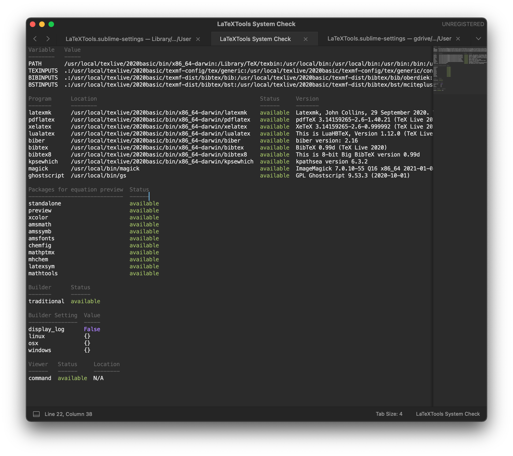
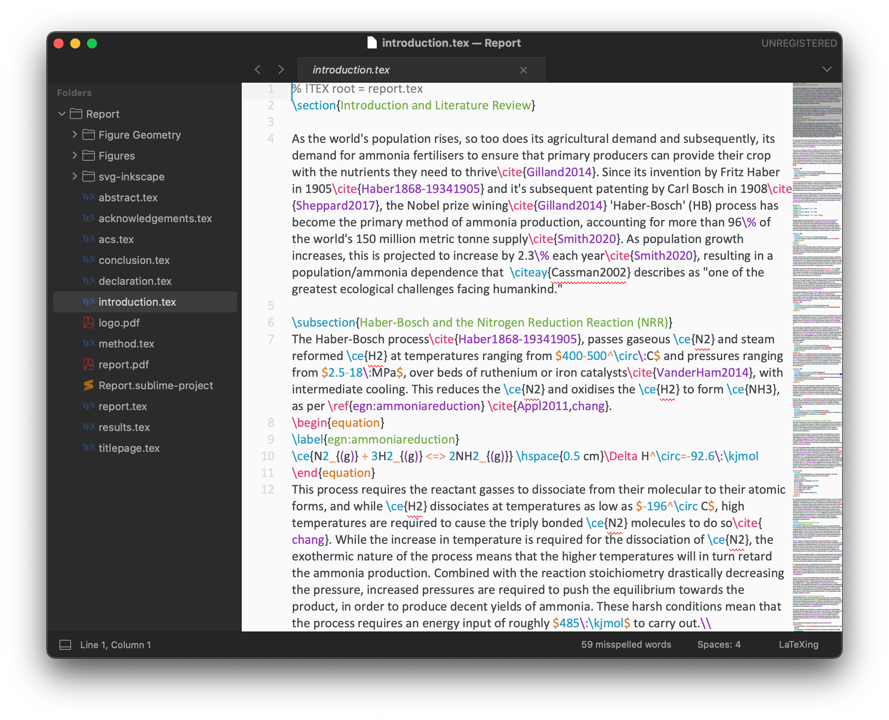
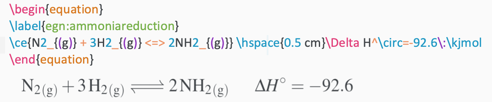

# LaTeX in Sublime Text (LaTeXTools) setup guide

!!! warning "Pre-Disclaimer"
	I feel like it would be disingenuous of me not to say that recently I have been giving [texpad](https://www.texpad.com) a go as my $\LaTeX$  editor of choice, purely because it has realtime typesetting. I could probably hack together some messy thing in Sublime to acocmplish something similar, but it would be messy...
	

	I might switch back to using sublime, as it's so much prettier, faster and smoother of an experience overall, but for now, since I've moved to [VScode](https://code.visualstudio.com) (:nauseated_face: Microsoft... but remote access :unamused: ) for most of my scripting work, and since I'm now on an M1 mac that can handle something slightly heavier than sublime, I figure its worth a shot :slightly_smiling_face:

!!! warning "Disclaimer"
	It's worth me mentioning that I'm fundamentally a mac/linux person and I *really* despise using windows. This method works on both macOS and linux flawlessly, but I can't comment on the specifics of how LaTeXTools behaves on Windows 

I've done a lot of playing around with $\LaTeX$ in different text editors, IDEs, WYSIWYG editors and dedicated apps, yet every time I try something new I always end up turning back to Sublime Text, as it always *feels* the best to use. It's incredibly fast and responsive, everything about it is customisable, it has really awesome tools built in for project management, and it has a phenomenally huge support base behind it if you ever run in to trouble.

I wanted to write a little setup guide in case anyone wanted to give it a shot, as I truly feel that 90% of the joy of using latex is in how fast/easy it is to use and so much of that comes down to the editor you choose.

If nothing else, this guide should hopefully teach you a little bit about how sublime text works and should introduce you to some of its power. Be sure to explore, play and experiment with Sublime and I'm sure that you'll fall in love with it as much as I have.

!!! info "Cheat Method"
	If you're feeling particularly lazy, I've actually uploaded my whole sublime text `user` packages folder  that you can just overwrite yours with (delete and replace. DO NOT MERGE) and change the paths of. Make sure that you already have package control installed before doing this though, or the files won't sync properly.
	

	Be warned, It's not clean and probably has out of date preference files in there, but it should work out of the box with tweaks to the paths.
	[Link here](https://github.com/adreasnow/lazypeoplelatexrepo)

## Prerequisites

There are a few little prerequisites that you'll need to get started that I won't cover in here:

* A working TeX distribution - on mac, I use macTeX minimal and install the packages that I need as I go with `tlmgr install`, to try and preserve space. My fully setup distribution takes up about 500 MB of space
* Sublime Text set up with package manager (should be as simple as ++cmd+shift+p++ ⟹ "Install Package Control")
* A PDF viewer that supports SyncTeX (Okular/Evince on linux, Skim on mac, SumatraPDF on windows)

## Set up Sublime Text

If you're already a sublime text user, then you probably already have things set up the way you'd like, however take a moment to set up sublime text to your liking.

### Theme - For non LaTeX files

{: style="width: 50%; "class="center"}

For a theme, I tend to use `Theme - Gravity` which is installed from package control (++cmd+shift+p++ ⟹ "Package Control: Install Package " ⟹ Theme - Gravity), and I customise it as follows:

Add the following in to your preferences file (Preferences ⟹ Settings) as follows:

```json
	"color_scheme": "Packages/Theme - Gravity/Monokai Gravity.sublime-color-scheme",
	"theme": "Gravity.sublime-theme",
	"gravity_highlight_color_blue": false,
	"gravity_sidebar_header": true,
	"gravity_tab_font_small": false,
	"gravity_tab_height_short": true,
	"gravity_title_bar": true,
```

These should go between the curly brackets and the line before these will need ot end with a `,`.

Save the file and your theme will automatically update

You can also browse and set the UI and theme colours through the gui by going ++cmd+shift+p++ ⟹ "UI: Select Theme"/"UI: Select Colour Scheme", and using the arrow keys to scroll through the different options. You can also google "Sublime Text 3 themes" to have a look at people's preferences and find one that you like.

#### Font

For the font, I tend to use the Roboto family from Google for my coding and terminal, which I use Nerd Fonts to make sure that they include a full set of symbols for use in 21st century computing. These can be obtained [here](https://github.com/ryanoasis/nerd-fonts/tree/master/patched-fonts/RobotoMono) and installed however your particular operating system desires (for mac, copy the `.ttf` files in to `~/Library/Fonts`  This folder is hidden, so you can press ++cmd+shift+g++ in finder and type `~/Library/` to access the folder ). 

These fonts can then be selected by adding the followin lines to your preferences file, as shown above:

```json
	"font_face": "Roboto Mono Nerd Font Complete",
	"font_size": 13.0,
```

### Theme - For LaTeX files

{: style="width: 50%; "class="center"}

I tend to set up myself with a separate light theme for writing in LaTeX to make things more readable, so now you want to go ahead and install "ayu" from package manager as described above. It will prompt you to install the package "A File Icon", and you should accept and install. You'll also want too get a copy of the Calibri font as it's quite readable, though since it's a proprietary Microsoft font, I shan't post any links. Download the TTF and install it in the same way as the Roboto family.

### Some Other Packages

I also like to use a few other packages from the package manager that you might choose to install now:

* Color Highlight - when it sees a colour word, hex or RGB value of a colour, it puts a coloured box around it for easy recognition (...I don't know what colour <span style="background-color: #3C6E99; color:#FFFFFF;">#3C6E99</span> is, unless there's a box behind it.)

* FileIcons - adds pretty file icons to files in the sidebar

* Git/GitGutter - useful if you want to use git with sublime text, it helps to track your modifications to tracked files (really good option for another version controlled backup for your thesis, also gives you a good indicator  of how much work you've done)

* PlatformSettings - allows you to specify specific settings for different platforms, which is particularly useful if you [sync your sublime text user folder across computers](https://packagecontrol.io/docs/syncing)


??? info "PlatformSettings Example"
	
	```json
	"osx":
	{
		"font_size": 14.0
	},
	"linux":
	{
		"font_size": 11.0
	},
	```

* SideBarEnhancements - adds extra options for when you right click on files in in the sidebar

* WakaTime - a useful tool for tracking your coding. Requires setting up an account [here](https://wakatime.com). [This data can also be used (if you're a complete nerd like me) to geneare pretty charts of how you're using your time.](../../../stats/)

	

## Setup LaTeXTools

Now that you have the base of sublime set up, you'll need to installing LaTeXTools, using package control.

Once you've done this, you'll need to configure LaTeXTools to work with your LaTeX distribution. To do this, you need to start by opening the LaTeXTools preference file (Preferences ⟹ Package Settings ⟹ LaTeXTools ⟹ Settings - User) and letting it create a new file from the default.

What I'm going to post next is a commented snippets from my config config file, that will advise you on how to set things up.

!!! info "Changed to true"
	```json
	// set to true to use BibLaTeX instead of BibTex for bibliography completions
	// can also be set on a per-project basis
	"use_biblatex": true, 
	```

!!! info "Removed .block from the end "
	```json
	// Change the scope selectors to preview math
	// E.g. set it to "text.tex.latex meta.environment.math.block.be"
	// to only preview math environment
	// Set it to "text.tex.latex meta.environment.math"
	// to preview every math command or environment
	"preview_math_scope": "text.tex.latex meta.environment.math",
	```

!!! info "Matches the maths preview to our theme's background"
	```json
	"preview_math_color": "#3f4347",
	"preview_math_background_color": "#FAFAFA",
	```

!!! info "Allows me too preview chemistry packages"
	```json
	"preview_math_template_packages": [
		"\\usepackage{amsmath}",
		"\\usepackage{amssymb}",
		"\\usepackage{amsfonts}",
		"\\usepackage{chemfig}",
		"\\usepackage{mathptmx}",
		"\\usepackage[version=4]{mhchem}",
		"\\IfFileExists{latexsym.sty}{\\usepackage{latexsym}}{}",
		"\\IfFileExists{mathtools.sty}{\\usepackage{mathtools}}{}"
	],
	```

!!! info "Changes the pixel density for high DPI displays"
	```json
	"preview_math_density": 600,
	// If the image is not sharp enough increase this scale to get a better resolution.
	// However also change the density by the same factor to keep the size.
	"preview_math_scale_quotient": 4,
	```

!!! info "Platform Settings"
	These are going to differ greatly based on which platform and distribution you're using, but here is my config
	
	```json
	"osx": 	{
		"texpath" : "/usr/local/texlive/2020basic/bin/x86_64-darwin:/Library/TeX/texbin:/usr/local/bin:$PATH",
	},
	
	"linux" : {
		"texpath" : "/usr/local/texlive/2020/bin/x86_64-linux/:$PATH",
		"python": "/home/adrea/miniconda3/bin/python",
		"sublime": "subl",
		"sync_wait": 0.5,
		"sublime_executable": "subl",
		"keep_focus_delay": 0.5
	},
	```

!!! info "Build Directory"
	To avoid your project folder getting all messed up with temp files, it can be good to compile in a cache directory and copy the pdf over afterwards
	```json
	"aux_directory": "<<cache>>",
	"output_directory": "<<cache>>",
	```

!!! info "Builder"
	Here I actually like to keep things simple and just use the traditional pdflatex builder. I have written some custom build scripts for lualatex, but i'm not convinced that it's much faster tbh.
	```json
	"builder": "traditional",
	```
	
!!! info "Keep output to warnings"
	```json
	"hide_build_panel": "no_warnings",
	```

!!! info "PDF viewer preferences"
	For the vast majority of you, you can ignore this, though if you want to use a non-standard pdf viewer on any platform and you want to sync your config file across multiple platforms, you'll need to configure each platform explicitly.
	
	Here I choose to use Okular rather than Evince on linux, so I need to ALSO specify to use Skim on mac.
	```json
	"viewer": "command",
	"viewer_settings": {
		"osx" : {
			"forward_sync_command": "/Applications/Skim.app/Contents/SharedSupport/displayline $line $pdf_file $src_file"
		},
		"linux" : {
	        "forward_sync_command": "okular --unique $pdf_file#src:$line$src_file",
	        "view_command": "okular --unique"
		}
	},
	```

!!! info "Smart bracket scanning"
	You'll want to append this to the bottom of the file, before the closing `}`. Make sure to add a `,` to the end of the previous line.
	```json
		"smart_bracket_scan_full_document": true,
	```
	

## Check LaTeXTools

At this point, you'll want to check LaTeXTools to make sure that it can find all the required files from your TeX distribution. This is as simple as; ++cmd+shift+p++ ⟹ LaTeXTools: Check system.

If all went well, you should see a screen full of "<span style="background-color: #2b2b2b; color:#94b848;">available</span>":

{: style="width: 50%; "class="center"}

If not, then you'll likely need to do some troubleshooting and it most likely means that your `"texpath"` variable in your LaTeXTools config is incorrectly set, or that your TeX distribution is not  properly installed.

If some but not all of it is found, then you might need to use `tlmgr` to install those extra components.

Errors finding `magick` or `ghostscript` might need to be resolved by installed those packages separately, this is pretty easily done through homebrew or conda on macOS, or through your repo manager on linux (yum/apt/pamac).

## Set up LaTeX Theme

So finally, we're all set up, but our LaTeX files are still in dark mode. To fix this, open up a latex file (or save a new file as a `.tex` file) and go to; Preferences ⟹ Settings - Syntax Specific. Here you'll want to make a few additions to the file:

```json
// These settings override both User and Default settings for the LaTeX syntax
{
	"spell_check": true,
	"color_scheme": "Packages/ayu/ayu-light.sublime-color-scheme",
	"font_face": "Calibri",
	"font_size": 16.0,
	"show_minimap": true,
	"word_wrap": true,
	"user": {
		"highlight": false,
	}
}
```

I actually modified the Ayu light theme which can be obtained [here](https://gist.github.com/adreasnow/e4f5b8db59a85e641cd47157fe43e1d0), which I think is MUCH better for readability. You just need to save it into your sublime text user packages folder (`~/Library/Application\ Support/Sublime\ Text\ 3/Packages/User` on mac) and use the theme line:

```json
	"color_scheme": "Packages/User/Ayu LaTeX.tmTheme",
```


{: style="width: 50%; "class="center"}

## Extra LaTeX Packages

A few extra packages that I like to use for LaTeX in Sublime Text include:

* LaTeXTab - This is useful for copying content directly from excel into a table in LaTeX
* LaTeXing - Technically speaking, this is a conflicting package to LaTeXTools, but it *does* provide some extra functionality. Don't use it for building  packages, just use it for how it helps you build your TeX document.

## Final Tips and Tricks

### Building your TeX Document

This project should now behave like any other project in sublime text. The best thing to do is to have a play and see how it behaves. Build your LaTeX document with ++cmd+b++, save your working directory as a project and back it up with version  control using git!. 

### ~~Dictionaries~~

~~If (like me) you reside outside of the US, you may like to set a custom dictionary.~~

~~First we need to obtain a Hunspell formatted dictionary file. The easiest way to do so is to download a dictionary extension for OpenOffice from [here](https://extensions.openoffice.org/en/search?f%5B0%5D=field_project_tags%3A157), extract the `.oxt` file using something like [The Unarchiver](https://theunarchiver.com) (you can rename the file to `.zip` to make it open).~~

~~From the extracted plugin, there will be a suitable `.dic` file (for me it's `en_AU.dic`, which you can put into your sublime text user packages folder (`~/Library/Application\ Support/Sublime\ Text\ 3/Packages/User` on mac). We now need to tell sublime to use this dictionary file, which is done in your Sublime preferences by specifying a particular dictionary:~~

```json
"dictionary": "Packages/User/en_AU.dic",
```

### Dictionaries (Revised)

The above method will work, but the dictionary parser seems to struggle with plurals. I didn't realise, but there is a language toggle in; view ⟹  Dictionary ⟹ Language - English ⟹ en_GB. This will change the internal Hunspell dictionary, rather  than having  to use external ones.

#### Adding New words

With `"spell_check": true,` set in our LaTeX specific preferences, when you open up a tex document, there will likely be a whole load of technical words that will show up as incorrect. This *is* annoying, but inevitable. The good news is that it's easy enough to right click and "Add" the word, though the bad news is that this gets appended to a LONG list in your `Preferences.sublime-settings` file:

```json
"added_words":
[
	"absorbance",
	"absorbances",
  "peptidyl",
	"aminoacyl",
	"repressors",
	"resuspended",
	"cetyl",
	"trimethyl",
	"trimethylammonium",
  ...
  ]
```

### Document Outline

The big useful tools to remember are ++cmd+r++ to view the outline of the current file and ++cmd+shift+r++ to view the outline of the whole project (be sure to reference the main document with `   % !TEX root =  main.tex`).

### Maths Previews

Maths previews "just work" by clicking on the maths environment and waiting for the preview to render. This also works for image previews. If they don't render particular characters froma  specific package, make sure that the package is listed in `preview_math_template_packages` in the LATeXTools preferences.

{: style="width: 50%; "class="center"}

By setting the `preview_math_color` and `preview_math_background_color` to the same as our theme, the preview should be seamlessly integrated into the editor.

To change how large they render on your display, you can tweak `preview_math_density` and `preview_math_scale_quotient` to get them to your desired size/pixel density.

### Autocomplete and Selection Dialogues

When you type `\cite{`, if you've already added your bibliography file with `\addbibresource{library.bib}` [^1], A dialogue will pop up that lets you extremely quickly search your library for citations. to add another, just press `,`. this will also work fo any custom defined citation commands.

This also works for refrencing figures, if you type `\ref{`, a dialogue will show all of the labelled figures you've got in your document.

This will even work for `\usepackage{`, showing you all availble packages from your distribution!

Thanks to LaTeXIng, when you have an open environment, such as `\begin{align}`, when you type `\end{`, the dialogue will suggest to end the align environment.

Autocomplete in general is incredibly useful... you'll have to play around with it to find out how it all behaves

### Caches

Since you'll be building into a cache directory, a useful command to remember is pressing ++cmd+l++, then releasing and pressing ++del++ which will remove all the temp files to be able to make a fresh build of your document

### Reverse and Forward Sync

This should work out of the box to some extent, though if you're using Skim on macOS, you'll need to set it up:

#### Reverse Sync

In Skim, go to: Skim ⟹ Preferences ⟹ Sync, and set "PDF-TeX Sync Support" to "Sublime Text"

This should now allow you to sync from Skim ⟹ Sublime when you ++cmd+shift+left-button++ on the text you want to sync to.

#### Forward Sync

!!! warning
	A heads up, this will sync to the paragraph, but not to the specific position withiin the paragraph as some other editors will do.

By default, you should be able to sync from Sublime ⟹ Skim when you build, but if we want on demand sync, there's a few options:

You can sync from Sublime ⟹ Skim on demand by pressing ++cmd+l++, releasing, then pressing ++j++

This hotkey isn't the easiest to remember, so you can either change the hotkey to something else by adding a block to your key bindings file (Preferences ⟹ Key Bindings):

Example: Change the hotkey to ++cmd+l++ then ++s++
```json
{ 	"keys": ["super+l","s"], 
	"context":  [
		{"key": "selector", "operator": "equal", "operand": "text.tex.latex"}],
	"command": "jump_to_pdf", "args": {"from_keybinding": true}},
```

Or you can bind the sync to a mouse click, like in Skim, by creating a new file `Default.sublime-mousemap` in your user packages folder (`~/Library/Application\ Support/Sublime\ Text\ 3/Packages/User` on macOS) that contains the following:

```json
[
	{
		"button": "button1", 
		"count": 1, 
		"modifiers": ["super","shift"],
		"press_command": "drag_select",
		"context": [
		{"key": "selector", "operator": "equal", "operand": "text.tex.latex"}],
		"command": "jump_to_pdf",
		"args": {"from_keybinding": true}
	}
]
```

This will sync Sublime ⟹ Skim when you ++cmd+shift+left-button++, as per with Skim. By setting the context to `text.tex.latex`, this ensures that Sublime will only try and run this command on LaTeX documents.
	
With the config as I've described though, when you forward sync, or build the document, the application will switch to Skim momentarily then Sublime will steal the focus back. To change this behaviour, in your LaTeXTools preferences, set `keep_focus` to false, as shown below:

```json
"keep_focus": false,
```

### Even More Features

LaTeXTools is an incredibly deep package that I *barely* know how to use, but for more information, please take a look at [their docs](https://latextools.readthedocs.io/en/latest/), and in particular their features and keybindings.

Also remember that being sublime text, anyhtiing that you want either already exists in the package manager, or is easily coded up in python.

I really hope this little guiide helps someone.

[^1]: This can also be a file anywhere on your computer. Useful for syncing your whole Mendeley library to one `.bib` file