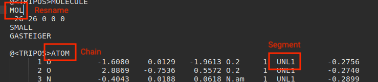
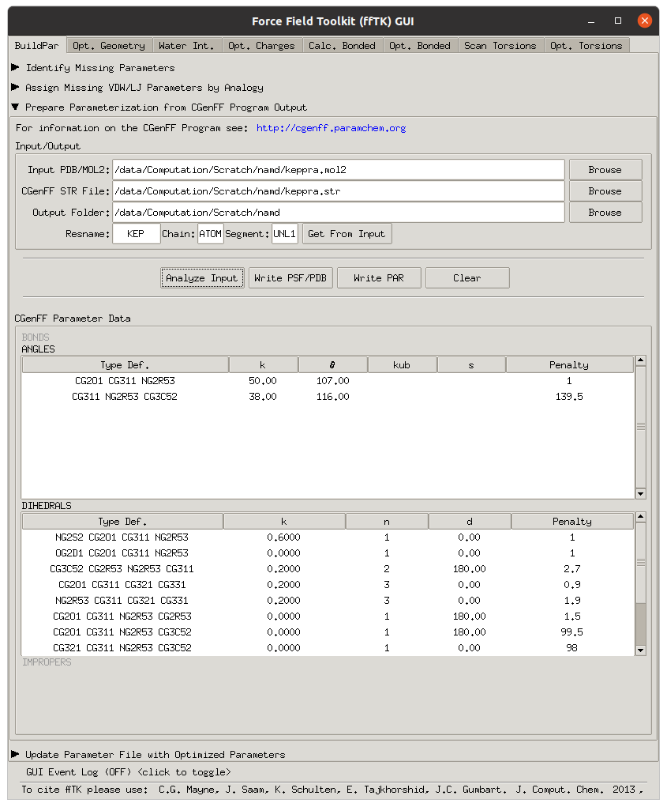

# NAMD QM/MM (CGenFF)

!!! note

	1. I know that using CGenFF isn't necesarrily the best way to do this, and in the molecule in specific the penalties are HUGE (100+), but since it's for the QM region it doesn't matter too much
	2. There are probably MANY better ways to do this, more efficient, etc. though this is what I came up with after banging my head on my desk for a few days :smile:


## Generating Your Molecule Force Fields

First, you'll need to get your geometry in a mol2 format. build/download and convert as needed

You will need to change the molecule identifier on the second line of the files t a short (less that 5 character I think - 3 to be safe) name that you'll use later

```
@<TRIPOS>MOLECULE
MOL
 26 26 0 0 0
```

Now you'll need to upload the molecule to the [CGenFF server](https://www.paramchem.org/initguess/) to assign each atom an appropriate type from the CGenFF force field. Download the .str file and use the fftk module in VMD (Extensions -> Modeling -> Force Field Toolkit) to generate your pdb and psf files.

Click on "Prepare Parameterisation from CGenFF Program Ouptut", load in your mol2 and str, set your output folder and enter your Resname, Chain and Segment details from your mol2 file

{: style="width: 60%; "class="center"}

{: style="width: 60%; "class="center"}

Then click "Analyse Input", "Write PSF/PDB" and then "Write PAR" to generate all your files.

This will be based on CGenFF 4.0, so you'll need to download [toppar_c36_jul16.tgz](http://mackerell.umaryland.edu/download.php?filename=CHARMM_ff_params_files/toppar_c36_jul16.tgz) and extract  `par_all36_cgenff.prm` to your working directory.

## Solvating the Molecule

Load up a new instance of VMD with your new MOL.pdb and and load in to it the associated MOL.psf file. In the "Solvation Box" plugin (Extensions -> Modeling -> Solvation Box) your pdb and psf should already be loaded in and asuming you're solvating with water, make sure that "Use Molecule Dimensions" is ticked, and you just need to type in your padding values (in $Å$) in each direction from the outside of the molecule (10 $Å$) ought to do it for a small molecule.

This will generate a new "solvate.psf" and "solvate.pdb" in the working directory of VMD. Copy these to your working directory and we can get started building our NAMD input.

Load up the pdb and psf into VMD and using the NAMD GUI (Extensions -> Simulation -> NAMD Graphical Interface),  set up your basic namd run and click "Write NAMD config file" when done. The file save promt isnt' useful here and the file will just be saved to the workign directory with the base name specifid in the NAMD GUI.

Thanks to a LOT of help from the amazing <a href="https://github.com/arcaian"><i class="fa fa-github" aria-hidden="true"></i>Michael Robinson</a>, we can get PBC working!
Copy and paste this script in to your TCL console (Extensions -> TK Console):

```tcl
proc get_cell {{molid top}} {
  set all [atomselect $molid all]
  set minmax [measure minmax $all]
  set vec [vecsub [lindex $minmax 1] [lindex $minmax 0]]
  puts "cellBasisVector1 [lindex $vec 0] 0 0"
  puts "cellBasisVector2 0 [lindex $vec 1] 0"
  puts "cellBasisVector3 0 0 [lindex $vec 2]"
  set center [measure center $all]
  puts "cellOrigin $center"
  $all delete
}
```

Then run the command with `get_cell`. this will spit out the basis vestors that we need for the PBC bondary conditions. Keep this output available for the next step. 

## Cleaning up the Config File

To add the PBC conditions, copy and paste the output from the aforementioned `get_cell` and insert some PBC settings:

Change:
```tcl
# input
coordinates             solvate.pdb
structure               solvate.psf
parameters              /usr/local/lib/vmd/plugins/noarch/tcl/readcharmmpar1.5/par_all36_prot.prm
parameters              /usr/local/lib/vmd/plugins/noarch/tcl/readcharmmpar1.5/par_all36_na.prm
```

To: 

```tcl
# input
coordinates             solvate.pdb
structure               solvate.psf

cellBasisVector1 36.39299964904785 0 0
cellBasisVector2 0 36.54599952697754 0
cellBasisVector3 0 0 34.242000579833984
cellOrigin -0.32710814476013184 0.5821866989135742 0.21385234594345093
wrapWater on
wrapAll on
wrapNearest off

parameters              /usr/local/lib/vmd/plugins/noarch/tcl/readcharmmpar1.5/par_all36_prot.prm
parameters              /usr/local/lib/vmd/plugins/noarch/tcl/readcharmmpar1.5/par_all36_na.prm
```


The config file that we've geenrated here won't actually work as is. We need to remove the cgenff parameter  file thats specified in the file, as it's outdated (3.0.1) and replace it with the downoaded one (4.0), as well as to add in out generated one from fftk:

Change:

```
parameters              /usr/local/lib/vmd/plugins/noarch/tcl/readcharmmpar1.5/par_all36_cgenff.prm
```

To the location of your downlaoded CGenFF parameter and your fftk analogy parameter:

```tcl
parameters              /data/Computation/Scratch/namd/par_all36_cgenff.prm
parameters              /data/Computation/Scratch/namd/MOL.analogy.prm
```

This file should now be able to be run!

## QM/MM

!!! warning
	If running on a single node, be aware that when you start NAMD with multiple processes (`+P16`), it will launch multiple QM jobs, each with their own multiple threads (`nprocs 14`). For this setup, that would mean 256 QM threads, meaning so much CPU scheduling that no cacs would complete.
	

	Some benchmarking may be required to find the optimal combination of NAMD threads, QM threads and GPUs, though for simple molecule solvation, 1 NAMD thread and 16 ORCA threads have yielded the best performance.

For QM/MM we need a few extra parameters, before the minimise steps in the config file. The basics of this are straightforward, though we also need to edit our pdb to tell the system about the QM/MM division:

```tcl
qmForces              on
qmParamPDB            "solvate.pdb"
qmColumn              "beta"
qmBondColumn          "occ"
QMSimsPerNode         1
QMElecEmbed           on
QMSwitching           on
QMSwitchingType       shift
QMPointChargeScheme   none
QMBondScheme          "cs"
qmBaseDir             "/data/Computation/Scratch/namd/orca/"
qmConfigLine          "! EnGrad B3LYP 6-31G(d)"
qmConfigLine          "%%pal nprocs 14 end"
qmConfigLine          "%%output PrintLevel Mini Print\[ P_Mulliken \] 1 Print\[P_AtCharges_M\] 1 end"
qmMult                "1 1"
qmCharge              "1 0"
qmSoftware            "orca"
qmExecPath            "/opt/orca/orca"
QMOutStride           1
QMPositionOutStride   1
```

Explaination of all of these fields can be in [this commented config file](https://www.ks.uiuc.edu/Research/namd/mailing_list/namd-l.2017-2018/att-0330/config.ORCA.namd).

The .pdb file needs to be modified so that the second column after the xyz coordinates is `1.0` (or greater) for QM and `0.0` for MM. The line before allows us to specify if the atom is involved in a QM-MM bond, as before; `1.0` for yes and `0.0` no. These columns can be switched by swapping the values of `qmColumn` and `qmBondColumn`.

We can do this through VMD, again thanks to <a href="https://github.com/arcaian"><i class="fa fa-github" aria-hidden="true"></i>Michael Robinson</a> with the following commands:

```
set mm [atomselect top "water"]
set qm [atomselect top "resname MOL"]

$mm set beta 0
$qm set beta 1
$all set occupancy 0

set all [atomselect top all]
$all writepdb solvate.pdb
```

The integer put in to the first column specifies the QM region as well, so if we had multiple regions that should be considered independently (e.g. different multiplicities, or charges )  we could assign them different identifiers.

These identifiers are used in the `qmMult` and `qmCharge` entries as `qmMult "<qm group> <mult>"`