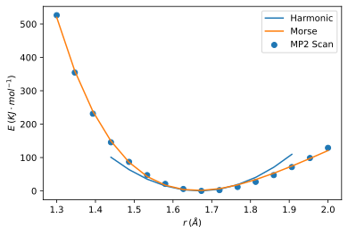

# Parameterising TiO2 From MP2 (function fitting in python)

!!! warning
	This is based purely on play and experimentation<br/>DO NOT USE THIS AS A GUIDE!!!

Based on the CO2.ff from fftool's examples, the charge and LJ parameters were taken from http://aluru.web.engr.illinois.edu/Journals/MolSim09.pdf which used the UFF LJ parameters.

*I would love to be able to calculate these myself, but I'm honestly sure the best way to do this. Charges aren't too difficult, but I'm not sure about the LJ potential*

#### Opt

$r_0$ and $\alpha_0$ were calculated from  an MP2 Opt

```
! Opt RI-MP2 def2-qzvpp def2/J def2-qzvpp/C CPCM RIJCOSX

%cpcm
   smd true
   SMDSolvent "Water"
end

* xyz 0 1
   Ti    -0.954237    0.829094    0.099906
   O     -2.665785    0.994563   -0.049940
   O      0.760022    0.963344   -0.049966
*
```

#### Bond

The bond parameters were calculated from the orca scan, with $r_0$ from tthe opt:

```
! RI-MP2 def2-qzvpp def2/J def2-qzvpp/C CPCM RIJCOSX

%cpcm
   smd true
   SMDSolvent "Water"
end

%paras
   R=1.3,2,16
end

* int 0 1
  Ti  0 0 0 0   0         0
  O   0 0 0 {R} 0         0
  O   0 0 0 {R} 105.26448 0
*
```

#### Angle

The bond parameters were calculated from the orca scan:

```
! RI-MP2 def2-qzvpp def2/J def2-qzvpp/C CPCM RIJCOSX

%cpcm
   smd true
   SMDSolvent "Water"
end

%paras
   A=170,180,11
end

* int 0 1
  Ti 0 0 0 0 0 0
  O  1 0 0 1.735 0 0
  O  1 2 0 1.735 {A} 0
*

```

## The python code

The code was  all run in [JupyterLab](http://adreasnow.com/Notebooks/fittingdata.html), but i'm embedding it this way for inline readiing:

### Bond Potential

$$
\begin{align}
Harmonic\\
E&=K(r-r_0)^2\\\\
Morse\\
E&=D\big[1-e^{-\alpha(r-r_0)}\big]^2
\end{align}
$$


#### Setting up the data 

``` python
import matplotlib.pyplot as plt
from scipy.optimize import curve_fit
from IPython.display import display, Math
import numpy as np
%config InlineBackend.figure_format = 'svg'

data = [[1.30000000, -998.80336263],
       [1.34666667, -998.86882091],
       [1.39333333, -998.91575342],
       [1.44000000, -998.94839025],
       [1.48666667, -998.97073788],
       [1.53333333, -998.98585895],
       [1.58000000, -998.99585930],
       [1.62666667, -999.00166180],
       [1.67333333, -999.00387242],
       [1.72000000, -999.00295857],
       [1.76666667, -998.99937503],
       [1.81333333, -998.99354601],
       [1.86000000, -998.98584493],
       [1.90666667, -998.97666956],
       [1.95333333, -998.96634681],
       [2.00000000, -998.95472697]]


# Transpose the data
data = np.array(data).T.tolist() 

# Extract the data into new arrays
r = np.array(data[0])
e = np.array(data[1])*2625.5

# Set the baseline  of the energy to 0, for out curve fitting
e = e + max(abs(e))
```

#### Parameterising and testing

```python
# we know our equilibrium distance from our MP2 opt, so we can set it here
r_nought = 1.66844

# Truncate the data, since we don't need to fit the extremes of the bond length
# - This will increase the accuracy of the fit for the hamronic potential and will not be used for the morse potential
r_culled = r[3:-2]
e_culled = e[3:-2]

# Define the functions to fit to (in this case, both harmonic and morse)
def bond_harmonic(r, k):
    return((k/2)*(r-r_nought)**2)

def bond_morse(r, d, alph, r_nought):
    return((d*(1-np.exp(-alph*(r-r_nought)))**2)+min(r))    

# Fit the functions to the truncated data, p0= is the guess values
params_morse, covariance_morse = curve_fit(bond_morse, r, e, p0=[1000, 1, 1.6])
params_harmonic, covariance_harmonic = curve_fit(bond_harmonic, r_culled, e_culled, p0=[2000])

# Define some stats functions
def r_squared(x, y, y_func):
    return(1-(np.sum((y-y_func)**2)/np.sum((y-np.mean(y))**2)))

def rmse(x, y, y_func):
    return(np.sqrt((1/len(y))*np.sum((y-y_func)**2)))

# Print the parameters and errors
print("Morse")
print("Params:\t\tD=" + str(params_morse[0]) + " α=" + str(params_morse[1]) + " r0=" + str(params_morse[2]))

print("$R^2$:\t\t" + str(r_squared(r_culled, e, bond_morse(r, *params_morse))))
print("RMSE:\t\t" + str(rmse(r, e, bond_morse(r, *params_morse))))

print("\nHamronic")
print("Params:\t\tK=" + str(*params_harmonic) + " r0=" + str(r_nought))
print("R^2:\t\t" + str(r_squared(r_culled, e_culled, bond_harmonic(r_culled, *params_harmonic))))
print("RMSE:\t\t" + str(rmse(r_culled, e_culled, bond_harmonic(r_culled, *params_harmonic))))
    
# Plot the new Functions agains the data
plt.scatter(r, e, label="MP2 Scan")
plt.plot(r_culled, bond_harmonic(r_culled, *params_harmonic), label="Harmonic")
plt.plot(r, bond_morse(r, *params_morse), label="Morse")      
plt.gca().ticklabel_format(axis='both', style='plain', useOffset=False)
plt.ylabel("$E\:(KJ\cdot mol^{-1})$")
plt.xlabel("$r\:(\AA)$")
plt.legend()
plt.show()
```

!!! info "The results"
	#### Morse
	Params:		D=553.5388757286896 α=1.860276961574165 $r_0$=1.6639436429929015<br/>
	$R^2$:		0.9988174064496037<br/>
	RMSE:		4.851403153348397<br/>
	
	#### Harmonic
	Params:		K=3861.0399780877187 r_0=1.66844<br/>
	R^2:		0.7495970915980668<br/>
	RMSE:		21.287329676809204<br/>


{: style="width: 50%; "class="center"}

!!! note
	I did parameterise the angle as well, but the scale of my $K$ is  off by  a factor of  $\sim100$, so I'm not including it in this page. my work so far can be seen in the [JupyterLabs](http://adreasnow.com/Notebooks/fittingdata.html).