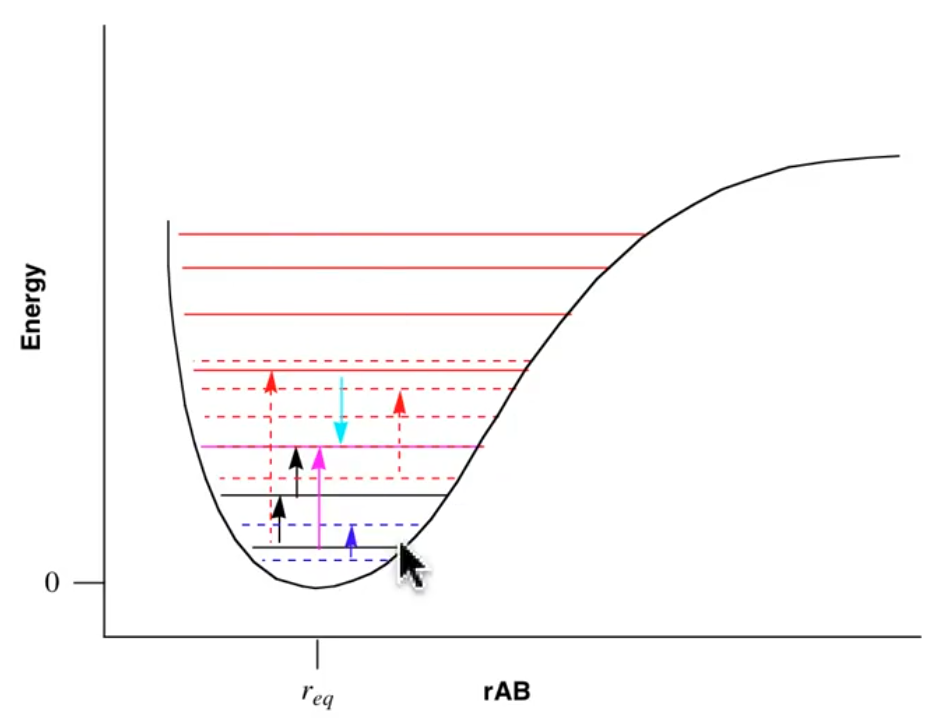

# Basic Force Field: Part 1

??? abstract
	
	

	<iframe width="560" height="315" src="https://www.youtube.com/embed/9i06lhXF1_Y" frameborder="0" allow="accelerometer; autoplay; encrypted-media; gyroscope; picture-in-picture" allowfullscreen></iframe>
	

From last lesson: How can we know where all the critical points are without calculate the whole PES?

!!! info
	Practically speaking, we can fit a PES curve from the IR excitations, by mapping out each individual excitation and it's associated oscillation
	 
	{: style="width: 40%;" class="center"}

## How is this curve represented mathematically?

#### In a single dimension...

* We could use a polynomial equation to model this, fitting a function to the curve
* $0$ is the point that we're expanding around, $U(r)$ is our energy function
  * We do this because we know the most about $r_{eq}$ due to spectroscopy

$$
U(r)=0+a(r-r_{eq})+b(r-r_{eq})^2+c(r-r_{eq})^3+...
$$

* To do this cleanly, we should (and do) be using a Taylor expansion, with the derivatives of the functions as the coefficients
  * If we stop as the second derivative, we create a harmonic oscillator (second derivative is the force constant)

$$
U(r)=U(r_{eq})+\frac{U'(r_{eq})}{1!}(r-r_{eq})+\frac{U''(r_{eq})}{2!}(r-r_{eq})^2+\frac{U'''(r_{eq})}{3!}(r-r_{eq})^3+...
$$

#### In multiple dimensions...

* We still use curve fitting algorithms, but this time, we use multidimensional algorithms

  * Which one should we use? Fourier? Exponential? Polynomial?

* What would be the mosts useful coordinate system to use?

  

## Mature Concepts in Physical Organic Chemistry

* Strain - Interactions within the molecule that prevent the individual oscillator from being able to take on its optimal state
  * Steric hinderance
  * Comes in different types; Length, Angle, Torsion
  * The ideal values of these oscillators depend on not just the type of atom, but also the state of the atom (hybridisation, multiple minima (resonance), electron distribution, bond order)
* A "force field" is defined by its atom types (and  forms), the functions it uses to calculate the bonds/angles/torsions and any constants (force, eq distances, etc.)