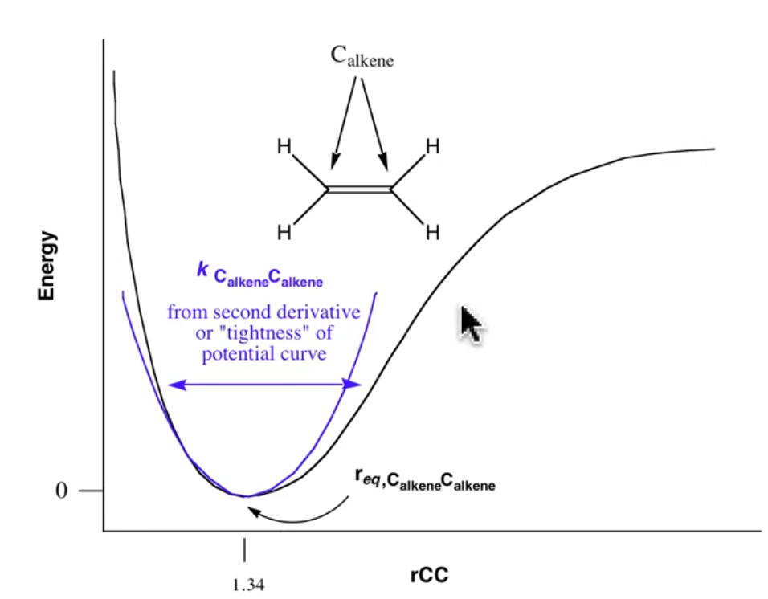
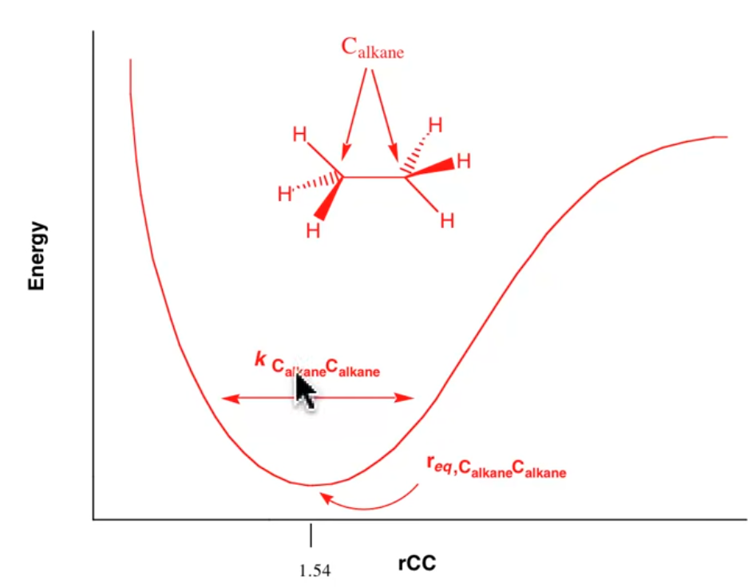
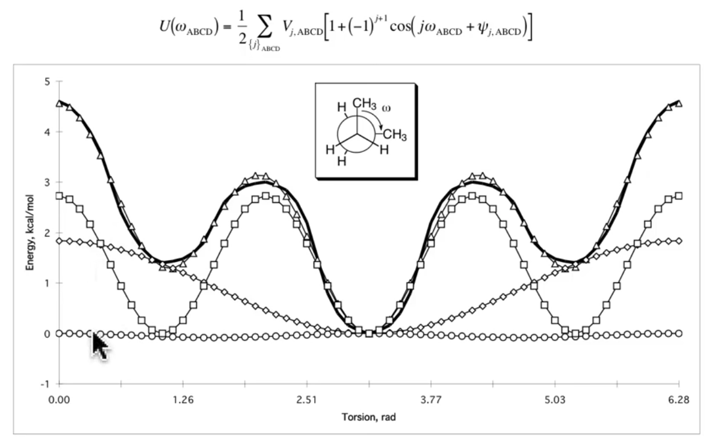
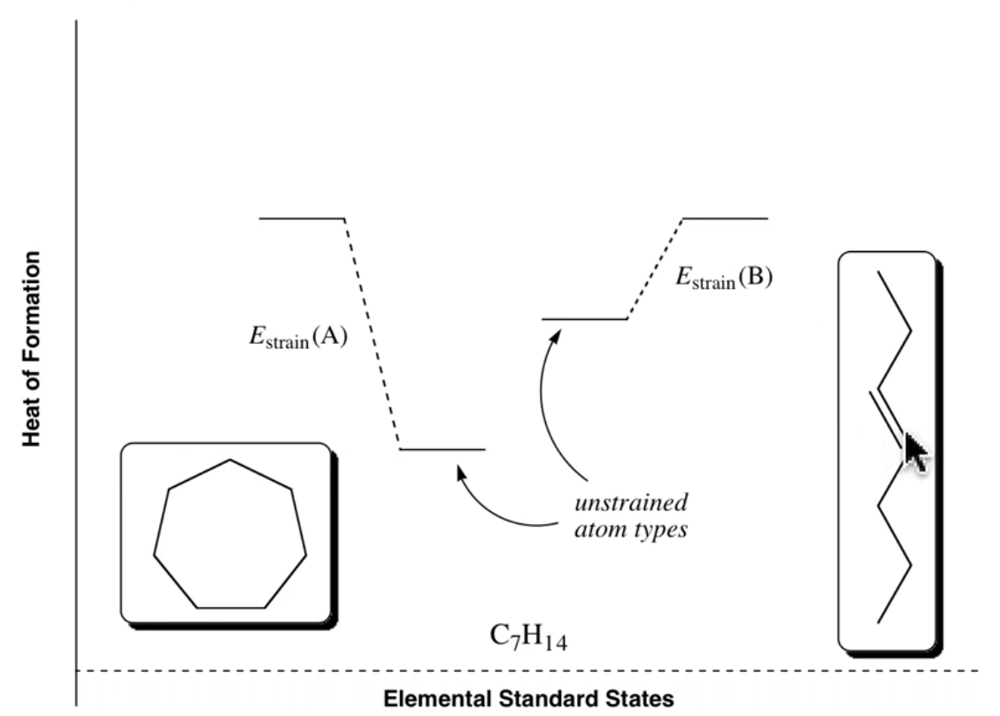

# Basic Force Field: Part 2

??? abstract
	
	

	<iframe width="560" height="315" src="https://www.youtube.com/embed/9VsiQnyyuW4" frameborder="0" allow="accelerometer; autoplay; encrypted-media; gyroscope; picture-in-picture" allowfullscreen></iframe>
	

## Examples of force fields

If we use the equation below, and substitute in $r_{eq}=0$ (the system at equilibrium), 

$$
U(r)=U(r_{eq})+\frac{U'(r_{eq})}{1!}(r-r_{eq})+\frac{U''(r_{eq})}{2!}(r-r_{eq})^2
$$

* The first term remains zero
* All subsequent terms will be $r_{eq}-r_{eq}$

$\therefore$ there is no Force

* If the distance changes any amount, because the final term is squared, the force will be positive and increase accordingly 

Simplifying (removing zero terms) this, we get

$$
U(r)=\frac{1}{2}k(r-r_{eq})^2
$$

* $k$ is our force constant, specific to the bond (e.g. alkene carbon to alkene carbon double bond)
* $r_{eq}$ is the known equilibrium bond length for this specific bond type
* This simplification, however only produces a harmonic oscillator, not the Morse potential

{: style="width: 50%; "class="center"}

* Since the force tends towards infinity as $|r|$ increases, there is no way to break bonds using these approximation... Consider this a limitation of the method 

{: style="width: 50%; "class="center"}

* Note that the alkane has a much smaller force constant $k$ and will therefore have a much wider oscillator

## How many constants?

* For every form of every type of every atom that you want to consider in your force field, you'll need to specify specific constants
* For every form of every atom that you use, the complexity of the system will increase at a rate $N^2$, as each of these atom types needs constants for bonding with every other atom type... 

## How to obtain these constants?

* Traditionally, IR spectra were used, however increasingly, high level QM calculations are used to calculate these to a very high accuracy

## Angle Bending

* Since angle bending is calculated agains two other atoms, the force constants increase faster ($N^3$) than bond length, as new atom types are increased 

{: style="width: 50%; "class="center"}

## Torsion

* Here we use a Fourier series to describe these forces, since the rotation of a bond will be periodic $360^\circ = 0^\circ$
* The triangle curve is the sum of the three other curves

{: style="width: 50%; "class="center"}

* The three curves that it's summing could represent
* The constants here increase at a rate $N^4$ with atom types introduced

## Steps to calculate strain:

1. Assign atom types to all the atoms
2. Specify which atoms are bonded together (either assumed using vdW spheres, or manually specified)
3. look up all the force constants/equilibrium value/phase angles required for the specified system (and decide what to do if any are missing)

* Specify a force constant based on a similar atom type
  * Error and tell you what's missing
* Fail to run and not tell you what's missing

## Caveats

* Two compare two different molecules, the two molecules need to have the exact same atom type, or they'll be compared against different constants

* In the image below, because the two molecules use different atom types, we can only compare their energies to the hypothetical unstrained version, we cannot compare them to each other

{: style="width: 50%; "class="center"}

* To compare them to each other, we'd need to calculate $\Delta H^\circ _f$ for each molecule to be able to compare the unstrained versions. From there, we can compare the relative, strained energies.