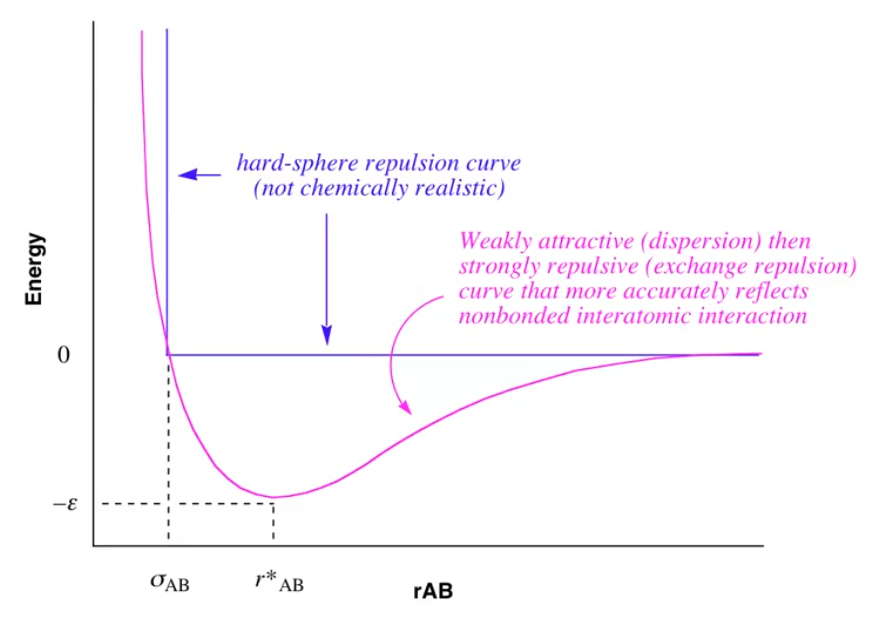
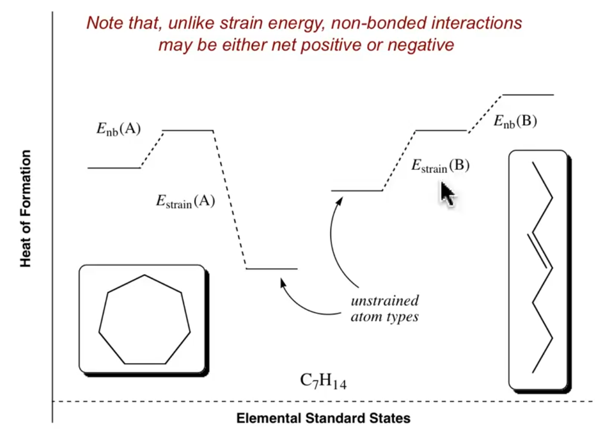

# Basic Force Field: Part 3

??? abstract
	
	

	<iframe width="560" height="315" src="https://www.youtube.com/embed/GoQ7Ki95zTs" frameborder="0" allow="accelerometer; autoplay; encrypted-media; gyroscope; picture-in-picture" allowfullscreen></iframe>
	

	

## Interactions between non-bonded atoms

* Atoms not bonded to each other, e.g. electrostatic repulsion

* As atoms approach each other, they start to attract, due to attractive dispersion forces (induced dipoles), following the image below

#### Leonard-Jones Potential

Where:

* $\varepsilon=$ a constant, the negative of the energy associated with the equilibrium distance $r_{AB}$
* $\sigma_{AB}=$ the distance at which $E=0$

$$
U(r_{AB})=4\varepsilon_{AB}\bigg[\bigg(\frac{\sigma_{AB}}{r_{AB}}\bigg)^{12}-\bigg(\frac{\sigma_{AB}}{r_{AB}}\bigg)^6\bigg]
$$

{: style="width: 50%; "class="center"}

* The attractive dispersion forces then become overwhelmed by the repulsive electrostatic forces that push the atoms apart

!!! note 
	While the 6th power is well documented for the attractive dispersion force falloff, the 12th power is not optimal for the representation of the electrostatic repulsive force. The 10th power is a better representation, however in floating point maths, the 12th power is easier to compute. Nowadays this is considered to be such a small cost computationally, that most force fields use the 10, 6 combination, rather than the 12,  6.

### Electrostatic interactions

* Commonly simulated using the coulombic interaction formula, however care needs to be taken as partial charges are very significant in these interactions

  * e.g. A ketone oxygen $\neq$ an aldehyde oxygen, despite both being carbonyl
  
#### Coulombic Potential

$$
U(r_{AB})=\frac{q_Aq_B}{\varepsilon_{AB}r_{AB}}
$$

* Can also be modelled as a force field based on the dipole interactions across the atoms

### Hydrogen bonding

* Similar to how the overall attractive/repulsive forces are modelled, however with different powers, since these forces are significantly weaker.

#### Hydrogen bonding potential

Where:

* $a'$ and $b'$ are parameters based on experimental data

$$
U(r_{XH})=\frac{a'_{XH}}{r^{12}_{XH}}-\frac{b'_{XH}}{r^{10}_{XH}}
$$

The effects of all these nonbonding interactions could be net positive or net negative. 

{: style="width: 50%; "class="center"}

### Finding stationary points

* Calculating the derivatives of the current system gives us the current forces that are applied. As we follow these forces, the molecule will tend itself towards equilibria and towards a stationary point.

## How to validate a force field (is it good or  bad)?

1. Get a large body of  experimental data
2. Define how important the accuracy of each individual component is
   * e.g. Do I care more about bond length accuracy or H-Bonding accuracy
3. Verify the parameters to minimise the amount of  overall error
4. Once a minimum is reached, lock it down, name it (e.g. MM3) and publish it.
   * Try to keep it stable, any changes could vary the results, particularly if there's no version numbers on changes. 
   * Don't ignore chemical intuition. Make sure that things make logical sense within the model.

## As a user of MM:

* Pick an appropriate force field
  * This will be dependent on the training set that the model was trained against
  * These models will perform their best when the structure is nearest its minima
  * Bonds cannot be made or broken by these force fields. They're not great for reactions
  * Starting with a bad guess structure will not necessarily lead to a logical structure
  * You can always develop a new force field if previous ones don't work for you