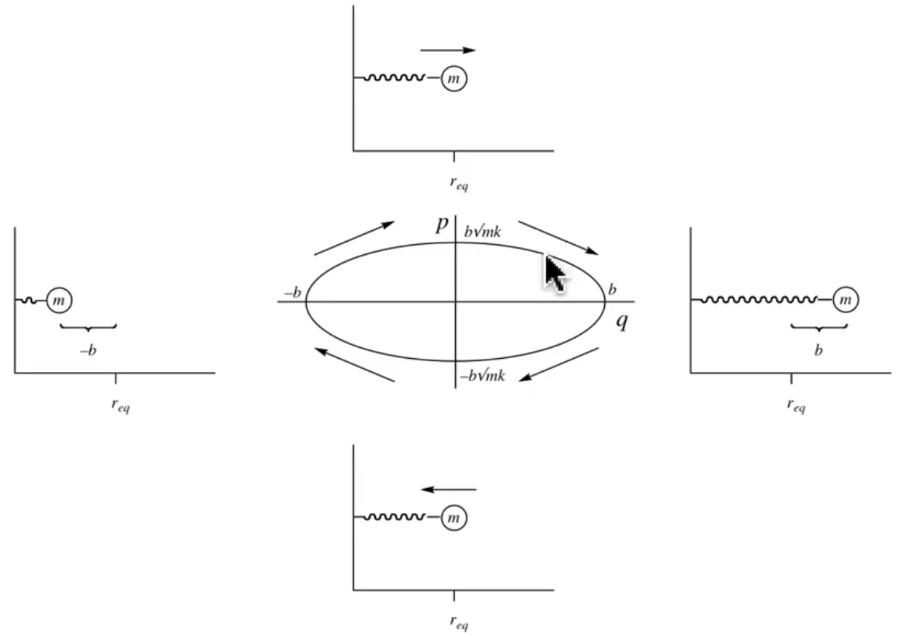
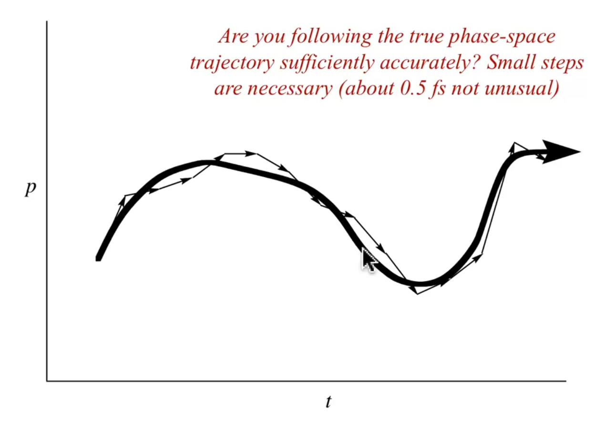

# MM Force Fields: Part 1

??? abstract
	
	

	<iframe width="560" height="31" src="https://www.youtube.com/embed/MK5BrpgUMUM" frameborder="0" allow="accelerometer; autoplay; encrypted-media; gyroscope; picture-in-picture" allowfullscreen></iframe>
	

## How do you find a global minimum when there's so many local minima?

* Systematically search all the coordinates?
  * Impossible ($~N^100$)

* Dynamics and quench (MD/Monte Carlo)
  * Run a dynamics simulation at a high temperature and periodically cool it down to see which structure it relaxes in to
* Simulated annealing (MD/Monte Carlo)
  * Heat the system up and cool it down slowly (similar to dynamics and quench)
* Evolutionary/Genetic Algorithms
  * Allow "good" geometries to survive and share properties and "bad" ones to die
  * Not a likely option

### Phase Space

The space that's characterised by the momentum and the position of the particles within the system

* $r=(q,p)$
* $r=(q_{1x},q_{1y},q_{1z},p_{1x},p_{1y},p_{1z},...)$

In the image below, the middle plot shows the trajectory of momentum ($p$) and position ($q$). Since it is harmonic, the plot is elliptical

{: style="width: 50%; "class="center"}

#### Are you following this phase space in small enough time steps?

* If the steps are too big, the trajectory may differ from the realistic (infinitely small) steps taken in reality
  * Think, broken physics in games
* The image below shows an example of a normal phase space trajectory

{: style="width: 50%; "class="center"}