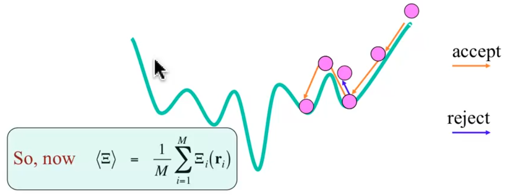
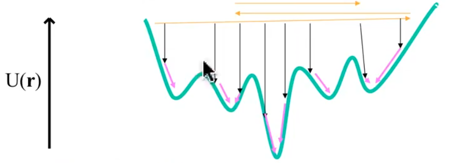

# MM Force Fields: Part 2

??? abstract
	
	

	<iframe width="560" height="315" src="https://www.youtube.com/embed/IzcxP7iUHcg" frameborder="0" allow="accelerometer; autoplay; encrypted-media; gyroscope; picture-in-picture" allowfullscreen></iframe>
	

##  Integrating over phase space

!!! note
	Expectation value: The weighted average of the probabilistic distribution, to give a statistically expected value.

This can be considered a Boltzmann weighted distribution, however we have the input of both the momentum and the position

$$
P(r)=e^{\frac{-E(q,p)}{k_BT}}
$$

## Metropolis Monte Carlo

A lower energy geometry will ultimately have a higher population distribution

1. Pick a starting geometry, propose a change and calculate that change's energy
   * $r_1\ce{->} r_2$
2. If the energy of the new geometry is less than the energy of the initial geometry, you accept the change
   * if: $-E(r_1)<-E(r_2)$
3. Otherwise you calculate the probability and compare it to a randomly generated number and if it's greater than that, you can also accept it
   * elif: $e^{\frac{-U(r_1)-U(r_2)}{k_BT}}>random \#\:\varepsilon[0,1]$
4. Otherwise you reject the change and iterate again

{: style="width: 50%; "class="center"}

## Simulated Annealing

We start the Monte Carlo simulation at a really high temperature and gradually decrease it. If we do this infinitely slow enough, we should easily be able to fall into the global minima

{: style="width: 50%; "class="center"}

## Molecular Dynamics (MD)

We solve classical (newtonian) equations of motion to calculate the behaviour of the atoms

* we use $F=ma=-dU(r)/dr$

The logic goes that if we do this for long enough, we'll sample phase space in a weighted way

## High Energy Quenching

Make a list of minima by randomly heating the system and occasionally cooling it rapidly to see where it lands

{: style="width: 50%; "class="center"}