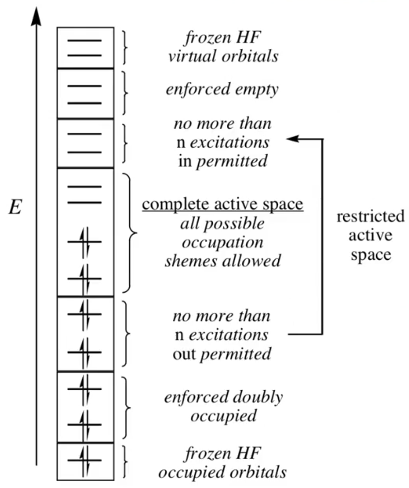

# Electron Correlation and CI

*Ab Initio* calculations are a long series of optimisations built on a hierarchy of calculations.

1. We start with our linear combination of primitives which have been pre-optimised ($a$ and $\alpha$) to form a basis function (here, 1s is used as an example).

* If they are "Decontracted", the $a_i$ is allowed to vary in the calculation to be optimised

$$
\varphi=\sum\limits_i^Na_i\bigg(\frac{2\alpha_i}{\pi}\bigg)^{3/4}e^{-\alpha_ir^2}
$$

<ol start='2'><li>We then take our linear combination of basis functions which form our wavefunction (LCAO). These could be more that one basis function per orbital</li></ol>

$$
\phi=\sum\limits_i^Na_i\varphi_i
$$

<ol start='3'><li>We then use the Slater determinant to optimise for the values of α</li></ol>
* If we solve for all the roots of the determinant, we get all the values of the orbitals

$$
\begin{vmatrix}
H_{11}-ES_{11} & H_{12}-ES_{12} & \cdots & H_{1N}-ES_{1N} \\ 
H_{21}-ES_{21} & H_{22}-ES_{22} & \cdots & H_{2N}-ES_{2N} \\
\vdots         & \vdots         & \ddots & \vdots\\
H_{N1}-ES_{N1} & H_{N2}-ES_{N2} & \cdots & H_{NN}-ES_{NN}
\end{vmatrix}=0
$$

* Using the variational principle

$$
E=\frac{\int\bigg(\sum\limits_i{a_i^*\varphi_i^*}\bigg)H\bigg(\sum\limits_j{a_j\varphi_j}\bigg)d\bf{r}}{\int\bigg(\sum\limits_i{a_i^*\varphi_i^*}\bigg)\bigg(\sum\limits_j{a_j\varphi_j}\bigg)d\bf{r}}=\frac{\sum\limits_{ij}a_i^*a_j\int\varphi_i^* H\varphi_jd\bf{r}}{\sum\limits_{ij}a_i^*a_j\int\varphi_i^* \varphi_jd\bf{r}}
$$

* And an appropriate hamiltonian running over pairs of electrons (and the SCF $\phi$)

$$
H_{ij}=\bigg\langle\varphi_i\bigg|-\frac{1}{2}\nabla^2\bigg|\varphi_j\bigg\rangle-\bigg\langle\varphi_i\bigg|\sum\limits_k^{nuclei}\frac{Z_k}{r_k}\bigg|\varphi_j\bigg\rangle+\bigg\langle\varphi_i\bigg|\sum\limits_n^{electrons}\frac{|\phi|^2}{r_n}\bigg|\varphi_j\bigg\rangle
$$

<ol start='4'><li>The combination of the optimised basis functions gives us our HF wavefunction</li></ol>

$$
\Psi_{HF}=\sum_i^Na_i\varphi_i
$$

<ol start='5'><li>Which a linear combinations of these optimised slater determinants can be used to form our CI wavefunction</li></ol>

* Singles - Here we run over electrons $i$ and excite them to orbital $j$
* Doubles - Then we run over electrons $i$ and $j$ and excite them to $r$ and $s$

$$
\Psi_{CI}=a_0\Psi_{HF}+\sum\limits_i^{occ}\sum\limits_j^{vir}a_i^r\Psi_i^r+\sum\limits_{i<j}^{occ}\sum\limits_{r<s}^{vir}a_{ij}^{rs}\Psi_{ij}^{rs}+...
$$

<ol start='5'><li>We can now optimise for the coefficients for $a_o/a_i/a_{ij}$ ($a_i$ will always go to $0$)</li></ol>

## Limited CI Calculations

If we allow more excitations from higher energy orbitals and freeze the core orbitals (or use some combination of freezing, exciting, and optimising), these are MultiConfiguration SCF (MCSCF) calculations.

Specifically, two methods for this are:

*  Complete Active Space SCF (CASSCF)
*  Restricted Active Space SCF (RASSCF)

{: style="width: 40%; "class="center"}

### Further MRSCF Calculations

You can also perform another step in your MRSCF calculation to allow your optimised orbitals to be further excited, which is known as Multi Reference CI (MRCI)