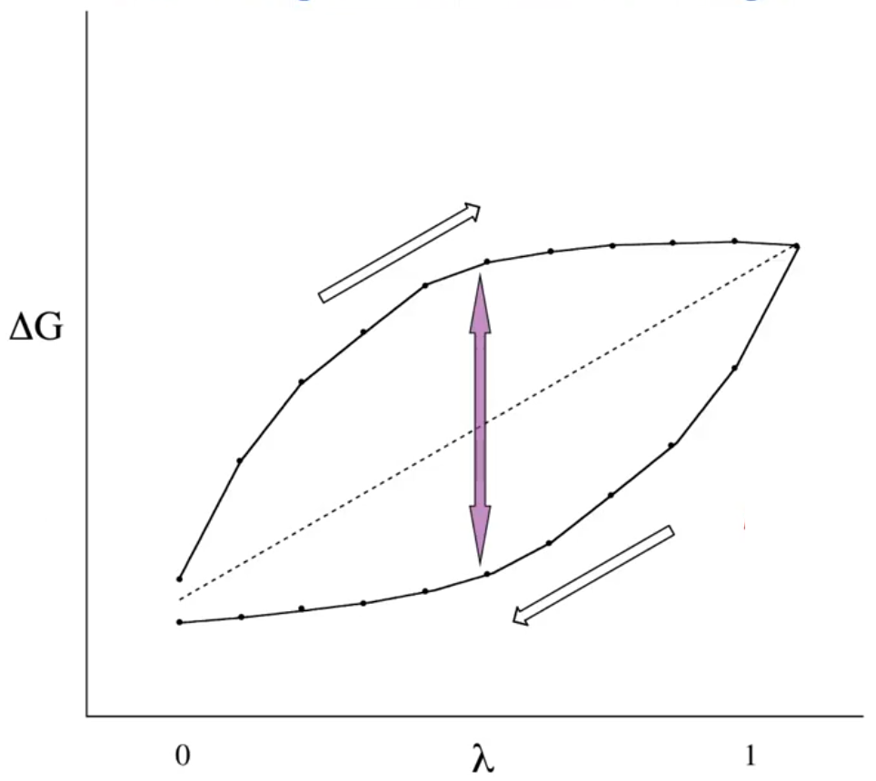
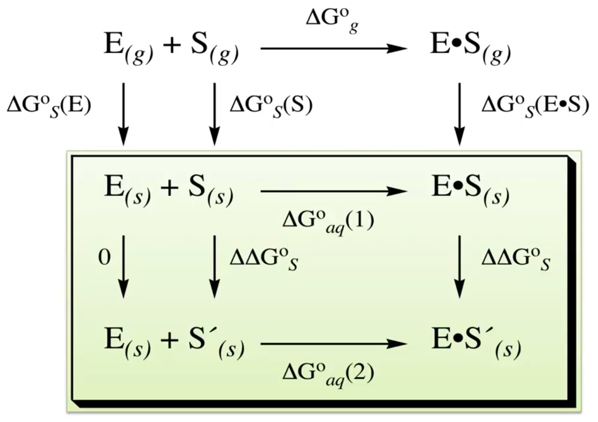

# Free Energy Perturbation

??? abstract
	
	

	<iframe width="560" height="315" src="https://www.youtube.com/embed/Xv95xYlsrbY" frameborder="0" allow="accelerometer; autoplay; encrypted-media; gyroscope; picture-in-picture" allowfullscreen></iframe>
	

Free energy perturbation (FEP) is a method in which one can perturb a system by changing a component to check free energy. This is typically done through MD[^2] by gradually changing the properties of one system into another using the following model

Where:

* $E_B=$ Energy of system $B$
* $E_A=$ Energy of system $A$
* $\lambda=$ The ratio ($0\to1$) of how far the system is tending towards system $B$

$$
E(\lambda)=\lambda E_B+(1-\lambda)E_A
$$

To couple this into MD, we need to take a number of MD iterations to get expectation values for the energy

$$
\langle A\rangle_B-\langle A\rangle_A=-k_BT\sum\limits_{\lambda=0}^1\ln\bigg\langle e^{-\big(E_{\lambda+d\lambda}-E_\lambda\big)/k_BT} \bigg\rangle_\lambda
$$

When we plot this (this example is at $\lambda=0.1$ increments), we get a plot that looks like this: {: style="width: 50%; "class="center"}

There are two ways to measure the error associated:

1. Compare the starting energy to the final energy to see how far it's deviated over the course of the process
2. Compare the maximum deviation between the two trajectories (Hysteresis) as indicated by the arrows

## E.g. 1. Enzyme-substrate binding

One of the ways in which FEP is useful is if we look at the enzyme-substrate binding process, described in [section 1](../06.01/#eg-2-enzyme-substrate-binding). We can extend this further to look at the difference that a single atom change would make (e.g. $\ce{H->F}$).

$E_{aq}$ will stay the same ($0$) but by calculating $S_{(aq)} \to S'_{(aq)}$ and $E\cdot S_{aq} \to E\cdot S'_{aq}$ we can calculate $\Delta G^\circ _{aq}(2)$ from $\Delta G^\circ _{aq}(1)$[^1]

*p.s. The fluorination process increases enzyme-substrate binding because it decreases solubility, rather than increasing the binding stability*

{: style="width: 60%; "class="center"}

In this way, we are playing "computational alchemy", since we are simulating chemically impossible things.

[^1]: The value for $\Delta G^\circ _{aq}(1)$ could be experimentally determined and $E\cdot S_{aq}$ could be an experimentally determined structure, making this a process of asking "would fluorinating this drug make it bing more effectively?"
[^2]:Though QM-MD is gaining in popularity for smaller systems

## Zwanzig Equation

The original Zwanzig equation that defines FEP is as follows

$$
\Delta F(A\to B)=F_B-F_A=k_BT\ln\bigg\langle\exp{\bigg(-\frac{E_B-E_A}{k_BT}\bigg)\bigg\rangle}_A
$$