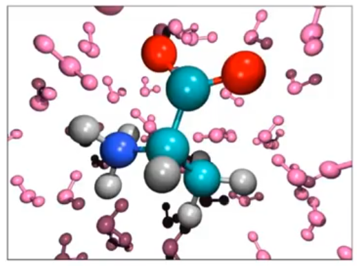
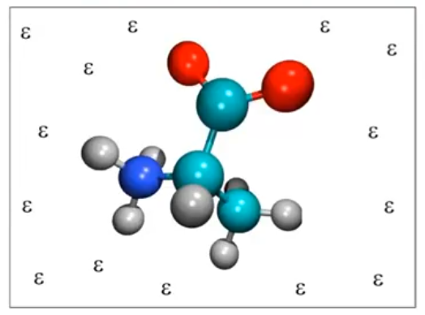
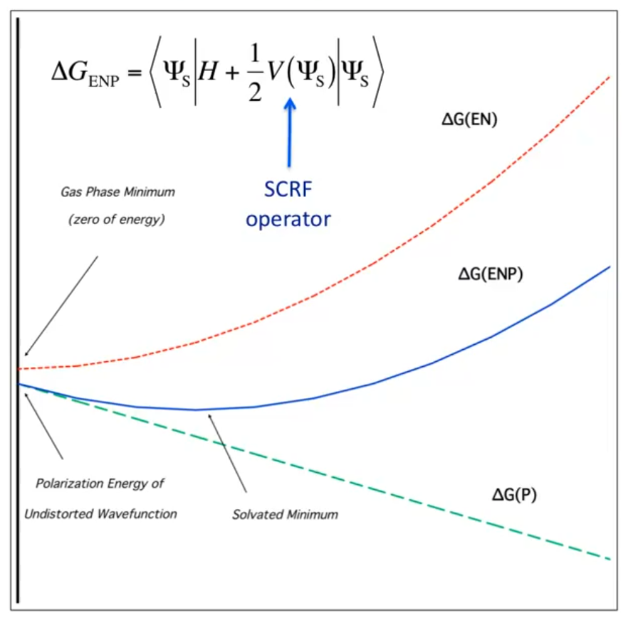
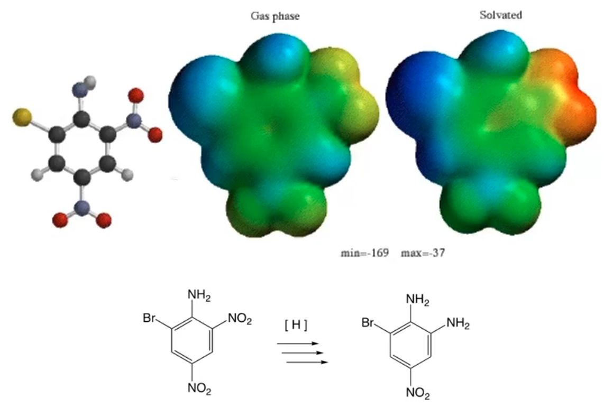

# Continuum Solvent Electrostatics

??? abstract
	
	

	<iframe width="560" height="315" src="https://www.youtube.com/embed/tB4xZLUGJqM" frameborder="0" allow="accelerometer; autoplay; encrypted-media; gyroscope; picture-in-picture" allowfullscreen></iframe>
	

## Rules for implicit solvation

### 1. If you replace the solvent molecules with a continuum, the resulting system will be no larger than the solute

* The space around the solute is characterised by the bulk dielectric constant $\varepsilon$.

#### Consequence:

All the structural information about the solvent is lost, however gas phase and solvent phase QM are now comparably expensive processes

Polarisation now arises from first principles (Self Consistent Reaction Field - SCRF)

#### Tools

Many methods available, however the Poisson equation is a basic starting point for the effects of a discrete charge in a dielectric field

$$
G=-\frac{1}{2}\int_S\rho(s)\phi(s)ds\\
$$

| Explicit | Implicit |
|:--------:|:--------:|
|||

## Solute-induced Polarisation

In the figure below, 

* The $x$ axis is some wavefunction coordinate
* The red line represents the gas phase wavefunction of the nuclei and electrons (EN)
  * The leftmost point is the global minima for the gas phase wavefunction
* The green line represents to polarisation energy, that is the effect of the continuum pushing the dipole to be stronger
* The green curve represents the combination of the favourable polarisation, with the unfavourable wavefunction distortion.
  * This culminates in a minimum that has more of a dipole to stabilise it in the solvent, giving it an overall lower energy

{: style="width: 50%; "class="center"}

## E.g. 1. Nitroaromatic radical anion

The figure below shows the charge distribution (how attracted a proton is to the region on the molecule) of the bromo-dinitroaniline$^-$ radical in both gas phase and solvated. The research showed that the nitro group that was more attractive to a proton would cause a cascade of reduction to convert $\ce{RNO2->[{[H]}] RNH2}$ at that particular point.

The effect of the continuum meant that rather than the electron being delocalised across the whole molecule, the electron had its density almost entirely located on the $1'$ nitro group.

{: style="width: 60%; "class="center"}

## Conducting sphere example

*  A conducting sphere carries a charge $q$ and has a radius $\alpha$
* The charge distribution on a sphere is given by the equation below, since the charge will all try to spread out evenly to minimise energy. The charge density will exist as the surface are of the spehere

$$
\rho(s)=\frac{q}{4\pi\alpha^2}
$$

* The potential outside the sphere is

$$
\phi(r)=-\frac{q}{\varepsilon|\alpha|}
$$

## Born equation derivation

$$
\begin{align}
G&=-\frac{1}{2}\int_S\rho(s)\phi(s)ds\\
&=-\frac{1}{2}\int_S\frac{q}{4\pi\alpha^2}\frac{q}{\varepsilon\alpha}ds\\
&=\frac{1}{2}\frac{q}{\varepsilon\alpha}
\end{align}
$$

To get the free energy difference between gas phase and solution, we can just subtract $1-\frac{1}{\varepsilon}$ giving us the final Born equation:

$$
G_P=-\frac{1}{2}\big(1-\frac{1}{\varepsilon}\big)\frac{q^2}{\alpha}
$$

Some curiosities to note

* $G_P$ changes quadratically with $q$, so double the charge would result in $4\times$ the solvation free energy
* $G_P$ changes linearly with the radius, so half the radius would double the solvation energy
* If $\varepsilon=1$, there will be no solvation energy, since $1-\frac{1}{1}=0$ which is also logical, since there should be no solvation in the vacuum ($\varepsilon=1$)

## Kirkwood-Onsager equation (Dipole in a sphere example)

Here the integral is a little bit different and we get:

$$
G_P=-\frac{1}{2}\bigg(\frac{2(\varepsilon-1)}{(2\varepsilon+1)}\bigg)\frac{\mu^2}{\alpha^3}
$$

* Note that now the energy is much more sensitive to the radius of the sphere

Which gives the Schrödinger equation

$$
\bigg\{H-\frac{1}{2}\bigg[\frac{2(\varepsilon-1)}{(2\varepsilon+1)}\bigg]\frac{\langle\Psi|\mu|\Psi\rangle}{\alpha^3}\mu\bigg\}\Psi=E\Psi
$$

We use the same gas phase hamiltonian, but add on this extra operator

Since we're dealing with another eigenfunction we're going to need to iterate on it:

$$
\bigg\{F_i-\frac{1}{2}\bigg[\frac{2(\varepsilon-1)}{(2\varepsilon+1)}\bigg]\frac{\langle\Psi|\mu|\Psi\rangle^2}{\alpha^3}\bigg\}\psi_i=\varepsilon_i\psi_i
$$

### 2. A continuum dielectric is not exactly real. It's not quite right to get too caught up in theoretical rigor

There really isn't a correct answer, since it's not even a physically observable property

#### Consequence:

Each method used to solve or approximate the poisson equation, or to construct the solvation cavity can differ greatly

**Tools:**

Parameterisation within these models is therefore just as important as in MM force fields.

## Cavitation

If we use spherical or elliptical cavitation spheres, we can analytically solve the equations really well, however these aren't a realistic representation of a molecule.

We can however, approximate solutions of the Poisson equation with arbitrary cavities, treating the molecule as either a continuous charge distribution, or as multicenter (charges on atoms) or multipole expansion, or by integrating over the surface of the cavity.

#### Examples

|Continuous Distribution|Multipole Expansion|Generalised Born|
|:---------------------:|:-----------------:|:--------------:|
|Polarisable Continuum Model (PCM)|Rivail et al.|GB|
|COnductor like Screening MOdel (COSMO)||SMx|