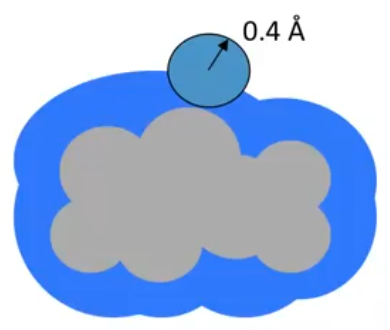
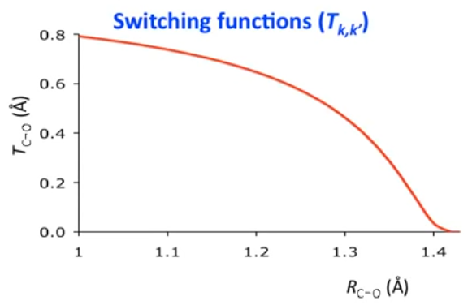

# Continuum Solvent Non-Electrostatics

??? abstract
	
	

	<iframe width="560" height="315" src="https://www.youtube.com/embed/VN6D5lgJvUc" frameborder="0" allow="accelerometer; autoplay; encrypted-media; gyroscope; picture-in-picture" allowfullscreen></iframe>
	

## Rules for implicit solvation

### 3. Electrostatics are only *part* of the free energy of solvation

#### Consequence:

You also need to somehow account for cavitation, dispersion, solvent structural changes etc.

#### Tools:

You can always make electrostatics better at the same time

## How to account for non-electrostatic terms

* (worst) You could ignore them completely, though this would only really be valid for systems where electrostatic effects will dominate
* Attempt to compute them separately e.g. one property, one calculation
* (best) Assume proportionality to the solvent-accessible surface area and parameterise microscopic surface tensions
  * Continuum solvation is inherently semiempirical, so parameterisation should not be feared.

## First solvation-shell contributions

One way to approximate the Solvent Accessible Surface Area (SASA) is to "roll a ball" over the surface of the molecule and the volume it takes up defines the 

{: style="width: 30%; "class="center"}

Where:

* $\sum\limits_k^{atoms}=$ Adding up the influence of each atom $k$
* $A_k=$ Surface area exposed of the atom $k$
* $\sigma_k=$ A characteristic surface tension, based on atomic number
* $\sum\limits_{k'}^{atoms}\sigma_{kk'}(R)=$ A modifier for the interaction of functional groups
  * $\sum\limits_{k'}^{atoms}=$ Adding up the influence of each *other* atom ($k'$)
  * $\sigma_{kk'}(R)=$ looks at the distance between the two atoms ($k$ and $k'$) and modifies the value of $\sigma$

$$
G_{CDS}=\sum\limits_k^{atoms}A_k\bigg(\sigma_k+\sum\limits_{k'}^{atoms}\sigma_{kk'}(R)\bigg)
$$

The value of $\sigma_{kk'}$ varies over distance, which will result in a gradual switching behaviour. In the figure below, the short distances might represent a ketone (the switch is on) and the longer distance might represent an ether (the switch is off)

{: style="width: 30%; "class="center"}

## Microscopic surface tensions

This simple equation shows the non-electrostatic solvation energy $G_{CDS}$ is equal to the sum of the exposed surface area of each atom $A_k$ times some proportionality constant $\sigma_k$.

$$
G_{CDS}=\sum\limits_kA_k\sigma_k
$$

### E.g. 1. SMx universal solvation model

These are **universal**, because the surface tension ($\sigma_k$) will change based on the solvent

* Surface tensions are treated as functions, rather than parameters
* The value arrives from running over a series of descriptors ($\sum_j^{descr}$) and taking a parameter associated with that descriptor ($\hat{\sigma}_{Z_i}$) and multiplying it with the descriptor ($\xi_j$$)

$$
\sigma_i=\sum\limits_j^{descr}\hat{\sigma}_{Z_i}\xi_j
$$

The descriptors could be (incomplete list):

* $n=$ solvent index of refraction (is a direct measure of polarisability of the solvent)
* $\gamma=$ solvent macroscopic surface tension (how hard it is to cavitate the solvent)
* $\alpha=$ Abraham h-bonding acidity (the ability of the solvent to h-bond as a proton donor)
* $\beta=$ Abraham h-bonding basicity (the ability of the solvent to h-bond as a proton acceptor)

#### To create these parameters

Take the experimental data, subtract the electrostatics to get the $G_{CDS}$, we know the surface area, since we can calculate it, which leaves the unknown parameters.

After doing a big multilinear regression, we can determine the universal parameters of the solvent

$$
\Delta G_{aq,\:expt}-\Delta G_{ENP}=G_{CDS}=\sum\limits_kA_k\sigma_k
$$

#### The result

SM8 has about 72 parameters for 2500 data (H, C, N, O, F, S, P, Cl, Br based compounds) in 91 solvents.

There is a mean error of $\sim\pm0.6\:kcal\:mol^{-1}$ for neutral species and $\pm3-6\:kcal\:mol^{-1}$ for ions (depending on the solvent)

## Examples of solvent descriptors

|                                                              | $\ce{H2O}$ | $\ce{C6H6}$ | $\ce{CH2Cl2}$ |
| :----------------------------------------------------------- | :--------: | :---------: | :-----------: |
| Dielectric constant ($\varepsilon$)                          |   78.36    |    2.27     |     8.93      |
| Abraham h-bonding acidity ($\alpha$)                         |    0.82    |    0.00     |     0.10      |
| Abraham h-bonding basicity ($\beta$)                         |    0.38    |  0.14[^1]   |     0.05      |
| Refractive index ($n$)                                       |    1.33    |    1.50     |     1.42      |
| Surface tension ($cal\cdot mol^{-1}\cdot\unicode{x212B}^{-2}$) |   104.71   |    40.62    |     39.15     |
| Carbon aromaticity                                           |    0.00    |    1.00     |     0.00      |
| Electronegative halogenicity                                 |    0.00    |    0.00     |     0.67      |

[^1]:Benzene's $\pi$ cloud can actually accept a proton to some extent.

## SM8 Performance

Mean unsigned errors (kcal/mol) for SM8 compared to other models

| Solute Class         | Data N | SM8  | IEFPCM (G03/UA0) | C-PCM GAMESS | PB Jaguar | All Equal to Mean[^2] |
| :------------------- | :----: | :--: | :--------------: | :----------: | :-------: | :-------------------: |
| Aqueous neutrals     |  274   | 0.5  |       4.9        |     1.6      |    0.9    |          2.7          |
| Non-aqueous neutrals |  666   | 0.6  |       6.0        |     2.8      |    2.3    |          1.5          |
| Aqueous ions         |  112   | 3.2  |       12.4       |     8.4      |    4.0    |          8.6          |
| Non-aqueous ions     |  220   | 4.9  |       8.4        |     8.4      |    8.1    |          8.6          |

[^2]:Assumes no difference in atom types.