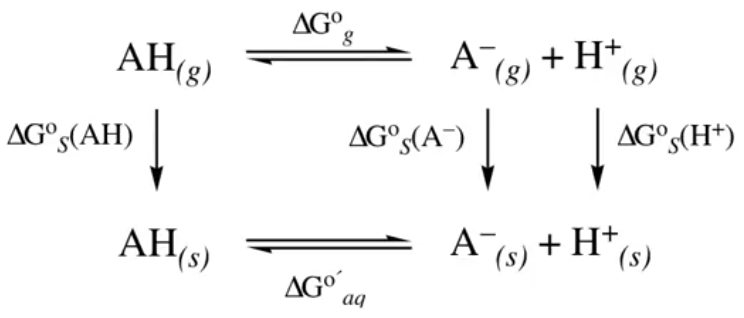
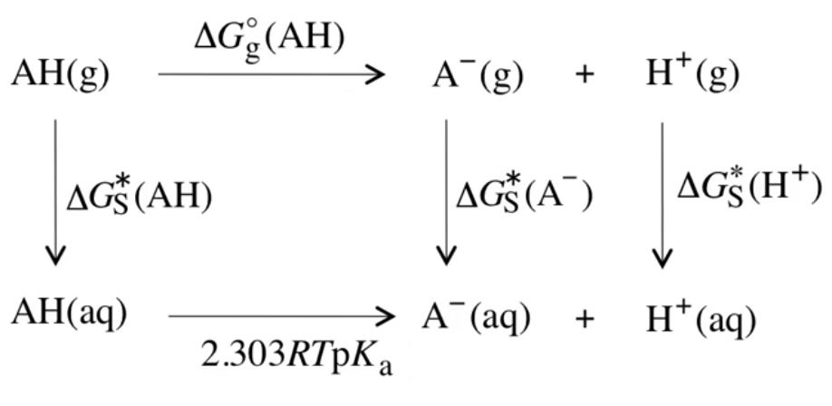
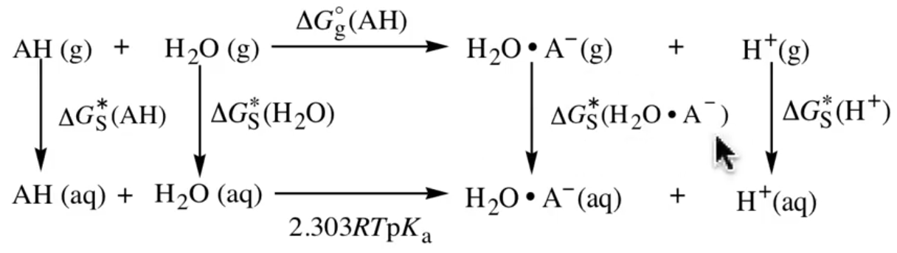
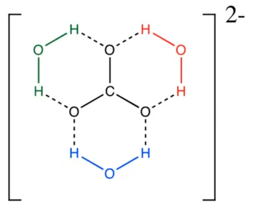

# Hybrid Models

??? abstract
	
	

	<iframe width="560" height="315" src="https://www.youtube.com/embed/hXT5KWDBnRI" frameborder="0" allow="accelerometer; autoplay; encrypted-media; gyroscope; picture-in-picture" allowfullscreen></iframe>
	

## Equilibria

### $pK_a$ (Born-Haber cycle)

$pK_a$ is typically calculated using the Born-Haber cycle with the equation:

Where $\Delta G^{\circ\prime}=\Delta G^{\circ\prime}_{aq}$

$$
\begin{align}
pK_a&=-\log\bigg[\exp{\bigg(\frac{-\Delta G^{\circ\prime}}{RT}\bigg)}\bigg]\\
&=\frac{\Delta G^{\circ\prime}}{2.303RT}
\end{align}
$$

Using the free energy cycle:

{: style="width: 35%; "class=center sharp"}

### Process:

1. For the anion, I need diffuse functions, a big basis set and a good level of theory
2. QM packages won't let you calculate the electronic energy of $\ce{H+}$, since there's no electron to calculate
3. $\Delta G^\circ_{(s)}=-264.0\:kcal\cdot mol^{-1}$ (experimentally derived)
4. Standard-state concentration-change free energy must be included
5. each non-cancelled error of $1.4\:kcal\cdot mol^{-1}$ in any step will lead to an error of 1 $pK_a$ unit
   * Errors in ionic solvation free energies can be *much* larger than that
6. Function-group systematic errors can be corrected for

## The overall equation

We can condense this all into the one line equation:

$$
2.303RT\:pK_a=\Delta G_g^\circ(AH)-\Delta G^*_{aq}(AH)+\Delta G^*_{aq}(A^-)+\Delta G_{aq}^*(H^+)
$$

Using this free energy cycle:

{: style="width: 40%; "class="center"}

## Free energy cycles and ion structures

Here we're treating the ion as a cluster, in an attempt to try and reduce the amount error on the cluster:

$$
2.303RT \: pK_a = \Delta G_g^\circ (AH) - \Delta G^*_{aq}(AH) - \Delta G^*_{aq}(\ce{H2O})+\Delta G^*_{aq}(\ce{H2O}\cdot A^-)+\Delta G_{aq}^*(H^+)
$$

Utilising this free energy cycle:

{: style="width: 60%; "class="center"}

## Comparison (Experimental Data $pK_a=15.5$)

### Experimental data

|               Method 1 $\ce{MeOH/MeO-}$                |             Method 2 $\ce{MeOH/H2O.MeO-}$              |
| :----------------------------------------------------: | :----------------------------------------------------: |
|      $\Delta G^\circ_g=375.0\:kcal\cdot mol^{-1}$      |      $\Delta G^\circ_g=358.0\:kcal\cdot mol^{-1}$      |
| $\Delta G_{aq}^*(\ce{H+})=-265.9\:kcal\cdot mol^{-1}$  | $\Delta G_{aq}^*(\ce{H+})=-265.9\:kcal\cdot mol^{-1}$  |
| $\Delta G_{aq}^*(\ce{MeOH})=-5.11\:kcal\cdot mol^{-1}$ | $\Delta G_{aq}^*(\ce{MeOH})=-5.11\:kcal\cdot mol^{-1}$ |
|                                                        | $\Delta G_{aq}^*(\ce{H2O})=-6.32\:kcal\cdot mol^{-1}$  |

### Computed data (SM6)

|               Method 1 $\ce{MeOH/MeO-}$                |               Method 2 $\ce{MeOH/H2O.MeO-}$                |
| :----------------------------------------------------: | :--------------------------------------------------------: |
| $\Delta G^*_{aq}(\ce{MeO-})=-88.3\:kcal\cdot mol^{-1}$ | $\Delta G^*_{aq}(\ce{H2O.MeO-})=-81.8\:kcal\cdot mol^{-1}$ |
|                      $pK_a=20.4$                       |                        $pK_a=16.0$                         |

## Adding more waters

This is the experimental $pK_a$ data{: style="width: 20%; "class="center"}

$$
\ce{H2CO3 <=>[pK_{a_1}=6.4] HCO3- <=>[pK_{a_2}=10.3] CO3^{2-}}
$$

Without adding explicit waters of solvation, the results are insanely inaccurate, however when we add water molecules in, the structure becomes much more stabilised  and the $pK_a$ is much more in line with experiment.

| No. $\ce{H2O}$ | $pK_{a_1}$ | $pK_{a_2}$ |
| :------------: | :--------: | :--------: |
|       0        |    -0.6    |    1.6     |
|       1        |    1.3     |    5.0     |
|       2        |    2.3     |    7.8     |
|       3        |    4.2     |    9.0     |

