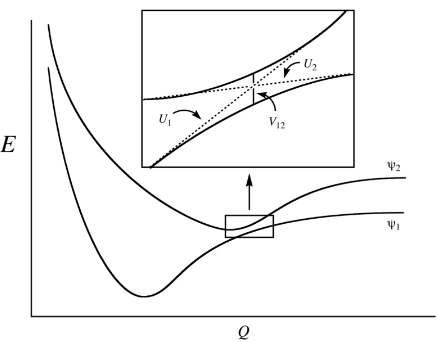
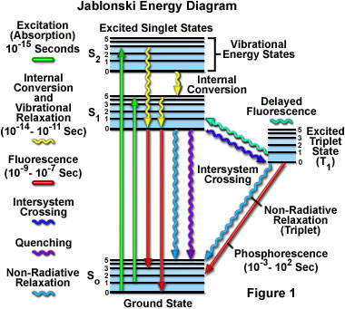

# Conical Intersections

??? abstract
	

	

	<iframe width="560" height="315" src="https://www.youtube.com/embed/Jsi8b1M45bg" frameborder="0" allow="accelerometer; autoplay; encrypted-media; gyroscope; picture-in-picture" allowfullscreen></iframe>
	

Occur at the intersection between of the PES between different electronic excited states. They allow for radiationless transition between the two PES.

!!! info "Kasha's Rule"
	 States that photonic emission will only happen in appreciable yield from the lowest excited to the ground state.
	

	Another way to think about this is that the wavelength of an emitted photon is going to be independent of the photon that excited the molecule.
	
	This happens mostly because the exited states will all be relatively close in energy, resulting in appreciable overlap that allows for non-emissive relaxation to the lowest excited state.

The Landau-Zener model allows us to determine the likelihood to of this "surface hopping" by looking at how close they get to each other, and the gradient between them

$$
\begin{align}
P&=\exp\bigg(\frac{\pi V^2_{12}}{h\nu|\psi_1-\psi_2|}\bigg)\\\\
\psi_i&=\frac{dU_i}{dQ}
\end{align}
$$

{: style="width: 50%; "class=center sharp"}

We can use a Jablonski diagram to understand the different excitation/relaxation processes and their timeframes.

{: style="width: 50%; "class=center sharp"}

