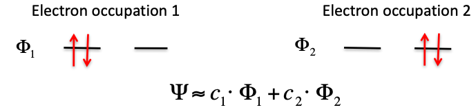
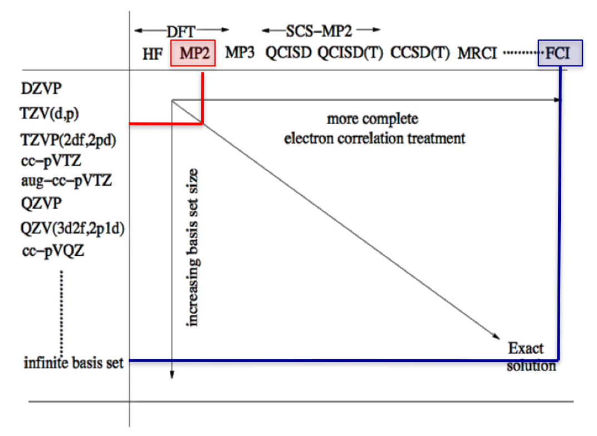
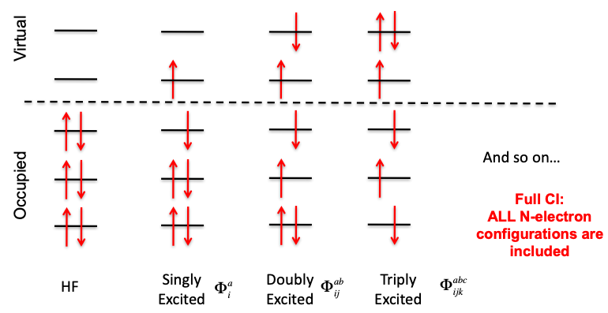
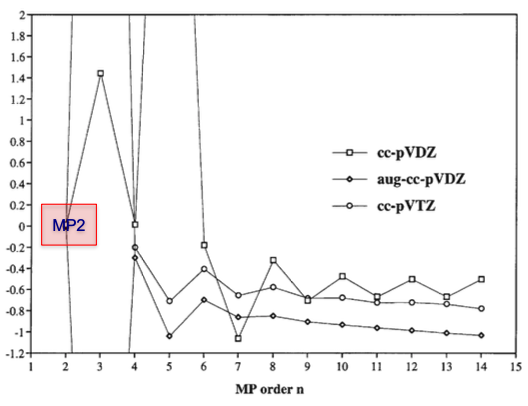
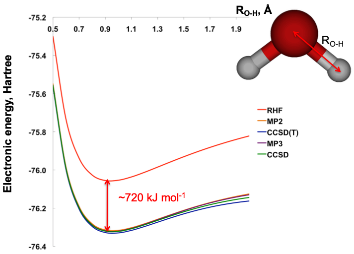
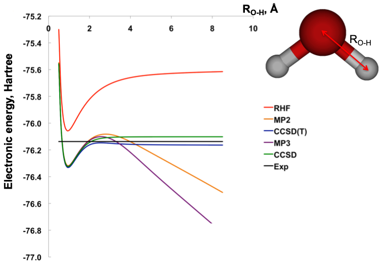
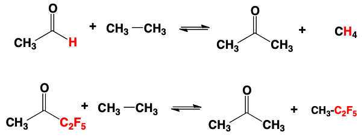

# Electron Correlation

Electron correlation is defined as (By Löwdin) the difference in the electronic energy obtained between HF and a correlated method:

$$
E^{corr}=E_{method}-E_{HF}
$$

Correlation energy comes in two forms, dynamic and static

## Dynamic Correlation Energy

Occurs as a result of the fact that electrons cannot exist in the same place at the same time, and will ultimately avoid each other. The electrons will have a certain energy associated with this avoidant behaviour

## Static Correlation Energy

Also known as "Non-dynamic" or "Strong", comes form the near degeneracy of MOs.  Since electrons are indistinguishable from each other, in certain cases (such as transition metals and $\ce{O3}$), the wavefunction will have to be made of a combination of the possible states of the system, leading to a difference in energy.

{: style="width: 70%; "class="center"}

This energy accounts for about 1% of the total energy, however since it predominantly effects the valence electrons, it can account for $>90%$ of the reaction energy

## Pople Diagram

The Pople diagram gives us a sense that to achieve higher levels of theory and accuracy (to obtain a more accurate solution to the Schrodinger equation), we need an appropriately large basis set:

{: style="width: 70%; "class="center"}

## Solving Correlated Levels of Theory

To get the exact solution to the Schrodinger equation using Configuration Interaction (CI) we need to consider all the possible excitations of the system. For each increase of the number of excitations, you significantly increase the number of possible configurations 

$$
\Psi=\color{red}C_{HF}\Phi_{HF}\color{blue}+\sum\limits_{ia}C_i^a\Phi_i^a\color{green}+\sum\limits_{a<b\\i<j}C_{ij}^{ab}\Phi_{ij}^{ab}\color{purple}+\sum\limits_{a<b<c\\i<j<k}C_{ijk}^{abc}\Phi_{ijk}^{abc}\color{orange}+...
$$

Where $a, b, c, ...$ are virtual orbitals and $i, j, k, ...$ are occupied orbitals.

{: style="width: 70%; "class="center"}

### The Cost

| Excitations |            Cost             |
| :---------: | :-------------------------: |
|   Single    |   $n_{occ}\cdot N_{virt}$   |
|   Double    | $n_{occ}^2\cdot N_{virt}^2$ |
|   Triple    | $n_{occ}^3\cdot N_{virt}^3$ |

For perspective, water with a DZVP basis has about $10^{42}$ configuration (for full CI), so if each configuration takes 1 second to calculate, it would take $3.171\e{34}$ years to calculate.

With coupled cluster methods, the notation is CCSD for "Coupled Cluster Singled Doubles" and when we add extra terms in brackets, such as "CCSD(T)" the triple excitation states are not optimised.

### CI VS CC

CI and CC both use the excitations, however CI uses a linear combination of the excitations where CC uses an exponential of the Taylor's series of the excitations that maintains the size extensivity.

$$
\begin{gather}
\Psi_{CI}=(1+C_1+C_2+C_3+…) \Psi_{HF}\\
\Psi_{CC}=exp(1+\widehat{T}_1+\widehat{T}_2+\frac{1}{2!} \widehat{T}_1^2+\frac{1}{2!} \widehat{T}_2^2+\frac{1}{3!} \widehat{T}_1^3+\frac{1}{3!}\widehat{T}_2^3+…) \Psi_{HF}
\end{gather}
$$

For full calculations (where all excitations are considered) CI and CC will produce the same results, however both will be effectively unobtainable in terms of cost.

When truncated, CI becomes **non-size-extensive** where CC becomes **non-variational**. since being variational is kind of unimportant, as non complete basis sets will typically be used, CC is preferable to CI.

While writing this, the scaling of both CI and CC are about the same.

### MP2

MP2 is a non-variational method that uses the HF method and is thus fundamentally variational, that recovers 80-95% of the correlation energy.

MP2 is the typical go to, as it has been shown that higher orders will not necessarily converge and can have quite nasty issues in terms of consistency, as can be seen below.

{: style="width: 50%; "class="center"}

| Method |  MP2  | CISD  | CCSD  | CCSD(T) |
| ------ | :---: | :---: | :---: | :-----: |
| Cost   | $N^5$ | $N^5$ | $N^6$ |  $N^7$  |

## MP2 VS CC

For a bond dissociation, around equilibrium geometry all the methods perform similarly well

{: style="width: 50%; "class="center"}

However, since MP2 is [based on the HF method](../04/#for-radicals), it will break down as the bond dissociates to two radicals, treating them as an anion and cation

{: style="width: 50%; "class="center"}

## Size Consistency

Is the concept that if you have two identical molecules, far enough apart from each other that the won't interact, the energy of both of them in the one calculation should be equal to twice the energy of one molecule on its own.

$$
E_\ce{2H2O} = 2E_{\ce{H2O}}
$$

For Full CI, if we truncate the method at the Doubles level with two molecules, the highest level of excitation will be one electron from each molecule being excited, leading to a discrepancy in the energy.

For CI to be truncated in a size consistent manner, it needs to be at a level of 2 times the number of molecules in the system.

## Size Extensivity

Is the concept that the energetic error from the method should be the same for all atom types. 

E.g. The reactions below should both have an error of  $\pm10\:KJ\cdot mol^{-1}$ despite one including heavier atoms. 

{: style="width: 70%; "class="center"}

## Basis Set Superposition Error (BSSE)

Occurs as a result of non-covalent interactions between interactions causing a stabilisation (decreasing of energy) of the MOs. Since the electrons are always assigned to the  lowest energy orbitals first, some electrons from one molecule will be assigned to the other one in a non-realistic situation. 

This problem increases massively with the number of non-covalently interacting molecules in the system, and will increase where there is a large amount of density, such as in condensed phases. 

BSSE tends to be irrelevant for HF, as there is no exchange in the calculation and is less significant for DFT, however it is most important for correlated methods as there is simply more opportunity for BSSE to occur, through its many interactions.

### Counter-poise (CP) Correction

The BSSE energy can be calculated using a perturbation method to determine how much this energy accounts for:

$$
E^{CP}(A\cdots B)=E_{AB}(A\cdots B)-\big[E_{AB}(A)-E_A(A)\big]-\big[E_{AB}(B)-E_B(B)\big]
$$

Where:

* $E_{AB}(A\cdots B)=$ The energy of the total system
* $E_{AB}(A)=$ The energy of molecule $A$ in the presence of virtual atoms of $B$ (perturbed)
* $E_{AB}(B)=$ The energy of molecule $B$ in the presence of virtual atoms of $A$ (perturbed)
* $E_A(A)=$ The energy of molecule $A$ by itself (unperturbed)
* $E_A(B)=$ The energy of molecule $B$ by itself (unperturbed)

