# Appendices 

Working iPython notebook files for the processing of data relating to benchmarks and all raw data for the OEEF scanning sections can be found at  [:fa-github: GitHub](https://github.com/adreasnow/honours). Due to the enormity of the undertaking, geometries have not been included and due to the enormity of their file sizes, PyMOL files have not been shared either, however both are available [:fa-envelope: upon request](mailto:mailto:adrea.snow@monash.edu).$\newcommand{\va}{V\cdot\AA^{-1}}\newcommand{\eh}{E_h}\newcommand{\dc}{^\circ C}\newcommand{\kcalmol}{Kcal\cdot mol^{-1}}\newcommand{\kjmol}{KJ\cdot mol^{-1}}$

## A Raw data from the pathway benchmarking in Section 3.1

<a>Table A.1: </a>Raw $\Delta G^{\circ}$ from the benchmarking of the reaction pathways in [Section 3.1](../3.results/#31-pathway-selection). The blank cells pertain to calculations that were not performed.

| Pathway         | Energy ($E_h$) |                    |              |                    |              |
| --------------- | :------------: | :----------------: | :----------: | :----------------: | :----------: |
|                 |    Reactant    | Transition State 1 | Intermediate | Transition State 2 |   Product    |
| Non-activated   |  -709.212961   |    -709.171714     |              |                    | -709.187604  |
| Brønsted Acid 1 |                |    Barrierless     | -709.620615  |    -709.599167     | -709.634264  |
| Brønsted Acid 2 |                |    -786.010860     | -709.596855  |    Barrierless     | -709.648273  |
| Brønsted Base   |                |    -785.166022     | -708.726998  |    -708.701422     | -708.755359  |
| Lewis Acid      |                |    Barrierless     | -1033.879641 |    -1033.855176    | -1033.885971 |
| Lewis Base      |                |    Barrierless     | -960.453357  |    -960.453357     | -960.483276  |

<a>Table A.2: </a>raw $\Delta G^{\circ}$ of the species used top balance the reaction trajectories in [Section 3.1](../3.results/#31-pathway-selection)

| Additive    | Energy ($E_h$) |
| ----------- | :------------: |
| $\ce{H2O}$  |   -76.440078   |
| $\ce{H3O+}$ |   -76.830283   |
| Piperidine  |  -251.221244   |
| $\ce{BF3}$  |  -324.652124   |

<a>Table A.3: </a>Transition state imaginary frequencies and calculated transmission coefficients for the intermediate formation and cyclisation steps respectively, for the reaction pathways benchmarked in [Section 3.1](../3.results/#31-pathway-selection)

|                 | Frequency 1 ($cm^{-1}$) | $\kappa_1$ | Frequency 2 ($cm^{-1}$) | $\kappa_2$ |
| --------------- | ----------------------- | ---------- | ----------------------- | ---------- |
| Brønsted Acid 1 | Barrierless             |            | -382.40                 | 1.157      |
| Brønsted Acid 2 | -1228.66                | 13.612     | Barrierless             |            |
| Brønsted Base   | -1200.35                | 1.185      | -534.59                 | 1.342      |
| Lewis Acid      | Barrierless             |            | -427.78                 | 1.202      |
| Lewis Base      | Barrierless             |            | -548.23                 | 1.365      |

|                               |                                                |
| :----------------------------------------------------------: | :----------------------------------------------------------: |
| PES scan of the Lewis acid ($\ce{BF3}$) attaching into **1**, scanning along the $\ce{O-B}$  bond length. | PES scan of the Lewis base ($\ce{piperidine-}$) deprotonating the **1** amine, scanning along the amine $\ce{N-H}$ bond length. |
|                              |                               |
| PES scan of the protonation of the 'Brønsted acid 1'  pathway (**1** $\to$ **7**) scanning along the forming $\ce{O-H}$ bond length. | PES scan of the cyclisation of the 'Brønsted acid 2'  pathway (**11** $\to$ **4**) scanning along the forming $\ce{N-C}$ bond length. |

<a>Figure A.1: </a>PES scans along the reaction coordinate for all barrierless steps in the various pathways.

## B Raw data and reaction trajectories from  Section 3.4

<a>Table B.1: </a>Raw $\Delta G^\circ$, transition state imaginary frequencies, and tramsission coefficients for the benchmarks performed in [Section 3.4](../3.results/#34-benchmarking-the-optimised-oeef-directions-on-relaxed-geometry)

| $\vec F$ ($\va$)         | $\Delta G$ Reactant ($\eh$) | $\Delta G$ Transition State ($\eh$) | $\Delta G$ Product ($\eh$) | $\bar\nu$ | $\kappa$ |
| ------------------------ | :-------------------------: | :---------------------------------: | :------------------------: | :-------: | :------: |
| Gas                      |                             |                                     |                            |           |          |
| None                     |         -708.898472         |             -708.838431             |        -708.840519         |  -472.60  |  1.243   |
| 0.1 (Catalytic)          |         -708.898222         |             -708.841845             |        -708.845638         |  -434.69  |  1.210   |
| 0.1 (*S* anti-selective) |         -708.898075         |             -708.836571             |        -708.838916         |  -472.30  |  1.247   |
| 0.1 (*S* anti-selective) |         -708.898395         |             -708.839004             |        -708.840006         |  -472.70  |  1.166   |
|                          |                             |                                     |                            |           |          |
| Hexane                   |                             |                                     |                            |           |          |
| None                     |         -708.906434         |             -708.853442             |        -708.8 58711        |  -489.29  |  1.276   |
| 0.1 (Catalytic)          |         -708.906599         |             -708.857667             |        -708.865868         |  -465.54  |  1.246   |
| 0.1 (*S* anti-selective) |         -708.906126         |             -708.851179             |        -708.857311         |  -487.68  |  1.274   |
| 0.1 (*S* anti-selective) |         -708.906126         |             -708.851179             |        -708.857311         |  -487.68  |  1.257   |
|                          |                             |                                     |                            |           |          |
| DCM                      |                             |                                     |                            |           |          |
| None                     |         -708.916525         |             -708.871672             |        -708.885508         |  -486.00  |  1.266   |
| 0.1 (Catalytic)          |         -708.915264         |             -708.875421             |        -708.890046         |  -460.69  |  1.240   |
| 0.1 (*S* anti-selective) |         -708.914632         |             -708.867875             |        -708.879710         |  -484.81  |  1.271   |
| 0.1 (*S* anti-selective) |         -708.915696         |             -708.872193             |        -708.883006         |  -462.14  |  1.242   |
|                          |                             |                                     |                            |           |          |
| Ethanol                  |                             |                                     |                            |           |          |
| None                     |         -708.916180         |             -708.872721             |        -708.885927         |  -482.10  |  1.267   |
| 0.1 (Catalytic)          |         -708.916826         |             -708.878676             |        -708.894984         |  -457.65  |  1.236   |
| 0.1 (*S* anti-selective) |         -708.916163         |             -708.870769             |        -708.884170         |  -486.67  |  1.273   |
| 0.1 (*S* anti-selective) |         -708.917107         |             -708.875217             |        -708.887664         |  -458.69  |  1.238   |
|                          |                             |                                     |                            |           |          |
| DMSO                     |                             |                                     |                            |           |          |
| None                     |         -708.916626         |             -708.873640             |        -708.887326         |  -480.16  |  1.264   |
| 0.1 (Catalytic)          |         -708.917322         |             -708.879704             |        -708.896476         |  -456.87  |  1.235   |
| 0.1 (*S* anti-selective) |         -708.916525         |             -708.871672             |        -708.885508         |  -486.00  |  1.272   |
| 0.1 (*S* anti-selective) |         -708.916525         |             -708.871672             |        -708.885508         |  -486.00  |  1.235   |
|                          |                             |                                     |                            |           |          |
| Water                    |                             |                                     |                            |           |          |
| None                     |         -708.916820         |             -708.874020             |        -708.887956         |  -481.96  |  1.267   |
| 0.1 (Catalytic)          |         -708.917509         |             -708.880107             |        -708.897132         |  -456.64  |  1.235   |
| 0.1 (*S* anti-selective) |         -708.916764         |             -708.872039             |        -708.886105         |  -486.57  |  1.273   |
| 0.1 (*S* anti-selective) |         -708.917400         |             -708.876558             |        -708.889680         |  -459.05  |  1.238   |

{: style="width: 80%; "class="center"}
{: style="width: 80%; "class="center"}
{: style="width: 80%; "class="center"}
{: style="width: 80%; "class="center"}
{: style="width: 80%; "class="center"}
{: style="width: 80%; "class="center"}

<a>Figure B.1: <a/>Reaction trajectories for the relaxed benchmarks performed in [Section 3.4](../3.results/#34-benchmarking-the-optimised-oeef-directions-on-relaxed-geometry)

## C Electron density difference maps of the derivatives discussed in Section 3.5 

|                                  |      |      |      |
| :------------------------------: | :--: | :--: | :--: |
| 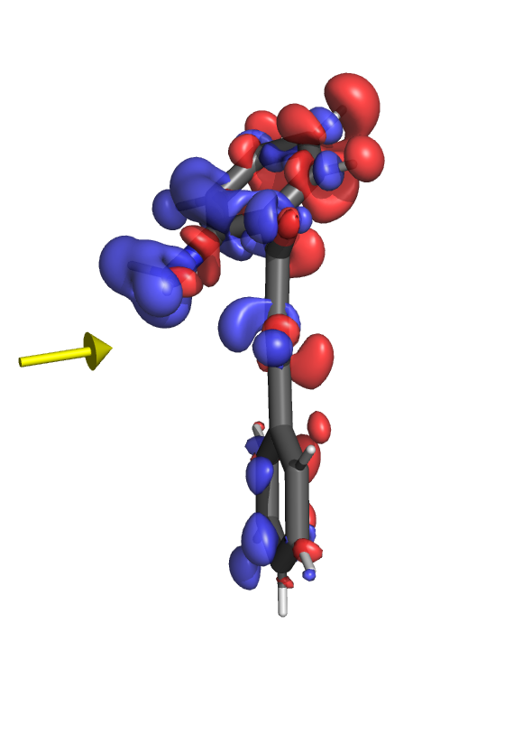 | |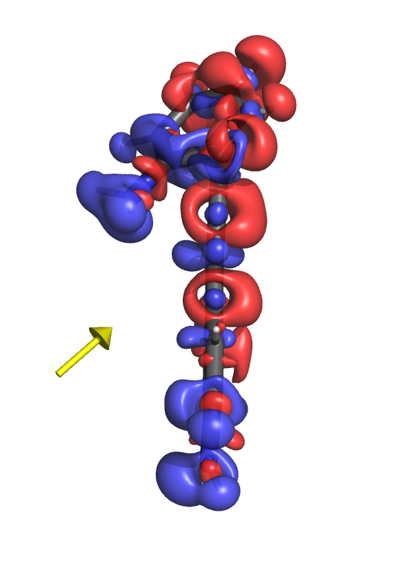||
| $\ce{R1 = H, R2 = H}$ $F=$ *S* selective | $\ce{R1 = H, R2 = H}$ $F=$ *S* anti-selective |$\ce{R1 = H, R2 = NH2}$ $F=$ *S* selective|$\ce{R1 = H, R2 = NH2}$ $F=$ *S* anti-selective|
|  | 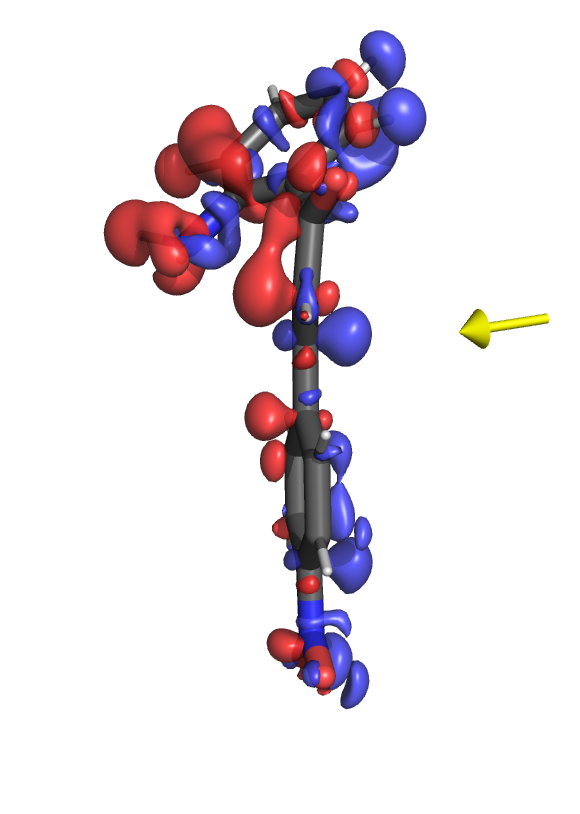|||
| $\ce{R1 = H, R2 = NO2}$ $F=$ *S* selective | $\ce{R1 = H, R2 = NO2}$ $F=$ *S* anti-selective |$\ce{R1 = NH2, R2 = H}$ $F=$ *S* selective|$\ce{R1 = NH2, R2 = H}$ $F=$ *S* anti-selective|
|  | |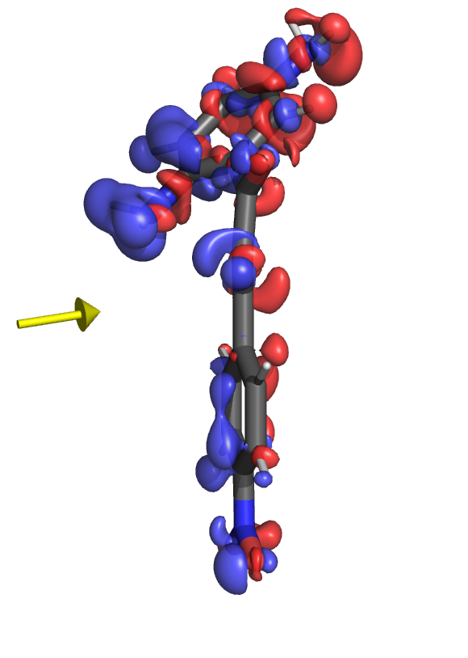||
| $\ce{R1 = NH2, R2 = NH2}$ $F=$ *S* selective | $\ce{R1 = NH2, R2 = NH2}$ $F=$ *S* anti-selective |$\ce{R1 = NH2, R2 = NO2}$ $F=$ *S* selective|$\ce{R1 = NH2, R2 = NO2}$ $F=$ *S* anti-selective|
|  | 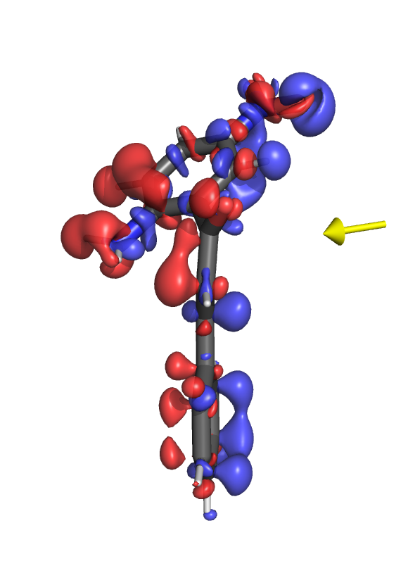||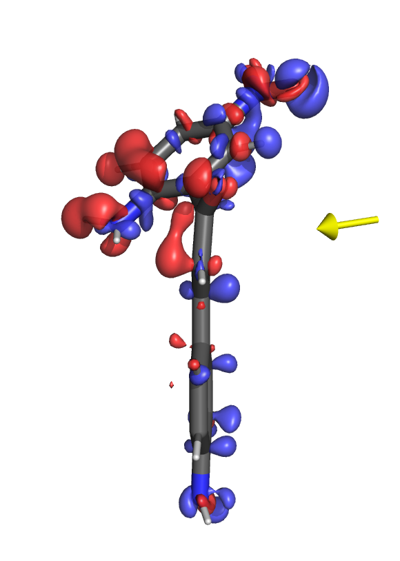|
| $\ce{R1 = NO2, R2 = H}$ $F=$ *S* selective | $\ce{R1 = NO2, R2 = H}$ $F=$ *S* anti-selective |$\ce{R1 = NO2, R2 = NH2}$ $F=$ *S* selective|$\ce{R1 = NO2, R2 = NH2}$ $F=$ *S* anti-selective|
| | 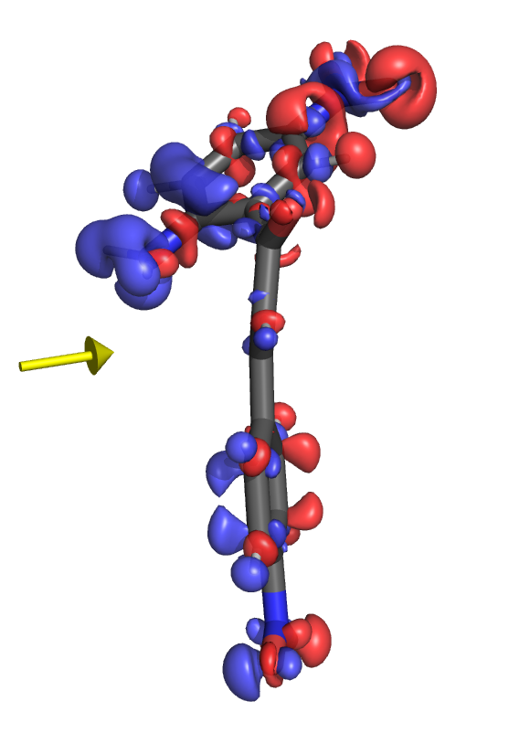 | 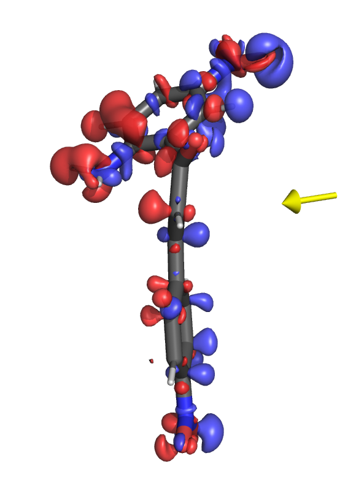| |
| | $\ce{R1 = NO2, R2 = NO2}$ $F=$ *S* selective | $\ce{R1 = NO2, R2 = NO2}$ $F=$ *S* anti-selective | |

<a>Figure C.1:</a> Electron density difference isosurfaces following an isovalue of 0.0002 for the optimal $0.1\:\va$ *S* selective/*S* anti-selective OEEF directions for each of the derivatives, calculated at M06-2X/6-31+G\*, solvated in CPCM ethanol. The red and blue isosurfaces represent regions of increased and decreased electron density respectively. The yellow arrow is a representation of the direction of the applied field vector.

## D Raw data and reaction trajectories from Section 3.6

<a>Figure D.1:</a> Raw $\Delta G^\circ$, transition state imaginary frequencies, and tramsission coefficients for the benchmarks performed in [Section 3.6](../3.results/#35-investigating-the-effects-of-charged-derivatisation-of-2-aminochalcone)

| $\vec F$ ($\va$)                 | $\Delta G$ Reactant ($\eh$) | $\Delta G$ Transition State ($\eh$) | $\Delta G$ Product ($\eh$) | $\bar\nu$ | $\kappa$ |
| -------------------------------- | :-------------------------: | :---------------------------------: | :------------------------: | :-------: | :------: |
| Non-derivatised ($\ce{R1,R2=H}$) |                             |                                     |                            |           |          |
| None                             |         -708.916180         |             -708.872721             |        -708.885927         |  -482.10  |  1.267   |
| 0.1 (Catalytic)                  |         -708.916826         |             -708.878676             |        -708.894984         |  -457.65  |  1.236   |
| 0.1 (*S* anti-selective)         |         -708.916163         |             -708.870769             |        -708.884170         |  -486.67  |  1.273   |
| 0.1 (*S* anti-selective)         |         -708.917107         |             -708.875217             |        -708.887664         |  -458.69  |  1.238   |
| 0.2 (Catalytic)                  |         -708.913028         |             -708.876643             |        -708.903230         |  -431.65  |  1.207   |
| 0.2 (*S* anti-selective)         |         -708.916849         |             -708.868621             |        -708.882899         |  -488.55  |  1.276   |
| 0.2 (*S* anti-selective)         |         -708.918317         |             -708.877299             |        -708.890741         |  -436.64  |  1.212   |
|                                  |                             |                                     |                            |           |          |
| Derivatised ($\ce{R1,R2=NO2}$)   |                             |                                     |                            |           |          |
| None                             |        -1117.798403         |            -1117.747859             |        -1117.759120        |  -511.75  |  1.308   |
| 0.1 (Catalytic)                  |        -1117.792269         |            -1117.752700             |        -1117.768354        |  -489.44  |  1.277   |
| 0.1 (*S* anti-selective)         |        -1117.797376         |            -1117.744906             |        -1117.758071        |  -517.59  |  1.316   |
| 0.1 (*S* anti-selective)         |        -1117.801593         |            -1117.745641             |        -1117.760201        |  -486.77  |  1.273   |
| 0.2 (Catalytic)                  |        -1117.787395         |            -1117.750533             |        -1117.775299        |  -443.38  |  1.220   |
| 0.2 (*S* anti-selective)         |        -1117.795114         |            -1117.741251             |        -1117.757556        |  -527.43  |  1.331   |
| 0.2 (*S* anti-selective)         |        -1117.803489         |            -1117.748212             |        -1117.761122        |  -484.36  |   1.27   |
|                                  |                             |                                     |                            |           |          |
| Derivatised ($\ce{R1,R2=NH2}$)   |                             |                                     |                            |           |          |
| None                             |         -819.567938         |             -819.527946             |        -819.541147         |  -453.96  |  1.232   |
| 0.1 (Catalytic)                  |         -819.572619         |             -819.535792             |        -819.550188         |  -427.28  |  1.202   |
| 0.1 (*S* anti-selective)         |         -819.569241         |             -819.526057             |        -819.540957         |  -463.67  |  1.244   |
| 0.1 (*S* anti-selective)         |         -819.569181         |             -819.530218             |        -819.544841         |  -432.05  |  1.207   |
| 0.2 (Catalytic)                  |         -819.576743         |             -819.539267             |        -819.556151         |  -418.99  |  1.193   |
| 0.2 (*S* anti-selective)         |         -819.570568         |             -819.525077             |        -819.541019         |  -468.29  |  1.249   |
| 0.2 (*S* anti-selective)         |         -819.572210         |             -819.531785             |        -819.548810         |  -407.72  |  1.182   |

## E Transition state geometries  and reaction trajectories from the OEEF perturbed benchmarks in Section 3.6 

{: style="width: 80%; "class="center"}
{: style="width: 80%; "class="center"}
{: style="width: 80%; "class="center"}
{: style="width: 80%; "class="center"}
{: style="width: 80%; "class="center"}
{: style="width: 80%; "class="center"}

<a>Figure E.1:</a> Reaction trajectories for the benchmarks performed in  [Section 3.6](../3.results/#35-investigating-the-effects-of-charged-derivatisation-of-2-aminochalcone)

|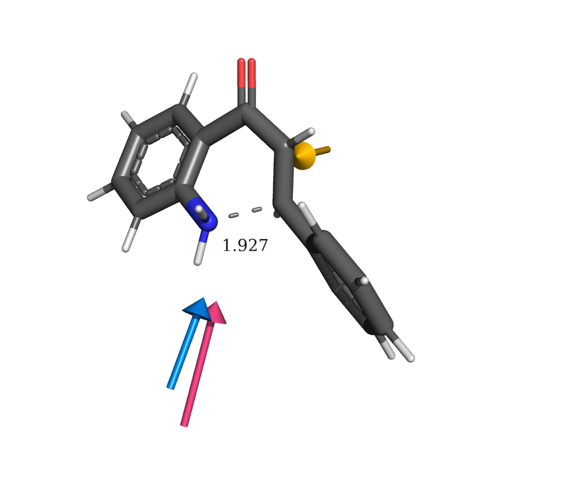|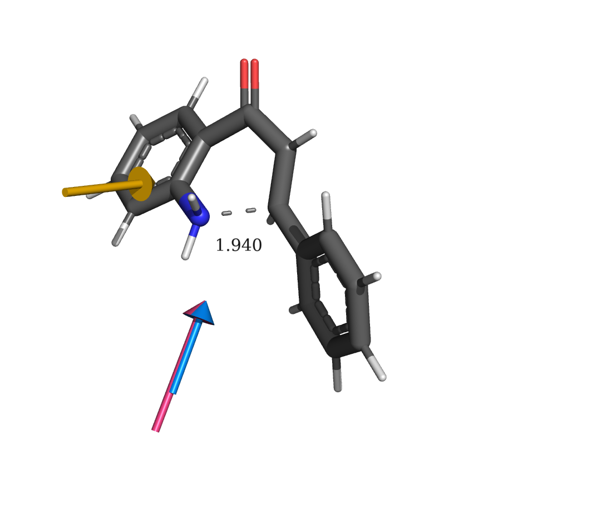|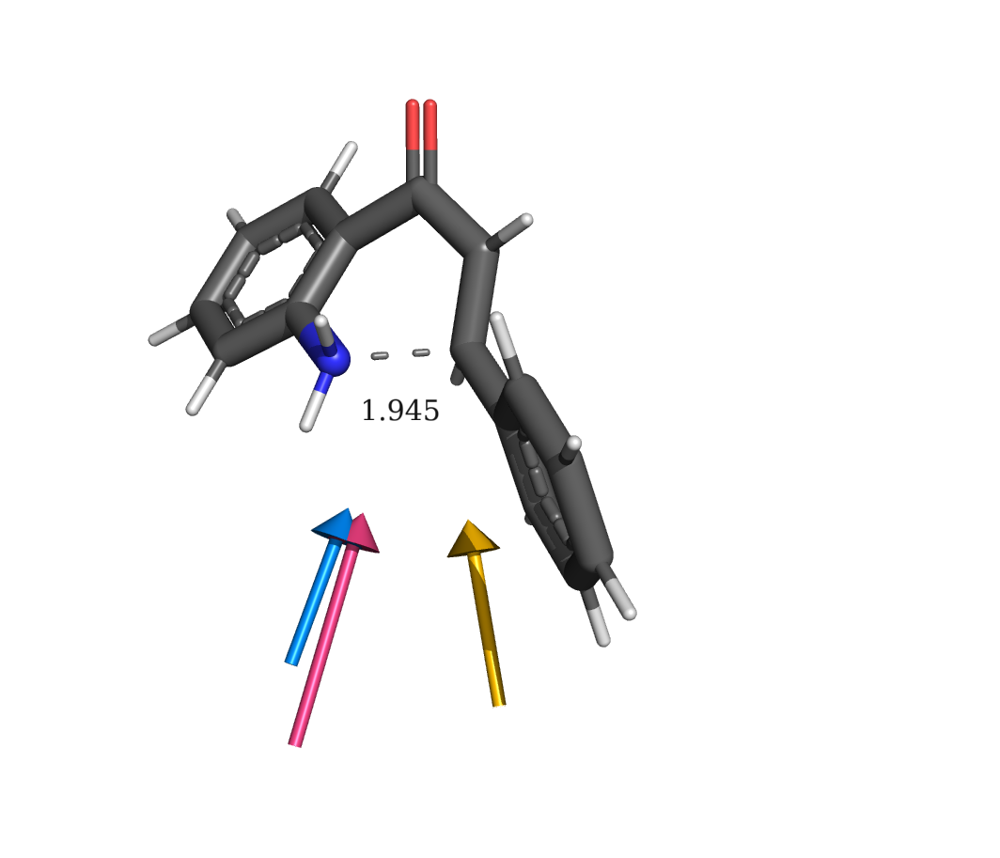|
| :----: | :----: | :----: |
|$\ce{R1,R2 = H}$ $\vec F=0.1\:\va$ *R* selective|$\ce{R1,R2 = H}$ $\vec F=0.1\:\va$ *S* selective|$\ce{R1,R2 = H}$ $\vec F=0.1\:\va$ Catalytic|
|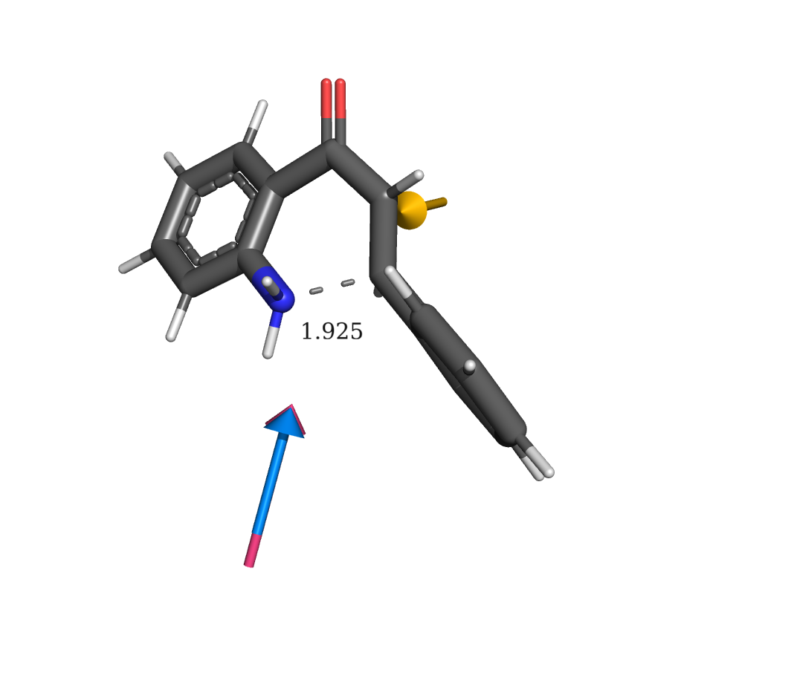|||
|$\ce{R1,R2 = H}$ $\vec F=0.2\:\va$ *R* selective|$\ce{R1,R2 = H}$ $\vec F=0.2\:\va$ *S* selective|$\ce{R1,R2 = H}$ $\vec F=0.2\:\va$ Catalytic|
|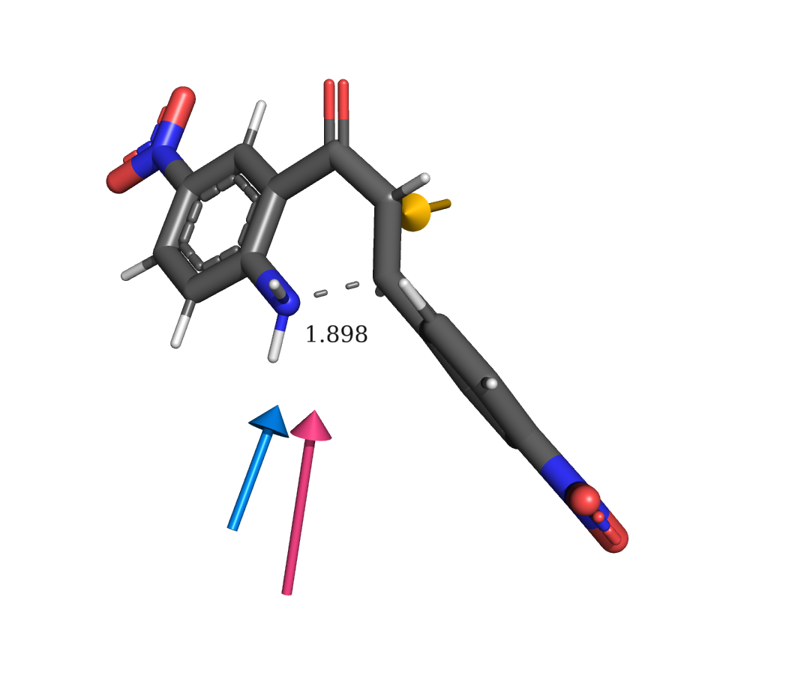|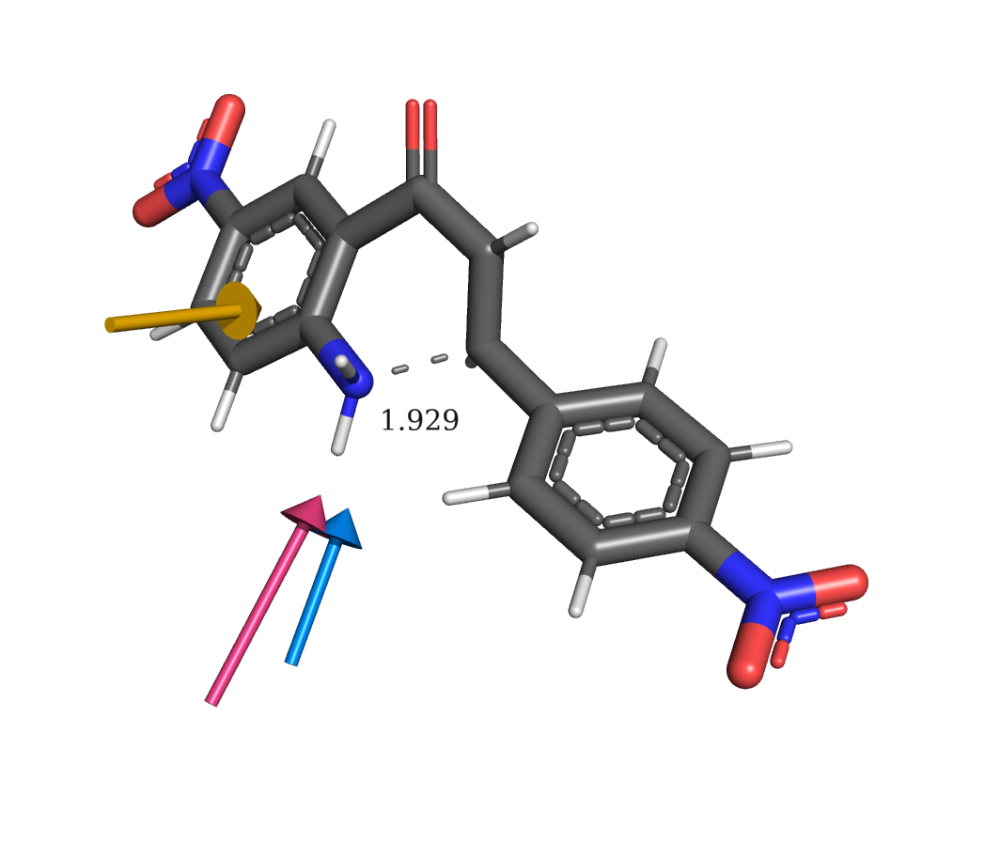||
|$\ce{R1,R2 = NO2}$ $\vec F=0.1\:\va$ *R* selective|$\ce{R1,R2 = NO2}$ $\vec F=0.1\:\va$ *S* selective|$\ce{R1,R2 = NO2}$ $\vec F=0.1\:\va$ Catalytic|
||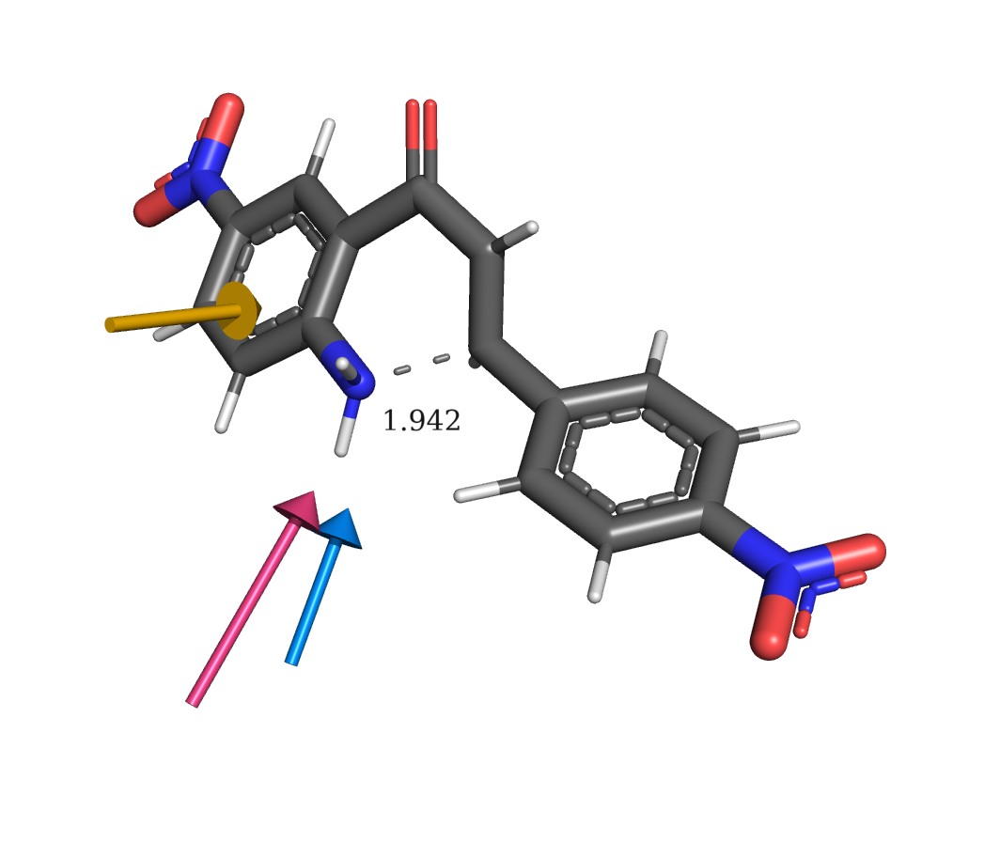||
|$\ce{R1,R2 = NO2}$ $\vec F=0.2\:\va$ *R* selective|$\ce{R1,R2 = NO2}$ $\vec F=0.2\:\va$ *S* selective|$\ce{R1,R2 = NO2}$ $\vec F=0.2\:\va$ Catalytic|
||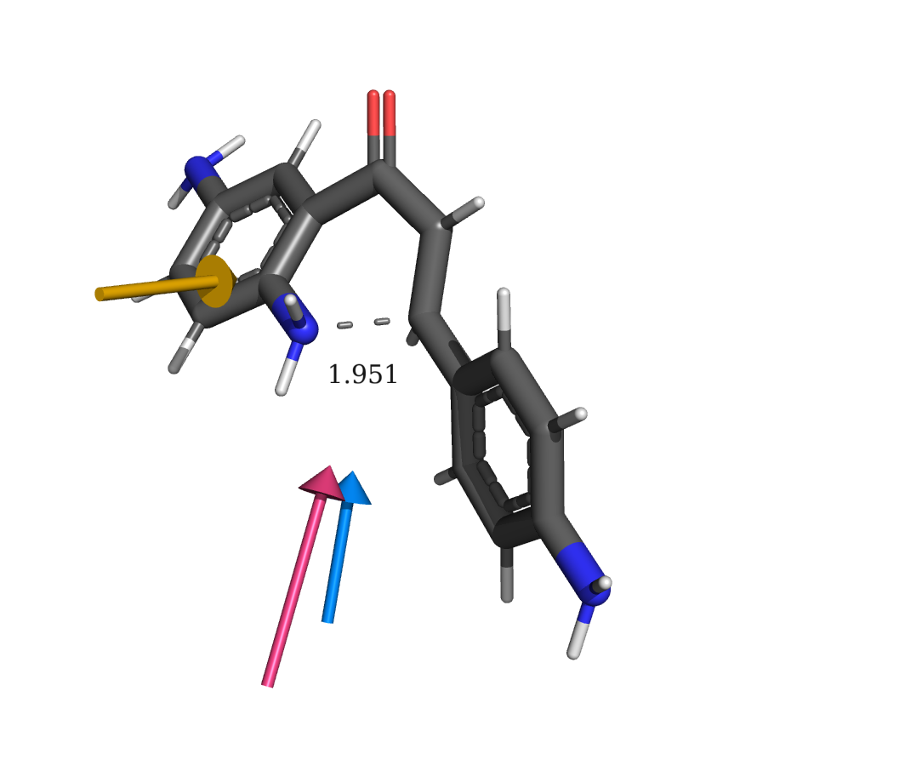||
|$\ce{R1,R2 = NH2}$ $\vec F=0.1\:\va$ *R* selective|$\ce{R1,R2 = NH2}$ $\vec F=0.1\:\va$ *S* selective|$\ce{R1,R2 = NH2}$ $\vec F=0.1\:\va$ Catalytic|
||||
|$\ce{R1,R2 = NH2}$ $\vec F=0.2\:\va$ *R* selective|$\ce{R1,R2 = NH2}$ $\vec F=0.2\:\va$ *S* selective|$\ce{R1,R2 = NH2}$ $\vec F=0.2\:\va$ Catalytic|

<a>Figure E.2:</a> Transition state geometries  and reaction trajectories from the OEEF perturbed benchmarks in  [Section 3.6](../3.results/#35-investigating-the-effects-of-charged-derivatisation-of-2-aminochalcone)

## F Full theoretical choices, approximations and precision used throughout the project 

| Software Package | Job type | Functional | Basis set | Solvation | Convergence criteria | Integration grid | Approximations | Field |
| :--------------: | :------: | :--------: | :-------: | :-------: | :------------------: | :--------------: | :------------: | :---: |
|Pathway Benchmarking: low level opt|||||||||
|ORCA 5.0.1[^ORCA]|Opt|M062X[^Zhao2008]|aug-cc-pVTZ[^DunningBS1][^DunningBS2] aug-cc-pVTZ/JK|CPCM[^CPCM][^CPCM-ORCA] Ethanol|Tightscf tightopt|Defgrid3|RIJK[^RI-JK]|No|
|Pathway Benchmarking: High level opt|||||||||
|ORCA 5.0.1[^ORCA] | Opt | ωB97M-V[^wB97M-V]  | Def2-QZVPP[^Def2ECP]def2/j[^def2-J] | SMD[^SMD]  Ethanol | Verytightscf tightopt | Defgrid3 | RIJCosX[^RIJCOSX] | No|
|Pathway Benchmarking: TS Searching NEB|||||||||
|ORCA 5.0.1[^ORCA] | NEB-TS | M062X[^Zhao2008] | aug-cc-pVTZ[^DunningBS1][^DunningBS2] aug-cc-pVTZ/JK | CPCM[^CPCM][^CPCM-ORCA] Ethanol | Tightscf tightopt | Defgrid3 | RIJK[^RI-JK] | No|
|Pathway Benchmarking: High level opt - TS|||||||||
|ORCA 5.0.1[^ORCA] | OptTS | ωB97M-V[^wB97M-V]  | Def2-QZVPP[^Def2ECP]def2/j[^def2-J] | SMD[^SMD]  Ethanol | Verytightscf tightopt | Defgrid3 | RIJCosX[^RIJCOSX] | No|
|Pathway Benchmarking: PES scanning|||||||||
|ORCA 5.0.1[^ORCA] | SCAN | ωB97M-V[^wB97M-V] | Def2-TZVPD[^Def2ECP]Def2/J[^def2-J] | SMD[^SMD] Ethanol | Tightscf | Defgrid2 | RIJCosX | No|
|Pathway Benchmarking: High level opt Frequencies|||||||||
|ORCA 5.0.1[^ORCA] | Freq | ωB97M-V[^wB97M-V] | Def2-QZVPP[^Def2ECP]Def2/j[^def2-J] | SMD[^SMD]  Ethanol | Verytightscf | Defgrid3 | RIJCosX[^RIJCOSX] | No|
|Partial charge determination|||||||||
|Multiwfn 3.8[^multiwfn]| CHELPG[^CHELPG] charges based on the wavefunctions calculated above, using a grid density of $0.1\:\AA$.||||||||
||Multiwfn uses the LIBRETA[^libreta] package for evaluation of the electrostatic potential||||||||
|Benchmarking barrier as a function of $F_y$|||||||||
|ORCA 5.0.1[^ORCA] | Single Point | M062X[^Zhao2008] | 6-31+G(d)[^PopleBS1][^PopleBS2] | SMD[^SMD] Ethanol/none | Standard | Defgrid3 | none | Yes|
|Benchmarking *R*/*S* separation as a function of $F_z$|||||||||
|ORCA 5.0.1[^ORCA] | Single Point | M062X[^Zhao2008] | 6-31+G(d)[^PopleBS1][^PopleBS2] | SMD[^SMD] Ethanol/none | Standard | Defgrid3 | none | Yes|
|Benchmarking catalysis/separation ($F_y$/$F_z$) as function of dielectric medium |||||||||
|ORCA 5.0.1[^ORCA] | Single Point | M062X[^Zhao2008] | 6-31+G(d)[^PopleBS1][^PopleBS2] | CPCM[^CPCM][^CPCM-ORCA] varied| Standard | Defgrid3 | none | Yes|
|OEEF scans|||||||||
|Psi4 1.4[^psi4-1][^psi4-2][^psi4-3] | Opt | M062X[^Zhao2008] | 6-31+G(d)[^PopleBS1][^PopleBS2] | none | Standard | 590/99 | none | Yes|
|EDD isosurfaces|||||||||
|Psi4 1.4[^psi4-1][^psi4-2][^psi4-3] | SP | M062X[^Zhao2008] | 6-31+G(d)[^PopleBS1][^PopleBS2] | none/CPCM[^CPCM][^CPCM-ORCA] | Standard | 590/99 | none | Yes|
|Relaxed OEEF Solvent Benchmarking|||||||||
|ORCA 5.0.1[^ORCA] | Opt NumFreq | M062X[^Zhao2008] | 6-31+G(d)[^PopleBS1][^PopleBS2] | CPCM[^CPCM][^CPCM-ORCA] varied | Tightopt | Defgrid3 | none | Yes/No|
|Derivative Efield scans|||||||||
|Psi4 1.4[^psi4-1][^psi4-2][^psi4-3] | Opt | M062X[^Zhao2008] | 6-31+G(d)[^PopleBS1][^PopleBS2] | CPCM[^CPCM][^CPCM-ORCA] | Standard | 590/99 | none | Yes\\|
|Point charge perturbation|||||||||
|ORCA 5.0.1[^ORCA] | Single Point | M062X[^Zhao2008] | 6-31+G(d)[^PopleBS1][^PopleBS2] | none | verytightscf | Defgrid3 | none | Yes|

[^ORCA]: Neese, F. The ORCA Program System. *WIREs Comput. Mol. Sci.* **2012**, *2* (1), 73–78. https://doi.org/10.1002/wcms.81.
[^DunningBS1]: Dunning, T. H. Gaussian Basis Sets for Use in Correlated Molecular Calculations. I. The Atoms Boron through Neon and Hydrogen. *J. Chem. Phys.* **1989**, *90* (2), 1007–1023. https://doi.org/10.1063/1.456153.
[^DunningBS2]: Kendall, R. A.; Dunning, T. H.; Harrison, R. J. Electron Affinities of the First‐row Atoms Revisited. Systematic Basis Sets and Wave Functions. *J. Chem. Phys.* **1992**, *96* (9), 6796–6806. https://doi.org/10.1063/1.462569.
[^CPCM-ORCA]: Garcia‐Ratés, M.; Neese, F. Effect of the Solute Cavity on the Solvation Energy and Its Derivatives within the Framework of the Gaussian Charge Scheme. *J. Comput. Chem.* **2020**, *41* (9), 922–939. https://doi.org/10.1002/jcc.26139.
[^SMD]: Marenich, A. V.; Cramer, C. J.; Truhlar, D. G. Universal Solvation Model Based on Solute Electron Density and on a Continuum Model of the Solvent Defined by the Bulk Dielectric Constant and Atomic Surface Tensions. *J. Phys. Chem. B* **2009**, *113* (18), 6378–6396. https://doi.org/10.1021/jp810292n.
[^Zhao2008]: Zhao, Y.; Truhlar, D. G. The M06 Suite of Density Functionals for Main Group Thermochemistry, Thermochemical Kinetics, Noncovalent Interactions, Excited States, and Transition Elements: Two New Functionals and Systematic Testing of Four M06-Class Functionals and 12 Other Functionals. *Theor. Chem. Acc.* **2008**, *120* (1–3), 215–241. https://doi.org/10.1007/s00214-007-0310-x.
[^PopleBS1]: Hehre, W. J.; Ditchfield, R.; Pople, J. A. Self—Consistent Molecular Orbital Methods. XII. Further Extensions of Gaussian—Type Basis Sets for Use in Molecular Orbital Studies of Organic Molecules. *J. Chem. Phys.* **1972**, *56* (5), 2257–2261. https://doi.org/10.1063/1.1677527.
[^PopleBS2]: Clark, T.; Chandrasekhar, J.; Spitznagel, G. W.; Schleyer, P. V. R. Efficient Diffuse Function-Augmented Basis Sets for Anion Calculations. III. The 3-21+G Basis Set for First-Row Elements, Li–F. *J. Comput. Chem.* **1983**, *4* (3), 294–301. https://doi.org/10.1002/jcc.540040303.
[^wB97M-V]: Mardirossian, N.; Head-Gordon, M. ΩB97M-V: A Combinatorially Optimized, Range-Separated Hybrid, Meta-GGA Density Functional with VV10 Nonlocal Correlation. *J. Chem. Phys.* **2016**, *144* (21), 214110. 
https://doi.org/10.1039/C7CP04913G.
[^Def2ECP]: Weigend, F.; Ahlrichs, R. Balanced Basis Sets of Split Valence, Triple Zeta Valence and Quadruple Zeta Valence Quality for H to Rn: Design and Assessment of Accuracy. *Phys. Chem. Chem. Phys.* **2005**, *7* (18), 3297. https://doi.org/10.1039/b508541a.
[^def2-J]: Weigend, F. Accurate Coulomb-Fitting Basis Sets for H to Rn. *Phys. Chem. Chem. Phys.* **2006**, *8* (9), 1057–1065. https://doi.org/10.1039/B515623H.
[^RIJCOSX]: Neese, F.; Wennmohs, F.; Hansen, A.; Becker, U. Efficient, Approximate and Parallel Hartree–Fock and Hybrid DFT Calculations. A ‘Chain-of-Spheres’ Algorithm for the Hartree–Fock Exchange. *Chem. Phys.* **2009**, *356* (1–3), 98–109. https://doi.org/10.1016/j.chemphys.2008.10.036.
[^ORCA]: Neese, F. The ORCA Program System. *WIREs Comput. Mol. Sci.* **2012**, *2* (1), 73–78. https://doi.org/10.1002/wcms.81.
[^multiwfn]: Lu, T.; Chen, F. Multiwfn: A Multifunctional Wavefunction Analyzer. *J. Comput. Chem.* **2012**, *33* (5), 580–592. https://doi.org/10.1002/jcc.22885.
[^Markland2018]: Markland, T. E.; Ceriotti, M. Nuclear Quantum Effects Enter the Mainstream. *Nat. Rev. Chem.* **2018**, *2* (3), 0109.
[^psi4-1]: Parrish, R. M.; Burns, L. A.; Smith, D. G. A.; Simmonett, A. C.; DePrince, A. E.; Hohenstein, E. G.; Bozkaya, U.; Sokolov, A. Y.; Di Remigio, R.; Richard, R. M.; Gonthier, J. F.; James, A. M.; McAlexander, H. R.; Kumar, A.; Saitow, M.; Wang, X.; Pritchard, B. P.; Verma, P.; Schaefer, H. F.; Patkowski, K.; King, R. A.; Valeev, E. F.; Evangelista, F. A.; Turney, J. M.; Crawford, T. D.; Sherrill, C. D. Psi4 1.1: An Open-Source Electronic Structure Program Emphasizing Automation, Advanced Libraries, and Interoperability. *J. Chem. Theory Comput.* **2017**, *13* (7), 3185–3197. https://doi.org/10.1021/acs.jctc.7b00174.
[^psi4-2]: Turney, J. M.; Simmonett, A. C.; Parrish, R. M.; Hohenstein, E. G.; Evangelista, F. A.; Fermann, J. T.; Mintz, B. J.; Burns, L. A.; Wilke, J. J.; Abrams, M. L.; Russ, N. J.; Leininger, M. L.; Janssen, C. L.; Seidl, E. T.; Allen, W. D.; Schaefer, H. F.; King, R. A.; Valeev, E. F.; Sherrill, C. D.; Crawford, T. D. Psi4: An Open-Source Ab Initio Electronic Structure Program. *Wiley Interdiscip. Rev. Comput. Mol. Sci.* **2012**, *2* (4), 556–565. https://doi.org/10.1002/wcms.93.
[^psi4-3]: Smith, D. G. A.; Burns, L. A.; Simmonett, A. C.; Parrish, R. M.; Schieber, M. C.; Galvelis, R.; Kraus, P.; Kruse, H.; Di Remigio, R.; Alenaizan, A.; James, A. M.; Lehtola, S.; Misiewicz, J. P.; Scheurer, M.; Shaw, R. A.; Schriber, J. B.; Xie, Y.; Glick, Z. L.; Sirianni, D. A.; O’Brien, J. S.; Waldrop, J. M.; Kumar, A.; Hohenstein, E. G.; Pritchard, B. P.; Brooks, B. R.; Schaefer, H. F.; Sokolov, A. Y.; Patkowski, K.; DePrince, A. E.; Bozkaya, U.; King, R. A.; Evangelista, F. A.; Turney, J. M.; Crawford, T. D.; Sherrill, C. D. Psi4 1.4: Open-Source Software for High-Throughput Quantum Chemistry. *J. Chem. Phys.* **2020**, *152* (18), 184108. https://doi.org/10.1063/5.0006002.
[^CPCM]: Klamt, A.; Schüürmann, G. COSMO: A New Approach to Dielectric Screening in Solvents with Explicit Expressions for the Screening Energy and Its Gradient. *J. Chem. Soc., Perkin Trans. 2* **1993**, No. 5, 799–805. https://doi.org/10.1039/P29930000799.
[^RI-JK]: Weigend, F.; Kattannek, M.; Ahlrichs, R. Approximated Electron Repulsion Integrals: Cholesky Decomposition versus Resolution of the Identity Methods. *J. Chem. Phys.* **2009**, *130* (16), 164106. https://doi.org/10.1063/1.3116103.
[^CHELPG]: Breneman, C. M.; Wiberg, K. B. Determining Atom-Centered Monopoles from Molecular Electrostatic Potentials. The Need for High Sampling Density in Formamide Conformational Analysis. *J. Comput. Chem.* **1990**, *11* (3), 361–373. https://doi.org/10.1002/jcc.540110311.
[^libreta]: Zhang, J. Libreta: Computerized Optimization and Code Synthesis for Electron Repulsion Integral Evaluation. *J. Chem. Theory Comput.* **2018**, *14* (2), 572–587. https://doi.org/10.1021/acs.jctc.7b00788.