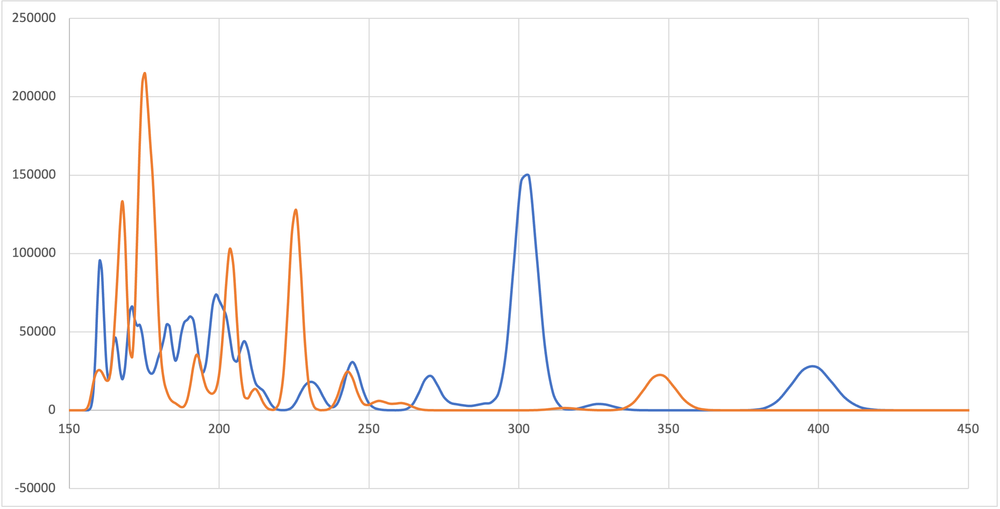
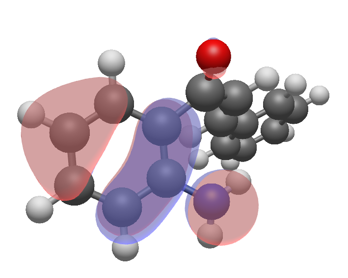
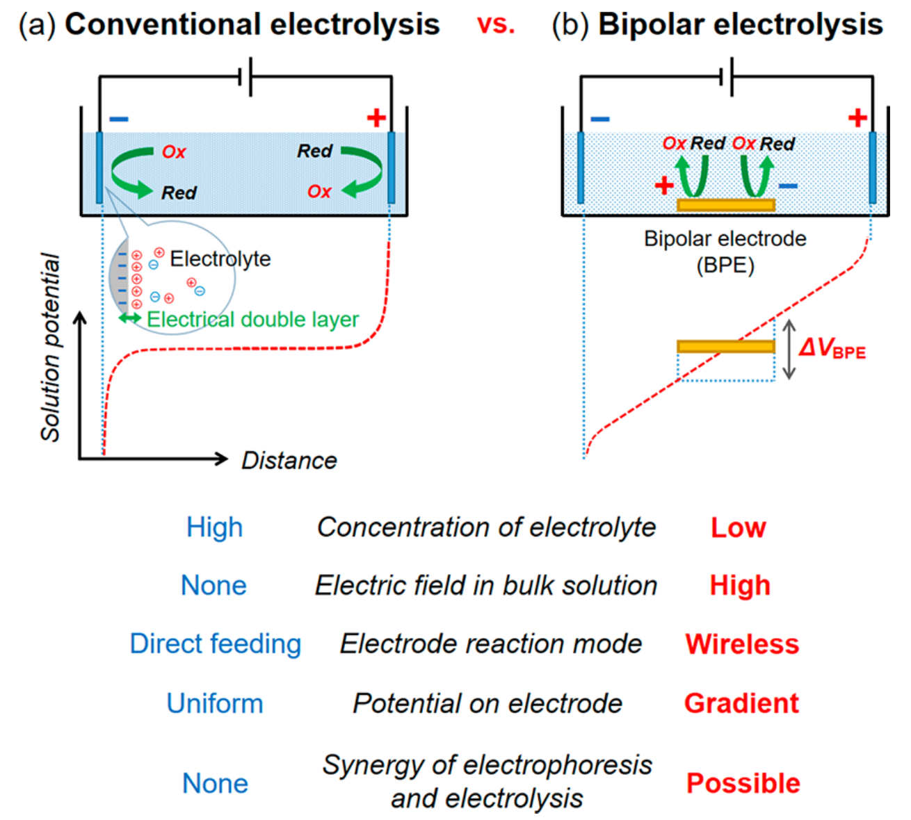

#  Thesis Defence Prep

* Monash first and second year notes
* Curly arrows practice
* Catalysing aza-Michael additions stereoselectively

  * Previous methods:
    * Chiral acids (BINOL-phosphate): coordinates with the amine and Michael acceptor, deprotonating the amine in the process
    * Cyclic $\ce{\alpha,\beta}$-unsaturated ketones and taking advantage of the ring configuration ot create steric hinderance 
    * Chiral Michael donor, or Michael acceptor: only allows the bond to form in one configuration
    * Chiral Lewis bases
* How to characterise the reaction experimentally?

  * Enantiopurity of the product

    * Vibrational Circular Dichroism spec
    * Polarimetry 

  * How could you monitor the kinetics?

    * What specific markers?

      * NMR:

        * doublet, doublet along the $\ce{C-C_\alpha=C_\beta}$ bond to triplet doublet in $\ce{C-C_\alpha-C_\beta}$
        * Shift of these peaks from 7-8 ppm to 3-4 ppm due to loss of alkene $\pi$ current, maintains EWGs though.
        * Loss of broad $\ce{NH2}$ peak

      * UV-VIS:

        * $\lambda$-max ($\gt200\:nm$) shift from $\sim300\to225\:nm$ 
        * Secondary peak shift from $\sim400\to350\:nm$ 

{: style="width: 60%; "class="center"}

* Shape of the HOMO

{: style="width: 25%; "class="center"}

* $pK_a$s
  * $\ce{NH2}\sim2.6$
  * $\ce{OH (enol)}$
  * $\ce{C_\alpha}$
  * $\ce{C_\beta}$
  * $\ce{piperidine}\sim11.2$
  * $\ce{KH}\sim35$
* Know the rotation stabilisation conversion

$$
\begin{align}
V &= \frac{J}{C}\\
D&=3.33564×10^{−30} C\cdot m\\\\
\frac{D\cdot V}{m}&=\frac{J\cdot 3.33564×10^{−30}C\cdot m}{C\cdot m}\\
&=3.33564×10^{−30}J\\\\
\frac{D\cdot V}{Å}&=3.33564×10^{−20}J\\
&=\frac{3.33564×10^{−20}\:J}{6.022\times10^{-23}\:mol}\\
&=0.02008\:J\cdot mol^{-1}\cdot1000\\
&=20.08\:KJ\cdot mol^{-1}
\end{align}
$$

* Rigid rotor and harmonic oscillator approximations
  * Rigid rotor: assumes that as the molecule rotates in space around its centre of mass, it doesn't deform, neglecting centrifugal distortion as the rotor spins faster.
  * Harmonic oscillator: assumes that the energy of a bond as it vibrates will be the same for an equal contraction or stretching of the bond. In reality the displacement will follow morse potential, with contractions resulting in a steeper gradient and stretching resulting in a more relaxed gradient
* Bipolar electrodes

  * Both anodic and cathodic at the same electrode
  * Pair of driving electrodes connected to the power source with the bipolar electrode simply being a conductive material placed 

{: style="width: 60%; "class="center"}

* V to V/Å eqn

  * There really isn't one in my mind... the field is going to attenuate so quickly through the dielectric medium that you can't really claim any field in the bulk, and at the electrode it's a question of how far into the EDL are you measuring.
  * In a bipolar electrode this might be more of a realistic thing to calculate as the electrolyte concentration should be sufficiently low as to allow the field to propagate and the bipolar electrode itself should be able to help facilitate the field through it's own polarisation
* electrochemical window of amines/ILs

  * looks like it electrochemical potential would be ≥1.2V for oxidation of the amine and ≤-1.4V for reduction of  the $\ce{\alpha,\beta}$-unsaturated ketone
    * Hence $\sim2.6\:V$

* electrochemical reactivity

  * (oxidation) Amines -> amine radical -> quenching with H
  * (reduction) $\ce{\alpha,\beta}$-unsaturated ketones -> hydrogenation with H

* VTST is better than TST for low or non-existent barriers, as the entropic contribution is going to have the potential to influence the barrier more

## Intro Talk

* Very brief welcome and title 
* The ability to use electric fields in order to manipulate the outcome of a chemical reaction without the need for specially designed catalysts has grown significantly in interest in the past 30 years, largely spearheaded by the work of Sasson Shaik and his research group who used their newly formed valence bond theory in order to understand the way in which electrons behave when bonding.
* Through their discovery that all bonds, regardless of their level of ionicity, could be described in a polar context, it stood to reason that these ionic resonance contributors could be stabilised in order to manipulate the electronic composition of molecules and thus their reactivity
* Their finding can be briefly summed up in 5 simple rules
* 4 +1 rules
  1. Bond polarisation
  2. Rxn axis
  3. Stabilising the rxn axis with OEEF
  4. Rotation
  5. (+1) stereocontrol
* In my work, I used these particular rules to study the cyclisation of 2'-aminochalcone using DFT based approaches, in order to guide future research into how these fields could be used to enntioselect the products of this toy reaction
  * Why we tested this molecule

* Found that most conventional means of catalysis tap into accentuating the natural polarity of the reaction
  * making $\ce{C_\beta}$ more electrophilic and making $\ce{-NH2}$ more nucelophilic
  * or they work by breaking the $\ce{\alpha,\beta}$-unsaturated ketone to allow for better HOMO-LUMO overlap
* Using rule 3, we found that we could achieve electrocatalysis, increasing the rate of the reaction by a factor of 3.2 with an OEEF of $0.2\:V\cdot\AA^{-1}$orientated following the reaction axis. This caused mixing of the $\ce{\alpha,\beta}$-unsaturated ketone $\pi$ system with the $\pi^*$ LUMO, making the electronic configuration look more like the product
* Using the natural polarity of the reaction, I found that I could afford stereocontrol by orienting the OEEF along the newly forming $\ce{N-C}$ bond, which either encouraged or discouraged the mixing of the $\ce{NH2}$ lone pair HOMO with the $\pi^*$ LUMO, influencing the formation of the new bond.
* This resulted in a theoretical enantiomeric excess of 99.9% in an OEEF of $0.2\:V\cdot\AA^{-1}$.
* kinetic resolution between the two isomers
* $|\vec F|$ must be kept low (rule 4)
* Future research
  * Solvation in ILs in order to maintain the orientation of the OEEF with respect to the reaction axis
