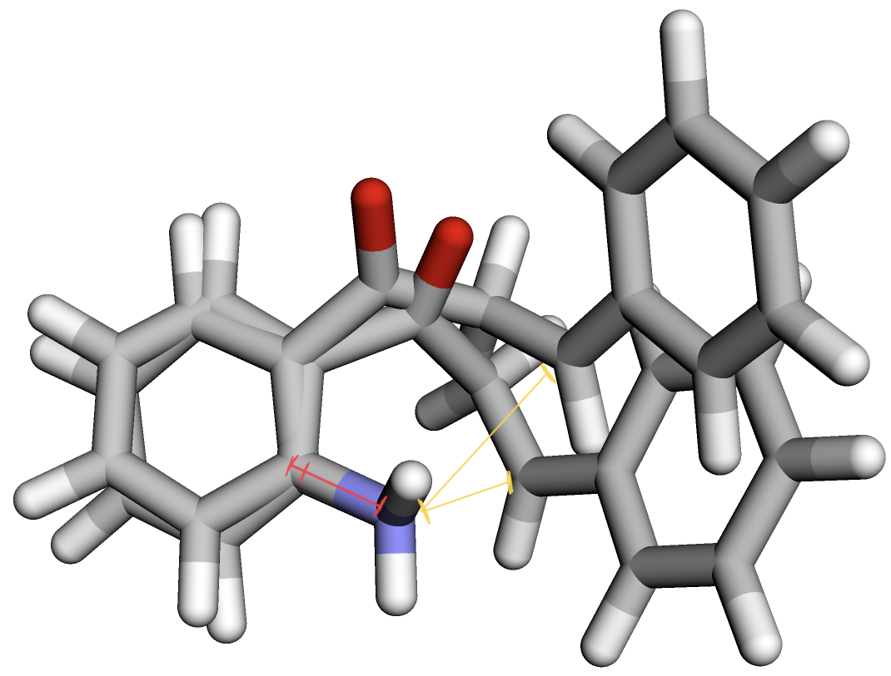
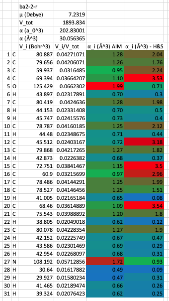
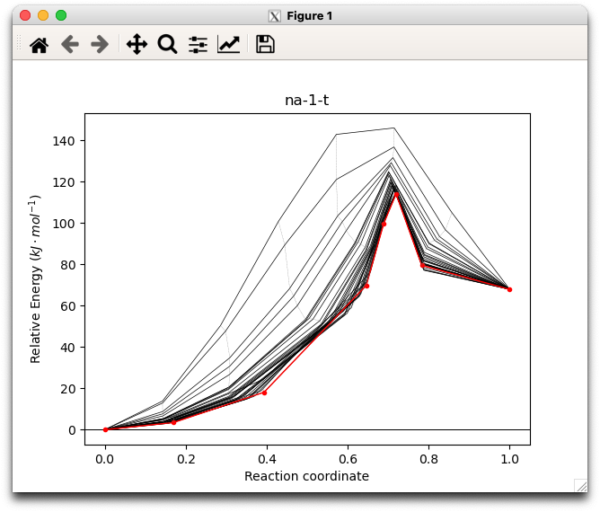
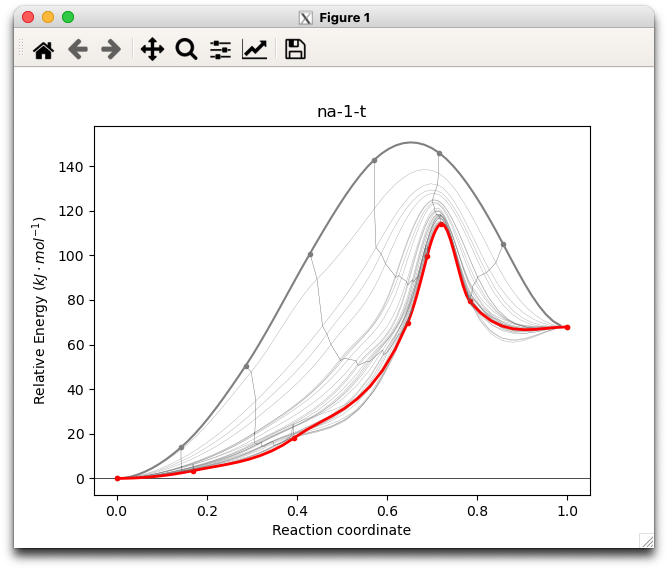

# Week n

!!! note "Current milestone"
	Presentation

## Monday 28/6

I've taken a bit of time off for mental (and physical) health reasons, so I'm not entirely sure what week it is, so I'm starting from week n.

### Lit Review

Is done, but I'm not entirely happy with it. I've pushed all of the talk of specifics of the cyclisation and the choice of ILs to the methods section.

### Presentation

I've started... But I keep getting distracted doing other things...

### Reaction Benchmarking

I'm pretty happy with the choice of the Brønsted acid pathway 2, but I think that it's particularly shallow saddle point, and so it keeps looking for a higher one. This is an issue if we want to parameterise the TS for MD

### Moving Forward Computationally

I've started looking at atomic polarisability and trying to find the AIM atomic and molecular basin volumes to be able to calculate the atomic polarisabilities for the reaction pathway.

!!! failure
	Well it looks like MonARCH and M3 are down till Wednesday :unamused:

### What I did today:

* Developed this methodology: [AIM - Calculating basin volume](../../../Cheat%20Sheets/MultiWFN/#aim-calculating-basin-volume-for-polarisibility)
* Group Meeting
* Felt inadequate after hearing how detailed and thorough Nathan's presentation was

### Things to add to lit review

* e-field makes interaction energy decrease, which increases their mobility

## Tuesday 29/6

I really need to stop getting distracted and just slam out this presentation...

### What I did today:

* Running molecular polarisability calcs on Rosalind (don't use AutoAux. Just don't do it.)
  * I've calculated atomic polarisabilities for the reactant and product, but the magnitude of some of the carbons seems truly massive. So does the dipole moment though...
* Made a spreadsheet for calculating atomic polarisabilities 
* Learned to spell polarisabilities and kept getting it wrong anyway...
* Worked on the presentation
* Got feedback from Katya about my lit review which I think really helped my confidence :slightly_smiling_face:
* Found a better method for specifying which TS to follow in orca using either `%geom TS_Mode {B 0 1}` or `%geom TS_Mode {M 0}`

!!! tip "It's almost midnight and..."
	I made the mistake of looking into the atomic polarisability calculation method of Heid and Schröder as per Peter's suggestion...
	

	* Firstly, whoever wrote GDMA really doesn't like making things user friendly
	* Secondly, why use github when you can just publish your code in the supplementary information :unamused:
	* Finally, I really hope that Peter has an example job script or two for me, or I think I'm going to just stick with the AIM basin volume method...

## Wednesday 30/6

### What I did today:

* Collaborators meeting - I think Katya thinks I'm far more capable than I am, and that I'm going to be able to do much more in my honours that I really can, which is exemplified by the next point:
* Spent way too long battling to get a simple Psi4 job running on MonARCH :slightly_frowning_face:. It seems to not be submitting a revised version of the slurm file, which makes no sense!
  * Unmatched `"` :expressionless:
* I figured out that solvating the polarisability jobs with implicit solvation is a bad idea, so I'm re-running those in gas phase. I should probably re-optimise first though... proof of concept first?
* Of the Heid and Schröder method I have so far

  * [x] Created all my `.fchk` files, using Psi4 (in one job file) instead of Gaussian
  * [x] Modified the example GDMA script to run all the jobs in serial
  * [ ] Run the GDMA jobs
  * [ ] Run the python script to get the polarisability
  * [ ] Repeat for the product

  ^ These are queued up and with the automation scripts should be done by the morning :slightly_smiling_face:

* I have automated the polarisability process and have fired off a full re-optimisation and polarisability calc for ba2-2-r/p

### To do

* Test the H&S script with the GDMA outputs and compare them to the AIM basin volume method.
* ~~I should probably document the whole Heid and Schröder process so that I can easily do it on the TS and product.~~ done
* Re-optimise the ba2-2-r/p jobs in gas phase ready for parameterisation
* ~~Re-do the polarisability with these newly optimised geometries~~ done
* DO THE GODDAMN PRESENTATION!!!

## Thursday 1/7

!!! note "Excited!"
	Orca 5.0 announced!! (release and full details to come tomorrow)

### What I did today:

* Trying to re-do the AIM basin volume polarisability calcs with gas (wB97X-D/sadlej-pol-fs) optimised geoms in Psi4
* Trying to re-do the GDMA based H&S polarisability calcs in Psi4 with gas (M06-2X/sadlej-pol-fs) optimised geoms in Psi4
* Finally did some more work on the presentation, though I'm mostly cleaning up what I've already done instead of adding stuff to the blank slides...
  * I did finally get around to understanding how a thing works (that I should have known before writing my lit review :sweat_smile:)
* Eagerly watching as the OptTS calcs inch closer to a more reasonable geom
  * Look at that bond forming N-C(sp2) distance (yellow) getting smaller, and the N-C(aromatic) distance (red) get slightly longer, as you'd expect :smile:

{: style="width: 40%; "class="center"}

* So In hindsight, it was actually just optimising to the product geometry and searching from there :unamused:

## Friday 2/7

!!! note "Excited!"
	So ORCA 5 is crazy fast, and it supports analytical hessians for MGGAs now :smiley:

### What I did today:

* Played around with ORCA 5 a bit

* Got the higher quality, gas phase AIM basin volume polarisabilities sorted

  * It would seem that Psi4 can only analytically calculate molecular polarisabilities for AI methods
  * The H&S method really doesn't seem the most functional

  {: style="width: 30%; "class="center"}

* Started up some new jobs to try and find this goddamn TS. Hopefully ORCA 5 will help with that!

* Compiled a fresh version of OpenMPI 4.1.1 for ORCA 5.0.0 which is currently residing in the apps folder. I've written up how to access/use that in the group slack and have incorporated it into 2slm

## Saturday 3/7

!!! note
	I know that Monarch and M3 are going to be down for a couple of days, so I'm trying to get some calculations out before my meetings on Monday and Wednesday

### What I did today:

* Realised that the best starting point for my OptTS jobs is an NEB calculation, so I'm using ORCA 5's new ZOOM-NEB-CI method to generate a decent starting geometry, which I'll read into for different OptTS jobs, each following one of the first 5 vibrational modes!
* Prettied up my visualise_neb script, as I realised that I had some more useful data available than I was previously using

|                            Before                            |                            After                             |
| :----------------------------------------------------------: | :----------------------------------------------------------: |
|  |  |

### To Check Tomorrow (running jobs today)

* Cyclication-neb-4 (OptTS/freqs)
* Cyclication-neb-m1-irc
* Cyclication-neb-m3-irc
* Cyclication-neb-b (OptTS/freqs)
* Start an OptTS mode 1 from the NEB run
