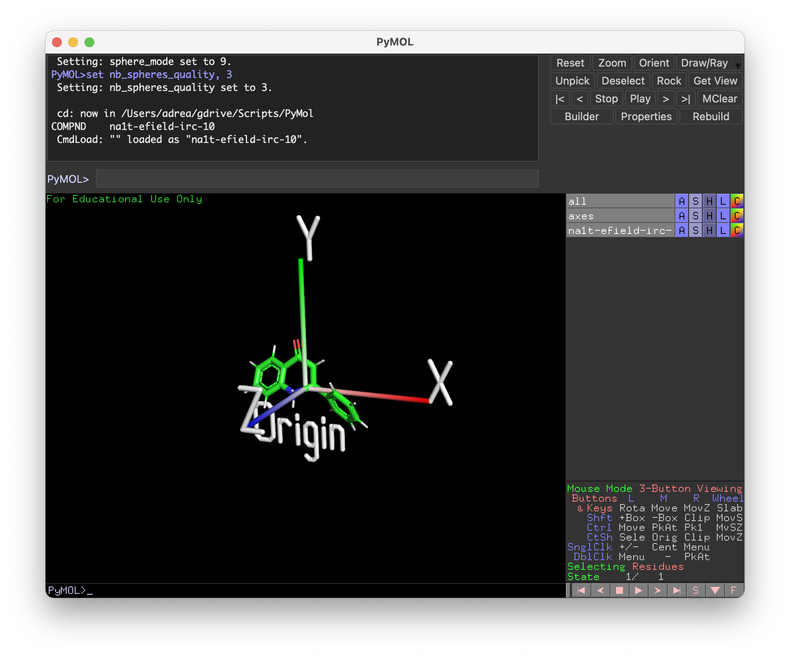
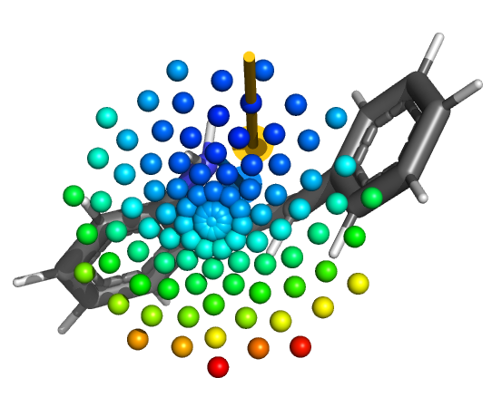
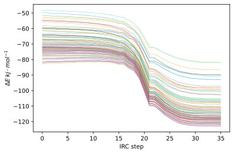
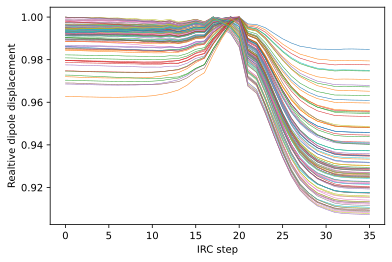

# Week n+1

!!! note "Current milestone"
	Presentation (still :expressionless:)

## Sunday 4/7

MonARCH and M3 go down at 8am tomorrow, so I'm just trying to get as much done with these OptTS jobs as I can, before I need to start doing things on Rosalind again.

### What I did today:

* I fired off a bunch jobs to have a maximum of 16 hours (will die at 7am), based on the output form the NEB calculation
  * Forcing a bond coordinate between the new bonding atoms - following modes 0-2 - new hessian every 5 steps
  * Specifying for the OptTS job to follow the eigenvector that has strong bonding between the new bonding atoms
  * Forcing the new bond coordinate and setting only a small hessian active region around the bonding atoms (16 coordinates, computed numerically... at least they can be computed in one lot as one per core)

## Monday 5/7

> "You only make Professor once!"
> Katya

So we drank, ate and were merry to celebrate :smile:

### What I did today (that wasn't just eating and drinking):

* Had a meeting with Katya who advised me to try using B3LYP to get the OptTS jobs to work
  * I gave it a shot, but I think the force field that ORCA is using between full hessian steps is throwing off the optimisation...
  * So of course I went full tilt, and am optimising with B3LYP, calculating a full analytical hessian at every step! (on Rosalind, the poor gal)
* Katya also suggested that I start getting the MD runs equilibrating, which meant that I need to get everything parameterised.
  * I had a chat with Tom about this and it's difficult to say the least. The reactant is a radical pecies to probably will have some parameterisation issues, and LigParGen for atom typing is failing at atom typing the molecule.

## Tuesday 6/7

### What I did today:

* I had a psych appt this morning and am donating plasma this arvo, so it's going to be a short one
* Pushed through the B3LYP OptTS job on Rosalind
* Threw together some slides for tomorrow's meeting with Michelle
* Tonight I'll probably try to get some more jobs going on MonARCH and M3 when they're back up at 6
  * Probably a decent quality NEB-ZOOM-CI job to find the highest energy point in the rxn trajectory, in case we can't find a TS
  * Probably some more `recalc_hess 1` at different levels of theory.
* ^ I got these up and running :slightly_smiling_face:
  * MP2 jobs have finished, I can start to parameterise, minimise and check them tomorrow

### To Do:

* Parameterise, minimise and verify R&P

## Wednesday 7/7

### What I did today (pre meeting):

* Put some more detail into the slides for the Pas-Coote collaborations meeting
* The OptTS m1 jobs followed the wrong mode, so I started some m0 jobs that didn't do much better, and some m2 jobs.
  * These jobs still seem to be following weird modes
* Fired off a new B3LYP `recalc_hess 1` OptTS job, following the bond formation trajectory

!!! note "Pas-Coote collaboration meeting"
	The meeting was a bit of a bombshell for my product, but seems to come down to three main things that I need to be working on for my honours:
	1. Studying the aza-michael reaction in QM with a bunch of different ILs explicitly solvating/coordinating (which experience tells me is painful experience) to see what catalytic effects the ILs will have in general
	2. Exploring the effects of the E-Field on the reaction itself (should be pretty easy with Psi4, though I've never tried to plot anything in 3D like that)
	3. Continuing on from Luke's work and trying to verify that his results are correct, which it sounds like Michelle really isn't the most confident

### What I did today (post meeting):

* REALLY proud of myself for this
  * I figured out a way to generate a whole bunch of vectors from a couple of lists of angles, by maintaining a constant radius and scanning through the azimuth and zenith
  * I then took these coordinates and in Psi4 am scanning through all of them and printing them out at the end as a long list.

## Thursday 8/7

What a busy day!

### What I did today:

* I focused most of my efforts on getting some interesting data from the E-Field calcs and boy did I manage to do something cool! :smile:
* I obviously wrote the E-field scan job script for psi4
* I wrote a data processing script for PyMOL that takes the E-Field data, plots it as colours balls (the colour pertains to the stabilisation enrgy), shows the most stabilising E-field, as a vector and shows the molecular dipole as a vector

<iframe width="100%" height="315" src="https://www.youtube.com/embed/6q7yFpWzWLg" title="YouTube video player" frameborder="0" allow="accelerometer; autoplay; clipboard-write; encrypted-media; gyroscope; picture-in-picture" allowfullscreen; class="center"></iframe>

* I then ran an IRC (still running) and ran the forward trajectory through a Psi4 script builder that will run an E-filed scan for each of the IRC steps (localised around the field direction that proved the most stabilising)
  * Nerves O.O I haven't had to do this kind of batch data runs since my internship with Katya

<iframe width="100%" height="315" src="https://www.youtube.com/embed/riRUisK4YwU" title="YouTube video player" frameborder="0" allow="accelerometer; autoplay; clipboard-write; encrypted-media; gyroscope; picture-in-picture" allowfullscreen; class="center"></iframe>

* Those jobs were scanning the wrong coordinate system, so third time's the charm and hopefully now* they'll be correct...
  * When in doubt, insert your unquestionable axes!
    {: style="width: 40%; "class="center"}
* Still not working... I think it's an issue with how I'm rotating the coordinates. Trying a different method now!
* 11:30 pm and I finally have everything going along smoothly :crossed_fingers:

### To do:

* I'll probably try and form the data into this data, with the steps of the IRC as a function of time
  * I was initially thinking of doing a 3D plot, with IRC, $\Delta E$ and $\vec F$ as the axes, but I think it might be hard to unwrap $\vec F$ into anything logically interpretable

## Friday 9/7

### What I did today:

!!! info "Today's scientific conclusions"
	* In the non activated pathway, due to the reaction bushing the electrons up onto the oxygen, the reaction axis seems to be going straight up towards the oxygen. This puts it squarely in line with the molecular dipole, which means that as the molecule aligns itself with the electric field, it will also be aligning the reaction axis.
	  * Given that the acid catalysed pathways have a reaction axis that runs almost perpendicular to the molecular dipole, it would be much harder to stabilise those
	* Running these crude calculations, we're getting stabilisation energies of over $100\:\kjmol$ 

* Analysed the data from last night and decided that it wasn't centred enough to be really useful

{: style="width: 40%; "class="center"}

* In response the above issue, Idid some more work on my vec field generator notebook and positioned it nicely using PyMOL to preview the points, before I submitted all the jobs again.
* Had a good chat with Peter about the data that I have so far to come up with the aforementioned conclusions
* Ran a little bit of interpretation on the data I collected last night
  * It looks like the reactant is definitely being stabilised more than the product

{: style="width: 40%; "class="center"}

* And the dipole is being displaced by the EField to different amounts at different points in the IRC. The most stabilising EField seems to push the dipole closer to the product state much sooner in the IRC and is definitely polarising the molecule to a huge amount, which is demonstrated by massive magnitude increase in the perturbed dipole.

{: style="width: 40%; "class="center"}

* This can be seen in the video below; (pink is the perturbed dipole, blue is the unperturbed dipole. Length is relative to magnitude)****

<iframe width="100%" height="315" src="https://www.youtube.com/embed/kagIvHpJfqI" title="YouTube video player" frameborder="0" allow="accelerometer; autoplay; clipboard-write; encrypted-media; gyroscope; picture-in-picture" allowfullscreen; class="center"></iframe>
