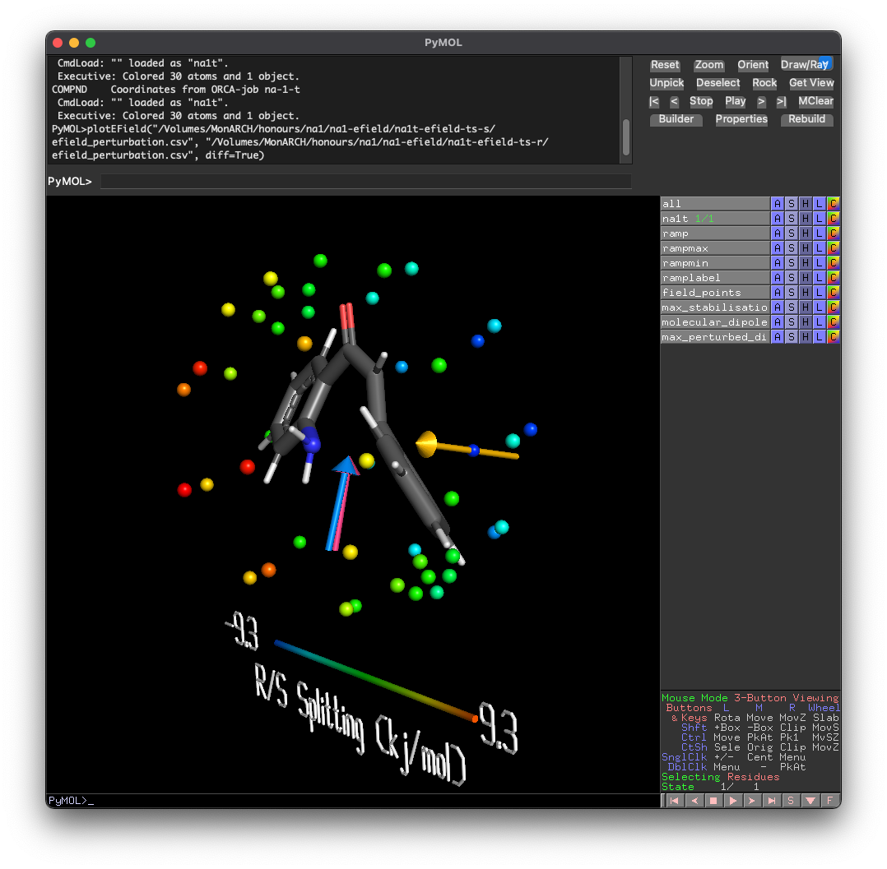
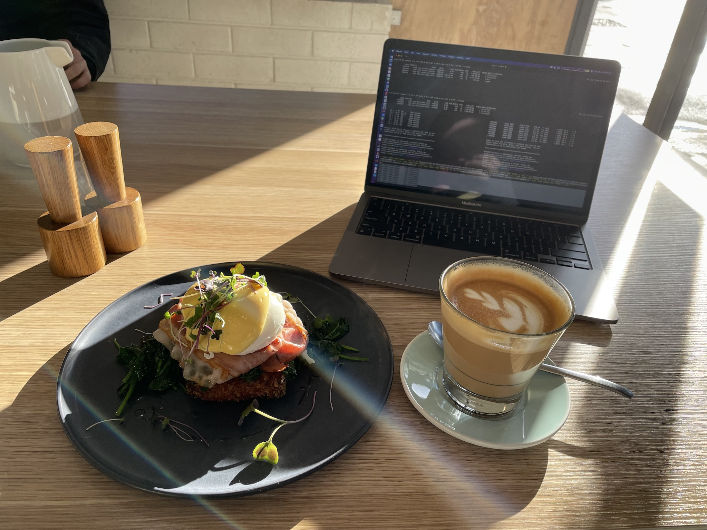

# Week n+2

!!! note "Current milestone"
	Presentation (... look, I know I need to get on to it, I'm fairly certain that I'm supposed to be presenting it to the group today, but in all honesty, especially after the meeting with Michelle, I'm feeling pretty uncertain about what I should be saying)

## Monday 12/7

### From meeting with Katya:

* New ILS of interest are:
  * [C2mim]\[OAc]
  * [C4pyr]\[DCA] (though this apparently isn't working in OpenMM)
  * [C4pyr]\[OTf]
* First priorities are to test the reaction with the optimum e-field from the scan jobs
* Second is to parameterise everything for pMD in OpenMM
  * Then run OpenMM jobs with and without the e-field
  * Then ONIOM SRS-MP2/DFT for energies

### What I did today:

Submitted MP2 gas opt jobs

* Ran the molecular polarisabilities and processed the atomic polarisabilities

Submitted opt/freq jobs for the perturbed SMD solvated benchmark reaction

Submitted genmer/molclus jobs to generate some low energy configurations of na1r + each ion, for $k_{ij}$ parameterisation

Had to do a progress update for the group meeting; didn't have anything prepared so just winged it and seemed to do alright :slightly_smiling_face:

## Tuesday 13/7

### What I did today:

* Got psi4 1.4 and orca 5.0.0 running on M3 and added them to my 2slm script. This also meant putting psi4 in the apps folder
* Tried to get the gas phase OptTS to play nicely
  * It did not want to cooperate
* Got the BF4 SAPT job up and running, though it needs a LOT of memory and I'm not sure how much I can really give it... I tried freezing the core, but we shall see if that's enough (it wanted 180GB before)
  * It's still angry so I've dropped the basis set form `tz` to `dz`

## Wednesday 14/7

### What I did today:

* Took all of the completed configuration scans and converted them to SAPT jobs
* Fired off the $\ce{OAc-}$ configuration interaction, because why not, while I'm already at it...
  * May have added in a few extra ions since
* Got some pMD runs going to test Tom's process, it seems to work well and is giving reasonable densities, though I've yet to test with an e-field
* Got Toms `sapt_analysis.py` script running
* Collaborator meeting went well, though Michelle is really pushing the stereoselectivity angle, and pretty much doesn't care about barriers, which kind of means that I need to re-write chunks of my intro and should re-structure my intro presentation
  * In light of this, I got some jobs on to try and measure the selectivity difference of each field against enantiomers. this is pretty straightforward for static geometry, but letting the molecules relax into the e-field is going to be a bit trickier/more time consuming... They are queued regardless! (hopefully they can actually optimise though...)
* I got the static perturbed R/S difference, though I need to figure out which way the fields should be pointing :sweat_smile:

{: style="width: 40%; "class="center"}

### To Do:

* Read the papers from Michelle

### Jobs to check on:

* SMD Opt/Freq:
  * Queued (M3): na1r/t/p perturbed
  
* Gas Opt:
  * Running: na1t
  
* Molclus scans: 
  * Running: $\ce{OAc-, TCM-, PF6-}$
  
* SAPT analysis: 
  * Running: $\ce{C4pyr+}$
  * Queued: $\ce{OTf-, DCA-, C2mim+, OAc-, TCM- PF6-}$
  
* EField scans:
  * Queued: Relaxed s/r
  
* pMD
  * Running: $\il{C4mpyr}{DCA}$
## Thursday 15/7

### What I did today:

* I had a really difficult day emotionally, so I just decided to take it off and focus on Beat Saber

  * I think that I should start taking my quest to uni to try and warm up when I'm feeling particularly cold, and to make sure that I get some blood flowing every now and then.
* I did get a little bit of work done first thing in the morning whilst trying to pick myself up at The Little Man, which was nice though :slightly_smiling_face:

{: style="width: 40%; "class="center"}

## Friday 16/7

### What I did today:

* Resubmitted some failed SAPT jobs
  * $\ce{DCA-}$ was having trouble optimising due to linear angles (no surprises there) so I set it to optimise with cartesian coordinates instead
  * $\ce{C2mim+}$ just segfaulted without reason...
* Today has been vaguely productive, I've been focusing on getting the MD parameterisation done, which pretty much just the $k_{ij}$ params are left
* Stopped unnecessary SAPT job
* Started IL parameterisation (this is a thing I need apparently)
  * $\ce{C4mpyr+ - Anion}$ scans
  * Ion - ion (self interaction) scans
* Got one of the relaxed efield scans through, the other crashed but has been restarted and is running again
* Ran partial charge analysis and got those parameters in
* Queued up so many parameterisation jobs for the ILs
* The relaxed efield scan finished, but I've queued up a higher density one because I like the results, but I'm getting some interesting data emerging that I feel like would show more clearly in higher resolution scans. This might take a while though...

## Saturday 17/7

### What I did today:

* Took the completed configuration scans and set up their corresponding SAPT jobs
* Re-started the polarisability jobs after realising I hadn't set them up as chained jobs opt -> pol (so they all failed)
* The efield perturbed bench jobs finished but have so many imaginary freqs that they're giving energies about $1400\:\kjmol$ lower than they should be, so I've set them to tight opt and am re-running. I've also dropped the field strength to $0.1\:V/\AA$
* One of the relaxed scans failed due to memory, so I've set it back off with some more memory

### Na1 Parameterisation Progress Matrix

| Task                         |        na1r        |        na1t        |        na1p        |
| ---------------------------- | :----------------: | :----------------: | :----------------: |
| MP2 Opt (gas)                | :white_check_mark: | :white_check_mark: | :white_check_mark: |
| Molecular polarisability     | :white_check_mark: | :white_check_mark: | :white_check_mark: |
| Atomic polarisability        | :white_check_mark: | :white_check_mark: | :white_check_mark: |
| $k_{ij}$                     |  See matrix below  |        N/A         |        N/A         |
| LigParGen                    | :white_check_mark: | :white_check_mark: | :white_check_mark: |
| Check params (minimise test) | :white_check_mark: | :white_check_mark: | :white_check_mark: |
| POLAR section                | :white_check_mark: | :white_check_mark: | :white_check_mark: |
| Test with ILs!               |                    |                    |                    |

### $k_{ij}$/pol Parameterisation Matrix

|                |        na1         |   $\ce{C4mpyr+}$   |    $\ce{DCA-}$     |    $\ce{OTf-}$     |    $\ce{PF6-}$     |
| -------------- | :----------------: | :----------------: | :----------------: | :----------------: | :----------------: |
| $\ce{C4mpyr+}$ | :white_check_mark: | :white_check_mark: | :white_check_mark: | :white_check_mark: | :white_check_mark: |
| $\ce{DCA-}$    | :white_check_mark: |                    | ==SAPT - running== |                    |                    |
| $\ce{OTf-}$    | :white_check_mark: |                    |                    | :white_check_mark: |                    |
| $\ce{PF6-}$    | :white_check_mark: |                    |                    |                    | ==SAPT - running== |
| Polarisability | :white_check_mark: | :white_check_mark: | :white_check_mark: | :white_check_mark: | :white_check_mark: |

