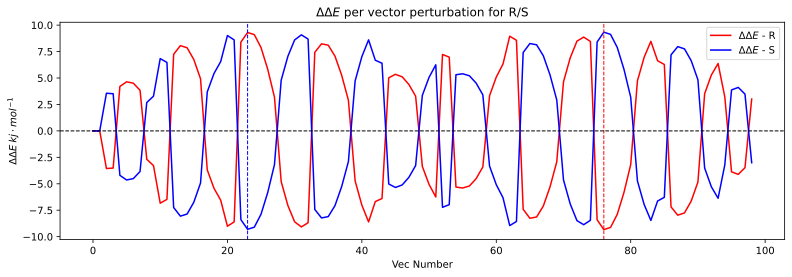

# Week n+6

## Monday 9/8

### What I did today (and yesterday):

* The M06-2X/6-31+G* efield scans finished and the results looks pretty good!

{: style="width: 80%; "class="center"}

* The magnitude of the splitting is also in line with the static benchmark jobs

{: style="width: 80%; "class="center"}

* It's also translated to the PyMOL script in a really logical manner

<iframe width="100%" height="315" src="https://www.youtube.com/embed/zwPtJ0IakpI" title="YouTube video player" frameborder="0" allow="accelerometer; autoplay; clipboard-write; encrypted-media; gyroscope; picture-in-picture" allowfullscreen; class="center"></iframe>

* I'm currently testing the gaussian relaxed bench job again though, as it seemed to be refusing to optimise before. This time I'm not aiming for a hessian guided optimisation to see if it will help.
  * I decided to fix this by starting from the rough geometry each time, so that it can't just look at the previous hessian and say "nup, I'm good." so hopefully now is should actually optimise :slightly_smiling_face:
  * These jobs are currently running
  * In looking closer, it seems that the jobs that I *did* managed to get to calculate the first hessian were saying "oh, you have more than one negative eigenvalue? nup, I'm bailing", so I've set the `opt=noeigentest` flag to prevent that from happening and have requeued the relaxed perturbation jobs. These may take a while though... 
* Katya has made it clear that I should really start writing, so I've ordered a Keychron K3 as motivation and will need to get started on that... probably tomorrow tbh. I'm quite fuzzy after yesterday's vaccination and lack of sleep :/

## Tuesday 10/8

### What I did today:

* Psych appointment and CHM1022 TAing took up most of my day, though I did send some geometries off to Michelle to see if she could replicate the field with functionality.
* I did keep trying to get the gaussian jobs to work, but they really don't want to.

## Wednesday 11/8

### What I did today:

* I've been moving to another method of doing the relaxed scans, where I generate all the ninput files within the slurm file. This allows my to run the opt jobs in ORCA first to get a rough geometry, then to run them in Gaussian as a full hessian guided opt. This should hopefully help with my negative eigenvalues issue...
* Okay that meeting fucked me over a bit
  * The PCCP paper is unlikely at this point since we cant use functionality to do r/s selection as we'd just be introducing chirality to be able to stereoselect and that's bad, so instead what I can do is to run e-field scans on a few derivatives of the aminochalcone. A matrix has been created below of these
  * The IL stuff has been resurrected, but we're only going to $\il{C4mpyr}{OTF}$
  * We're also going to do an analysis on the ILs themselves to see what kind of field they generate internally

## Thursday 12/8

### What I did today:

* I woke up to find that only one of my jobs had started, though a few had tried and failed (in the dependency chain or relaxed derivatives)
  * I'm an idiot and I forgot that the neutrality of an $\ce{R-NO2}$ group comes form the +ve and -ve charges balancing out, so adding in an extra proton, like a nitrogen based carboxylic acid, made my charge/multiplicity wrong
* I had a thought last night that may make things a tad more difficult... If I'm trying to calculate the energy of just the core of the IL MD runs, then I'll need to do some perturbative magic, as the composition of the ILS on the outside is going to differ quite a lot. This means that for each SP, I'll need to do 3(?) jobs; one of just the core, one of just the ILS and one of the core and the ILs to be able to get just the energy difference provided by the IL electric field.
  * I set off some actual tests for this to see how long it would take to do an SP of a full core in Gaussian vs in ORCA. I should probably do Psi4 for completeness, but I know it will be much slower, even if it will be much *smoother*
  * This seems to not be going quite as smoothly as I'd like, as the ORCA job just crashed :unamused:
* Tonight I got a response form Katya that kept me working till 11:45 PM. She emphasised the importance of extracting neutral clusters from the MD trajectories and that we can't use EFPs or anything like that. She also made it clear that the energy of the whole cluster is what we need to procure, and not the interaction energy, so a single single point of each of the geometry is what we need.
* This got me thinking about how to get only the core energy of the cluster, and I suggested using ghost atoms, to represent the ILs, to which I haven't really heard a no?

## Friday 13/8

### What I did today:

* Had a good panic and a bit of a cry
* Spoke to Peter about how to pick out IL pairs from around a solute, I think the answer will be to measure the distance of all ILs within a certain radius and then pick the `n` closest anions and `n` closest cations
* Cleaned up the efield scans on M3 that that crashed overnight and got them back up and running. I think to keep as many slots open as possible, I'm going to do all of the efield scans from that series on M3
* Got some ORCA SP jobs running. I'm currently testing ORCA with full basis functions, ghost functions on the ILS and ghost functions and CPCM
* I figured out a simple way to create neutral clusters by looking in a set radius of 15Å from the centre of the geometry of the solute and measuring the distance to each residue. This creates an ordered list, which allows me to just pick the first `n` residues form the list. My judgement call places the solvation at ~10 ion pairs, but I'm honesly not sure. I still feel like there's a few little gaps, since it's long and flat molecule, and measuring the spherical distance doesn't cover enough space.
* I ruled out ORCA as it's just way too slow, but I'm now doing some ghost atom tests, as well as some simple benchmark tests with Gaussian
* I've started testing on Gadi to see how long things will take and how much they'll cost... it's like around 175 KSU all up, though more likely it will be less due to Gadi's better hardware, some of the jobs may not be so easy to converge, in which case they'll cost significantly more.

## Saturday 14/8

### What I did today:

* Things are looking better! After having a long email discussion with Katya and Michelle, We've decided (again) to drop the ILs and focus on a small molecule study of the cyclisation for 2'-aminochalcone to aza-flavanone (*phew*). I think that this has mostly been sparked by me doing some benchmarking that's showed exactly how costly these SPs will be to run on Gadi (looks like 200-400 KSU)
* I ran a test of optimising the unoptimisable catalytic geometries in Psi4, and even without a hessian to follow, it optimised really quickly and cleanly without any fuss. I verified the geometry in Gaussian and it's only producing one -ve freq, corresponding to the TS mode! so it beat out ORCA and Gaussian, when they both had analytical hessians to follow!
  * I should probably flag this for the future, as it seems that Psi4 can handle electric fields better than Gaussian or ORCA.
  * I'm still testing this method to see if ORCA can produce nice solvated geometries from this though, as there's no analytical hessians for PCMsolver in Psi4
* I'm currently digging up the lb2t jobs to try and get them optimised to a TS as we'd like. What I've done is to take the geometry of the ring forming centre of the optimised na1t geometry and apply it to the lb2t starting point. I've then checked the geom into Psi4 (can it do it twice? :D) and into ORCA (without hessian guidance) to see if it will be able to find the TS this way.
* I've synced the derivative efield scans up between MonARCH and M3 and have queued the jobs up on MonARCH, but I might actually cancel these, in order to get the bench jobs through once I'm done testing the psi4 -> orca -> gaussian pathway.
* I'm also currently testing F-SAPT as an approach to being able to get intramolecular energy decomposition, though the examples provided seem to mainly focus a molecule and comparing two sub regions, so three fragments all up, and I'm not sure how this will translate.
* I've been trying to sort out these relaxed bench jobs and I stumbled upon something in the GAMESS documentation that said that you need to optimise in cartesian coordinates, as the field will generate a torque on the molecule that the can't be addressed with internal coordinates.
  * I wonder if this also means that you can only trust numerical hessians and not analytical ones...

#### Job Times

| Job                                                 | Time (h) | # SCF cycles | Energy         | Memory Used (GB) | Cost (SU) |
| --------------------------------------------------- | :------: | ------------ | -------------- | ---------------- | --------- |
| Gaussian (10 IP) - MonARCH                          |  10:05   | 26           | -14416.1063713 |                  |           |
| Gaussian (10 IP) - Gadi                             |  11:30   | 27           | -14416.1063713 | 14.94            | 368.24    |
| Gaussian w Ghost ILs (10 IP) - Gadi                 |   6:27   | 20           | -709.001510682 | 17.74            | 211.33    |
| Gaussian w Ghost ILs & CPCM(Ethanol) (10 IP) - Gadi |   6:35   | 16           | -709.024908436 | 30.87            | 215.48    |
| Gaussian core only                                  |    -     |              | -708.995468    |                  |           |
| Gaussian w Ghost ILs (10 IP)                        |   6:40   | 20           | -709.001510    |                  |           |
| Gaussian w Ghost ILs & CPCM(Ethanol) (10 IP)        |   6:40   | 16           | -709.024908    |                  |           |

*costs can be reduced by using less memory. Will check the Gadi cost report to see how much was actually used. 

#### R - Efield Scans Matrix

| ↓ left \| right → |    $\ce{NH2}$​    |    $\ce{NO2}$    |        -         |
| ----------------- | :--------------: | :--------------: | :--------------: |
| $\ce{NH2}$        | ==running== (37) | ==running== (30) |   queued (88)    |
| $\ce{NO2}$        | ==running== (70) | ==running== (28) | ==running== (28) |
| -                 | ==running== (46) | ==running== (31) |        -         |

#### S - Efield Scans Matrix

| ↓ left \| right → |    $\ce{NH2}$    |    $\ce{NO2}$    |                   -                    |
| ----------------- | :--------------: | :--------------: | :------------------------------------: |
| $\ce{NH2}$        | ==running== (29) | ==running== (40) | done |
| $\ce{NO2}$        |   ==running==    | ==running== (17) |            ==running== (29)            |
| -                 | ==running== (46) | ==running== (36) |                   -                    |

#### Relaxed Bench Matrix

| solvent | na1r | na1t | na1p |
| ------- | :--: | :--: | :--: |
| gas     |      |      |      |
| hexane  |      |      |      |
| ethanol |      |      |      |
| dcm     |      |      |      |
| dmso    |      |      |      |
| water   |      |      |      |

#### MD Run Matrix     

| IL                                                |                 na1r-r                 |                na1t-1-r                |                na1t-2-r                |                na1t-3-r                |                 na1p-r                 |                 na1r-s                 |                na1t-1-s                |                na1t-2-s                |                na1t-3-s                |                 na1p-s                 |
| ------------------------------------------------- | :------------------------------------: | :------------------------------------: | :------------------------------------: | :------------------------------------: | :------------------------------------: | :------------------------------------: | :------------------------------------: | :------------------------------------: | :------------------------------------: | :------------------------------------: |
| $\il{C4mpyr}{OTF} - \vec F =0.1\:V\cdot\AA^{-1}$​​​​  | done | done | done | done | done | done | done | done | done | done |
| $\il{C4mpyr}{MSO4} - \vec F =0.1\:V\cdot\AA^{-1}$​​​ | done | done | done | done | done | done |                 queued                 | done | done | done |
| $\il{C4mpyr}{TCM} - \vec F =0.1\:V\cdot\AA^{-1}$​​  | done | failed | done | done | done | failed | done | done |              ==running==               | done |
| $\il{C4mpyr}{OTF} - \vec F =0.0\:V\cdot\AA^{-1}$​​​  | done | failed |              ==running==               |              ==running==               | done | done |              ==running==               |              ==running==               |              ==running==               |              ==running==               |
| $\il{C4mpyr}{MSO4} - \vec F =0.0\:V\cdot\AA^{-1}$​​​ | done |                 queued                 |                 queued                 |                 queued                 | done | done |                 queued                 |                 queued                 |                 queued                 | done |
| $\il{C4mpyr}{TCM} - \vec F =0.0\:V\cdot\AA^{-1}$​​  | done | done | done |                 queued                 |                 queued                 | done | done | done | done | done |

