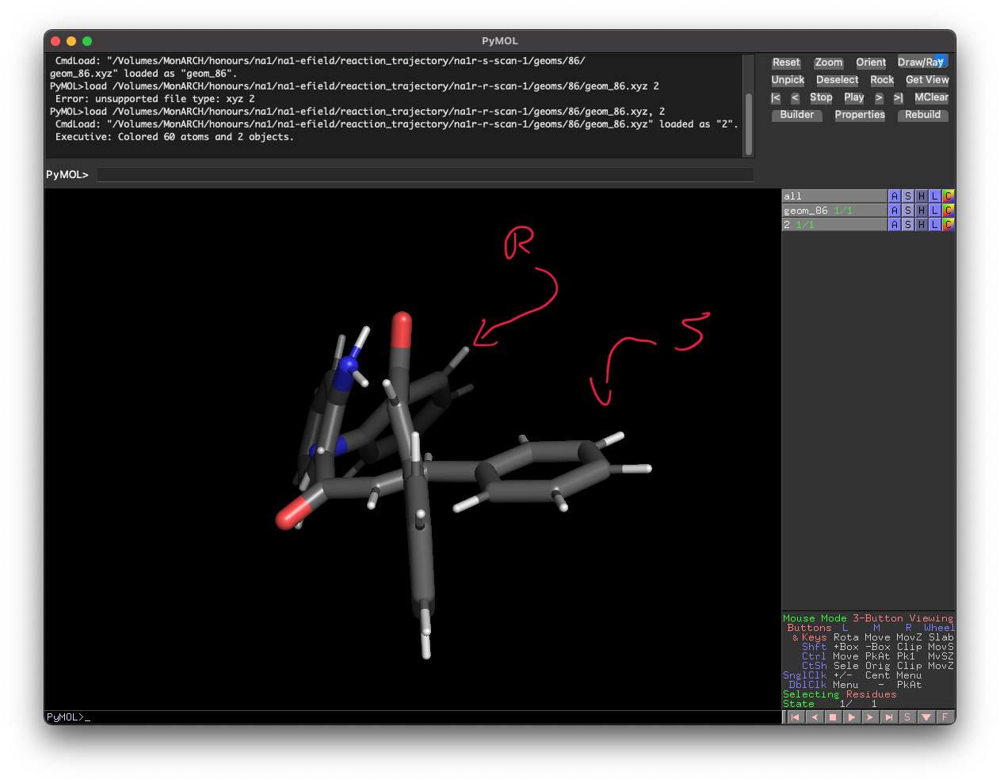

# Week n+8

## Sunday 22/8

### What I did today :

* Wooo! The ωB97M-V TS search seems to have found something, but I suspect that it's just the piperidine detaching. Either way, It's currently calculating the numfreqs

## Monday 23/8

### What I did today:

* ~~I now have the efield scans done, which means that I have my choice vectors, so I've queued my benchmarking jobs and have submitted a job that's checking the catalytic effect as a function of field strength.~~
  * I've looked back at my scans and noticed something really wrong with my results. Where I've increased the dynamic level of the optimiser, it's caused the molecule to follow the rotational torque and align itself with the field, so the resulting stabilisation will be catalytic, not selective. I've had to re-start the scans to remedy this.

{: style="width: 70%; "class="center"}

* Katya wasn't happy with how I went about assessing the interaction of the catalyst, so I've decided to take a different approach.
  * If I optimise the protonated LB pathway, that should give me a TS that I can use to obtain a barrier height that I can compare to the non-activated pathway
  * To get the electrostatic catalysis, I can then add a point charge and see what impact that has on the lb2t-h energy.
  * I can then use the decomposition method in https://www.publish.csiro.au/ch/CH16579 to obtain information about correlation, exchange and Hartree energy
* The ωB97M-V TS search has found the TS for the LB leaving, so I'm now freezing that coordinate and optimising for the cyclisation.
  * This flailed wildly, but I'm trying something a bit different now, where I'm going to optimise to a geometry where the ring is much closer to being formed with revpbe-d3bj in Psi4 (to take advantage of `fixed_distance`) then I'll finish it off with ωB97M-V in ORCA

## Tuesday 24/8

### What I did today:

* I've actually spent the vast majority of my day re-writing my intro, which has been significantly easier this time around since I can properly explain certain concepts and actually understand them much better myself!
* I've continued to push the scans through, they're coming along nicely, though are taking their sweet time.
  * One job has only vector left, but since Rosalind is busy trying to find a TS for lb2t-h, I've got it running on Hodgkin. It hopefully shouldn't take too long at least.
* I'm honestly not sure about finding the TS of a conjugated addition anymore, I've resorted to doing an ωB97M-V OptTS search with def2-TZVPPD to try and find lb2t-h, and it's still not looking good. I guess I'll have to ask Michelle, but I'm still kind of confused as to what I can be comparing, since I'm not comparing barrier heights.
* All of the efield scans have finished and they look **MUCH** better, so I've extracted the vectors of interest and have submitted the benchmark jobs!

## Thursday 26/8

### What I did today:

* Today I got really angry trying to interpret the efield scan results that I've been getting, but then I came to the conclusion that ORCA uses the Gaussian convention for EField direction, which explains some inconsistencies in calculations.
  * I've taken this info and have set off the efield-strength jobs as well as re-submitting the bench jobs
* I felt like absolute hell, so I went and got tested and spent the rest of the day in bed.

## Friday 27/8

### What I did today:

* The lb = pyrrole jobs seem to be optimising to something with a lower TS imaginary freq, but without confirming at m062x I can't know for sure. The pyrrole seems to be aligned with the carbonyl carbon, so I guess it's pulling some electron density, but it's not attached and doesn't seem to be particularly involved in the ts. onlt an M062x opt/freq will tell.
* I've started getting results back from my bench jobs and the R/S selection seems to be worse than the hard +/- Z selection (perpendicular to the reaction axis), so I'm cancelling the jobs manually once they've completed the catalytic step, which conveniently is step 1.
  * I need to run another job to see whether or not this catalytic method actually results ion a lower barrier than the reaction axis catalysis.
* The Field scans are coming along, but I think I need to do them in gas phase as well, and should probably use ethanol as the solvent, so I guess I need to re-do all of them...
  * More importantly, I need to see if this field is actually the most catalytic, as the field scans don't seem to be producing as low barriers as I'd expect.
* I've submitted the rotation PES scans in the normal priority queue, and have done them at ωB97M-V, as it's good for barrier heights and seems to be reasonably fast. I'll need to get some ωB97M-V geoms and ΔEs of the reactant and TS though to see if the barrier height is comparable. Perhaps I then need to do the scan again in the selective efield to see if it it will be higher, since the endpoints will be higher.

#### na1 - Efield Scans Matrix

| Steroisomer |                  na1r                  |                  na1t                  |                  na1p                  |
| ----------- | :------------------------------------: | :------------------------------------: | :------------------------------------: |
| R           | done | done | done |
| S           | done | done | done |

#### Relaxed Bench Matrix

| solvent         |    na1r     |  na1t  |    na1p     |
| --------------- | :---------: | :----: | :---------: |
| gas             |   queued    | queued |   queued    |
| hexane          |   queued    | queued |   queued    |
| ethanol         |   queued    | queued |   queued    |
| dcm             |   queued    | queued | ==running== |
| dmso            |   queued    | queued |   queued    |
| water           |   queued    | queued |   queued    |
| relaxed ethanol |   queued    | queued |    queue    |
| relaxed gas     |   queued    | queued |   queued    |
| static ethanol  |   queued    | queued |   queued    |
| static gas      | ==running== | queued |   queued    |

#### MD Run Matrix     

| IL                                                |                 na1r-r                 |                na1t-1-r                |                na1t-2-r                |                na1t-3-r                |                 na1p-r                 |                 na1r-s                 |                na1t-1-s                |                na1t-2-s                |                na1t-3-s                |                 na1p-s                 |
| ------------------------------------------------- | :------------------------------------: | :------------------------------------: | :------------------------------------: | :------------------------------------: | :------------------------------------: | :------------------------------------: | :------------------------------------: | :------------------------------------: | :------------------------------------: | :------------------------------------: |
| $\il{C4mpyr}{OTF} - \vec F =0.1\:V\cdot\AA^{-1}$​​​​  | done | done | done | done | done | done | done | done | done | done |
| $\il{C4mpyr}{MSO4} - \vec F =0.1\:V\cdot\AA^{-1}$​​​ | done | done | done | done | done | done | done | done | done | done |
| $\il{C4mpyr}{TCM} - \vec F =0.1\:V\cdot\AA^{-1}$​​  | done | done | done | done | done | done | done | done | done | done |
| $\il{C4mpyr}{OTF} - \vec F =0.0\:V\cdot\AA^{-1}$​​​  | done | done | done | done | done | done | done | done | done | done |
| $\il{C4mpyr}{MSO4} - \vec F =0.0\:V\cdot\AA^{-1}$​​​ | done | done | done | done | done | done | done | done | done | done |
| $\il{C4mpyr}{TCM} - \vec F =0.0\:V\cdot\AA^{-1}$​​  | done | done | done | done | done | done | done | done | done | done |

