# Week n+9

## Sunday 29/8

### What I did today :

* The MD runs and efield scans are all done, so I've gotten rid of those matrices
* The big battle at the moment is these bench jobs
  * I've got the rxn bench jobs queued on M3 and one has been picked up so far
  * I've also got the efield strength jobs queued on Monarch after realising that the direction of the fields was inherently wrong
* My constrained ωB97M-V opt job has finished and I need to submit the TS search now 

## Monday 30/8

### What I did today:

* I realised that the reactants in my efield scans were optimising to the *cough* true *cough* minimum geometry, and as a result were rotating by 90°, so I've fixed and resubmitted those

* After running my constrained optimisations of lb2t, I decided to run a revBPE-D3BJ `recalc_hess 1` optimisation and in looking at the hessian that emerged I noticed a sneaky little vibrational mode around $-260\:\bar\nu$ that looked like it might be the TS. I decided to follow this eigenvector with `ts_mode { M 10 } end` (it was mode 10) and that particular state started to move around, so I've been chasing the mode down to `{ M 9}` @ $\sim90\:\bar\nu$ and have been keeping an eye on it since. It's been tedious, but I'm hopeful that I'll be able to follow it to the true TS

  <iframe width="100%" height="315" src="https://www.youtube.com/embed/YcdAGab5n60" title="YouTube video player" frameborder="0" allow="accelerometer; autoplay; clipboard-write; encrypted-media; gyroscope; picture-in-picture" allowfullscreen; class="center"></iframe>

  * The  ωB97M-V optts job is still optimising as well, following the bond of the ring formation

* Katya told me today that I don't really have enough to publish, and TBH this makes me kind of relieved, as it's one less thing to worry about, so I can just focus on my thesis for the time being

* The mid year report is due soon, and I should really focus on trying to cobble something together to submit for that...

## Tuesday 31/8

### What I did today:

* I decided that for the relaxed field strength benchmarks, It's really important that I make sure that the geometry is aligned the same through each optimisation, so I've deiced to put some constraints in. In GaussView I created dummy atoms -1Å X and -1Å Z  of the oxygen atom and rotated the carbonyl bond to be 90° to the dummy-oxygen bonds. I then rotated the molecule so that the adjacent aniline group is planar to the first bond (Dihedral 31-5-12-4 = 0°) In ORCA, I then constrained the position of the dummy atoms and the oxygen atom, and constrained the dummy-carbonyl angles (31-5-12 = 90° and 32-5-12 = 90°) and the dummy-carbonyl-aniline dihedral. This should keep the carbonyl bond parallel to the Y axis and allow the C=O bond to change length and keeping the central ring in the X/Y plane, while letting everything else optimise around it.
  * I'm going to put these constraints in to the other bench jobs as well for consistency.
  * This turned into a much bigger job than I anticipated to pull off
  * It looks like dummy atoms won't work with SMD, so I'll have to switch to CPCM

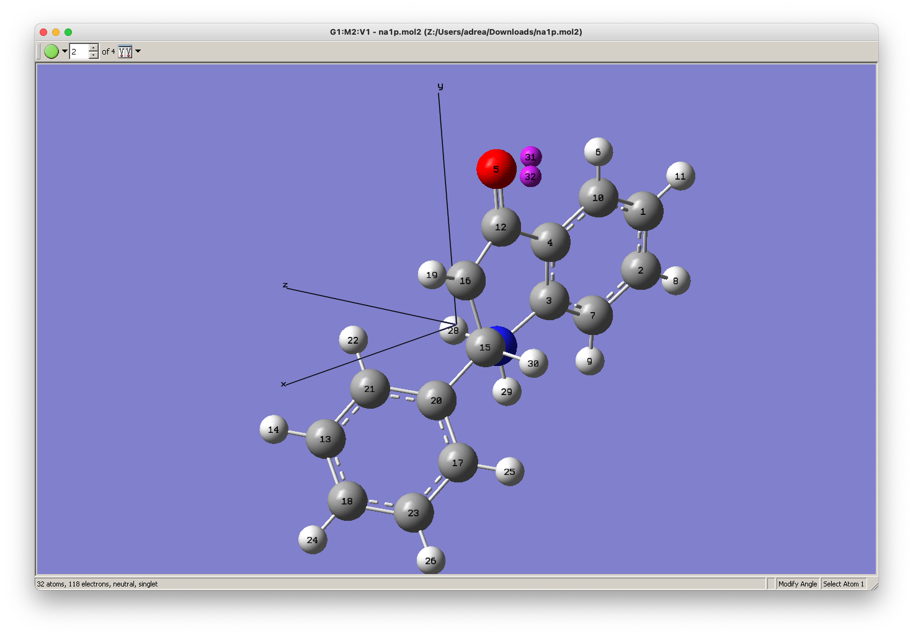{: style="width: 80%; "class="center"}

* Now I'm *really* confused. It seems as though my relaxed bench jobs have been optimising to some extent, but it doesn;t look like they've necessarily been doing it fully?
  * I've killed these jobs to focus on the more robust ones that I've queued up today 

## Wednesday 1/9

### What I did today:

I really should push on with some writing...

* I started writing about dielectric constants, charge screening and stabilisation
* I've been pushing jobs through still
* I had a pretty flat afternoon, so I decided to try my hand at some coding exercises instead, but I have been continuing to squash bugs, find stupid mistakes and keep the jobs going through (hopefully)
  * I think I might have a small amount of pre-burnout starting to creep in, as well as some lockdown related depression

## Thursday 2/9

### What I did today:

At this point, I've completely given up on finding the ts for the lb pathway. My justification for this is that the reaction is seemingly barrierless, as when I look through the hessians, I'm seeing the TS modes that look most like the conjugate addition pop up at $-30$ to $-50\bar\nu$ mid optimisation. The reaction is also insanely fast (5 mins @ r.t.), indicating that it is kinetically and thermodynamically favourable, so if there is a barrier, it's small enough for it to be easily overcome by STP energetics.

* I've spent most of my day trying to figure out how to visualise the differences in the perturbed electron density and I think I've found an interesting way to do it, and now I just need some production computations
  * Using static geometry, perturb the molecule with fields of your choosing
  * Convert the wavefunctions (gbw) into cubes using `orca_plot` and exporting the SCF density
  * Subtract them to get the difference in the electron density using `cube_tools` 
  * load them into PyMol to visualise them
* I've just set this up as a Psi4 scrips which is slightly easier, since the 

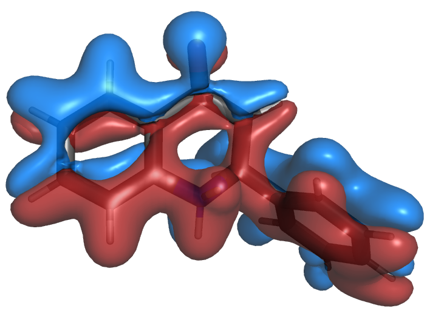{: style="width: 80%; "class="center"}

## Friday 3/9

### What I did today:

* I spent all morning trying to find a nice way to present the displaced electron density. One option is the blobby mehtod above, which does work, but can be a bit tricky to visualise on a 2D PDF

|           S/R/C            |
| :------------------------: |
| 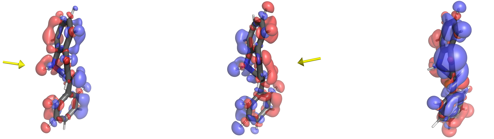 |
| 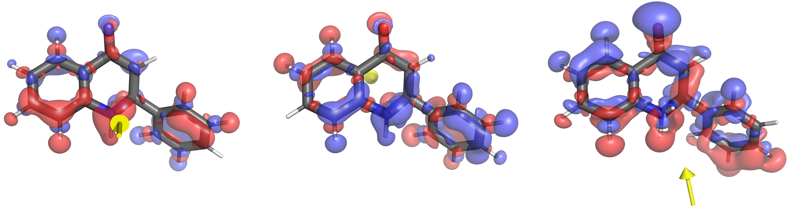 |
|  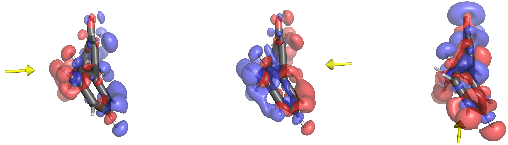  |

* I also tried doing something similar with contour plots as well

|             |              S               |              R               |              C               |
| ----------- | :--------------------------: | :--------------------------: | :--------------------------: |
| Back Plane  |      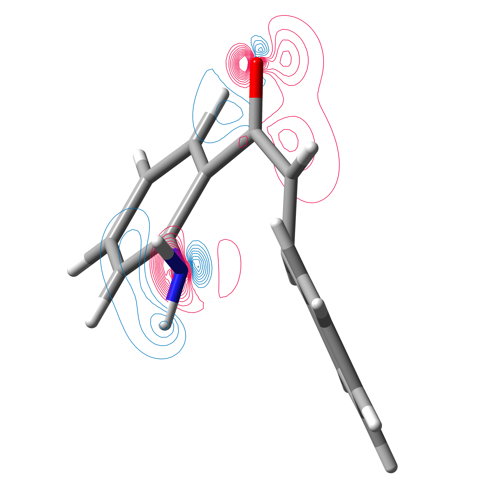      |  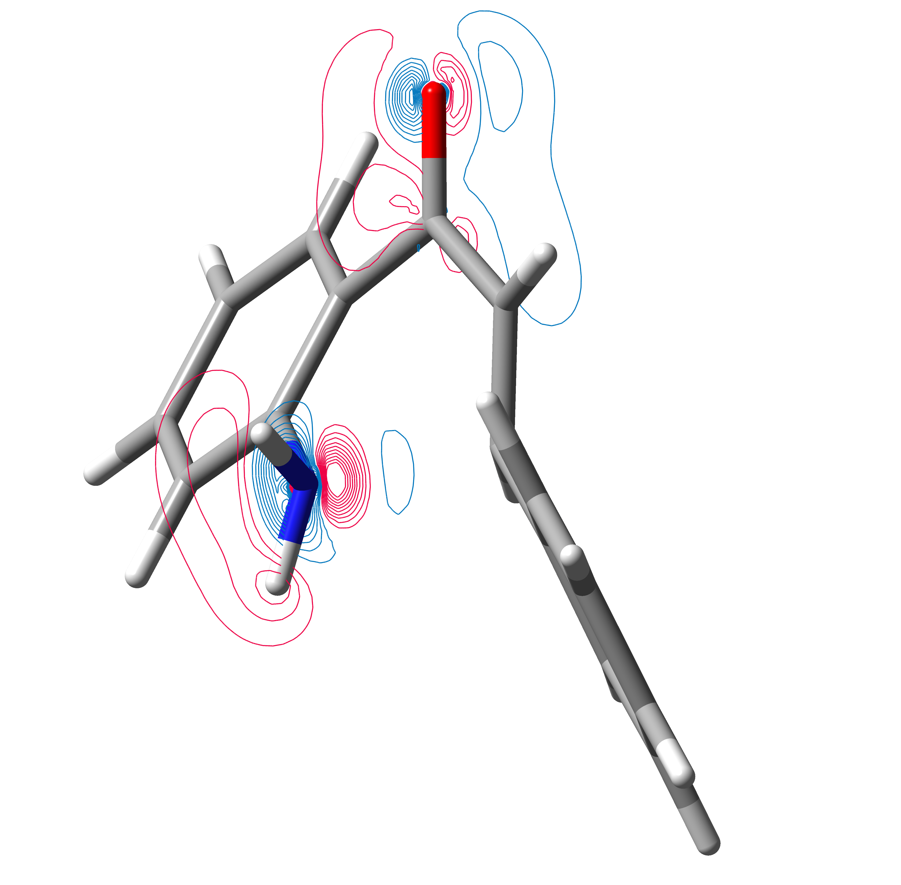  |      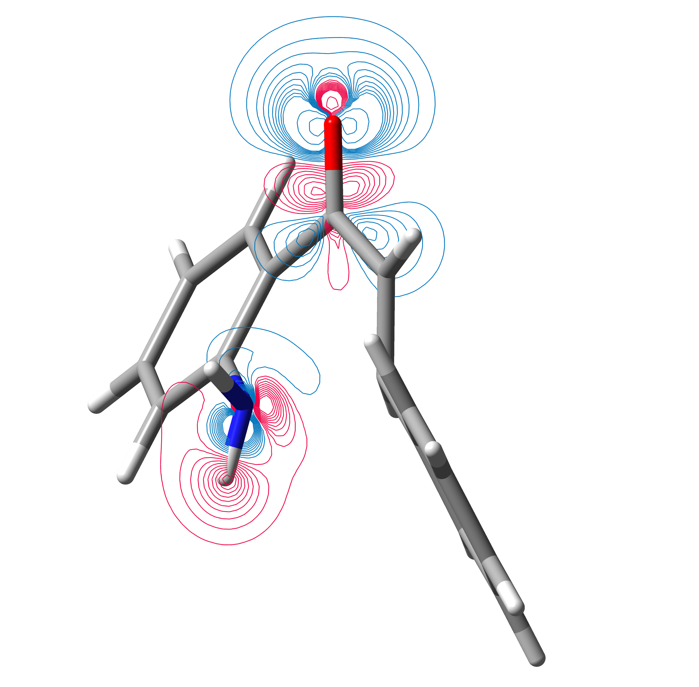      |
| Front Plane | 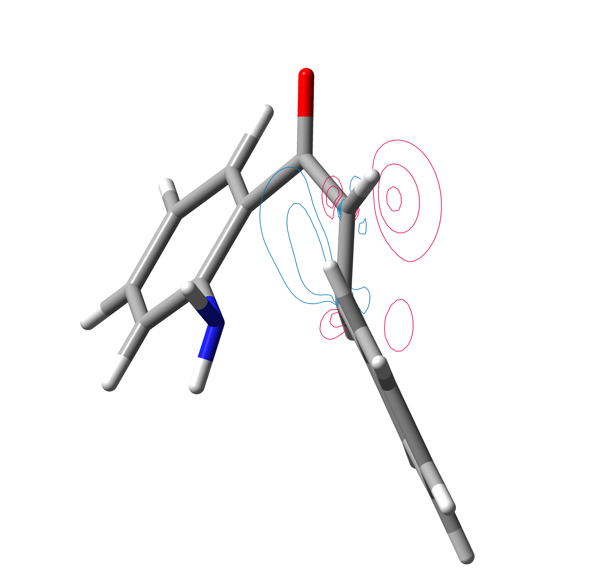 | 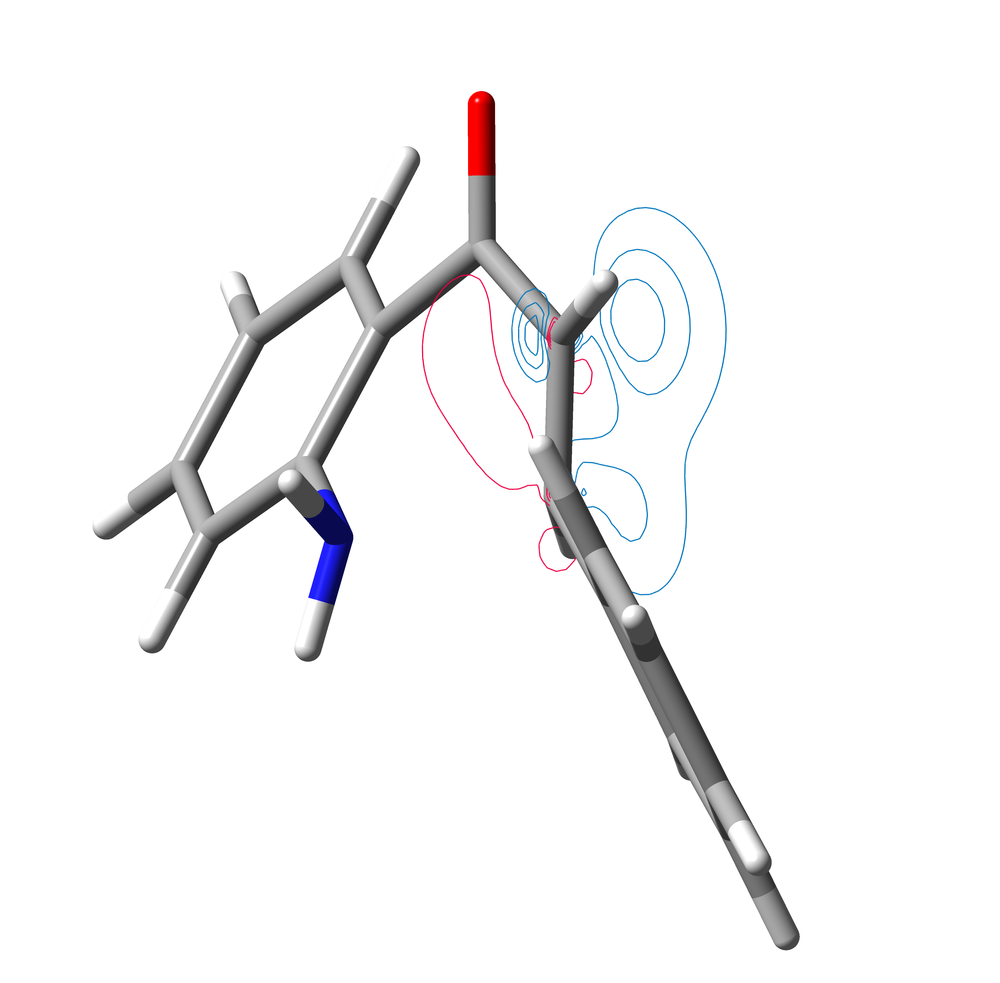 | 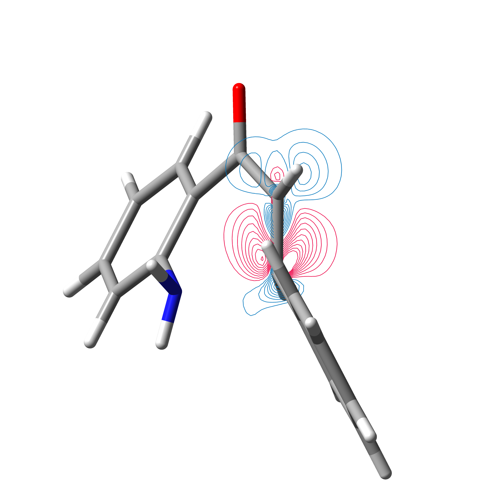 |

* I think I've found a method that looks pretty good, but I need ot figure out how to display the geometry underneath the isosurface, thin or thick?

|                              |
| :--------------------------: |
|            |
| 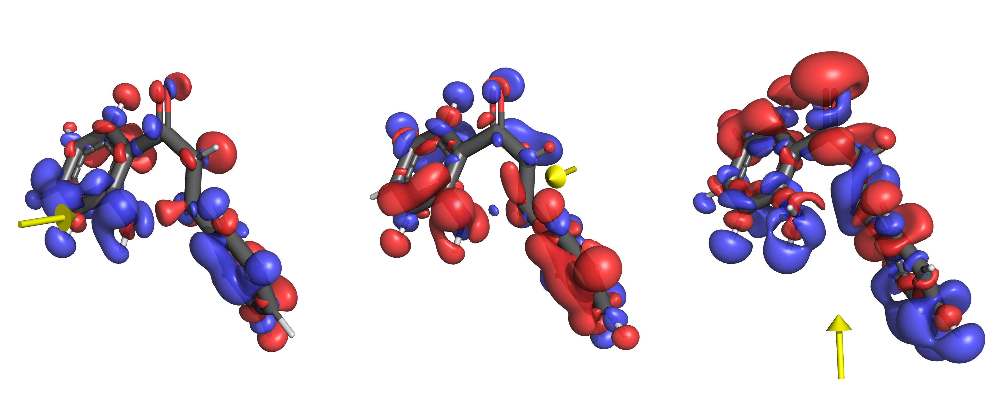 |

* I also found some inconsistencies in some jobs so am tidying them up and pushing others through

* The bench jobs are finally going through on M3, and the results are looking awesome!

* I'm really not sure what to make of this; as the field strength increases, the nitrogen on the TS seems to be curling up and away from the electric field, instead of towards it. I'm not sure though if this is just a product of how I've constrained the geometry... it seems likely, but I'm not sure how better to do it. perhaps I could do something similar and unconstrain the C=O bond and constrain the N-O-DA bond angle to make sure that it remains in the same orientation relative to the electric field, since it's going to be the determining factor in the reaction axis.

  * I have since submitted these constraints for the T and P jobs. 

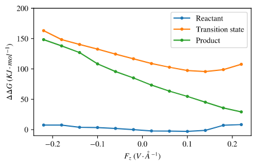{: style="width: 50%; "class="center"}

## Saturday 4/9

### What I did today:

* As well as getting most of the SMD bench jobs through, I noticed that my new constraints were allowing the molecules to rotate too freely in the electric field, causing them to spin out too much. I've put in some new dihedral constraints that should hopefully fix this.
* I also did some work producing a few more figures, including a nice one displaying the axes

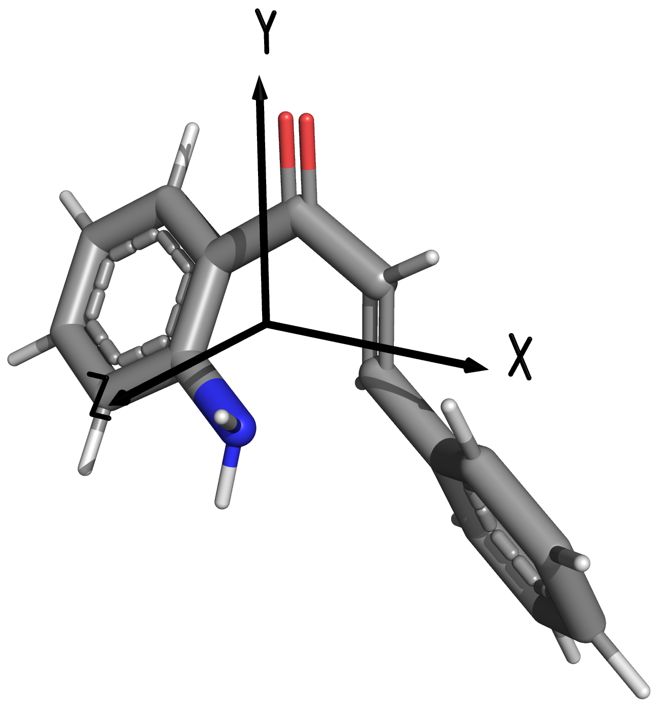{: style="width: 40%; "class="center"}

#### Relaxed Bench Matrix

| solvent         |                  na1r                  |                        na1t                        |                        na1p                        |
| --------------- | :------------------------------------: | :------------------------------------------------: | :------------------------------------------------: |
| gas             | done |                  ==running== (M3)                  |       done       |
| hexane          | done |       done       |       done       |
| ethanol         | done |                  ==running== (M3)                  |       done       |
| dcm             | done |       done       |       done       |
| dmso            | done |       done       |       done       |
| water           | done |       done       |       done       |
| relaxed ethanol | done | done/==running== | done/==running== |
| relaxed gas     | done | killed/==running== | killed/==running== |
| static ethanol  | killed |       killed       |       killed       |
| static gas      | killed |       done       |       done       |

