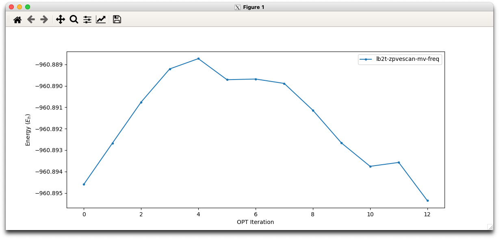
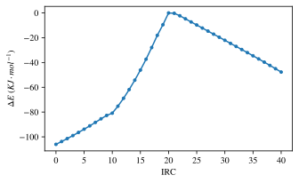
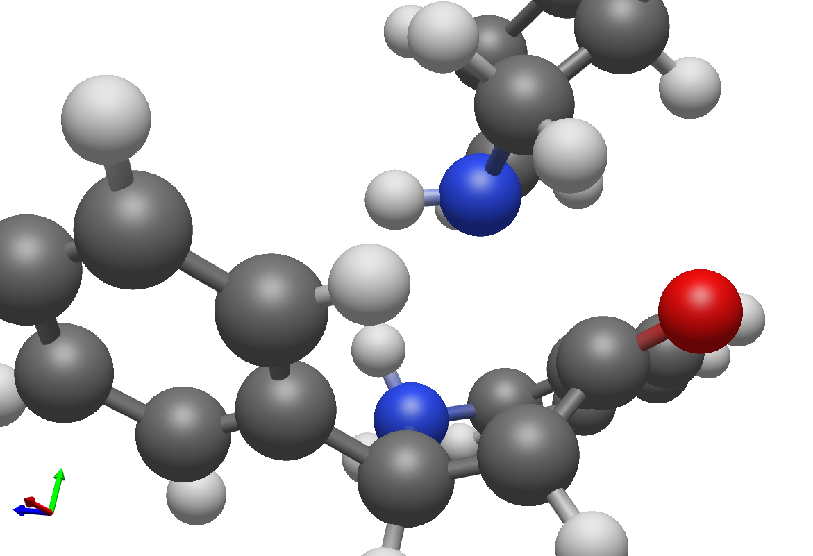
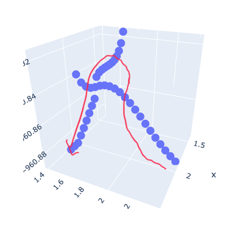
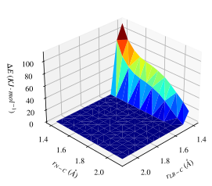
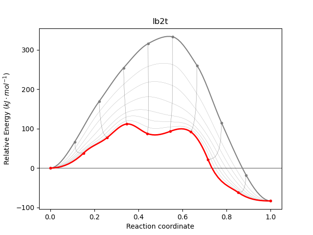

# Week n+11

## Monday 13/9

### What I did today :

* Meeting with Katya
  * I think she finds the scans of the lb TS complex interesting and wants me to be able to write about them and the difference between the M06-2X and ωB97M-V results, so I'm re-doing them completely, with the same relative starting geometry.
  * I took a fair few notes from the meting about things to write about, and what to and not to include in the sections that I've written so far. Really I just need to keep writing.
* I don't feel like I've really done enough writing, based on what Katya wants of me, but I did manage to write >900 words on TST and tunnelling which tbh is something that I'm not the most familiar with to begin with, so I'm proud of what I've accomplished. 
* I am concerned that I'm not going to be able to get a huge amount done this week though, owing to lots of appointments and meetings, as well my teaching commitments tomorrow.
* This makes me VERY happy though! The ωB97M-V hessian guided TS search, based off the PES scans is working fantastically, even with only a cc-pvdz basis set!

<iframe width="100%" height="315" src="https://www.youtube.com/embed/Wiydh6Hm0G4" title="YouTube video player" frameborder="0" allow="accelerometer; autoplay; clipboard-write; encrypted-media; gyroscope; picture-in-picture" allowfullscreen; class="center"></iframe>

* Not only is it following the correct mode, but the energy is also starting to decrease!

{: style="width: 70%; "class="center"}

## Tuesday 14/9

### What I did today :

* I checked the progress of that OptTS jobs and it seems to be losing the TS mode of the LB leaving but in looking at the IRC, perhaps the process isn't actually concerted after all?
  * In the trajectory, the first linear section corresponds to the cyclisation step, which would only have an $\sim20\kjmol$ barrier, then the rest is the lewis base leaving, which wouldn't necessarily be considered a part of the cyclisation itself. This isn't an optimised TS to be starting with however.

{: style="width: 40%; "class="center"}

* I Drafted an email to Katya, but decided not to send it until I have more data, so I'm going to just put it here instead:

??? info "Email to Katya"
	Hi Katya, 
	I ran an IRC (wB97M-V/cc-pvdz SMD ethanol) of the closest thing that I have to a correct TS of the lewis base conjugate addition and I found something interesting that I'm not entirely sure how to account for. The reaction is always discussed as a concerted pathway, but the IRC seems to suggest that it may in fact be two seperate, steps with the TS at IRC step 10 pertaining to the cyclisation and at step 20 pertaining to the Lewis base leaving.
	

	I'm not sure if there would be a lower energy pathway on the PES where the two TS overlap, or if the optimiser will just always keep going downhill to find the lower energy of the two TS.
	
	The starting point for the IRC was the geometry that I showed you yesterday, where both bond breakages/formations were involved in the vibrational mode.
	
	I'm thinking that you may be right in your assumptions yesterday that it might actually be more subtle interactions at play, with the Lewis base not formally bonding to the carbonyl carbon, as the lowest energy configurations of the TS seem to not largely involve the LB-C bond in the TS mode, but the nitrogen still seems to take on an almost tetrahedral geometry, as though it's forming some kind of  weaker bond.
	
	{: style="width: 50%; "class="center"}

* Putting the scans together into one 3D plot, the only conclusion to make is that the PES looks something like this, and that the IRC is following the red line

{: style="width: 40%; "class="center"}

## Wednesday 15/9

### What I did today :

* I had a whole bunch of medical appointments this morning, but while Out, I started working on processing the data that was coming in from the 2D PES scan

{: style="width: 40%; "class="center"}

* Lots of writing!
* After the collaborator meeting, I went back to the drawing board with the Lewis base pathway and realised something painfully obvious. Piperidine has a pKa of 11, but it's used with an equal measure of $\ce{KOH}$, which $\ce{KH}$ has a pKa of 35, so the proton will choose to be on the potassium over the nitrogen, meaning that my catalyst shouldn't ever be in the +1 state, meaning that my calculations are off.
  * This might be a saving grave in terms of finding the LB TS, but it may also prove to be even more of a tricky TS to find, as it seems to involve four bonds moving in concert, as the amine nitrogen seems to transfer to the piperidine nitrogen. I'm not sure if this is truly concerted though, and if it's not, I'm not sure if the proton will be removed before or after the cyclisation.
  * I suspect that the LB is deprotonated first, then it adds into the carbonyl, then I'm guessing that either it goes cyclisation -> deprotonation, or the two steps happen in concert.
* I currently have a Hessian guided M06-2x/6-31+G* job queued, as well as a non-Hessian guided M06-2X/aug-cc-pvtz job. I'm also locally running an ωB97M-V/cc-pvdz locally
* I am re-doing the benchmark calculations taking this into account, and if the TS searching jobs don't work, I'll be able to use these geoms as the basis for an NEB search

## Thursday 16/9

### What I did today :

* I had a few appointments this morning so I didn't really get anything done, but I have been pushing the *revised* opt jobs through. The benchmarking jobs are also still chugging along.
* I really need to keep pushing on with my methodology.
  * Methodology (draft) is done!

## Friday 17/9

### What I did today :

* This TS seems to be quite elusive as well, so I decided to run some low level NEB jobs to find what it could be. My initial attempt gave me two transition states and an intermediate, which I'm not happy with, since the first TS is of the deportation of the amine. 

{: style="width: 40%; "class="center"}

* I suspect that this is a product of the interpolation though, so I'm trying out using a TS guess to interpolate between. Just to sanity check everything:
  * pKa KH = 35 ([link](https://hmdb.ca/metabolites/HMDB0032630))
  * pKa piperidine = 11.2 (Evans)
  * pKa 2'-aminoacetophenone = 16.26 ([link](https://hmdb.ca/metabolites/HMDB0032630)) - serves as an analogues for the aminochalcone
* Theoretically, would the KH also deprotonate the aminochalcone?
* Okay, lots of things have happened today, the NEB runs are still going, but more importantly, I'm REALLY not happy with my benchmarking data. The reactants are in their wrong configuration, and a lot of the transition states are just very wrong. VERY wrong. I'm going to re-do them all, checking things as I go
* I'm also re-doing just the ethanol relaxed bench jobs at ωB97M-V so that I can get a better representation of what the rates might *actually* be like

## Saturday 18/9

### What I did today :

* I suspect that ba2-2 is a barrierless reaction, so I'm running a scan to be sure.

#### Benchmark Matrix

| Pathway         |                           Reactant                           |       Transition state       |                Product                 |
| --------------- | :----------------------------------------------------------: | :--------------------------: | :------------------------------------: |
| Non-activated   |            done            |         ==running==          | done |
| Brønsted Acid 1 |            done            |         ==running==          | done |
| Brønsted Acid 2 |            done            | scan - queued (barrierless?) | done |
| Brønsted Base   |            done            |         ==running==          | done |
| Lewis Acid      |            done            |         ==running==          | done |
| Lewis Base      | done / up configuration - queued |                              | done |
| Lewis Base -2   |                            queued                            |            queued            |                 queued                 |
| Relaxed Ethanol |            done            |         ==running==          |              ==running==               |

