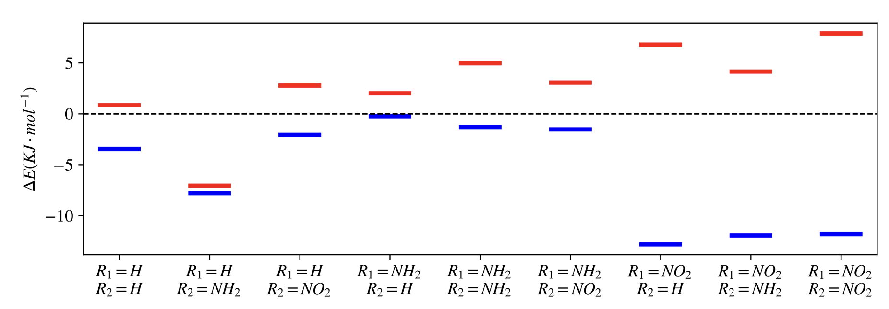

# Week n+13

## Monday 27/9

### What I did today:

* I decided that I want charged of each of the derivatives, so I'm optimising them in ORCA and and will use Multiwfn to get their charges
* In this porcess I realised that the geometry for the $\ce{NO2-NH2}$ geometry was actually just $\ce{NO2-H}$, so I guess I have to re-do that :/

## Tuesday 28/9

### What I did today:

* After chatting with Michael, I've started to re-structure my thesis a bit, so that I can write more of a combined methods and results section.
* Since all the TS geometry have been completed, I've rendered out those as a pretty figure
* Woo! I'm making progress on my writing!!! I'mma make a writing matrix to keep track of how I'm going
* I've gotten my results from the ba21t job, and I have a sneaky negative frequency in there... normally I wouldn't care too much, but my transmission coefficient is at 13.4, so the reaction is pretty much instantaneous. I'm not particularly happy with that assessment, so I'm doing a full hessian guided optimisation to see if it comes down a bit
* I'm getting a bit desperate, so I'm running a crest job to see if I can find a more stable configuration of ba22r as well :expressionless: 

## Wednesday 29/9

### What I did today:

* Second dose AZ :smile:
* Finished the first draft of $F_Z$
* Put a lot of work into figuring out the Wigner transmission coefficient approximation, only to find that it didn't fix my problem anyway

## Thursday 30/9

### What I did today:

* Since the benchmarks are all done, I'm removing that matrix from my notes
* Working on the CPCM section was interesting, as all of the figures that I had used ended up being replaced by new ones that served the narrative a bit better
* I've completed the field scans sections, but I'm not sure that I'm saying enough there. I just don't really know what I have to say to say about it. I think that In general I should consider this primarily a methods writeup and I can come back to flesh out the discussion components a bit later.
* I've been trying to understand the mechanisms behind the derivatives, and I've reached a point where I think I know what's going on, but I'm creating some EDDs to try and double check the logic.

## Friday 1/10

### What I did today:

* EDDs finished last night at like 10pm, so I've left them till this morning to interpret. Preliminary results seems to support my theories about how they're working though! 
* I got pretty distracted getting PyMOL running with openVR...
* Trying to figure out these derivatives...
  * I think I got them sorted in the notes below, and have made some generalisations about how they work.

{: style="width: 70%; "class="center"}

#### Notes table

| System                              |   Effect on *S* relative to H-H    |   Effect on *R* relative to H-H    | *S*                                                          | *R*                                                          |
| ----------------------------------- | :--------------------------------: | :--------------------------------: | ------------------------------------------------------------ | ------------------------------------------------------------ |
| $\ce{R1 = H, R2 =  H}$              |                 -                  |                 -                  | - helps hybridisation ($\ce{N->\beta}$)                      | - prevents hybridisation                                     |
| $\ce{R1 = H, R2 =  NH2}$            | ⬇︎ | ⬇︎  | - makes C more electrophilic ($\ce{\beta->\pi}$)             | - makes C more electrophilic ($\ce{\pi->\beta}$)   - makes N more nucleophilic ($\ce{\pi->N}$) |
| $\ce{R1 = H, R2 =  NO2}$            | ⬆︎  | ⬆︎ | - Helps hybridisation ($\ce{N->\beta}$) - makes C less electrophilic (systematic) ($\ce{\beta->NO2}$) | - makes C less electrophilic (systematic) ($\ce{\beta->NO2}$) - prevents hybridisation |
| $\ce{R1 = NH2, R2 =  H}$ (reversed) | ⬆︎  | ⬆︎ | - flipped  - Pushes electron density back onto the cyclising amine | - flipped  - makes C less electrophilic ($\ce{O->\pi->\beta}$) |
| $\ce{R1 = NH2, R2 =  NH2}$          | ⬆︎  | ⬆︎ | - flipped  - Pushes electron density back onto the cyclising amine (more available than in NH-H) | - makes C less electrophilic ($\ce{O->\pi->\beta}$)          |
| $\ce{R1 = NH2, R2 =  NO2}$          | ⬆︎  | ⬆︎ | - Helps hybridisation ($\ce{N->\beta}$)                      | - prevents hybridisation                                     |
| $\ce{R1 = NO2, R2 =  H}$            | ⬇︎ | ⬆︎ | - Helps hybridisation ($\ce{N->\beta}$)                  | - prevents hybridisation - Negative charge accentuates OEEF |
| $\ce{R1 = NO2, R2 =  NH2}$          | ⬇︎ | ⬆︎ | - Helps hybridisation ($\ce{N->\beta}$)                  | - prevents hybridisation - Negative charge accentuates OEEF |
| $\ce{R1 = NO2, R2 =  NO2}$          | ⬇︎ | ⬆︎ | - Helps hybridisation ($\ce{N->\beta}$) makes C less electrophilic (systematic) ($\ce{\beta->NO2}$) | - prevents hybridisation - Negative charge accentuates OEEF - makes C less electrophilic (systematic) ($\ce{\beta->NO2}$)makes C less electrophilic (systematic) ($\ce{\beta->NO2}$) |

- General trends:
  - $\ce{R2}$ has more effect on the *R* isomer than the *S*
    - Effects in the order of $\ce{NH2<H<NO2}$
  - $\ce{R1}$ has more effect on the *S* isomer than the *R*
    - Effects also in the order of $\ce{NH2<H<NO2}$
  - Both $\ce{R1}$ and $\ce{R2}$ on their own, with normal $F=Z/-Z$ (where the other $\ce{=H}$) causes splitting to occur with *S* decreasing in energy and *R* increasing
- General mechanisms:
  - *S*
    - Helps hybridisation ($\ce{N->\beta}$)
    - Makes C more electrophilic ($\ce{\beta->\pi}$)
    - When OEEF flipped, Pushes electron density back onto the cyclising amine
  - *R*
    - Prevents hybridisation
    - Makes N more nucleophilic ($\ce{\pi->N}$)
    - When $\ce{R2=NO2}$, makes C less electrophilic (systematic) ($\ce{\beta->NO2}$) 
    - When $\ce{R1=NO2}$, engative charge accentuates OEEF
    - When OEEF flipped, makes C less electrophilic ($\ce{O->\pi->\beta}$)

#### Writing Matrix

| Section                | Status                                                       | Notes                                                        |    In Progress     |
| ---------------------- | ------------------------------------------------------------ | ------------------------------------------------------------ | :----------------: |
| Abbreviations          | Later                     |                                                              |                    |
| Abstract               | Later                     |                                                              |                    |
| Intro                  | Second draft done          |                                                              |                    |
| Computational details  | First draft done           |                                                              |                    |
| Reaction benchmarking  | To do                     |                                                              |                    |
| Static $F_Y$           | First draft done           |                                                              |                    |
| Static $F_Z$           | First draft done           |                                                              |                    |
| Static $\varepsilon_r$ | First draft done           |                                                              |                    |
| Efield Scans           | First draft done           | I'm not sure what else to add here, but it feels weak.       |                    |
| EDD maps               | First draft done           | perhaps needs a discussion of the implication of these mechanisms? |                    |
| Relaxed $\vec F$       | To do                     |                                                              | :white_check_mark: |
| Derivatives            | First draft done           |                                                              |                    |
| Conclusion             | Later                     |                                                              |                    |
| Acknowledgements       | Later                     |                                                              |                    |
| Appendices             | Later/WIP |                                                              |                    |
