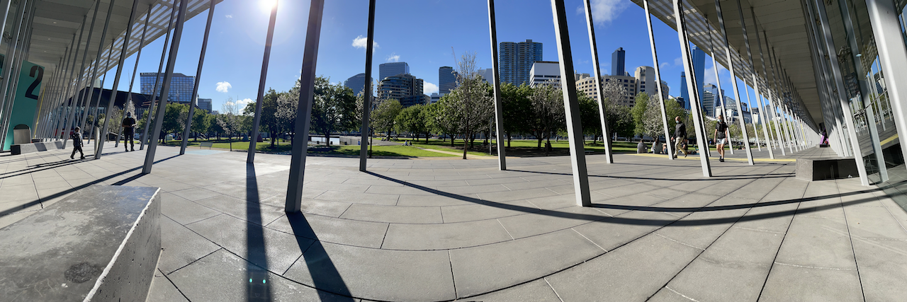
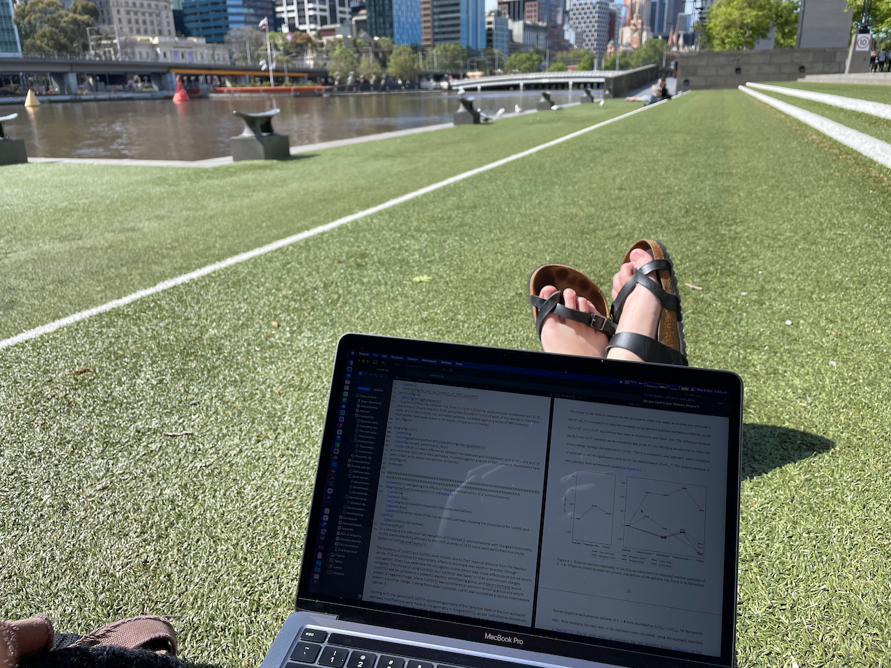
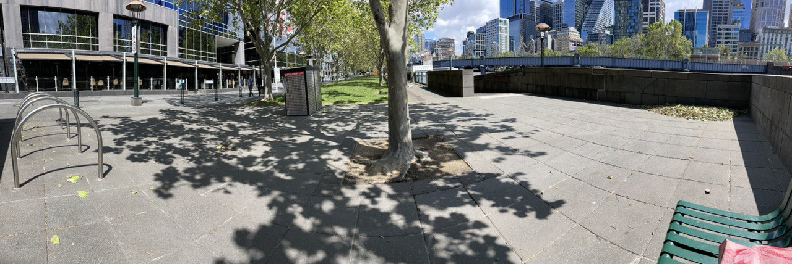

# Week n+14

## Sunday 3/10

### What I did today:

* Plonked in the city and did some work on the derivatives section.

{: style="width: 100%; "class="center"}

## Monday 4/10

### What I did today:

* Meeting with Katya resulted in me doing more calculations, which I think were actually really helpful. I ended up doing the point charge perturbative calculations that I suggested that I should do in my thesis, and they've actually proved really good for identifying what is caused by through bond, and what s electrostatic only.
* I've mostly spent my day just working on that section as a result though, which I really need to work on my benchmark stuff as well.

## Tuesday 5/10

### What I did today:

* It's been a busy day working on the benchmarking section, and I'm still going. These's a LOT to talk about, and I've just started to pick apart the processes.

## Wednesday 6/10

### What I did today:

* I decided to go and sit in the city and do some writing, and I worked on getting out the reaction benchmarking section. There's still a little bit left to go, but I did add a few things of note.
  * Namely, I looked into the correlation between transition bond length and barrier height, and I looked to see how much an increase in temperature would result in an ioncrease in rate.

{: style="width: 70%; "class="center"}

## Thursday 7/10

### What I did today:

* Plonked in the city again to get some more writing done

{: style="width: 100%; "class="center"}

* Okay, I just finished my first draft of the benchmarking section which has turned out to be 11 pages long, which considering it's the pre-investigation, is pretty chunky. I guess it's time to finally get to work on the "Relaxed $\vec F$" section, then hopefully I can just cull the discussion bits for Mike, and focus on my presentation.

## Friday 8/10

### What I did today:

* I've finally submitted my mid-year report, so I even though I haven't finished the "Relaxed $\vec F$" section, I should really just start to work on my presentation.
* Well I'm working on my presentation, and it's about as hard as I suspected it might be. I think it's going to be a long weekend for me to get this done in time for Monday
* I think I have a basic plan/outline for my presentation now, I just need to flesh it out.

#### Writing Matrix

| Section                | Status                                                       | Notes                                                        | In Progress |
| ---------------------- | ------------------------------------------------------------ | ------------------------------------------------------------ | :---------: |
| Abbreviations          | Later                     |                                                              |             |
| Abstract               | To do                     |                                                              |             |
| Intro                  | Second draft done          |                                                              |             |
| Computational details  | First draft done           |                                                              |             |
| Reaction benchmarking  | First draft done           |                                                              |             |
| Static $F_Y$           | First draft done           |                                                              |             |
| Static $F_Z$           | First draft done           |                                                              |             |
| Static $\varepsilon_r$ | First draft done           | more discussion tying together all of the static scans?      |             |
| Efield Scans           | First draft done           | I'm not sure what else to add here, but it feels weak.       |             |
| EDD maps               | First draft done           | perhaps needs a discussion of the implication of these mechanisms? |             |
| Relaxed $\vec F$       | To do                     |                                                              |             |
| Derivatives            | First draft done           |                                                              |             |
| Conclusion             | To do                     |                                                              |             |
| Acknowledgements       | Later                     |                                                              |             |
| Appendices             | Later/WIP | should I add in lists of partial charges?                    |             |
