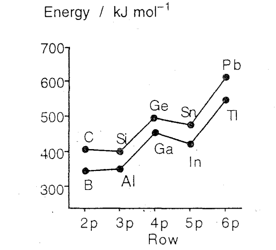

# Inert Pair Effect

p-block compounds typically contain p-block elements in a single oxidation state, which will often be oxidation states +3 or +4. This means that all of the S and P valence electrons will be involved.

As we know from carbon, this means that the p and s orbitals will hybridise to become degenerate, however as we descend the period, the involvement of the S electrons in bonding becomes decreased. 

!!! info "example"
	As we go down group 14, we cam see that the typical oxidation states go $\ce{Si^{IV}, Ge^{IV},Sn^{IV\:(and \:II)},Pb^{II\:(and\:IV)}}$

This can be boiled down to a number of effects

### 1. Relativistic Effects
$$
\begin{align}
Where:\\
v&=\text{velocity}\\
C&=\text{speed of light}\\
m&=\text{relativistic mass}\\
m_0&=\text{non-relativistic mass}\\
\\
m&=\frac{m_0}{\sqrt{1-\frac{v^2}{C^2}}}
\end{align}
$$
!!! info "Example"
	for $Pb, v=0.6C; m=1.25 m_0$

As we decrease the period of the p-block, the nuclear charge $Z$ increases significantly, going from $5-10\:au$ all the way to $81-86 \:au$ as the bottom of the block. While holistically, this is balanced by the negative charge of the electrons, in practice, internal electrons such as the 1s electrons will be so strongly effected due to Coulomb's law ($F=k\frac{q_1q_2}{r^2}$) that the forces result in huge amounts of kinetic energy, causing the electron to move faster.

Using the relativistic mass equation, this causes the electron to get much heavier, causing the orbital to contract inwards toward the nuclei. This effects internal electrons more than outer electrons for a number of reasons, including:

* As the principal quantum number of the s function increases, the amount of electron density localised closer to the nucleus is decreased.
* The further out the electron resides, the more screening there will be of the nucleus from the electron
* The charge of the nuclei decreases at a rate of $r^2$, and will thus have less of an effect on further bound electrons

{: style="width: 50%; "class="center"}

This does, however, have the effect of contracting other s-electrons, as there will be a knock on effect, allowing the outer electrons to reside closer to the nucleus.

### 2. s$\to$p Promotion Energies

Relativistic (and other) effects cause the energy gap between the s and p orbitals to increase, meaning that there will be more of an energetic requirement to get them to hybridise and the hybridised product will ultimately be less thermodynamically stable.

{: style="width: 30%; "class="center"}

### 3. Decreasing Covalent Bond Strength

As the orbitals get larger, and more diffuse, it becomes harder for them to get significant electron overlap in bonding, that would be stabilising. This means that the split between the bonding and antibonding orbitals decreases as the atoms get larger.

If the bonds get weaker *and* the s$\to$p promotion energy increases, the energy that is expended in hybridising the orbitals is not recovered in forming new bonds, causing them the be less stable and less likely to form.

