# Group 13

Main group elements are considered to be less interesting that d-block elements, as they tend not to be coloured, don't have as many interesting oxidation states (and thus aren't as catalytic), though they are making a comeback due to their sheer abundance and their relative low toxicity, considering how expensive it can be to clean up transition metals from pharmaceuticals (up to 50% of the cost of the drug).

D-block elements have so many oxidation states due to the number and degeneracy of the d-type orbitals, which allows electrons to be taken out and put in without drastically changing their electronic energy

## $\ce{Al^{I}}$ and $\ce{Ga^{I}}$ Halide Chemistry

In their natural form, Al and Ga will want to form into their +3 oxidation state. In the gas phase, this form will dimerise, with the empty p-orbital accepting a lone pair from the chlorine 

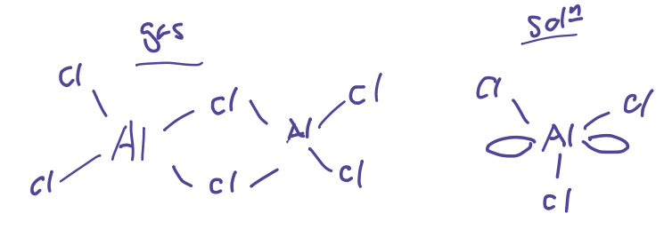{: style="width: 40%; "class="center"}

In their +1 oxidation state though, group Al and Ga can be considered Lewis amphoteric, that is, they can act as both a lewis acid ($e^-$ donation into the empty p-orbitals) and can act as a Lewis base (donating their LPE to another species). they are however extremely electron deficient and are very electrophilic in this state.

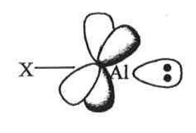{: style="width: 20%; "class="center"}

## Disproportionation of $\ce{Al^IX}$

Formally: when a substance is both oxidised and reduced simultaneously in a reaction

For the sake of this unit, we'll think of the reaction:

$$
\begin{gather}
\ce{Al^ICl->[rt]Al^{III}Cl3 + 2Al^0_{(s)}}\\
\ce{Al^ICl<-[\Delta\:(900^\circ C)]Al^{III}Cl3 + 2Al^0_{(s)}}
\end{gather}
$$

So some of the decomposition will spit out aluminium metal and some will form the more stable $\ce{Al^{III}X3}$ form.

While this reaction will thermodynamically happen in the forward direction, the process is working to enthalpically decrease entropy, so if we increase the temperature, we can use entropy to drive the reaction backwards ($\Delta G = \Delta H-T\Delta S$).

## Synthesis of $\ce{M^IX}$

$$
\ce{M_{(l)} + HX_{(g)} ->[\Delta \gt 900^\circ C)] M^IX_{(g)} + 1/2H2_{(g)}}
$$

To synthesise this, the old school method uses a stainless steel drum as a reactor, engulfed in a bath of liquid $\ce{N2}$.

The reaction is performed under vacuum and occurs in two stages.

1. The metal is heated in a crucible to temperatures above $900^\circ C$, and $\ce{HX}$ gas is bubbled through it. This causes the $\ce{M^IX}$ to form and condenses on the surface of the inverted bell jar.
2. The liquid nitrogen is then removed and the $\ce{M^IX}$ flows down into a receiving vessel to be collected.

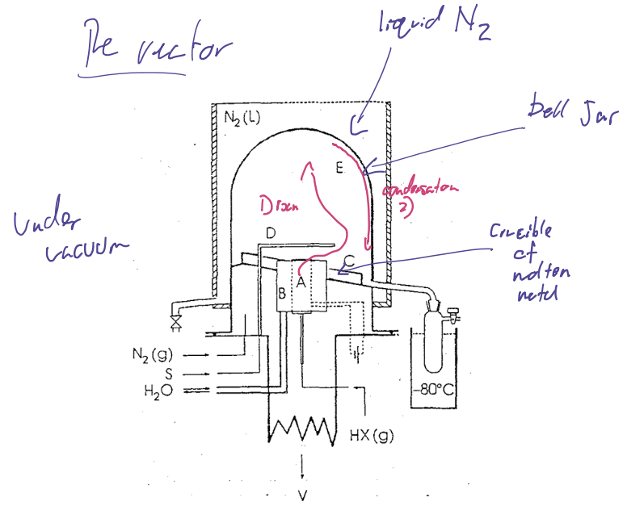{: style="width: 70%; "class="center"}

## Stabilising the $\ce{M^IX}$

This product however is not particularly thermodynamically stable in its current form and will disproportionate back. We can stabilise it kinetically using bulky ligands (Lewis bases, such as $\ce{NMe3}$ and $\ce{OEt2}$).

This product is only *meta*stable though, and will disproportionate through multiple stages at temperatures $\gt 95^\circ C$.

### 1. Stabilised form

The stabilised form is a ring of $\ce{Al^I}$ with ligands acting as Lewis bases, forming dative bonds to the unoccupied p-orbitals. This now gives the aluminium a full octet, making it more stable.

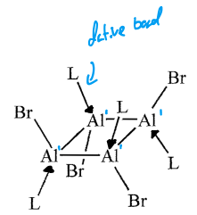{: style="width: 20%; "class="center"}

### 2. $\ce{Al^{II}}$ Intermediate

The first oxidation state to drop out is the +2 oxidation state, which has the following geometry. Each metal atom has taken on another halide, and thus has increased its oxidation state.

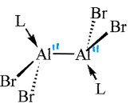{: style="width: 20%; "class="center"}

### 3. $\langle\ce{Al^{0.91}}\rangle$ Intermediate

As we keep disproportionating our $\ce{M^IX}$, we'll end up with complexes with a mix of oxidation states. This one occurs form the reaction:

$$
\ce{Al4Br4(THF)4 ->[\Delta] Al22Br20(THF)10}
$$

The average oxidation state for this complex is $\frac{20}{22}=0.91$, however the complex is made up a combination of "naked" aluminium ($\ce{Al^0}$) and $\ce{Al^II}$.

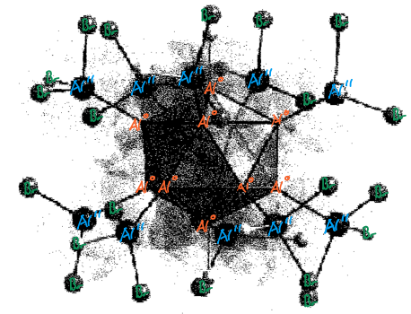{: style="width: 40%; "class="center"}

### 4. $\langle\ce{Ga^{1.4}}\rangle$ Intermediate

This is another decomposition product, this time, of the reaction:

$$
\ce{[Ga^ICl(OEt2)]4 ->[-30^\circ C]}
$$

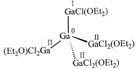{: style="width: 20%; "class="center"}

## Stabilising Them in Practice

To actually get the stabilised form, there are two main methods:

#### 1. Salt metathesis (old method)

Using the $M^IX$ produced in the reactor, we can do a transmetallation of the bulky ligand to stabilise the product
Here, $\ce{M''} = \ce{Li, K,}$ etc.

$$
\ce{M'^IX + RM'' ->[transmetallation] RM'^I + M''X}
$$

#### 2. Reduction (preferred method)

Using strong reducing agents like alkali metals, if we use bulky enough ligands, we can form the correct product in a single reaction.

$$
\ce{RM^{III}X2 + K_{(S)} ->[{[R]}] RM^I + KX}
$$

### Using the Cp* ligand

The cyclopentadienyl (Cp*) ligand is a really useful one that bonds in an $\eta^5$ fashion (it coordinates to 5 atoms simultaneously). It's particularly good as it is flat and acts like a little shield.

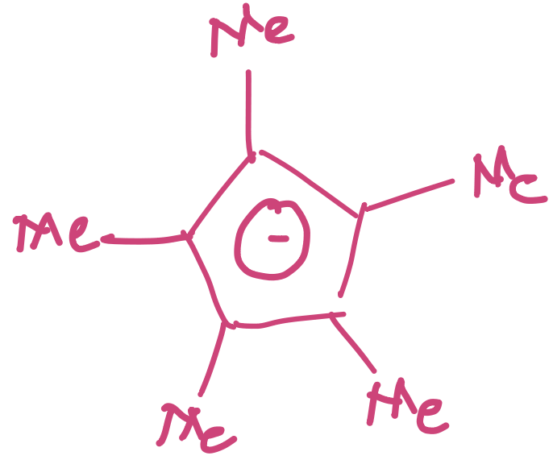{: style="width: 15%; "class="center"}

Depending on the group 13 metal though, they will take on a different geometry

### Thallium-Cp* (ionic)

Thallium forms an ionic linear polymer complex, with Cp* coordinating with two thalliums atoms and two thalliums coordinating with two Cp* molecules. This complex is very stable, so much so that it can be made in water

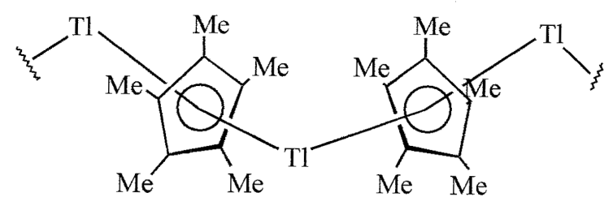{: style="width: 30%; "class="center"}

### Indium/Gallium-Cp* (vdW)

Both indium and gallium form octahedral cages with Cp* on the outside. These are formed primarily from vdW interactions and as a result have long/weak bonds

|                        Indium-CP                         |                        Gallium-CP                        |
| :------------------------------------------------------: | :------------------------------------------------------: |
| 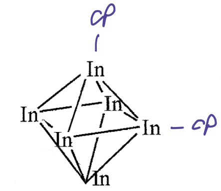{: style="width: 50%; "class="center"} | 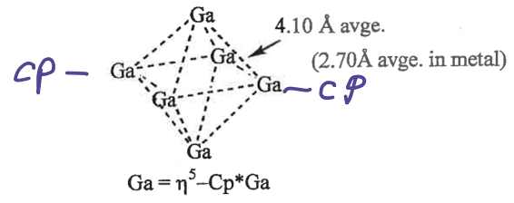{: style="width: 70%; "class="center"} |

### Aluminium-Cp* (covalent/dative)

Aluminium is a bit different. Due to the inert pair effect, it forms tetrahedral cages, due to the s-p gap being small enough that the orbitals can hybridise, resulting in the formation of efficient dative bonds in the 'Lewis amphoteric' (electron donor *and* acceptor) like manner.

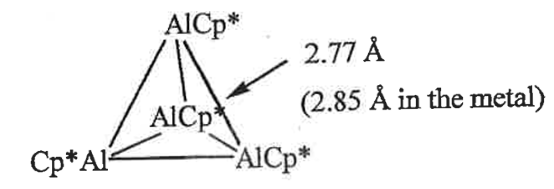{: style="width: 20%; "class="center"}

This can be seen quite effectively in the MO diagram below, where by combining the Al-Cp* monomers, into a tetramer, the occupied sp hybridised orbitals split into bonding and non-bonding degenerates, giving a bond order of 0.5 between the complex but once the unoccupied p-orbitals split and mix, the non-bonding sp-orbitals are now more energetically stable than in their monomeric form, resulting in a thermodynamically stable complex and a bond order of 1.

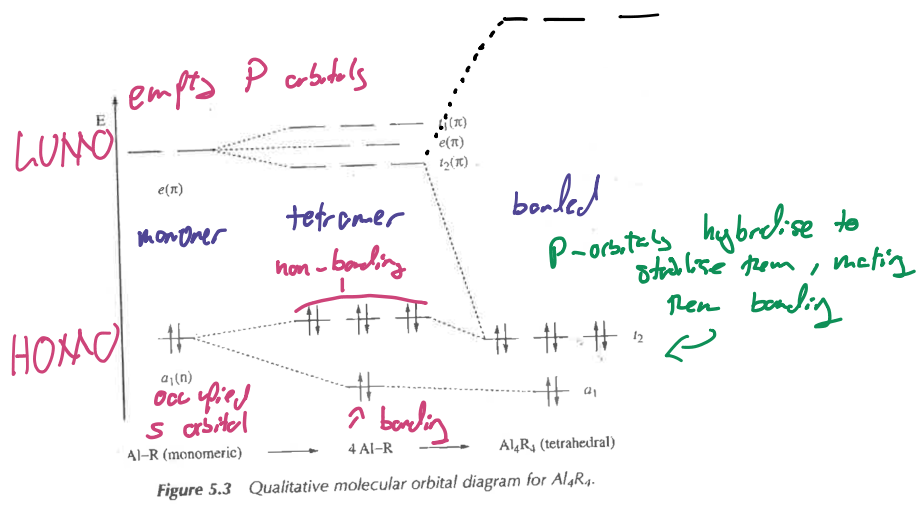{: style="width: 70%; "class="center"}

Some potential bulky ligands that we can use to stabilise these complexes are:

|                          Terphenyl                           |                           "Trisyl"                           |                          $\ce{N''}$                          |                        "super-silyl"                         |
| :----------------------------------------------------------: | :----------------------------------------------------------: | :----------------------------------------------------------: | :----------------------------------------------------------: |
| 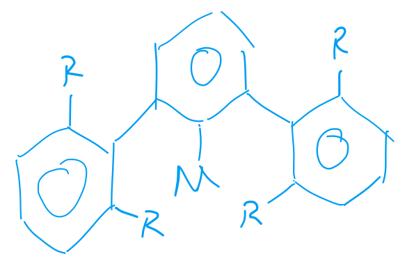 | 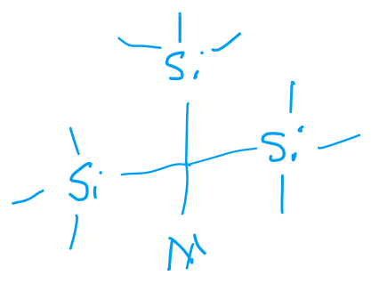 | 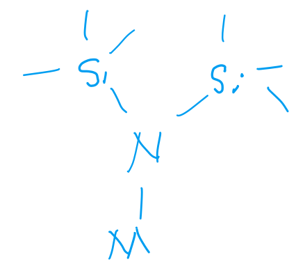 | 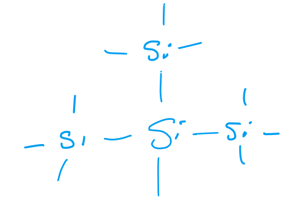 |
| $\begin{gather}\ce{R=^tBu, ^iPr, Me}\\\ce{Ar^* = ^iPr}\end{gather}$ |                                                              |                                                              |                                                              |

## Metathesis Complexes

Using the salt metathesis method, Schnerkel tried to stabilise his $\ce{Al^II}$ that he formed from his reactor salt metathesis in the following form

$$
\ce{Al^II + LiN'' -> AlN'' + LiI}
$$

While he did probably get some of the $\ce{AlN''}$ forming what he extracted instead were crystals of $\ce{-> [Al77N''20]^{-2}[Li-I-Li]+}$. 

This gives us an interesting nested structure made of multiple layers of our aluminium, that he described as a **"metal cutout"**:

* Internally we have a single, naked $\ce{Al^0}$ atom, surrounded by an icosahedron made of $\ce{12Al^0}$
* Then we have a layer of $\ce{40Al^0}$
* Followed by a layer of $\ce{20(Al^I-N'')}$

This had an average oxidation state of $\frac{20-2}{77}=0.23$ and is thus being very close to metallic Al metal. The reason that there are so few atoms in the last shell, is that the $\ce{N''}$ ligand will sterically prevent them from aggregating.

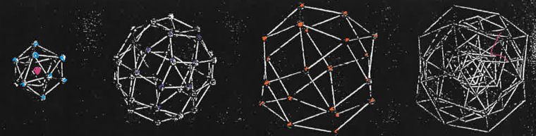{: style="width: 70%; "class="center"}

If you did this with Ga, you'd get the $\ce{Ga^IN''}$ monomer, which would decompose to the $\ce{88Ga}$ metal cutout as an $\ce{N''}$, though in the middle you'd get a $\ce{Ga-Ga}$ bond.

## Coordination Chemistry of $\ce{M^IR}$

Much like $\ce{CO}$ we could assume that because or $\ce{M^IR}$ complex has a similar MO configuration (isolobal), it would bond as a ligand in a similar fashion, that is, the LPE donating into a free orbital, forming a σ bond and a d-orbital back donating into an empty p-orbital on out complex as a π bond.

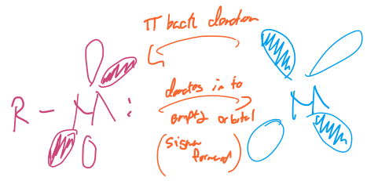{: style="width: 30%; "class="center"}

### Is this what happens?

The first question that we can ask, is "does it act like the $\ce{CO}$ ligand with transition metals", and as we can see, yest it does. It forms tetrahedral structures coordination with $\ce{Ni}$

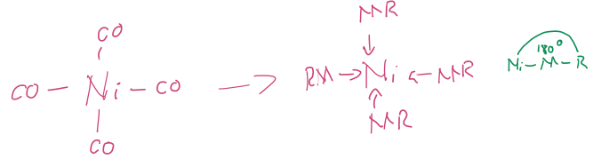{: style="width: 50%; "class="center"}

And it can act as a bridging ligand with $\ce{Fe}$

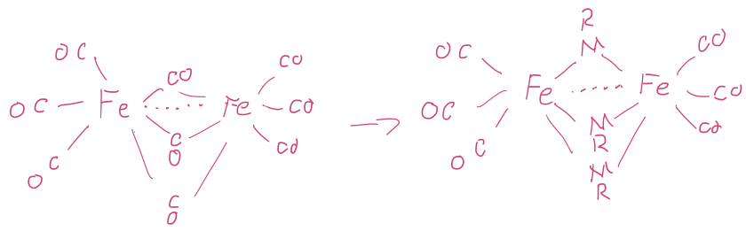{: style="width: 50%; "class="center"}

### How to Make These Compounds

1. Ligand displacement - Kicking off one ligand to bind another one
   * $\ce{Fe2(CO)9 + Cp^*Ga^I -> Fe2(CO)6(GaCp^*)3 + CO}$
2.  Redox salt elimination
   * $\ce{Ar^*Ga^{III}Cl2 + Na2[Fe^{-II}(CO)4] -> Fe^0(CO)4(Ar^*Ga^I) + NaCl}$

### Structure and Bonding

#### Robinson's Proposal

Robinson thought that this complex had so much back bonding going on, that he considered the complex to he a "ferrogallyne", as $\ce{Ar^*Ga#Fe(CO)4}$

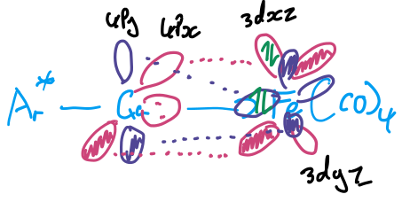{: style="width: 40%; "class="center"}

* 2 $\pi$ bonds, $\ce{Fe -> Ga}$ $4p^y\to3d^{yz}/4p^z\to3d^{yx}$ (acid)
* 1 $\sigma$ bond $\ce{Ga -> Fe}$ (base)

But is the gallium really acting as a Lewis acid as well?

#### Al Cotton's Rebuttal

Consisted of three specific arguments:

1. The bond lengths of the complex weren't short enough to be a triple bond ($2.225\AA$)

2. Comparing the FTIR spectrum of the compound and comparing it to a weak Lewis, $\pi$ acid ($\ce{Ph3P}$) (known not to accept a large amount of backbonding)

   * The logic goes that if there is lots of backbonding going on, then there will be less electron density on the Fe to backbond into the $\pi^*$ (antibonding) orbitals of the CO, making it's bonds stronger. We see the opposite of this though. the bonds get weaker, implying that the gallium is accepting even *less* electron density back from Fe...

.png){: style="width: 60%; "class="center"}

| $\ce{(Ar^*Ga)Fe(CO)4}$ | $\ce{(Ph3P)Fe(CO)4}$ |
| :--------------------: | :------------------: |
|          2030          |         2052         |
|          1959          |         1979         |
|          1941          |         1947         |
|          1292          |                      |

   

3. DFT calculations show that there is VERY little d-orbital electron density being backdonated from the $\ce{Fe->Ga}$.

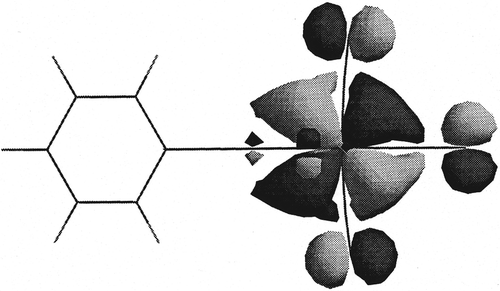{: style="width: 30%; "class="center"}

We can also see a very strong $\sigma$ bond between the Ga and Fe, which validates that we are getting $\sigma$ LPE donation.

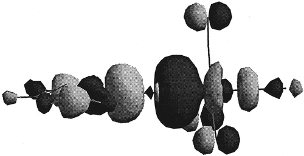{: style="width: 30%; "class="center"}

### The Takeaway

G13 metals in the +1 oxiadation state are just really good Lewis bases, bud don't have back donation.

## G13-G13 Multiple Bonds

Werner Uhl experimentally made these $\ce{R2M^{II}-M^{II}R2}$ systems which are planar, by using a salt elimination. These metal atoms are sp2 hybridised which means that they have an empty p-orbital that are in phase, but are unnocupied and thus are non-bonding despite having the potential to be bonding.

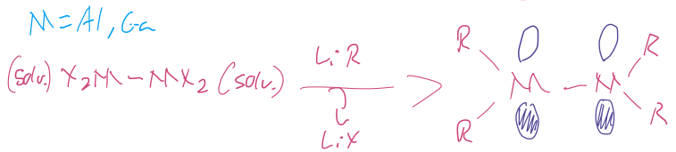{: style="width: 50%; "class="center"}

Uhl noticed this and figured that by reducing the compund with a strong reducing agent (alkali metal), he could occupy the empty p-orbitals and create a new $\pi$ bond. He only managed to singly reduce the compound though, so it's instead a paramagnetic, singly occupied compund, with a bond order of 1.5 (one and a half bonds).

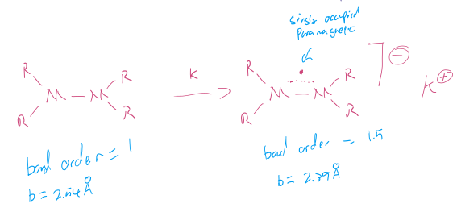{: style="width: 50%; "class="center"}

Robinson, by accident whilst trying to form the $\ce{(Ar^*Ga^I)-}$ compound, accidentally ended up forming this "digallyne" species. It likely formed the $\ce{(Ar^*Ga^I)-}$ as an intermediate and was over-reduced with excess sodium (since it has empty p-orbitals) to form the new species. Robinson thought that it had a $\ce{Ga#Ga}$ triple bond, but the species was trans bent.

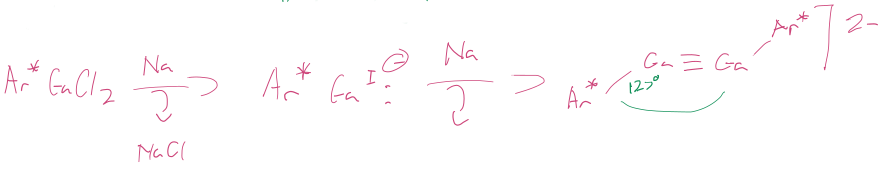{: style="width: 70%; "class="center"}

To have comparable bonding to an alkyne, it needs an extra two electrons, and thus has a -2 charge. There's one big issue though, due to the inert pair effect, hybridisation doesn't happen quite so easily, and so the energy required to promote one of the doubley occupied s-orbital electrons to a new p-orbital is too great, and isn't recovered in the formation of the bond itself, so instead the perpendicular p-orbitals overlap to form two dative bonds and one $\pi$ bond orbitals without a $\sigma$ orbital

|                        Alkyne bonding                        |                   Digallyne trying to bond                   |                      Digallyne bonding                       |
| :----------------------------------------------------------: | :----------------------------------------------------------: | :----------------------------------------------------------: |
| The alkyne forms from two quartet (multiplicity 4) $\ce{CH}$ fragments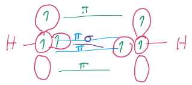{: style="max-height: 100px; "class="center"} | The digallyne forms from two doublet $\ce{GaAr^*}$ fragments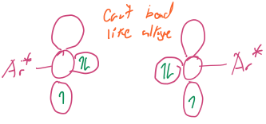{: style="max-height: 100px; "class="center"} | Forms two dative bonds, one $\pi$ bond and no $\sigma$ bonds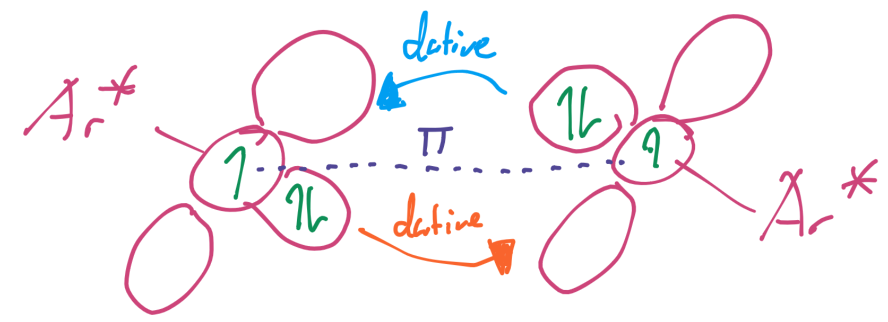{: style="max-height: 100px; "class="center"} |

### Cotton and Cowley

Ran DFT calculations to see what was actually happening and realised that the molecule actually had 1 $\sigma$ bond, 1 $\pi$ bond and 1 non-bonding orbital. This will be discussed further for group 14.

This instead forms this trans bent system, with $\ce{Na+}$ couterions

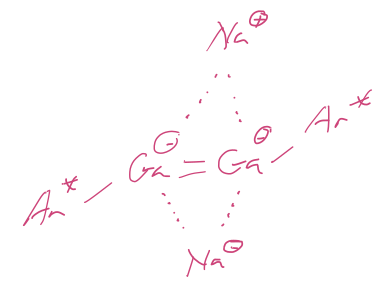{: style="width: 30%; "class="center"}