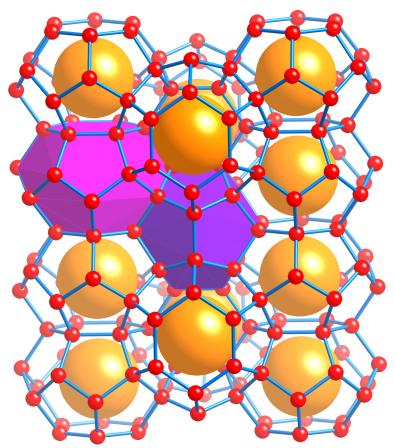
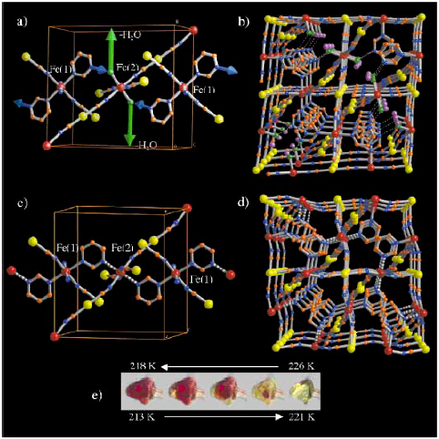
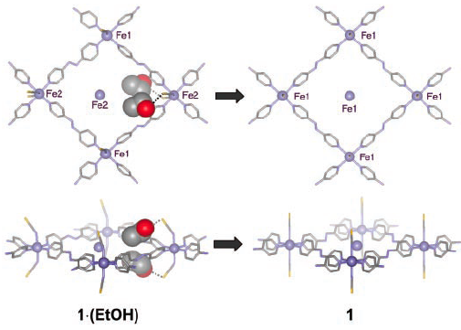
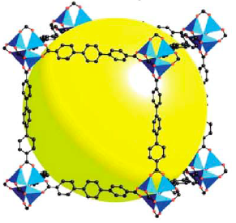
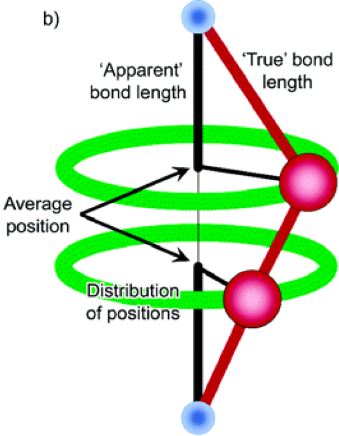

# Crystal Engineering Applications

## Clathrates

Are "inclusion compounds", where the **host lattice** forms a cage around the guest molecules, trapping them. These are crystalline analogues of the supramolecular host-guest complexes, and are also known as **inclusion compounds**. The host lattice may or may not be templated by the guest molecules and may or may not be stable without them.

### Clathrate Hydrates

Are water hosts with small molecule guests, such as methane, ethane, $\ce{CO2}$, Ar. Without guests, ice forms into a hexagonal structure, but due to the presence of the guest molecules, the water H-bonding network is disrupted and forms cages that encapsulate the guests.

{: style="width: 40%; "class="center"}

These clathrate hydrates can form anywhere that water exists in high pressures and low temperatures, and can be a real problem in gas lines through the arctic circle. They can trap methane and cause blockages in the pipeline that can cost up to $1B each year to prevent and remove.

## Ureas and Thioureas

Ureas and thioureas form chiral, hydrogen bonded hexagonal tubes in which narrow guests can be intercalated. All of the H-bond donors and acceptors in the molecule are used in the network, so there are only weak vdW interactions between the host and guest. The removal of the guest results in the collapse of these structures.

## Pharmaceuticals

Are prone tot he formation of polymorphs, hydrates and solvates, which can vary greatly in their physical properties, making them better or worse at serving their function from a medical perspective. By forming co-crystals with the pharmaceuticals, the resulting formulation could be more effective (solubility, stability, enantioselectivity, preventing polymorphism, ease in processing, etc.)

## Magnetism

For potential magnets, their magnetic properties are based on their ability for the unpaired electrons for neighbouring atoms to couple. This is a short range effect and thus requires specific geometry to be accomplished. By using coordination compounds, magnets can be produced that have specific properties, such as being less dense, transparent and somewhat porous, whilst also being easier to synthesise and having soluble precursors.

Magnets can also be made stronger by using linkers which themselves can magnetically couple. For example The tetracyanoethylene radical ($\ce{TCNE^.-}$),

<iframe style="width: 50%; height: 300px;" frameborder="0" src="https://embed.molview.org/v1/?mode=balls&cid=12635" class="center"></iframe>

## Sensing

Since the molecular properties of the material are intrinsically tied to its geometry, it stands to reason that any environmental change that triggers a structural change will result in a change to the physical properties. This gives us an avenue to make sensing crystals.

This polymer changes colour and magnetic properties based on temperature, with magnetic coupling reversible increasing around a specific temperature range.

{: style="width: 40%; "class="center"}

This coordination polymer changes between a low and high spin state, as guest molecules coordinate with the $\ce{Fe^{II}}$ centres, causing a change in magnetic properties and colour.

{: style="width: 40%; "class="center"}

## Zeolites

Are naturally forming minerals with highly porous structures that are primarily made of aluminium and silicon, bridged by oxygen atoms. If the $\ce{Si-O-Si}$ linkers are replaced be $\ce{M-L-M}$ linkers, then the structure can be made even more porous.

## Gas Sorption

Related to the zeolites, $\ce{Zn4}$ clusters bridged by carboxylate ligands in an $\ce{\alpha-Po}$ (cubic) net can have a huge amount of internal space. Up to 91% of the volume of the crystal.

If packed into gas cylinders, these can be used adsorb gasses, which can increase the storage capacity by many times. This works by slowing down the gas particles enough to be packed in much closer.

{: style="width: 40%; "class="center"}

By using specialist linkers, such as benzene-1,3,5-tricarboxylic acid with copper, the resulting coordination polymer can specifically separate gas mixtures.

## Molecular Adsorption

Porphyrin based coordination polymers can be better st adsorbing large amounts of water (up to 78%(w/w) ) from organic solvents, which is faster, more efficient and more effective than currently used zeolite based molecular sieves. these can also be selective for particular solvent functionalities.

## Ion exchange

Porous coordination polymers can also be used for exchanging ions. This is particularly the case for counterions embedded within the pores, as they can be pushed out and replaced with other ions

## Chirality

Chiral zeolites are rare, but we can make chiral coordination polymers. These use chiral ligands and have topologies that are inherently chiral and can be used for chiral separations and chiral catalysis. For example, a racemic mixture of synthesised ionic ligands (for making chiral catalysts) could be run through the column, and based on the topology, only a certain chirality would bind to the polymer, selectively allowing only the other chirality ligands to pass through.

## Negative Thermal Expansion

If a crystal has linear linkers, it's possible for the linkers to rotate with kinetic energy. Since the kinetic energy is dependent on temperature, as the material heats up, the kinetic energy will increase, causing the atoms to spin faster. When this happens, they pull inwards causing the structure to contract, rather than expand.

These can be useful to either compensate for materials that thermally expand, or can be designed specifically not to thermally change in volume.

{: style="width: 40%; "class="center"}