# Supramolecular Chemistry

Supramolecular chemistry is the study of molecular assemblies and of the intermolecular bonds that occur between them. They can be classified into two main categories:

* Host-Guest Assemblies - the inclusion of one or more molecules within another
* Self-Assembling Systems - complex assemblies with multiple components

These systems are mainly made up of four types of interaction:

* Hydrogen bonds (directional electrostatics)
* $\pi$ interactions
* vdW interactions (much less useful here)
* Metal-ligand coordination bonds

## Association/Binding Constants

The affinity of a species to bind with another is measured by an association constant $K_A$ or $\log(K_A)$ , with the typical $K_A=\frac{[H:G]}{[H][G]}$ in units of $mol\cdot dm^{-3}$. Large constants indicate strong binding, and small constants indicate weak binding. In Host-Guest assemblies, this is called the binding constant.

Association constants are concentration and environment specific and thus cannot be compared between systems easily, though they can be influenced by altering the selectivity of the binding.

### Selectivity

The components that come together in a supramolecular assembly must be appropriate to be able to bind with each other (Lewis acids with Lewis base, H-bond donors with H-bond acceptors, etc.).

If there is an preference towards the binding of a particular class of molecules, there is said to be selectivity for that species. It can be enhanced by the use of:

* **Complementary** binding sites
  * The host and guest should come together in an induced fit (not lock and key)
* **Preorganisation** of the components to be bound together
* **Cooperativity** of multiple interactions working together

#### Cooperativity (chelate effect)

Species with multiple covalently connected binding sites form a more stable assembly than the same functionality without being bound together. This is due to the reduction in entropy for the reaction. In solution, there is no such thing as a truly naked atom, and so whatever will be coordinated to will have a solvation shell around it, comprising of multiple species. Swapping out those species for a single larger molecule will cause an increase in entropy, and decrease in free energy.

Ligands are described as dentate, according to the number of binding sites 

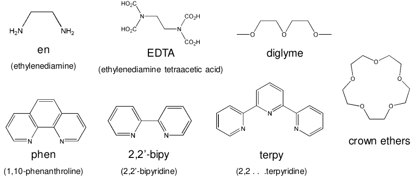{: style="width: 70%; "class="center"}

#### Preorganisation

A host that has the binding sites pre-arranged in the conformation of the host-guest assembly will have much stronger binding and is said to be **preorganised**. Heterocyclic macrocyles are typically used, resulting in this being called the macrocycle effect.

There is a certain amount of energy required to bring all the binding sites of the host together to coordinate with the guest, as the binding sites will like repel each other.

| Non-Preorganised Weaker binding | Preorganised Stronger binding  |
| :---------------------------------: | :--------------------------------: |
| 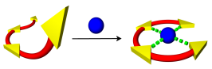  | 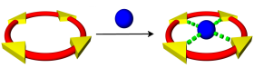 |

This effect is a product of both the increase in entropy and reduction in enthalpy. This results in the entropy and enthalpy cost being spent in making the macrocycles, rather than in the binding, making the binding much stronger ($\e{4}$)

* Entropy
  * Since linking the binding sites together will result in fewer degrees of freedom, there will be less of an entropic penalty on binding to the guest
* Enthalpy
  * The act of bringing the repulsive donor groups together increases the enthalpy, which is greatly reduced when binding occurs

Another consideration is the macrocycle naturally excludes a certain amount of solvent, leading to less "reorganisation energy" needing to be spent. This is more prevalent with polar solvents that may competitively bind to the host molecule

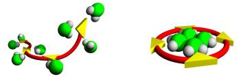{: style="width: 30%; "class="center"}

#### Thermodynamic Selectivity

Since the selectivity can be directly related back to the free energy change associated with the binding of the system ($\Delta G=-RT\ln(K)$), we can compare **them** to get a measure of selectivity between two different guests:
$$
\text{Thermodynamic Selectivity}=\frac{K_\text{guest 1}}{K_\text{guest 2}}
$$

## Types of Interaction

Interactions can be considered through many different means, beyond just their strength. Their directionality and selectivity are also important. Some important interactions include:

| Interaction                                    | Strength ($\kjmol$) |       Example        |
| ---------------------------------------------- | :-----------------: | :------------------: |
| Ion-Ion (non-directional)                      |       200-300       |  $\ce{[Cl][Bu4N]}$   |
| Ion-Dipole                                     |       50-200        |    Na [15]crown-5    |
| Dipole-Dpole                                   |        5-50         |       Acetone        |
| H-bonding                                      |        4-120        |                      |
| Cation-$\pi$                                   |        5-80         | $\ce{K+}$ in benzene |
| Anion-$\pi$ (for electron tight $\pi$ systems) |                     |                      |
| $\pi$-$\pi$                                    |        small        | Benzene and grpahite |
| Halogen bonding                                |                     |                      |

### Electrostatics

Can be broken down into three main interactions, all of which are based on the Coulombic attraction between charged species

* Ion-ion - very non-directional
  * Without other factors, there are largely not particularly useful for supramolecular chemistry
  * Since these have a longer falloff, these are typically the first interactions, though other weaker interactions will ultimately define the geometry of the complex
* Ion-dipole
  * Are based on the deformation of the electron density to form informal charges
  * Since the electron density has to shift to create the charge, the result will give a directional positive and negative pole, allowing for control over direction of attraction
  * Are useful for coordinating an ion in a larger host

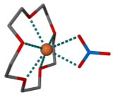{: style="width: 20%; "class="center"}

* Dipole-dipole - weak, but very directional
  * Are weaker than ion-dipole interactions due to having much less charge density
  * While individually they are weak, their directionality makes them exceptionally important for supramol
  * In aggreagation, their interactions can be quite strong
  
  |                         Face to face                         |                         End to face                          |
  | :----------------------------------------------------------: | :----------------------------------------------------------: |
  | 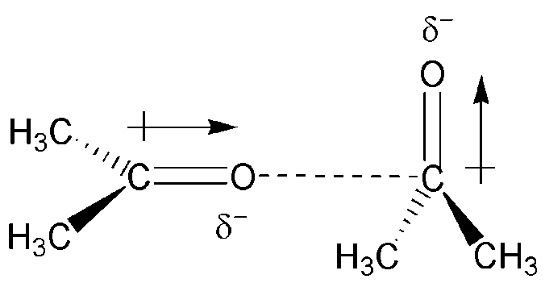{: style="max-height: 100px; "class="center"} | 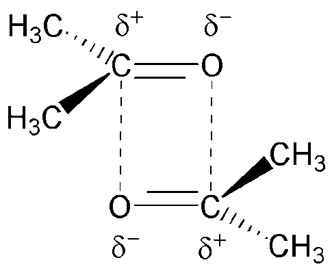{: style="max-height: 100px; "class="center"} |

### Hydrogen Bonds

The most important non-metallic interactions in supramol, they consist of a donor atom, that donates a hydrogen to the acceptor.

* Donors are any electronegative atom with an attached hydrogen
* Acceptors are any dipoles with electron withdrawing atoms that the hydrogen can interact with
  * Carbonyls, pyridyls, carboxylates, $\pi$ systems

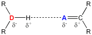{: style="width: 20%; "class="center"}

The combinations of these can come in multiple configurations sharing both acceptors and donors.

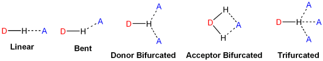{: style="width: 60%; "class="center"}

There can also be layers of **primary** and **secondary** interactions that can compete with or reinforce each other

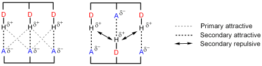{: style="width: 60%; "class="center"}

While hydrogen bonds can be classified by their directionality and length, to categorise their strength, it's not a great model to use.

### $\pi$ Interactions

Can come in the form of $\pi$-$\pi$, cation-$\pi$, or anion-$\pi$. Cation interactions are mostly for alkali and alkali-earth metals. if they involve transition metals they're typically too strong to be considered in this category. 

An example if this is that the interaction between $\ce{K+}$ and benzene are comparable with that of $\ce{K+}$ and water, but fewer benzene molecules can surround the potassium, so it has a lower overall solubility.

 $\pi$-$\pi$ interactions can either be edge to face, which is essentially a weak H-bond, or can be face to face, which is the $\pi$ cloud interacting with the backbone of the adjacent $\pi$ system.

### Hydrophobic Effects

Are the result of the exclusion of non-polar groups from aqueous media. These interactions can be both enthalpic (lower energy through less repulsion) and entropic (clustering of molecules together reduces the number of "holes" in the solvent)

### Metal Coordination

Metals are useful as structural components, since they can coordinate to multiple geometries, however they can serve extra function as well, such as for use in a catalytic complex.

The metal determines the geometry, however they won't always behave as expected during self-assembly

## Self-Assembly

Is the spontaneous coming together of several components to form a larger aggregate species. This typically means combining multiple components and letting them come together to form the most thermodynamically favourable species. This requires a huge amount of careful planning and foresight to be able to do correctly, and still will not have a guaranteed outcome.

### Self-Assembly Retrosynthesis

By reducing the structure of a molecular system down to basic shapes we can design it to form particular shapes. These shapes can be related to molecular analogues that can be combined to form the desired structures.

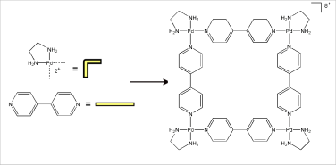{: style="width: 40%; "class="center"}

As with crystal engineering, the ligands and metals can be converging or diverging. If either species is convergent, then it will tend to form discrete species.

| Divergence                            |              Example               |
| ------------------------------------- | :--------------------------------: |
| Convergent metal Divergent ligand | 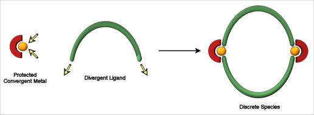 |
| Divergent metal Convergent ligand | 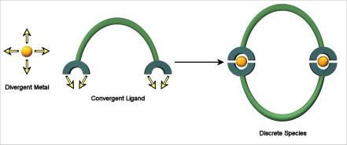 |
| Divergent metal Divergent ligand  | 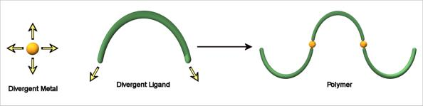 |

### Reversibility

During the self assembly process the kinetic products will form and will keep breaking apart and reforming until the thermodynamically most stable configuration is found. This allows for self-correction, but also means that it's far more likely to form small aggregate species that will come together to form the final product rather than the final product forming directly from solution.

### Hierarchical Assembly

Dictates that there is a hierarchy to which interaction will happen first in order of which interaction is the most stabilising. This means that a stronger interaction dictates the overall structure/connectivity of a system, and the secondary interactions will then shape the structure form there.

### Enthalpy/Entropy

* Enthalpic considerations mean that closed systems are preferable, as they will have more of the favourable interactions
* Entropic considerations prefers discrete entities over polymers

### Modification

**Directed self assembly** utilises a templating species to bring the components together. This can then be connected together using **post-modification**.

