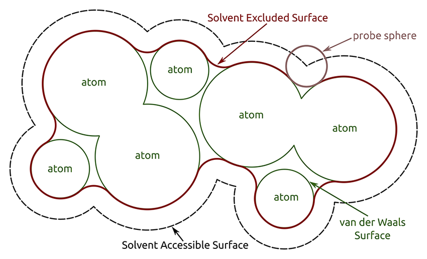

# PCM

## Factors:

* Solver - (D)PCM, CPCM ($k=0)$, IEFPCM, IPCM, COSMO ($k=0.5$), ddCOSMO, SS(V)PE
* Excitation treatment - LR, VEM, SS (cLR)
* Equilibrium/non-equilibrium (flips the excitation direction)
* Cavity
  * Radii set - Bondi, UFF, Allinger
  * Radii scale - 1.0, 1.2
  * Cavity formation - vdW, GEPOL, SES, SAS, isodensty 
  * Charge type - point, Gaussian, dipoles, generalised Born
    * Switching Function (for Gaussian) - SWIG, ISWIG
* Non-electrostatic terms - none, integration of atom types, stat-mech, QM/ESP based

## Notes:

* So as I keep reading, this tangled web of solvation models gets more complicated. It seems as though there's a handful of approaches, all of which branch out with different corrections. From what I can tell, these are the main overarching categories:
  * PCM
    * Is broken down into:
      * CPCM, DPCM, IPCM, IEFPCM, COSMO, ddCOSMO, SS(V)PE
      * These are all different formalisms for how to consider the polarisable continuum. IEFPCM and SS(V)PE seem to be considered the most sophisticated implementations.
    * With vertical excitation models:
      * LR, VEM, SS
        * I think ptSS and ptLR are just QChem implementations?
        * and cLR seems to be an implementation of SS
      * These seem to use an optical dielectric $\varepsilon_\infty$ (square of the refractive index @ 293K?)
  * Density and perturbation methods
    * EFP, CPPE, PDE, FPE
    * These are solvent microstate methods that represent the solvent as either a responsive of frozen electrostatic mass, with differing amounts of dispersion contribution. They better represent solvent specific interactions, such as hydrogen bonding and pi stacking, but lack the generalised nature of continuum based methods.
  * Parameterised models
    * Usually take a PCM basis and apply a correction on top based on some sort of identification of sites or density of the solute
      * nD-RISM, SMn, SMD, CMIRS
      * These usually do not analytically support excited states
* The term SCRF seems to refer specifically to a solvent model that's directly implemented in the SCF procedures and is thus self consistent with the electronic state, though since the SCF procedure is typically the ground state, the excitation model is used a correction, taking into account either the transition density or the density difference between the GS and ES.

#### Formulations of PCM
* DPCM is the initial formulation of PCM and uses the electrostatic definition of charge forming at the surface of two dielectric media
* CPCM and COSMO are both methods that utilise a conductor as the bulk and scale the resulting surface charges as a function of the dielectric constant. The scaling factor takes the form $f(\varepsilon)=\frac{\varepsilon-1}{\varepsilon+k}$. CPCM takes the value of $k=0$ where in COSMO $k=0.5$. This is known as the epsilon function. 
* The Integral Equation Formulation of PCM (IEFPCM) is a more generalised case from which DPCM and CPCM can be considered subcases. It is considered to be more mathematically exact
  * IEFPCM fixes two big issues of DPCM
    1. It correctly models the case in which the solute charge extends beyond the cavity
    2. It can be extended to work with anisotropic dielectrics and complex environments
#### Excited States With PCM

* In terms of solvation, **Linear Response** is a correction to the ground state density used for the SCRF procedure. It's implemented by calculating the excited state dynamic polarisation response from the transition density. **State Specific** uses a slightly different approach, calculating the dynamic polarisation from the difference between the ground and exited state densities.

* The SS solvation approach comes in three forms:
  * Vertical Excitation Method (VEM) - An iterative/self consistent approach
  * Sate Specific (SS) or Corrected-LR (cLR) - "can be seen as the first cycle of this iterative process."
  * Improta, Barone, Scalmani, and Frisch (IBSF) - Iterative like VEM, but the total excited state density is used instead of just the density difference.
* LR is good for systems where there is little electronic rearrangement between the GS and ES, otherwise an SS approach needs to be used.

#### Numerical Implementation
* Initially this was done by creating a vdW surface around the solute and treating each point as a specific charge.
  * The Solvent Excluded Surface (SES) is the surface at the vdW radii of the solute that is accessible by the solvent (using a probe of the radius of the solvent).
  * The GEPOL algorithm can effectively be thought of as the SES method, but with the surface made of convex elements (spheres inside of the solute instead of outside) rather than concave ones.
  * The Solvent Accessible Surface (SAS) is effectively the intersection of the vdW radii of the solute + the radius of the solvent probe, and is thus made of convex elements only.
  * The area of the individual faces produced by these methods determines the integration weight for that particular point charge.
  

{: style="width: 60%; "class="center"}

* Modern implementations use a Continuous Surface Charge (CSC) by modelling these points with simple spherical Gaussian functions
  * These use a Lebedev grid rather than a face area to determine the integration weights.
  * The SES method does not work here, so instead a scaling factor of 1.2 is typically used to increase the vdW radii to recover the solvent excluded regions
  * A "switching function" is used to measure the contribution of the Gaussian charge to the solvation energy.

* There appears to also be a way to use the isosurface of the solute's density, though according to Q-chem's manual, this isn't any superior to radii based cavity production and also doesn't support analytical gradients

#### Non-electrostatic terms

Implicit solvation energy is typically broken down into a few terms, with electrostatics, cavitation, dispersion and repulsion all having their own contributions.
$$
G^{sol}=G^{el}+G^{rep}+G^{disp}+G^{cav}
$$
While electrostatics is the dominant term in polar solvents, it's not the only one.

One approach uses in MST and SMD uses a summation over all solute atoms ($i$) of atomic surface tension ($\xi_i$), multiplied by the contribution of that atom ($A_i$):
$$
G^{nonel}=\sum_i\xi_i A_i
$$
This approach requires integration and partitioning of the surface cavity though, so a tesserae centric model can be used to calculate the dispersion-repulsion energy. Here, the solute is considered to be composed of fragments, surrounded by a number of solute molecules. The dispersion-repulsion energy can be considered a sum over the tesserae, using empirical parameters for the interaction of the solute and solvent.

The cavitation energy is considered from statistical mechanics, with each atom being considered independently as hard spheres, and the cavitation energy being the sum of the atomic spheres exposed to the solvent.

These approaches all use semiclassical mechanics to calculate dispersion and repulsion, though there are approaches that use QM components coming form the ESP and the electrostatic field computed at each tesserae. These also use parameters that are base don the optical permittivity and the first ionisation potential.

!!! note
	
	It looks as though these non-electrostatic terms are mostly optional additions, or are implemented as a correction term.
	
	#### From the Q-Chem 5 manual
	
	| Model              | Cavity  Construction            | Cavity  Discretization            | Non-Electrostatic Terms? | Supported Basis Sets            |
	| ------------------ | ------------------------------- | --------------------------------- | ------------------------ | ------------------------------- |
	| Kirkwood-Onsager   | spherical                       | point charges                     | no                       | all                             |
	| Langevin Dipoles   | atomic spheres (user-definable) | dipoles in 3-d space              | no                       | all                             |
	| C-PCM              | atomic spheres (user-definable) | point charges or smooth Gaussians | user-specified           | all                             |
	| SS(V)PE/IEF-PCM    | atomic spheres (user-definable) | point charges or smooth Gaussians | user-specified           | all                             |
	| COSMO              | predefined atomic spheres       | point charges                     | none                     | all                             |
	| Isodensity SS(V)PE | isodensity contour              | point charges                     | none                     | all                             |
	| SM8                | predefined atomic spheres       | generalized Born                  | automatic                | 6-31G* 6-31+G* 6-31+G** |
	| SM12               | predefined atomic spheres       | generalized Born                  | automatic                | all                             |
	| SMD                | predefined                      | point charges                     | automatic                | all                             |

#### Applications

This review by Benedetta Mennucci describes that PCM is not so good on its own for situations where h-bonding is important, but  shows that these are mostly electrostatic in nature and can be described through either through:

* QM solute + QM solvent + PCM
* AIMD solute + AIMD solvent shell + PCM
* AIMD solute + pMM solvent

This approach works for **strong** h-bonds, but more labile ones require a state averaging approach of different solute-solvent configurations to account for the combination of microstates.
