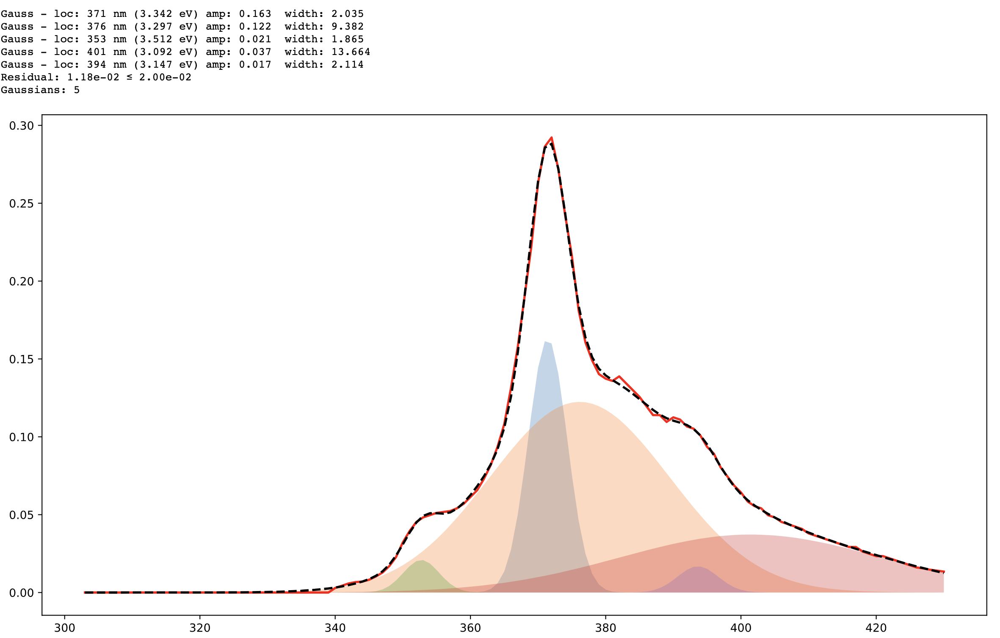

# Gas-Phase Fluorophore Dataset Notes

| Fluorophore                      | Class    | Charge | $\lambda_{max}^{abs}$ | $\lambda_{max}^{em}$ | $\Delta E_{0-0}$ | DOI                                                          | Other notes                                                  |
| -------------------------------- | -------- | :----: | :-------------------: | :------------------: | :--------------: | ------------------------------------------------------------ | ------------------------------------------------------------ |
| 8-methoxy-BODIIPY                | BODIPY   |   0    |         2.81          |         2.59         |       2.6        | [10.26434/chemrxiv.11639931.v1](https://doi.org/10.26434/chemrxiv.11639931.v1) |                                                              |
|                                  |          |        |          441          |         479          |       461        |                                                              |                                                              |
| Fluorescein                      | xanthene |   -1   |         2.36          |         2.10         |    2.27-2.28     | [10.1039/D0CP00453G](https://doi.org/10.1039/D0CP00453G)     | Deprotonated at the xanthene 0-0 is extracted from figure |
| Rhodamine 575                    | xanthene |   +1   |         2.50          |         2.45         |       2.47       | [10.1007/s13361-010-0017-4](https://doi.org/10.1007/s13361-010-0017-4) | Protonated amine, pronated carboxylic acid 0-0 is extracted from figure |
| Azulene ($s_2$)                  | azulene  |   0    |                       |                      |   3.565 fluor    | [10.1016/0301-0104(83)85076-9](https://doi.org/10.1016/0301-0104(83)85076-9) |                                                              |
| Azulene ($s_1$)                  |          |        |                       |                      |    4.23 fluor    |                                                              |                                                              |
| Azulene ($s_2$)                  |          |        |                       |                      |    3.565 abs     | [10.1039/c5cp01826a](https://doi.org/10.1039/c5cp01826a)     | From PES study $s_2$ is not $\lambda_{max}$              |
| Azulene ($s_1$)                  |          |        |                       |                      |    1.771 abs     |                                                              |                                                              |
| Azulene ($s_2$) Deconvoluted |          |        |         3.56          |         3.31         |       3.43       |                                                              | $S_1$ could not be identified in these plots 0-0 taken form average of abs and em wavelengths |
| Coumarin 153                     | coumarin |   0    |          417          |         368          |      3.152       | [10.1039/A902491C](https://doi.org/10.1039/A902491C)         | $\lambda_{max}$ was extracted from figure 1                  |

### Azulene Deconvolution

These were manually extracted from a paper by hand, plotting over the screenshots in excel.

=== "Absorbance"
	

	Blue peak on the right (356nm) is $s_0\to s_2$
	
	Greyish brown peak on the left (300nm) is $s_0\to s_3$
	
	I'm not sure what the grey and pinkish peaks are.
	
	

=== "Emission"
	
	Tallest peak is $s_2\to s_0$

​	
​	

