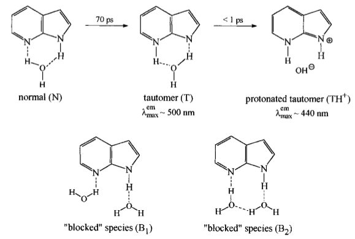

# Solvated Fluorophore Dataset Notes

## Solvents

| Solvent       | $\varepsilon_0$ |  $n$   | $\alpha$ | $\beta$ | $\gamma\:(mN/m)$<br/>$293.15K$ | $\gamma\:(cal\cdot mol^{-1})$<br/>$(mN/m\times 1.439)$ | $\phi$ | $\psi$ |     Toby owns      |  Needs purchasing  | Price                                                        |
| ------------- | :-------------: | :----: | :------: | :-----: | :----------------------------: | :----------------------------------------------------: | :----: | :----: | :----------------: | :----------------: | :----------------------------------------------------------- |
| *N*-Hexane    |      1.88       | 1.3749 |   0.00   |  0.00   |             18.35              |                         26.41                          |  0.00  |  0.00  |                    |                    |                                                              |
| Toluene       |      2.37       | 1.4969 |   0.00   |  0.14   |             27.94              |                         40.21                          |  0.86  |  0.00  | :white_check_mark: |                    |                                                              |
| Anisole       |      4.22       | 1.517  |   0.00   |  0.29   |             35.37              |                         50.90                          |  0.75  |  0.00  | :white_check_mark: |                    |                                                              |
| Diethyl ether |      4.24       | 1.3473 |   0.00   |  0.41   |             17.15              |                         24.68                          |  0.00  |  0.00  | :white_check_mark: |                    |                                                              |
| $\ce{CH3Cl}$  |      4.71       | 1.4458 |   0.15   |  0.02   |             27.10              |                         39.00                          |  0.00  |  0.50  | :white_check_mark: |                    |                                                              |
| THF           |      7.43       | 1.4072 |   0.00   |  0.48   |             27.37              |                         39.39                          |  0.00  |  0.00  |                    | :white_check_mark: | [\$150-240/L](https://www.sigmaaldrich.com/AU/en/substance/tetrahydrofuran7211109999) |
| DCM           |      8.93       | 1.4241 |   0.10   |  0.05   |             27.84              |                         40.06                          |  0.00  |  0.67  | :white_check_mark: |                    |                                                              |
| Ocanol        |      9.86       | 1.430  |   0.37   |  0.48   |             26.02              |                         37.44                          |  0.00  |  0.00  |                    | :white_check_mark: | [\$100-190/L](https://www.sigmaaldrich.com/AU/en/substance/1octanol13023111875) |
| EtOH          |      24.85      | 1.3614 |   0.37   |  0.48   |             22.28              |                         32.06                          |  0.00  |  0.00  | :white_check_mark: |                    |                                                              |
| ACN           |      35.69      | 1.3441 |   0.07   |  0.32   |             28.37              |                         40.82                          |  0.00  |  0.00  | :white_check_mark: |                    |                                                              |
| DMF           |      37.22      | 1.4305 |   0.00   |  0.74   |             36.73              |                         52.85                          |  0.00  |  0.00  | :white_check_mark: |                    |                                                              |
| DMSO          |      46.83      | 1.4793 |   0.00   |  0.88   |             43.36              |                         62.40                          |  0.00  |  0.00  | :white_check_mark: |                    |                                                              |

There's no point in doing water, since SMD uses its own parameters for it and apart from nile red, nothing will fluoresce in it.

Should we use octanol? I wanted a low dialectric, h-bonding solvent, but maybe Michelle's comments suggest not to add more h-bonding solvents.

## The Initial Proposed dataset

| Fluorophore                         |     Toby owns      |  Needs digging up  |  Needs purchasing  | Class          | Other notes                        | Price                                                        |
| ----------------------------------- | :----------------: | :----------------: | :----------------: | -------------- | ---------------------------------- | ------------------------------------------------------------ |
| Rhodamine 6G                        | :white_check_mark: |                    |                    | Rhodamine      |                                    |                                                              |
| Rhodamine 123(?)                    | :white_check_mark: |                    |                    | Rhodamine      |                                    |                                                              |
| AlexaFluor 532                      | :white_check_mark: |                    |                    | Rhodamine-like | In azide form                      |                                                              |
| NDI (of some description)           |                    | :white_check_mark: |                    | NDI            |                                    |                                                              |
| Naphthalamide (of some description) |                    | :white_check_mark: |                    | NDA            |                                    |                                                              |
| Prodan/                             |                    |                    | :white_check_mark: | Prodan         |                                    | [Prodan \$245/25mg](https://www.sigmaaldrich.com/AU/en/product/sigma/41525) |
| DAPI                                |                    | :white_check_mark: |                    | DAPI           | "Someone in bio will have some"    | [\$128/10mg](https://www.sigmaaldrich.com/AU/en/product/roche/10236276001) |
| FITC                                |                    |                    | :white_check_mark: | Fluorescein    | ==Can we just use fluorescein?==   | [\$66 USD/100mg](https://www.medchemexpress.com/FITC.html)   |
| Coumarin 343/519                    | :white_check_mark: |                    |                    | Coumarin       |                                    |                                                              |
| Texas Red                           |                    | :white_check_mark: |                    | Rhodamine-like | "Alison will have some"            | [\$256/5mg](https://www.sigmaaldrich.com/AU/en/product/sigma/s3388) |
| Nile Red                            | :white_check_mark: |                    |                    | Oxazine        |                                    |                                                              |
| BODIPY 493/503                      |                    |                    | :white_check_mark: | BODIPY         | Toby wants this to be investigated | [\$467/500mg](https://www.sigmaaldrich.com/AU/en/product/aldrich/790389) |
| Merocyanine 540                     | :white_check_mark: |                    |                    | Cyanine        |                                    |                                                              |
| Dansyl                              |                    |                    |                    | Naphthalene    | ==Which dansyl?==                  | [Hydrazine \$68/250mg](https://www.sigmaaldrich.com/AU/en/product/sigma/30434)<br/>[Amide \$150/1g](https://www.sigmaaldrich.com/AU/en/product/aldrich/218898)<br/>[Chloride \$160/1g](https://www.sigmaaldrich.com/AU/en/substance/dansylchloride26975605652) |
| Azulene                             |                    |                    | :white_check_mark: | Azulene        | $S_2\to S_0$ emitter               | [$55/50mg](https://www.sigmaaldrich.com/AU/en/substance/azulene12817275514) |
|                                     |                    |                    |                    |                |                                    |                                                              |
| Indigo Carmine                      |                    |                    | :white_check_mark: |                |                                    | [\$87/25g](https://www.sigmaaldrich.com/AU/en/product/sial/131164) |
| Cascade Blue                        |                    |                    | :white_check_mark: | Pyrene         |                                    | [\$208/1g](https://www.sigmaaldrich.com/AU/en/product/aldrich/h1529) |


## After Consultation with Michelle

!!! info "Notes form meeting"
	
	#### Suggestions to the dataset
	
	* [x] Add quinones and anthroquinones, 
	* [x] Add aza-indole
	* [x] Remove merocynainie
	* [x] remove anything that can internally hydrogen bond and any solvents that will hydrogen bond
	* [ ] We Don't want s1-s0 gap being too small - biradicals
	* [ ] Find species in the dataset that enolise - we don't really want this
	* [ ] make sure there's a few ct molecules, but not too many
		* [ ] Probably want a subset of CT molecules
	* [ ] Need to consider how much of the emisison state is populated
	
	#### Suggestions for the process
	
	* Cluster continuum will remove some of the issues with h-bonding - "That would be more satisfactory" 
	* For a benchmarking referecne, photoelectron spectra in gas phase to determine the $t_1 \to s_0$ gap
	* For casscf - basis set def2-tzvp
	* For dft - use cam-b3lyp - not too small of a basis set
		* Need to consider more roots. the errors are going to be much worse in higher roots.
		* This brings a bigger question - should we be comparing the WHOLE spectra, instead of just the lower states/0-0 transition
		* Probably need caspt2 results with casscf geoms
	
	#### To read up on
	
	* [ ] Papers by jackerman
	* [x] El-sayad rules
	
		* The rate of intersystem crossing is relatively large if the radiationless transition involves a change of orbital type
		
			* e.g. $^1\pi,\pi^* \to ^3n,\pi^*$ is faster than $^1\pi,\pi^* \to ^3\pi,\pi^*$
	* [ ] Danny jacoman's work benchmarking dft
	* [ ] Marco garavelli's work
	
	#### To investigate 
	
	* [ ] Check the difference between wb97x-dx and wb97x

!!! warn "If I had a system..."
	
	1. I'd look at the structure and look and look at the solvent, and specifically use cluster continuum.
	2. I'd look at molecules that don't internally hydrogen bond
	3. I'd use the best method I could, and if that's not MR, I'd use a selection of DFT functionals
	4. I'd then try to find the combination of method and solvation method that gives the best results.


	We have regularly come to the conclusion that SMD does a good job and that wb97-xd does a decent job - if there's no hydrogen bonding involved. " I don't believe for a moment in accurate quantitative"

## The Revision Process:


| Fluorophore                             |   Told to remove   |              Internal/H-Bonding acceptor/donor               | Protonation sites | $pK_a$    |         (un)Cyclises          |                         Do I want it                         |
| --------------------------------------- | :----------------: | :----------------------------------------------------------: | :---------------: | --------- | :---------------------------: | :----------------------------------------------------------: |
| Rhodamine 6g                            |                    | :negative_squared_cross_mark::white_check_mark::white_check_mark: |                   |           |      :white_check_mark:       | [They seem to be non-fluorescent in their closed form though...](https://encyclopedia.pub/entry/6165) |
| Rhodamine 123                           |                    | :negative_squared_cross_mark::white_check_mark::white_check_mark: |                   |           |      :white_check_mark:       |                                                              |
| Rhodamine 800                           |                    |                                                              |                   |           | :negative_squared_cross_mark: |                              ?                               |
| AlexaFluor 532                          |                    |    :white_check_mark::white_check_mark::white_check_mark:    |                   |           |                               |      :negative_squared_cross_mark: (Internal h-bonding)      |
|                                         |                    |                                                              |                   |           |                               |                                                              |
| NDI                                     |                    |                                                              |                   |           |                               |                                                              |
| Naphthalamide                           |                    |                                                              |                   |           |                               |                                                              |
| Prodan                                  |                    | :negative_squared_cross_mark::white_check_mark::negative_squared_cross_mark: |        2?         |           |                               |                      :white_check_mark:                      |
| DAPI                                    |                    | :negative_squared_cross_mark::negative_squared_cross_mark::white_check_mark: |         ?         | 4.31      |                               |                     :white_check_mark:?                      |
| Coumarin 343/519                        |                    |    :white_check_mark::white_check_mark::white_check_mark:    |        1-3        |           |      :white_check_mark:       |                :negative_squared_cross_mark:                 |
| 7-amino-4-methylcoumarin (coumarin 120) |                    | :negative_squared_cross_mark::white_check_mark::white_check_mark: |        1-2        | 3.37      |                               |                     :white_check_mark:?                      |
|                                         |                    |                                                              |                   |           |                               |                                                              |
| Texas Red                               |                    |     :negative_squared_cross_mark::white_check_mark: -->      |       many        | many      |                               | :negative_squared_cross_mark: (too many protonation states)  |
| Nile Red                                |                    | :negative_squared_cross_mark::white_check_mark::negative_squared_cross_mark: |         1         | 4.08      |                               |                      :white_check_mark:                      |
| BODIPY 493/503                          |                    | :negative_squared_cross_mark: ? :negative_squared_cross_mark: |                   |           | :negative_squared_cross_mark: |                      :white_check_mark:                      |
| Dansyl Amide                            |                    | :negative_squared_cross_mark: :negative_squared_cross_mark::white_check_mark: |                   | 4.63/9.97 | :negative_squared_cross_mark: |                      :white_check_mark:                      |
| Azulene                                 |                    | :negative_squared_cross_mark::negative_squared_cross_mark::negative_squared_cross_mark: |         0         |           | :negative_squared_cross_mark: |                      :white_check_mark:                      |
| Indigo Carmine                          |                    | :negative_squared_cross_mark::white_check_mark::white_check_mark: |         2         | 12-13     | :negative_squared_cross_mark: |                      :white_check_mark:                      |
| Fluorescein                             | :white_check_mark: |                                                              |                   |           |                               |           :negative_squared_cross_mark: (cyclises)           |
| FITC                                    | :white_check_mark: |                                                              |                   |           |                               |           :negative_squared_cross_mark: (cyclises)           |
| Merocyanine                             | :white_check_mark: |                                                              |                   |           |                               |     :negative_squared_cross_mark: (too many conformers)      |
| Cascade Blue                            | :white_check_mark: |                                                              |                   |           |                               | :negative_squared_cross_mark: (too many protonation states)  |
|                                         |                    |                                                              |                   |           |                               |                                                              |
| 1-aminoanthroquinone                    | :white_check_mark: |    :white_check_mark::white_check_mark::white_check_mark:    |         1         |           | :negative_squared_cross_mark: |                 :white_check_mark: \$76/100g                 |
| aza-indole                              |                    | :white_check_mark::white_check_mark::negative_squared_cross_mark: |                   | 4.59      | :negative_squared_cross_mark: | :negative_squared_cross_mark: (==complexes and tautiomerises==) unless we only use aprotic solvents |
|                                         |                    |                                                              |                   |           |                               |                                                              |
| anthracene?                             |                    | :negative_squared_cross_mark::negative_squared_cross_mark::negative_squared_cross_mark: |         0         |           | :negative_squared_cross_mark: |                                                              |


## Rejected

| Fluorophore | Toby owns | Needs digging up |  Needs purchasing  | CT   | Class  | Other notes | Price                                                        |
| ----------- | :-------: | :--------------: | :----------------: | ---- | ------ | ----------- | ------------------------------------------------------------ |
| 7-azaindole |           |                  | :white_check_mark: |      | indole |             | [\$47.80/1g](https://www.sigmaaldrich.com/AU/en/product/aldrich/a95502) |

## New Dataset

| Fluorophore                         |     Toby owns      |  Needs digging up  |  Needs purchasing  | CT                            | Class         | Other notes                        | Price                                                        |
| ----------------------------------- | :----------------: | :----------------: | :----------------: | ----------------------------- | ------------- | ---------------------------------- | ------------------------------------------------------------ |
| Rhodamine 800                       |                    |                    | :white_check_mark: |                               | Rhodamine     |                                    | [\$216/250mg](https://www.sigmaaldrich.com/AU/en/product/sigma/83701) |
| NDI (of some description)           |                    | :white_check_mark: |                    |                               | NDI           |                                    |                                                              |
| Naphthalamide (of some description) |                    | :white_check_mark: |                    |                               | NDA           |                                    |                                                              |
| Prodan                              |                    |                    | :white_check_mark: |                               | Prodan        |                                    | [\$245/25mg](https://www.sigmaaldrich.com/AU/en/product/sigma/41525) |
| DAPI                                |                    | :white_check_mark: |                    |                               | DAPI          | "Someone in bio will have some"    | [\$128/10mg](https://www.sigmaaldrich.com/AU/en/product/roche/10236276001) |
| Coumarin 153                        |                    |                    | :white_check_mark: |                               | Coumarin      |                                    |                                                              |
| Nile Red                            | :white_check_mark: |                    |                    |                               | Oxazine       |                                    |                                                              |
| BODIPY 493/503                      |                    |                    | :white_check_mark: | :negative_squared_cross_mark: | BODIPY        | Toby wants this to be investigated | [\$467/500mg](https://www.sigmaaldrich.com/AU/en/product/aldrich/790389) |
| Dansyl Amide                        |                    |                    |                    |                               | Naphthalene   |                                    | [\$150/1g](https://www.sigmaaldrich.com/AU/en/product/aldrich/218898) |
| Azulene                             |                    |                    | :white_check_mark: |                               | Azulene       | $S_2\to S_0$ emitter               | [$55/50mg](https://www.sigmaaldrich.com/AU/en/substance/azulene12817275514) |
| Indigo Carmine                      |                    |                    | :white_check_mark: |                               |               |                                    | [\$87/25g](https://www.sigmaaldrich.com/AU/en/product/sial/131164) |
| 1-aminoantrhaquinone                |                    |                    | :white_check_mark: | :white_check_mark:            | anthraquinone |                                    | [\$76.30/100g](https://www.sigmaaldrich.com/AU/en/product/sial/a39009) |

#### Other option

| Fluorophore | Toby owns | Needs digging up |  Needs purchasing  | Class      | Other notes                                                  | Price                                                        |
| ----------- | :-------: | :--------------: | :----------------: | ---------- | ------------------------------------------------------------ | ------------------------------------------------------------ |
| Anthracene  |           |                  | :white_check_mark: | anthracene | Can see the fine structure, only soluble in low-polar solvents | [\$42.2/1g](https://www.sigmaaldrich.com/AU/en/product/aldrich/141062) |

## Fluorophore Specific Notes

#### Notes of concern

* Rhodamine 800
  * Concentrations need to be kept low to prevent aggregation
  * Seems to be poorly handled by TD-DFT, but I think this should be okay
  * The $\ce{ClO4-}$ might have some chemical interactions that should lead us to exclude this species.
* ==7-Azaindole==
  * Forms clusters in solution and tautomerises with any protic solvent facilitate it
* BODIPY - all varieties and cyanine dyes (N-B-N, N-B-O and O-B-O)
  * Have strong MR character from double-excitation that leaved the adiabaitc TD-DFT approach with large errors 0.3-0.5 eV

## Finalised!

| Fluorophore                             | Solvated Dataset | Gas Dataset |        Class        | $m$-diagnostic | $D_{CT}\:(\AA)$ | $t\:(\AA)$ |
| --------------------------------------- | :--------------: | :---------: | :-----------------: | :------------: | --------------- | :--------: |
| Azulene                                 |       Yes        |     Yes     |       Azulene       |     0.120      | 0.967           |   -0.859   |
| Rhodamine 800                           |       Yes        |     No      |      Xanthene       |     0.076      | 1.074           |   -0.436   |
| 1-aminoanthraquinone                    |       Yes        |     No      |       Quinone       |     0.063      | 2.914           |   1.377    |
| Coumarin 153                            |       Yes        |     Yes     |      Coumarin       |     0.087      | 1.877           |   -0.271   |
| Nile Red                                |       Yes        |     No      |       Oxazine       |     0.078      | 1.592           |   -1.376   |
| BODIPY 493/503                          |       Yes        |     No      |       Cyanine       |     0.087      | 0.453           |   -0.941   |
| *N*-propyl-4-hydroxyl-1,8-naphthalamide |       Yes        |     No      |    Naphthalamide    |     0.071      | 0.626           |   -1.197   |
| DAPI                                    |       Yes        |     No      |    Phenylindole     |     0.082      | 1.959           |   -1.249   |
| Dansyl Amide                            |       Yes        |     No      |       Dansyl        |     0.071      | 1.660           |   -0.087   |
| Boron subphthalocyanine chloride        |       Yes        |     No      |       Cyanine       |     0.096      | 0.398           |   -1.830   |
| α-Sexithiophene                         |       Yes        |     No      | Polymeric thiophene |     0.079      | 0.002           |   -5.353   |
| Rhodamine 575                           |        No        |     Yes     |      Xanthene       |     0.050      | 0.741           |   -1.228   |
| Fluorescein                             |        No        |     Yes     |      Xanthene       |     0.074      | 3.756           |   2.358    |
| 8-methoxy-BODIPY                        |        No        |     Yes     |       Cyanine       |     0.089      | 0.770           |   -1.209   |


| Fluorophore                      | Price         | Quantity | Shop         | Item Number | Notes | Recieved           |
| -------------------------------- | ------------- | -------- | ------------ | ----------- | :---: | ------------------ |
| **Already have**                 |               |          |              |             |       |                    |
| Nile Red                         |               |          |              |             |       | :white_check_mark: |
| Naphthalamide                    |               |          |              |             |       | :white_check_mark: |
| Rhodamine 800                    | \$170.10      | 250mg    | Sigma        | 8370        |       | :white_check_mark: |
| Coumarin 153                     | \$57.96       | 100mg    | Sigma        | 546186      |       | :white_check_mark: |
| BODIPY 503                       | \$368.10      | 500mg    | Sigma        | 790389      |       | :white_check_mark: |
| Azulene                          | \$44.01       | 50mg     | Sigma        | 37879       |       | :white_check_mark: |
| 1-aminoanthraquinone             | \$60.21       | 100g     | Sigma        | A39009      |       | :white_check_mark: |
| DAPI                             | \$287.13      | 10mg     | ThermoFisher | 62247       |       | :white_check_mark: |
| Dansyl Amide                     | $117.90       | 1g       | Sigma        | 218898      |       | :white_check_mark: |
| Boron subphthalocyanine chloride | $104.03       | 50mg     | Biosynth     | FB179000    |       | :white_check_mark: |
| α-Sexithiophene                  | $26 USD       | 100mg    | TCI          | S0504       |   ?   |                    |
| <u>Total</u>                     | ~$1248.31 AUD |          |              |             |       |                    |


#### Rejected species Types

* Fluoresceins - internal cyclisation - require pH modification

#### Rejected species

* 7-azaindole
* indigo species - Tautomerise freely and have a very high triplet yield

=== "Rhodamine 800"
	

	<iframe style="width: 100%; height: 300px;" frameborder="0" src="https://embed.molview.org/v1/?mode=balls&cid=127750&bg=white"></iframe>
	
	* It’s always depicted with the perchlorate ion, but I’m not sure if that’s significant for its fluorescence, or if it’s just the common counterion.
	
	DOI: [10.1016/j.jlumin.2012.08.017](https://doi.org/10.1016/j.jlumin.2012.08.017)
	
	* Has a relatively small stokes shift, with mostly two identifiable emission peaks though the tail extends all the way to 950 nm
	* Is VERY red
	* Φ of ~0.25 in ethanol
	
	DOI: [10.1007/s11664-018-6367-6](https://doi.org/10.1007/s11664-018-6367-6)
	
	* Has a pretty small solvatochromic effect
	* Concentration dependent, with 23nm redshifting ocurring as aggregates form (mM or greater)
	
	DOI: [10.1002/qua.25780](https://doi.org/10.1002/qua.25780)
	
	“Why the lowest electronic excitations of rhodamines are overestimated by time-dependent density functional theory”
	
	* They seem to have large double excitation character, even in their singlet states, so MR and highly correlated methods can capture this, but TD-DFT struggles a bit.
	* Has a “partial” CT character? (0.37e over 1.791Å)
	* Not entirely sure how much I trust all of this without using cLR/VEM though.
	
	* They used modest basis sets for their testing 6-31+G(d,p)
	* Haven’t specified integration grids, which makes me think they used the G09 default (pruned 75,302) which probably isn;t sufficient for all their functionals
	* Used the same B3LYP-D3 geom for all their functionals
	
	DOI: [10.1007/s00894-022-05034-w](https://doi.org/10.1007/s00894-022-05034-w)
	
	* TD-DFT paper in water. B3PW91/6-31++G(d,p)/IEFPCM
	* Has an H-bonding site on the nitrile that needs attention


=== "BODIPY 493/503"
	

	DOI: [10.1021/ct500775r](https://doi.org/10.1021/ct500775r)
	DOI: [10.1021/ar500447q](https://doi.org/doi/10.1021/ar500447q)
	
	* In general, these seem to have double-excitation character in the lowest ES, making the adiabatic approximation of TD-DFT a big ask.
	* Not CT species
	* Very large Φ 
	* Looks like have a large MR character
	
		* Need either correlated or MR methods to model
		* Might not be the most appropriate for a TD-DFT datadset


=== "Azulene"
	
	<iframe style="width: 100%; height: 300px;" frameborder="0" src="https://embed.molview.org/v1/?mode=balls&cid=9231&bg=white"></iframe>
	
	[REALLY useful thesis on Azulene](https://harvest.usask.ca/bitstream/handle/10388/13870/AWUKU-THESIS-2022.pdf?sequence=1)


	DOI: [10.1016/0009-2614(74)85131-6](https://doi.org/10.1016/0009-2614(74)85131-6)
	
	* Has mostly single fluorescence ($s_2 \to s_0$) unless substituted
	* Energy gap between $s_2$ and $s_1$ is large enough that $s_2 \to s_2$ non-radiative relaxation is too slow to compete with $s_2 \to s_0$ fluorescence
	
	[10.1039/c5cp01826a](https://doi.org/10.1039/c5cp01826a)
	
	* Conical intersection between $s_1$ and $s_0$ 
	* Small amounts of $S_1$ emission can be detected as $t_1 \to s_1 \to s_0$


=== "1-aminoanthraquinone"
	

	<iframe style="width: 100%; height: 300px;" frameborder="0" src="https://embed.molview.org/v1/?mode=balls&cid=6710&bg=white"></iframe>
	
	DOI: [10.3390/ijms222111926](https://doi.org/10.3390/ijms222111926)
	
	* Both absorbance and emission are highly solvatochromic - large Stokes shifts
	* Φ decreases with increasing solvent polarity (0.15 in n-hexane to <0.03 in DMSO)
	* Charge Transfer species
	* Amine can either be twisted (TICT) or planar (PICT) - low energy barrier
	* Excited state intramolecular proton transfer not considered possible in $s_1$
	
	Timing
	
	* 560 ps fluorescence lifetime
	* 4.7 ps vibrtational relaxation in the ICT state
	* 150-180 ps ICT dynamics
	
	DOI: [10.1021/acs.jpca.7b11675](https://doi.org/10.1021/acs.jpca.7b11675)
	
	* CAM-B3LYP/6-31G(d,p) (no diffuse functions?)
	* LR IEF-PCM ACN
	
	Results
	
	* Identified the $s_1$ state as the "crucial state", as it's the lowest optically allowed excited state with a "relatively large oscilaltor strength"
	* In the $s_1$ state, it looks like the amino group wants to be perpendicular to the rings of the molecule
	* In polar solvents, it looks like they quench emission by enhancing ISC from $s_1 \to t_2$. I'm guessing this is die to a competition between intramolecular H-bonding and solvent-solute H-bonding

=== "7-azaindole"
	

```s
<iframe style="width: 100%; height: 300px;" frameborder="0" src="https://embed.molview.org/v1/?mode=balls&cid=9222&bg=white"></iframe>

DOI: [10.1021/jp9630232](https://doi.org/10.1021/jp9630232)

* Forms clusters in solution with water and alcohols that have different $\lambda_{max}^{em}$
* Water will pronate this species... not sure if other solvents can do this, as it seems to be largely cluster-shape dependent

{class="center"}

Timing

* 910 ps fluorescence lifetime in water at pH=7

DOI: [10.1021/j100178a023](https://doi.org/10.1021/j100178a023)

* It also seemingly tautomerises when excited, so I think we should rule out this species unless we go for aprotic only solvents
```
