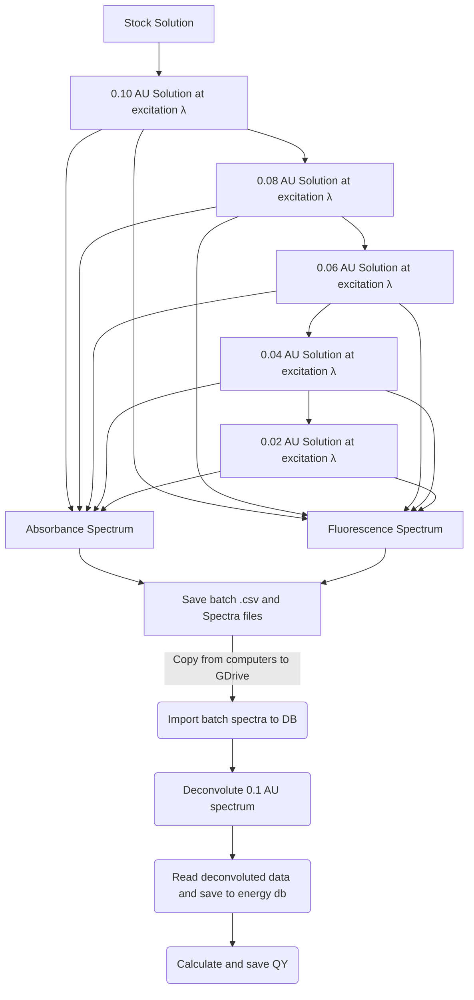

# Dataset Procurement Protocol

!!! info "Tips"
	
	* Don't bother naming and saving out each individual spectra, just keep your digital workspace clean and save the batch .csv file
	* Work quickly when working with volatile solvents, or your concentration will keep increasing as your solvent evaporates
	* If you're dealing with low-solubility solvents/solutes, keep diluting it until the absorbance stops increasing, otherwise your QY dilution with increase the concentration...
	* Clean your cuvette EVERY time. A fingerprint on the glass can mess with your baseline

#### Dilution

Make 4mL of solution to $\lambda_{excitation} = 0.1$ AU in cuvette

Use the following equation to determine dilution:

$$
\text{vol to replace} = \text{current vol}-\bigg[\bigg(\frac{\text{target abs}}{\text{current abs}}\bigg)\times\text{total vol}\bigg]
$$

Recored abs and fluorescence spectra and repeat with 0.08, 0.06, 0.04 and 0.02 AU solutions

* 0.1 --> 0.08 ~0.8 mL
* 0.08 --> 0.06 ~1.0 mL
* 0.06 --> 0.04 ~1.3 mL
* 0.04 --> 0.02 ~2.0 mL

#### UV-Vis

* Speed: Medium
* Everything else: Default

#### Fluorimeter
* Speed: manual
  * 300nm/s Rate
  * 0.25s Avg time
  * 0.5nm resolution
* Excitation slit width: 5 nm
* Emission slit width: 2.5 nm
* PMT voltage: Medium

## Process Flowchart

