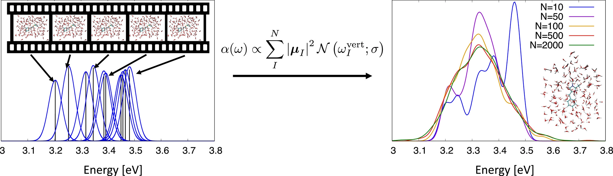
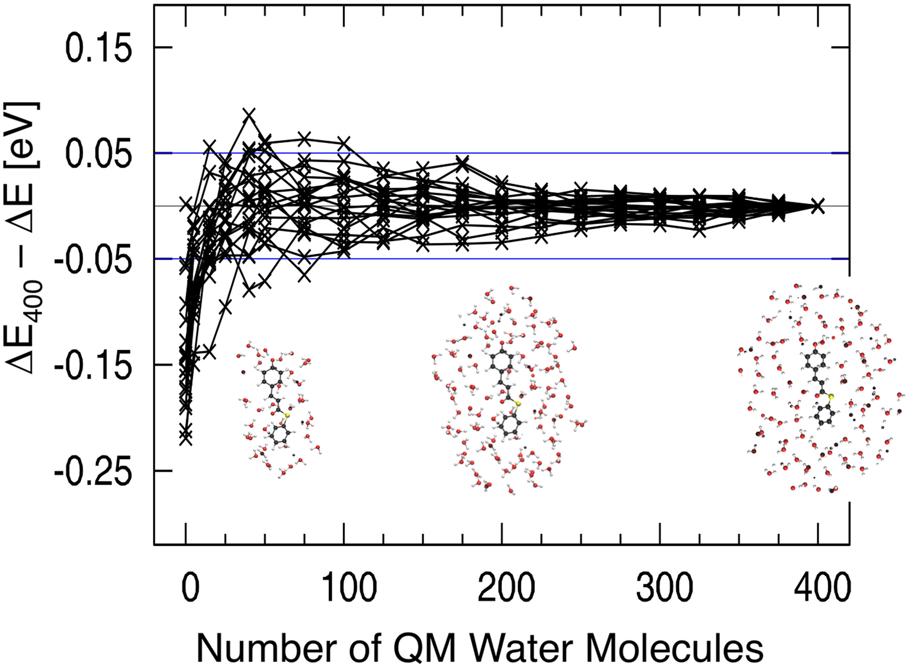
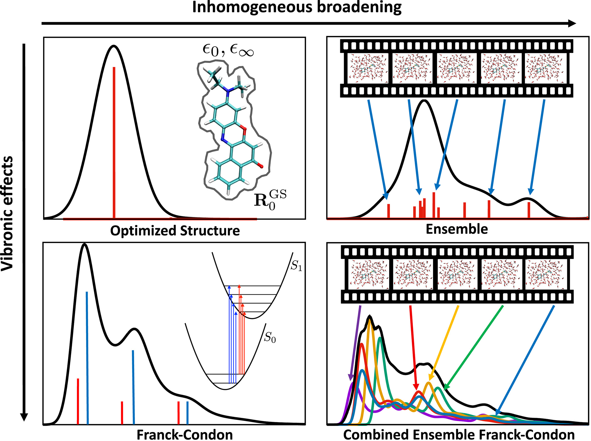

# Excited States in Solution

## [Modeling absorption spectra of molecules in solution](https://onlinelibrary.wiley.com/doi/10.1002/qua.25719)

!!! warn
	This paper reads like a love letter to the E-ZTFC approach and should be treated with a bit of bias.

* Solvents can effect absorption very strongly due to polarisation and direct solute-solvent interactions
  * Continuum models only account for the polarisation aspect, but lack the solvent-solute microstate configurations that will really effect the excited state properties. They also can't model the high energy tail of absorbance which are properties of vibronic transitions.
    * Surprise, Mick Gordon [thinks the answer is EFP](https://pubs.acs.org/doi/10.1021/jz200947j) and Dimitri Federov [thinks the answer is FMO](https://pubs.acs.org/doi/10.1021/cr200093j)...
  * Explicit QM solvation is the best, as it accounts for mutual polarisation and charge transfer, which can differ from state to state. 1-2 shells are needed for decent convergence, implying that these effects are relatively long-range
* Issues of optimising solvent-solute systems include: lots of shallow minima, non-unique solvent arrangement, lack of temperature effects.
  * MD can help this, with excitations being carried out on a number of configurations.
    * Can handle emission spectra by parameterising the solute for the excited state.
    * If using nuclear quantum effects, the energies will include ZPVE and the spectra will be red-shifted
      * Also result in more broad spectra due to an inhomogenous solvent environment and bond lengthening effects
    * MD will not lead to Gaussian shaped spectra due to solvent inhomogeneity.
      * The gaussian distribution would imply no solute-solvent interaction beyond polarisation
    * ~500 snapshots needed to converge a UV-Vis spectra from MD (no ref given)
* The electronic rearrangement of the solvent can happen on the same timescales as the absorbance itself, but the nuclear rearrangement of the solvent happens much more slowly, on the timescale of picoseconds

!!! info "Figure for the above claim"
	
	{: style="width: 80%; "class="center"}
	
	To sample an ensemble of solute–solvent configurations for simulation of an absorption spectrum, structures obtained from snapshots of a molecular dynamics trajectory are used for the computation of vertical excitation energies. Spectra are constructed by averaging over the vertical excitations calculated for different solute–solvent snapshots. In the ensemble approach, the $\sigma$-functions corresponding to individual vertical excitations are convoluted with a Gaussian function $\mathcal{N}$ of width σ centered at $\omega^{vert}$. The figure on the left shows the vertical excitation energies $\omega^{vert}$ and corresponding oscillator strengths as a stick spectrum for $N = 10$ snapshots, with each stick dressed with a Gaussian function. The sum of the Gaussian functions creates an absorption spectrum within the ensemble approach. The figure on the right shows the convergence of the ensemble spectrum computed for the GFP chromophore anion in water with respect to the number of snapshots sampled

### Continuum Solvation

* Multiple dielectric constants are used, with $\varepsilon_0$ (static) being used for ground state and $\varepsilon_\infty$ (optical) being used for excited states  
  * $\varepsilon_0$ varties wuite a lot with the polarity of the solvent, but $\varepsilon_\infty$ is a maeasure of the polarisability of the solvent and can be similar for both polar and non-polar solvents
* Linear Response (LR) methods use the transition density of the solute to model the solvation properties of excitations
  * Seem to not be great for excitations with large changes in density, such as charge-transfer transitions
* State-specific (SS) methods use the difference density, between the ground and excited states,  requiring extra density to be calculated
* These methods only account for a statistical average solvent-solute interaction, and do not take into account configuration interactions of the solvent.

### Explicit Solvent Models

* To account for polarisation and certain solute-solvent effects, we can embed MM charges in the QM calculations using QM/MM, and average over the configurations

  * This is not mutual polarisation though, as the solvent itself cannot be polarised without using pMD. Charge smearing and scaling methods tend to damage long range polarisation
  * EFP is being suggested as a viable option here as well, since they account for electrostatics, polarisation, dispersion, exchange-repulsion and charge-transfer
  * They could also be embedded with the use of an embedding potential

### Explicit QM Solvation with Classic Solvent Models

* QM treatment of the solvent can be important though where the electronic interaction between the solvent and solute play a large role in changing the transition energies. Charge transfer, dispersion, self consistent polarisation, etc. 
* Looking at how much solvent to include in the QM calc is more complex and is system dependent
* Reducing cost can be accomplished by using smaller basis sets for outer solvation shells
* If the goal is to model the excited state of the cluster in solution rather than the excited state of the solute-solvent cluster, then a lower level of theory can be used for the first shell
  * This can actually reduce the computational time compared to other embedding methods, as fewer SCF iterations may be needed.
  * Using some form of electrostatic embedding may be needed if extracting solvent clusters from MD, to stabilise the outer extents of the solvent cluster.
  * The outer edges of the extracted cluster can also be relaxed a bit to help this along.

{: style="width: 50%; "class="center"}

* Using MM charges around a QM solvent cluster can also reduce the size of the cluster needed to obtain good results.
* If using a PCM approach, be sure to use a SAS cavity rather than a vdW one, or if vdW is the only available cavity, try to scale the radii, as the PCM charges could appear between sparse outer solvent molecules.
* ==Rydberg states require the use of explicit QM solvent.== Systematic testing really needs to be performed on each system specifically though. PCM seems to give similar results to vacuum for these types of transitions.

### Excited State Methods

* EOM-CCSD seems to be the current gold standard at 0.01 eV with DFT modelled solvent, but is prohibitively expensive for explicit solvent. TDHF and CIS are some alternatives, but MCSCF with full solvent could get a bit messy to manage the active space.
* Explicitly treated TDDFT solvent needs to be approached with caution as some of the DFT approximations can lead to very low charge-transfer transitions. Non-local functionals are of note as better options here.
* DFT tends to predict very small transitions for the solvent molecules, so the more solvent molecules are added, the more low energy transitions will pop up in the calculation, skewing the results of the solute.
  * This seems to happen for all local and semi-local DFT functionals, so it's important to use range-separated functionals that use full exact (HF) exchange at long range and a decent amount of exact exchange at short range. 
  * Exact exchange provides the correct Coulombic stabilisation of the electron-hole interaction, which because it's then scaled by the amount of exact exchange, predicts lower charge transfer transitions to be too low in energy. 

### Computing Lineshapes In Solution

* While $\lambda_{max}$ values are useful, they don't really tell you a huge amount about the solution colour, as it's a property that requires the full lineshape; that is, the convoluted spectrum of all the excited state transitions weighted by their relative frequency, taking into account solvent configurations
* Even when $\lambda_{max}$ is the desired property, it's not going to be a product of the most stable ground state configuration alone, as it neglects temperature, solvent, lifetime broadening, etc. Often times there are also coupled vibronic fine structure considerations that go into the $\lambda_{max}$
* The most basic method computes a convolution of excitations based on PCM solvation and a single transtion
* The ensemble method is what's described in the box up the top, taking excitations from MD geometries to build a lineshape, however these can miss vibronic features or anything that's not quite modelled by the forcefield correctly.
* The Finite Temperature Franck-Condon (FTFC) method works by looking at the overlap of the ground and excited state wavefunctions and ascribing a relative probability and energy to that excitation based on the energy gap and Boltzmann distribution of that transition. These can then be combined into a spectrum with gaussian functions (the SD of the function is given by the reorganisation energy from the PCM) to give a better prediction of what the lineshape would be. The solvent is typically considered implicitly, and the PES is assumed to be harmonic around the minima. This accounts for vibronic considerations, but not solvent configurations, which can be important when strong solute-solvent interactions are at play
  * This is very sensitive to the DFT XC functionals.
  * In practice, this usually requires a small solvation shell, which is then frozen for Hessian calculations

* Combining ensemble and Franck-Condon can account for both!
  * Here the final lineshape is made by averaging the results of a bunch of FTFC calculations, each taken from snapshots of an MD run, calculated in a pocket of frozen solvent. This is obviously very expensive, however an Ensemble plus Zero Temperature Franck-Condon (E-ZCFC) method was developed that uses FTFC calculations on a small number of snapshots to give the linehsape, and uses vertical excitations from a large number of snapshots to account for more solvent effects. This method double counts some of the ZPVE though as it's modelled in both the FTCT and in the MD calculations.

{: style="width: 50%; "class="center"}

A schematic representation of some lineshape forming methods

### Success and Challenges

* If using MM forcefields, it's important to ensure a robust force field parameterisation of the chromophore
* One way to account to for weird configurations emerging from MD simulations is to weight the contributions of each MD snapshot based on the difference between the MM and QM energy
  * This seems like a pretty dodgy way to do this tbh...
  * It looks like you can fix this with a proper QM/MM treatment, rather than just MD snapshotting
* Capturing the effects of strong hydrogen bonding seems to be something that needs to be treated either quantum mechanically, with AIMD, QM/MM or PIMD
* Solvatochromic effects seems to be best handled with explicit QM solvation
* FTFC is better for rigid chromophores in a weakly interacting solvent 
  * As the lineshape will be dominated by vibronic contributions
* Ensemble is better for floppier molecules which will have more configurational space to sample
  * As the harmonic approximation will be less valid here
