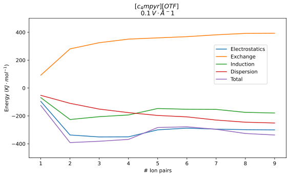

#    Pre-PhD Playground

## IP Extrapolation

I'm currently playing around to see how the interactions between a solute and ILs as a solvent, with and without an electric field change based on the number of ion pairs. These are snapshots form my previous pMD runs and I'm just running SAPT0/jun-cc-pvdz on them in Psi4.

All use the $\ce{c4mpyr+}$ cation, so only the anion is specified, the table shows which of the ion pair counts have completed successfully

* Note that the $\ce{[C4mpyr][OTF]}$ jobs took extra memory to complete, above the other ions.

| IL                    |     $0.0\:V\cdot\AA^{-s}$      |     $0.1\:V\cdot\AA^{-s}$      |
| --------------------- | :----------------------------: | :----------------------------: |
| $\ce{[C4mpyr][MSO4]}$ |      |  |
| $\ce{[C4mpyr][OTF]}$  |  |  |
| $\ce{[C4mpyr][TCM]}$  |  |  |

#### Timings

Note that for the *-co 8 IP jobs, I was running some tests to see if I could use fewer cores and get similar performance. 9 was the most pairs that could run within the 7 day time limit, and adding more cores did not reduce the job runtime.

{: style="width: 40%; "class="center"}

## Method Testing

My new focus is to see what I can gain from different methods so far, they are as follows:

* Single point extraction (Gaussian - fastest for M06-2X/6-31+G*)
  * $\ce{E_{\text{solute}+\text{interaction}} = E_{\text{system}} - E_{\text{solvent}} }$
* FMO1 (GAMESS)
* FMO2 (GAMESS)
* Psi4 chargefield (Psi4 + Gaussian for SP + MultiWFN for charges)
  * Requires calculation of partial charges though, FMO1 may be a better option since it uses the electron density where needed.
  * Could be corrected with DFTD3/4

#### Update:

It looks like there are some convergence issues, so in the FMO jobs I've switched from DIIS to SOSCF, and I'm letting the Gaussian jobs play out, but I'm also replicating their runs in ORCA, though with the frozen solvent optimisation, I'm also using numerical gradients so that it can only calculate the gradients for the solute.

#### Update:

I've kept playing and I've found some interesting things.

* Gaussian, as expected is still the best option for M06-2X/6-31+G*, ORCA is about the same speed with RI, but it takes massive amounts of memory
* come kind of PCM is needed, as otherwise the system tends to explode. The problem seems to be in trying to stabilise the negative charges on the $\ce{OTF-}$ anion, which makes sense. It's going to be so diffuse by nature of its structure.
  * This only increases the memory of the ORCA jobs further, so something like 10+ GB/core is required, and the system is too big to do on anything less than 16 cores.
* Psi4 chargefield seems to bring the energy down massively, but the jobs just aren't really converging. I'd love to get them to converge even very loosely, to that I could see what the resultant MOs look like.
  * I'm currently testing to see if it's an issue with the basis set/functional combination, or just that the optimisers really don't know how to handle the situation. It feels like a job for SOSCF, but Psi4's implementation doesn't seem to work with double hybrids.
  * Update: ωB97M-V seems to converge just fine... I'm now checking to see if M06-2X would behave better with a massive grid. The other big issue though is that the energy of the system drops massively, by more than double with the chargefield in place.
* FMO has been crashing as well, which after a whole lot of troubleshooting, seems to be an issue with linear dependence when trying to converge scf for the outermost $\ce{OTF-}$ anions.


I also did a check of population analysis schemes and created this lovely little boxplot showing the different schemes and their assigned charge distributions:

{: style="width: 50%; "class="center"}

#### Update (same day, but later):

Looks like the trick is to take those point charges and load them into a `pointcharges.pc` file and optimise in ORCA! 


#### Single point results:

|                                   | $E_{\text{solvent}}$ |  $E_{\text{solute}}$  | $E_{\text{full}}$ | $E_{\text{solute+int}}$ | $E_{\text{int}}$ | $E_{\text{int}} \:\kjmol$ |
| :-------------------------------- | :------------------: | :-------------------: | :---------------: | :---------------------: | ---------------- | ------------------------- |
| Single point subtractions         |    -11482.9600536    |    -709.014319493     |  -12192.0101637   |      -709.0501101       | -0.035790607     | -93.96824583662           |
| Point charge cloud - ORCA         |                      |   -708.972018707435   |                   |    -709.124134329562    | -0.1521156221    | -399.37959624667          |
| Point charge cloud - Psi4         |                      | -709.0218867826432643 |                   |                         |                  |                           |
| Point charge cloud: no PCM - Psi4 |                      | -708.9781365080156093 |                   |                         |                  |                           |

#### Single point results 5ip

|                       | $E_{\text{solvent}}$ | $E_{\text{solute}}$ | $E_{\text{full}}$ | $E_{\text{solute+int}}$ | $E_{\text{int}}$ | $E_{\text{int}} \:\kjmol$ |
| :-------------------- | :------------------: | :-----------------: | :---------------: | :---------------------: | ---------------- | ------------------------- |
| Single point Gaussian |    -5741.16113486    |   -708.938060608    |  -6450.17644472   |      -709.01530986      | -0.077249252     | -202.8179265759           |
| Single point FMO1     |   -5740.4397265670   |   -708.9305516399   |  -6449.326034670  |     -708.886308103      | -0.0442435369    | -116.1614149797           |
| Single point FMO2     |   -5741.1200041578   |   -708.9305516399   | -6450.1260562190  |     -709.0060520612     | -0.0755004213    | -198.22637122323          |

####  Update:

I noticed something weird in Psi4... When you create a molecule object, it actually centres it in space by the centre of mass, which means that it's really no surprise that my calculations have been so broken!

I wrote a little script that would calculate Mulliken charges for each fragment that I feed into it, and would use that to build a chargefield to perturb the solute molecule. This was cool, the interaction energies I was getting were actually not horrible far from the long painful single point jobs, so then I though, why not push this further and write a simple FMO1 implementation... which is where I'm at now!

{: style="width: 50%; "class="center"}

#### Update:

MiniFMO is pretty cool, but Psi4 isn't the most fully featured, so I might actually try implementing it using ORCA instead, since it's REALLY fully featured, and CRAZY fast, especially if I want to step up to FMO2.

I do actually want to implement FMO2, but that does mean that I'm going to need to break down the FMO paper :expressionless:

As for the accuracy of MiniFMO, it's really hard to gauge, since I haven't run any Psi4 benchmarking energy runs. I'm still not convinced that 6-31+G* is the best choice though... 

!!! info "FMO methodology as described by [Federov](https://onlinelibrary.wiley.com/doi/abs/10.1002/wcms.1322)"
	1. FMO1 - Calculate initial density
	2. FMO1 - Use initial density to optimise the charges on fragments through a mean field approach
	3. FMO2 - Calculate density of fragment pairs in the charges of the FMO1 iterations (not iteratively optimised)
	  * Near pairs are calculated with QM
	  * Far pairs with only the charges

	$$
	\begin{align}
	E_{FMO1} &= \sum_I^N E_I\\
	E_{FMO2} &= E_{FMO1} + \sum_{I>J}^N(E_{IJ}-E_I-E_J)
	\end{align}
	$$

#### Single point results 5ip

|                       | $E_{\text{solvent}}$ | $E_{\text{solute}}$ | $E_{\text{full}}$ | $E_{\text{solute+int}}$ | $E_{\text{int}}$ | $E_{\text{int}} \:\kjmol$ |
| :-------------------- | :------------------: | :-----------------: | :---------------: | :---------------------: | ---------------- | ------------------------- |
| Single point Gaussian |    -5740.97624872    |    -709.03976789    |  -6450.10014554   |      -709.12389682      | -0.08412893      | -220.880522541            |
| Single point FMO1     |    -5740.46383692    |   -709.0323620227   |  -6449.43872093   |      -708.97488401      | 0.0574780127     | 150.9085338395            |
| Single point FMO2     |    -5740.93614193    |   -709.0323620227   |        DNF        |                         |                  |                           |
| Single point MiniFMO1 |    -5740.66656255    |    -709.03939523    |  -6449.70670351   |      -709.04014096      | -0.00074573      | -1.95791426415            |
| Single point MiniFMO2 |    -5740.56224483    |    -709.03939523    |  -6449.64256787   |      -709.08032304      | -0.04092781      | -107.455973341            |

#### Update:

I've decided to shelve the miniFMO project, as I'm missing one key feature in Psi4, which is the ability to perform electrostatic embedding of charges that haven't been partitioned. There does appear to be a concept called a "diffuse" which can be built from a wavefunction, but it doesn't seem to be properly implemented in Psi4.

#### Update:

In a stroke of inspiration while digging through the depreciated Psi4 `Diffuse` class, I came across the ability to calculate the ESP for a wavefunction on a grid, and have coded up a way to generate a cloud of points within a sphere of each atom, generate the ESP for each point and use that to generate a chargefield of points.

I'm hoping that if I can cobble this together nicely, it will serve as a much better way of being able to embed charges for my MiniFMO implementation.


{: style="width: 30%; "class="center"}

|               | mol1              | mol2               | mol1+2              | mol1+2 - mol2         | Interaction only | $\kjmol$            |
| ------------- | ----------------- | ------------------ | ------------------- | --------------------- | ---------------- | ------------------- |
| QM            | -709.039387560356 | -738.8476519271799 | -1447.8954158532947 | -709.0477639261       | -0.008376365744  | -21.99214993614515  |
| FMO1          | -709.03939523714  |                    |                     | -709.0392959238623689 | 0.00009931327763 | 0.26074703028022056 |
| ESP Embedding | -709.03939523714  |                    |                     | -709.1010757493811525 | -0.06168051224   | -161.94219722222    |
| FMO1 ESP      | -709.03939523714  |                    |                     |                       |                  |                     |

WOOO! And with the suggestion that I look at how CHELPG managed it, I have decent looking charges!

{: style="width: 50%; "class="center"}


#### Single point results 5ip

|                       | $E_{\text{solvent}}$ | $E_{\text{solute}}$ | $E_{\text{full}}$ | $E_{\text{solute+int}}$ | $E_{\text{int}}$ | $E_{\text{int}} \:\kjmol$ |
| :-------------------- | :------------------: | :-----------------: | :---------------: | :---------------------: | ---------------- | ------------------------- |
| Single point Gaussian |    -5740.97624872    |    -709.03976789    |  -6450.10014554   |      -709.12389682      | -0.08412893      | -220.880522541            |
| Single point FMO1     |    -5740.46383692    |   -709.0323620227   |  -6449.43872093   |      -708.97488401      | 0.0574780127     | 150.9085338395            |
| Single point FMO2     |    -5740.93614193    |   -709.0323620227   | -6450.0533060700  |      -709.11716414      | -0.08480212      | -222.64795897             |
| MiniFMO1 - ESP        |    -5741.25662671    |    -709.03939523    |  -6450.35204199   |      -709.09541528      | -0.05602005      | -147.080652479            |
| MiniFMO2 - ESP        |    -5736.23438742    |    -709.03939523    |  -6444.27692817   |      -708.04254075      | 0.99685448       | 2617.2416366              |

The resultant FMO1 charge cloud looks really cool, but I'm getting strange results, as can be seen above (^) and am not sure if it's related to how much of an overlap there is in the point clouds.
I'm re-running the results with a 2.6 Å cutoff radius, 0.3 Å grid density and a higher FMO1 convergence tolerance.

{: style="width: 50%; "class="center"}

!!! warning "Diffusivity"
	Since sulphur is really large compared to the CHELPG defining dataset, and since ILs tend to have really diffuse charges, I tried running the miniFMO jobs with diffuse (3.4 Å @ 0.6 Å grid density) and very diffuse (5 Å @ 0.6 Å grid density), but the results were pretty much the same.

|                               | $E_{\text{solvent}}$ | $E_{\text{solute}}$ | $E_{\text{full}}$ | $E_{\text{solute+int}}$ | $E_{\text{int}}$ | $E_{\text{int}} \:\kjmol$ |
| :---------------------------- | :------------------: | :-----------------: | :---------------: | :---------------------: | ---------------- | ------------------------- |
| Single point Gaussian         |    -5740.97624872    |    -709.03976789    |  -6450.10014554   |      -709.12389682      | -0.08412893      | -220.880522541            |
| Single point FMO1             |    -5740.46383692    |   -709.0323620227   |  -6449.43872093   |      -708.97488401      | 0.0574780127     | 150.9085338395            |
| Single point FMO2             |    -5740.93614193    |   -709.0323620227   | -6450.0533060700  |      -709.11716414      | -0.08480212      | -222.64795897             |
| MiniFMO1 - ESP                |    -5741.25662671    |    -709.03939523    |  -6450.35204199   |      -709.09541528      | -0.05602005      | -147.080652479            |
| MiniFMO2 - ESP                |    -5736.23438742    |    -709.03939523    |  -6444.27692817   |      -708.04254075      | 0.99685448       | 2617.2416366              |
| MiniFMO1 - ESP - Diffuse      |    -5741.26551748    |    -709.03939523    |  -6450.36421899   |      -709.09870151      | -0.05930628      | -155.70863814             |
| MiniFMO2 - ESP - Diffuse      |    -5736.16292494    |    -709.03939523    |  -6444.16696364   |      -708.00403870      | 1.03535653       | 2718.32856952             |
| MiniFMO1 - ESP - Very Diffuse |    -5741.22477334    |    -709.03939523    |  -6450.29211977   |      -709.06734643      | -0.02795120      | -73.38587560              |
| MiniFMO2 - ESP - Very Diffuse |    -5736.48870337    |    -709.03939523    |  -6444.81567776   |      -708.32697439      | 0.71242084       | 1870.46091542             |


I've noticed some pretty big issues in how the charge clouds are being scaled, so I'm trying to figure that out. Initially, the charge zero fragments were being nullified, but now I can get them to sum and average to 0, and I can get the ions to average to their charge, but I can't seem to scale them to sum to zero.

I decided to do some digging, and using the standard method of scaling the charges vector by the fragment charge/sum of charges, I was getting scaling factors of ~0.02 for the cations and ~0.035 for the anions. I thought that I might be able to used a flat scaling value for all the charges, but peter suggested that rather than using the charges fragment, I could use the number of points in that fragment's point cloud! so now I'm trying scaling them all by 1/number of points, and it seems to be yielding mych more reasonable results!

{: style="width: 50%; "class="center"}


|                         | $E_{\text{solvent}}$ | $E_{\text{solute}}$ | $E_{\text{full}}$ | $E_{\text{solute+int}}$ | $E_{\text{int}}$ | $E_{\text{int}} \:\kjmol$ |
| :---------------------- | :------------------: | :-----------------: | :---------------: | :---------------------: | ---------------- | ------------------------- |
| Single point Gaussian   |    -5740.97624872    |    -709.03976789    |  -6450.10014554   |      -709.12389682      | -0.08412893      | -220.880522541            |
| Single point FMO1       |    -5740.46383692    |   -709.0323620227   |  -6449.43872093   |      -708.97488401      | 0.0574780127     | 150.9085338395            |
| Single point FMO2       |    -5740.93614193    |   -709.0323620227   | -6450.0533060700  |      -709.11716414      | -0.08480212      | -222.64795897             |
| MiniFMO1 - ESP - Scaled |    -5740.64205573    |    -709.03939523    |  -6449.68977755   |      -704.17362203      | 4.86577320       | 12775.08753660            |
| MiniFMO2 - ESP - Scaled |    -5740.41626328    |    -709.03939523    |  -6449.40962030   |      -708.99335702      | 0.04603821       | 120.87332035              |

So I noticed some issues with the charge scaling implementation that I had used, so I decided to improve it a bit.

Initially the charges were scaled by the formal charge of the fragment, which introduces restrictions on polarisation and charge transfer, so rather than scaling each fragment, I'm now generating one shift factor (it just offsets all the charges) that's just there to make sure that the charges sum to the formal charge of the total system. This is then applied uniformly to ALL generated chargefields.


|          | $E_{\text{solvent}}$ | $E_{\text{solute}}$ | $E_{\text{full}}$ | $E_{\text{solute+int}}$ | $E_{\text{int}}$ | $E_{\text{int}} \:\kjmol$ |
| :------- | :------------------: | :-----------------: | :---------------: | :---------------------: | ---------------- | ------------------------- |
| MiniFMO1 |    -5740.64075562    |    -709.03939523    |  -6449.68567072   |      -709.04491510      | -0.00551987      | -14.49241869              |
| MiniFMO2 |    -5740.43180165    |    -709.03939523    |  -6449.45187685   |      -709.02007520      | 0.01932003       | 50.72473876               |

This is better but it's still coming up short in a way that thinks that the charges may be too small. I'm going to try to change the outer cutoff radii to some multiple of the VDw radii instead and see if it's better. 

These results were with:

* A very tight grid density ($0.3\:\AA$)
* A smaller than CHELPG internal cutoff (the VDw radii)
* A much larger outer cutoff ($2\times$ VDw radii)

|          | $E_{\text{solvent}}$ | $E_{\text{solute}}$ | $E_{\text{full}}$ | $E_{\text{solute+int}}$ | $E_{\text{int}}$ | $E_{\text{int}} \:\kjmol$ |
| :------- | :------------------: | :-----------------: | :---------------: | :---------------------: | ---------------- | ------------------------- |
| MiniFMO1 |    -5740.64979372    |    -709.03939523    |  -6449.69747183   |      -709.04767811      | -0.00828288      | -21.74670144              |
| MiniFMO2 |    -5740.36438386    |    -709.03939523    |  -6449.35142193   |      -708.98703807      | 0.05235716       | 137.4637236               |

## EFP Gen

So I've decided to step away from the MiniFMO project and go back the essence of what I was trying to figure out in the first place: can I model a potential to perturb the solvent with in order to optimise it. To this end, I'm currently trying to generate EFP fragments for the ions.

??? info "Advice from the Q-Chem manual"
	EFP parameters can be generated in gamess using MAKEFP job (RUNTYP=MAKEFP). For EFP parameters calculations, 6-311++G(3df,2p) basis set is recommended. Original Stone’s distributed multipole analysis (bigexp=0 in the group $stone is recommended for non-aromatic compound; optionally, one may decrease the basis set to 6-31G* or 6-31+G* for generation of electrostatic multipoles and screening parameters. (To prepare such a “mixed" potential, one has to run two separate MAKEFP calculations in larger and smaller bases, and combine the corresponding parts of the potential). In aromatic compounds, one must either use numerical grid for generation of multipoles (bigexp=4.0) or use 6-31G* basis with standard analytic DMA, which is recommended. The MAKEFP job produces (usually in the scratch directory) the .efp file containing all the necessary EFP parameters. See the gamess manual for further details. Below are examples of the RUNTYP=MAKEFP gamess input file for water and benzene.
	```
	GAMESS input example for water.
	

	 $contrl units=angs local=boys runtyp=makefp coord=cart icut=11 $end
	 $system timlim=99999 mwords=200 $end
	 $scf soscf=.f. diis=.t. conv=1.0d-06 $end
	 $basis gbasis=n311 ngauss=6 npfunc=2 ndfunc=3 nffunc=1
	   diffs=.t. diffsp=.t. $end
	 $stone
	   bigexp=0.0
	 $end
	 $damp ifttyp(1)=3,2 iftfix(1)=1,1 thrsh=500.0 $end
	 $dampgs
	h3=h2
	bo31=bo21
	 $end
	 $data
	 water h2o (geometry: mp2/cc-pvtz)
	 c1
	o1 8.0  0.0000  0.0000  0.1187
	h2 1.0  0.0000  0.7532 -0.4749
	h3 1.0 
	$end
	
	GAMESS input example for benzene.
	
	 $contrl units=bohr local=boys runtyp=makefp coord=cart icut=11 $end
	 $system timlim=99999 mwords=200 $end
	 $scf soscf=.f. diis=.t. conv=1.0d-06  $end
	 $basis gbasis=n311 ngauss=6 npfunc=2 ndfunc=3 nffunc=1
	   diffs=.t. diffsp=.t. $end
	 $stone
	   bigexp=4.0
	 $end
	 $damp ifttyp(1)=3,2 iftfix(1)=1,1 thrsh=500.0 $end
	 $dampgs
	c6=c5
	c2=c1
	c3=c1
	c4=c1
	c5=c1
	c6=c1
	h8=h7
	h9=h7
	h10=h7
	h11=h7
	h12=h7
	bo32=bo21
	bo43=bo21
	bo54=bo21
	bo61=bo21
	bo65=bo21
	bo82=bo71
	bo93=bo71	
	bo104=bo71
	bo115=bo71
	bo126=bo71
	 $end
	 $data
	benzene c6h6 (geometry: mp2/cc-pvtz)
	c1
	c1     6.0    1.3168      -2.2807       0.0000
	c2     6.0    2.6336       0.0000       0.0000
	c3     6.0    1.3168       2.2807       0.0000
	c4     6.0   -1.3168       2.2807       0.0000
	c5     6.0   -2.6336      -0.0000       0.0000
	c6     6.0   -1.3168      -2.2807       0.0000
	h7     1.0    2.3386      -4.0506       0.0000
	h8     1.0    4.6772       0.0000       0.0000
	h9     1.0    2.3386       4.0506       0.0000
	h10    1.0   -2.3386       4.0506       0.0000
	h11    1.0   -4.6772       0.0000       0.0000
	h12    
	```


The only issue is that I'm currently struggling to get Psi4 to recognise the fragments, and I'm not sure how to input them for testing in GAMESS directly...

!!! note
	~~Psi4 (LibEFP) doesn't like the $1/r^7$ dispersion term, so be sure to disable it if generating fragments for Psi4~~<br>I *think* this has since changed in Psi4 1.6
	

	```Fortran
	$MAKEFP DISP7=.FALSE. $END
	```


|                                | $E_{\text{solvent}}$ | $E_{\text{solute}}$ | $E_{\text{full}}$ | $E_{\text{solute+int}}$ | $E_{\text{int}}$ | $E_{\text{int}} \:\kjmol$ |
| :----------------------------- | :------------------: | :-----------------: | :---------------: | :---------------------: | ---------------- | ------------------------- |
| Single point Gaussian (M06-2X) |    -5740.97624872    |    -709.03976789    |  -6450.10014554   |      -709.12389682      | -0.08412893      | -220.880522541            |
| EFP Psi4 (SCF)                 |                      |    -704.84315370    |                   |                         |                  |                           |

!!! error
	So EFP is a dead end... It can't seem to capture the subtlety of the pMD generated IEF

## eField gen

So today I decided to work on a different project, to use the point generation method from the MiniFMO routines to be able to generate electric field plots. This required me to borrow some functions from the MiniFMO script, but I noticed that the generation of the field vectors from the wavefunction was bottlenecked to only one core, even when 32 were provided on MonARCH.

I wrote a little routine that chunks the input matrix and gives each chunk to a different thread, but I don't know how to but the `wfn` object in shared memory, so it currently has to write the object to file and load it for each thread, which depending on the number of basis functions could be really memory intensive.

I then wrote a script to plot these fields in PyMOL from a `.npy` file that the script outputs:
{: style="width: 70%; "class="center"}

I am genuinely really impressed at how much faster I am with all of this than I was last year! [^1]

??? info "In my process of writing my PyMOL code..."
	Do you like my vector field? :slightly_smiling_face:
	{: style="width: 50%; "class="center"}

