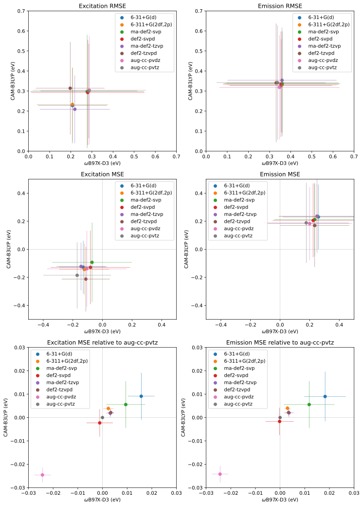
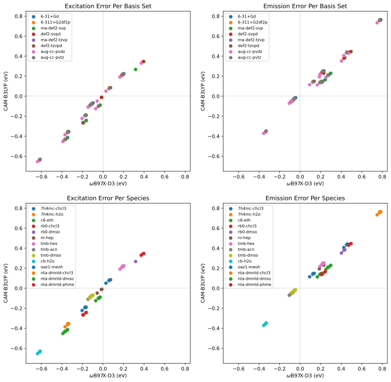

# August 2022

## Monday 1st August

Today is a teaching day, so I'll probably be mostly focused on that, since it's my first lab for the semester.

I also fixed a long and annoying issue with my macbook, so now it's actually fast and usable! :D

## Tuesday 2nd August

I have a meeting with Toby today, which should be useful, and I'll be in the office for the whole day, so this could be a tiring one...

#### To ask Toby:

* Is my dataset complete enough?
  * Alexa Fluor 532
  * Napthalamides
  * Cyanine 5
  * Fluorines
* Is there more space of fluorophores we need to consider?
* Would it be possible to get our own spectrochemical data?

* Interesting BODIPY:
  * Why is the photoswitching happening?

Hopefully I'll be productive though :)

I got the Pople (and Ahlrichs) jobs queued, and have been continuing to read that very long and very thorough review of PCMs

## Wednesday 3rd August

Today was a teaching day and I got very little sleep, so there was very little to report.

## Thursday 4th August

Today I plonked in a cafe and worked on expanding my scripts a bit further and adding a few new species to my dataset.

## Friday 5th August

I've had a rough day, so I've been plonked at ACMI and worked on a `with x as y:` implementation for my MonARCH handler in python, because I think I've had some weird memory leaks and SSH connections left hanging. Hopefully this should alleviate some, if not all of that.
I think the Monash security tools are also reeking havoc on my performance and battery life, so I need to figure out what to do there as well.

## Sunday 7th August

I'm in a weird mood today, so I'm currently plonked at ACMI and am trying to figure out what I should work on today.

I decided to pull up QChem again, and have a look at the non-SMD nonelectrostatic implementations. They seem to be quite cool! I'm currently running a high level pcm opt on 7h4mc-h2o to see how close I can get with SS-PCM+LJ+Cav. Once I have some optimised geometry, I might try doing a sp SMD job to see if the el/non-el breakdown is similar between the two. 


VERY EXCITED!!!!
*breathe*
I just found something REALLY cool. If you use LigParGen to parameterise a molecule, you can take the .key file it generates and QChem can read that directly, all you need to specify in the QChem input is the atom type as another column in your xyz section and then tell it where the generated ff params are, e.g.

```
$molecule
0 1
  O   -3.05691736233257     -1.90660759170326     -0.00001871962666   800
  C   -2.19890842969474     -1.01779130088902     -0.00002492322876   801
  O   -0.88248299133365     -1.50219746962366     -0.00001152640480   802
	...
$end

$force_field_params
    Filename /Users/asno0004/Computation/Jobs/7h4mc.prm
$end
```

!!! error
	I've been having some issues with this...

I'm currently trying to remap from the amber parameters using the table in the `amber99.prm` file and the original [paper](http://ffamber.cnsm.csulb.edu/ffamber/pdfs/cornell_amber94_1995jacs.pdf):
```
   #####################################################
   ##                                                 ##
   ##  TINKER Atom Class Numbers to Amber Atom Types  ##
   ##                                                 ##
   ##    1  CT      11  CN      21  OW      31  HO    ##
   ##    2  C       12  CK      22  OH      32  HS    ##
   ##    3  CA      13  CQ      23  OS      33  HA    ##
   ##    4  CM      14  N       24  O       34  HC    ##
   ##    5  CC      15  NA      25  O2      35  H1    ##
   ##    6  CV      16  NB      26  S       36  H2    ##
   ##    7  CW      17  NC      27  SH      37  H3    ##
   ##    8  CR      18  N*      28  P       38  HP    ##
   ##    9  CB      19  N2      29  H       39  H4    ##
   ##   10  C*      20  N3      30  HW      40  H5    ##
   ##                                                 ##
   #####################################################
```

Easier way is to use antechamber:

```bash
$ module load amber/18-serial
$ antechamber -i 7h4mc-h2o.pdb -fi pdb -o 7h4mc-h2o.mol2 -fo mol2 -at amber
```

Then you can read the `.pdb` it spits out to see the atomtypes in the 6th column, and convert them to numberical indiced via the above table.

### 8:53 PM

I'M A BIT DRUNK, BUT I DID IT :smile: !!!!!!!! (using ligpargen and OPLSAA params)

### 11:15 PM

And I [wrote a script](https://github.com/adreasnow/comp-chem-scripts#fileconverterslpg2prmpy) to automate it :smile:

!!! info "From the README"
	#### `fileConverters/lpg2prm.py`

	This script is designed as a simple tool to help build Q-Chem inputs that require MM parameters. It's set up so that you can download and extract the output from [ligpargen](http://zarbi.chem.yale.edu/ligpargen/) and run the script as `lpg2prm.py tmp/*` pointing to the folder of all the output files.
	
	The only files it really needs are the `.xyz` (which is output with atom types and adjacency list), and the `.prm`.
	
	It will print the \$molecule section of the Q-Chem input to the terminal and will write the `.prm` to the directory it obtained the `.xyz` file from as `<filename>-qchem.prm`

## Tuesday 9th August

Group meeting was good! managed to ask questions and mostly pay attention for once :smile:

As for the follow on from Sunday night, things are breaking and I have nfi why. QChem does not seem to play consistently.

I haven't had the motivation to get the failed jobs from my fluorophore set back up and running, but I figured out some issues with Q-Chem's qm/mm .prm implementation. I can get it running locally now, but not on the cluster...

Edit: Turns out I did NOT fix them, and today has been a b it of a waste, despite burning many hours.

## Wednesday 10th August

So after banging my head against the wall constantly since my "EUREKA!" moment on Sunday (It turns out that I wasn't *actually* reading in the `.prm` file and when I tried to, the whole calulation seemed to segfault :expressionless:), I decided to go back and look through the Q-Chem manual again with a fine tooth comb. Turns out that all that Q-Chem needs for parameters for the QM region of a QM/MM calc is the LJ parameters and atom charge. This means that I can pretty easily make an inline MM parameters section within the Q-Chem inputs:
```
$force_field_params
NumAtomTypes 30
AtomType   -1  -0.4126    2.9600   0.2100 
AtomType   -2   0.4917    3.5500   0.0700 
AtomType   -3  -0.2954    2.9000   0.1400 
...
$end
```

And use these *negative* atom types for the MM atom types in the XYZ section:

```
$molecule
0 1
O       -2.99251        -1.32228         0.31398          -1      2      0      0      0
C       -2.06347        -0.54887         0.55727          -2      1      3     13      0
O       -0.92455        -1.09701         1.0257           -3      2      4      0      0
...
$end
```

I've also added another script (a modified version of [`lpg2prm.py`](https://github.com/adreasnow/comp-chem-scripts#fileconverterslpg2prmpy)) called [`lpg2qchemlj.py`](https://github.com/adreasnow/comp-chem-scripts#fileconverterslpg2qchemljpy)

!!! warning
	Be aware that these are still only rough parameters. A good starting point to improve these would be to generate some quick CHELPG charges with Multiwfn and use those in place of the LPG  atom-typed ones.

Since the qm/mm job is working, I've got that job running as well as both a cheaper job with only MM water and more expensive one with 6 added QM h-bonding water molecules. I also decided to try the state specific job that kept freezing up with a cheaper CPCM calculation, rather than trying to do it with a full SS(V)PE PCM. :crossed_fingers:

~~I also did some more testing on the Q-Chem jobs and the non-electrostatic term job seems to be failing as a result of the dispersion/repulsion component, so I'm currently running an opt just with the added cavitation term to see how close that gets to the SMD result.~~

Edit: These are non-analytic optimisations :grimacing:, so I am going to abstain from running this job for now

I also kicked the XTB opt off for the solvated geometry starting point for the qm/mm job. **<u>DON'T FORGET TO CHECK ON THIS ADREA!</u>**

## Thursday 11th August

Baby steps to getting things done. The cheap QM/MM job was going to take forever, so I made another one with one solvation shell and with optimised QM waters for the h-bonding components to see if that would help. The XTB opts kept ripping the waters apart as well, so I'm not going to do that. The MonARCH queue is being really slow atm, so jobs that I've queued last night are still waiting... I might run some of them locally. Perhaps the ssPCM job, since its only single threaded anyway :sweat_smile:

## Friday 12th August

Meeting with Katya this morning and I don't have too much to present, since I've mostly been trying to figure out QM/MM stuff and force fields in Q-Chem...

I spent most of my day trying to figure out ssPCM and on my way home I combined a bunch of my python optimisation checking scripts into one, with argparse switching to select the specific function.

#### Meeting with Katya:

* [x] Contact NCI and ask what requitemements there are to getting qchem
  * It was apparently gifted to the users of Gadi by Peter Gill
* [x] Contact Philip and Simon if they have retail access and what pricing
* [x] ~~Contact Q-Chem about which licenses are site specific~~ Not needed if Q-Chem is free on Gadi
* [x] wB97X-D basis set Comparison
* [ ] LJ params from polarisability
  * This is proving to be a bit more complicated...


## Sunday 14th August

Spent my afternoon preparing for teaching tomorrow and reading through the paper for group meeting on Tuesday.

!!! info "Q-Chem PCM Tip"
	By setting `PrintLevel 2` in the `$pcm` section, the log file will print out the blocks needed so that the whole file can be interpreted as a `.pqr` file and opened with VMD or PyMOL. From here you can interpret the file (Plugins --> APBS Electrostatics) to generate the PCM surface charges along the SES or SAS. This is useful for being able to easily visualise the PCM cavity. `PrintLevel 2` extends this to also print an ESP at the surface grid by the converged solute.

## Monday 15th August

Today was a teaching day and that mostly took up all of my time, but as usually, I've ended up working late in bed...
In my working, I found a few useful tools for linear scaling PCM calculations in Q-Chem, which is particularly useful for the big QM/MM jobs.

* The Conjugate gradient solver (``$pcm  solver cg`) is faster for large cavities than the standard matrix inversion method.
* The use of the fast multipole method (`$pcm usemultipole`) can be used to speed up the calculation of long range electrostatic terms, but requires that no matrix be stored (`$pcm nomatrix`)

I also sped up my Jupyter code, that it only pulls data from jobs that it doesn't already have data for, and I also plotted some MAE plots of ωB97X-D3 vs CAM-B3LYP for each basis set. Naturally, they're very messy since the data is incomplete...

## Tuesday 16th August

So those methods of speeding up the PCM calculation all seem to cause the TDDFT solver to crash, which means that I had a choice to make, either stick with basic, slow CPCM, or move to MM-only solvation. Naturally I'm now solvating with 30K water molecules and trying to see if I can get the emission energy anywhere near as low as what SMD predicts .

So I stumbled upon [a benchmarking paper](https://pubs.acs.org/doi/10.1021/ct300326f) that I had in my Zotero and it's kind of exactly what I'm trying to figure out:

> 1. Addition of diffuse orbitals is mandatory and tends to decrease the transition energies
> 2. Going from a double-ζ to a triple-ζ BS induces rather small variations
> 3. Including additional polarization orbitals tends to slightly decrease Evert‑a, and
> 4. BS effects are nearly independent of the selected functional.

## Wednesday 17th August

Yup, my results seem to be in line with what that paper is saying:

* Functional errors are very large (up to 0.8 eV)
* Basis set errors only account for < 0.03 eV of that
* Having a well behaved wavefunction is seemingly more important than anything else.

These are not complete yet, there's still a bunch of failed jobs that would likely skew the results (particularly for aug-cc-pvdz), but the trend is pretty clear.

{: style="width: 80%; "class="center"}

## Thursday 18th August

I've been trying to clean up the failed jobs from my basis set testing and I've definitely found a few badly behaving sets.

* Pople basis sets - hit and miss, but mostly miss. 6-31+G(d) seems to behave slightly better than 6-311+G(2df,2p), which is unsurprising given it should *theoretically* converge more easilys
* ma-def2-tzvp definitely seems to be less well behaved than def2-tzvpd.
* Of course aug-cc-pvtz is being a dick, while aug-cc-pvdz seems to be behaving itself for the most part.

I've been working on my stats visualisation and on trying to optimise the 7h4mc-h2o system that has been giving me horrible errors, with xtb/qmmm as a big water cluster.

{: style="width: 80%; "class="center"}


## Friday 19th August

So I decided to to some quick testing to see which basis set and functional might be good for some quick QM/MM work, but it kind of opened up a can of worms when I started looking at the polarisation consistent (pc-*n*) basis sets. Even at the cheapest augmented form (aug-pc-0), they seem to perform better than aug-cc-pvtz at a fraction of the cost (at least for 7h4mc-h2o emission, which is my current trouble child).

These are the benchmarking results, in line with all the others.

| Functional |    Basis    | Error (eV) |
| ---------- | :---------: | :--------: |
| CAM-B3LYP  | aug-cc-pvtz |   0.762    |
| CAM-B3LYP  |  aug-pc-0   |   0.749    |
| CAM-B3LYP  |  aug-pc-1   |   0.748    |
| CAM-B3LYP  |  aug-pc-2   |            |
| ωB97X-D3   | aug-cc-pvtz |   0.775    |
| ωB97X-D3   |  aug-pc-0   |   0.776    |

These are my time/energy trials for the first step of a crude QM/MM setup:

| <h3>Time (s) </h3> | ma-def2-svp | aug-cc-pvdz | 6-31+G(d) | aug-pc-0 | aug-pc-1 |
| ------------------ | :---------: | :---------: | :-------: | -------- | -------- |
| CAM-B3LYP          |     78      |     685     |    51     | 34       | 491      |
| ωB97X-D3           |     84      |     715     |    61     | 43       | 537      |

| <h3>Energy</h3> | ma-def2-svp | aug-cc-pvdz | 6-31+G(d) | aug-pc-0 | aug-pc-1 |
| --------------- | :---------: | :---------: | :-------: | -------- | -------- |
| CAM-B3LYP       |   4.4065    |   4.3396    |  4.3798   | 4.4332   | 4.3555   |
| ωB97X-D3        |   4.4792    |   4.4130    |  4.4548   | 4.5193   | 4.4340   |

Okay, so on closer inspection, I think that the hydroxyl proton in the 7h4mc completely detaches in the excited state, which is ultimately what gives the characteristic low energy transition. 

## Sunday 21st August

!!! warning "Personal Decision"
	I sat down today and had a really good chat with someone that I trust thoroughly about my PhD and financial situations and have decided to go back to full time research starting tomorrow. In looking back at my [coding stats](../../../stats), I've probably been working enough hours through the week **cough** *and weekend* **cough** to consider myself at a full time workload, I've just been operating in a very unfocused and "playful" manner. With a bit more direction and focus on reading, I feel like I should be able to meet my milestones.

## Monday 22nd August

Well, I slept horribly and started work late, but I was also working late last night, so I can give myself that little break, I guess...
I've been working (still playfully...) on writing a script to use MDAnalysis to extract solvent clusters from around polar contacts within solutes, and it's looking pretty good.

I've got the new clusters working in the ssPCM opt job, and am about tio get it working in the QM/MM job as well. It's kind of strange, but I feel like the Jensen basis sets ([aug]-pc-*n*) do a better job of capturing the lability of the 7h4mc proton in the excited state that seems to be reducing the transition energy, so I'm testing those jobs with a combination of aug-pc-1/pc-1 for solute/solvent.

#### Doubts

My brain is starting to go back on itself as to the importance/validity of this work. It's not that the work isn't important, but rather that there is no golden hammer approach that we can really take to anything within this space, which makes me wonder why I'm trying to fix it...
PCMs are fundamentally limited in their approach, and as I'm finding out, TD-DFT in general may in itself be part of the issue.
I think I might need to try the 7h4mc-h2o species with some higher level calculations as well, perhaps DLPNO-STEOM-CCSD or ADC(2)

## Tuesday 23rd August

So I did a little test of the 7h4mc-h2o species with DLPNO-STEOM-CCSD which gave results that weren't much better than TDDFT, so I did a quick CASSCF(8,8) calculation in Psi4 with IEFPCM water and the coefficients for root 1 were:

```
   Active Space Natural occupation numbers:

         A   1.976791         A   1.949008         A   1.944880
         A   1.370837         A   0.627139         A   0.067303
         A   0.041201         A   0.022842
```

So I'm thinking that there's a pretty decent chance that there's some multireference character in this species... I'm currently running an NEVPT2 SP on the TDDFT geom to sanity check this, and am also running a pyscf CASSCF opt.

* NEVPT2 job seems to give the same emission, and a CASSCF(10,9) job shows that 8,8 was the right choice. Guess we'll see how the pyscf opt job runs...
* So the pyscf optimised geom didn't make a difference to the DLPNO-STEOM-CCSD energy...

I ended up giving in and setting off an EOM-CCSD PCM opt in Psi4 to see if that would fix the geometry woes.

## Wednesday 24th August

Marking day (part 1) means plonking in a cafe to incentivise myself to slam this out...

So I was having a conversation about errors on emission with Michael yesterday and realised that errors in nm, would not be linear with the errors in eV, so I decided to plot it today... Not only are the errors not linear, but they're **very** dependent on the base emission energy and are **very** asymmetric:

<iframe src="https://www.desmos.com/calculator/eoghbzrcnt?embed" width="100%" height="500" style="border: 1px solid #ccc" frameborder=0></iframe> 

I also finally got back to reading the John Herbert review again (it is very long, but very thorough!)

## Thursday 25th August

Marking day (part 2) means plonking in a cafe again!


## Friday 26th August

Had a meeting with Katya, did some reading, looked at some more jobs and started running some BMK benchmarks with qchem.

* Question form Katya; what makes BMK different?

It's past midnight, but I wrote a little function that goes through all of the failed jobs and finds the next largest basis set job that has completed and uses its geometry and MOs as a starting point for its own calculation. The failed jobs excluding aug-pc-2, (==Adrea, run these ones too when the aug-pc-2 jobs finish==) have subsequently been re-queued.
... I though it was a pretty clever move to make to automate this repair process :3

## Saturday/Sunday 27/28th August

I did get a bit of work done, but mostly on job handling and file processing. I did read a bit more of that review, but not a huge amount

## Monday 29th August

I'm teaching today which is going to occupy most of my afternoon, but it's also been a rough day for me emotionally, so I'm not sure how productive I will be in general outside of that.

## Q-Chem Notes (My Mini Dot-Point Review)

* ssPCM gradients non-analytical
  * Also can't seem to get them to *not* crash
* Non-El approches to PCM are also non-analytical
  * Very susceptible to parameter errors
  * Not sure if it will even make a difference to the TD-DFT, since it seems to be an energetic correction
* QM/MM only needs LJ and charge params for the QM region (WOO!)
* No density fitting for PCM
  * Makes it much slower than ORCA
* EFP is only optimisable for EFP only jobs
  * Doing it in GAMESS is very slow
* Has nicer print for solvation, but doesn't give you a huge amount for everything else or gives you far too much
* Really bad error handling. It likes to segfault without giving any info as to why

## Important (play) coding:

* [x] Write a server-side script for reading files? (should be faster than catting over ssh)
  * [x] Potentially explore sftp file reads instead of ssh catting
* [x] QM/MM in Q-Chem
* [ ] QM solvation shell + EFP for long range
* [ ] Having a few explicit water molecules around charged functionality + EFP/PCM

## To do:

Apart from all the papers that need reading...

* [x] Finish the Benedetta Mennucci review
* [ ] Finish the non-Benedetta Mennucci review
* [ ] Read up on domain decomposition solvation (ddPCM/ddCOSMO)
* [ ] Read up on [COSMO-RS](https://wires.onlinelibrary.wiley.com/doi/10.1002/wcms.56)
  * [x] ~~Should we get a license? Perhaps not, since this would be effectively paywall restricted science...~~
    * Yeah, not worth it. Katya agrees.

* [ ] Watch Lectures
  * [ ] [Understanding strongly correlated systems in excited state chemistry](https://www.youtube.com/watch?v=Y2nNag-70w4)
  * [ ] [Benchmarking multiconfigurational methods for vertical excitation energies](https://www.youtube.com/watch?v=rlicz_ISDbU)
  * [ ] [Concepts of Molecular Excited State Calculations](https://winterschool.cc/2016/concepts-of-molecular-excited-states-calculations)
  * [ ] [Modelling Photoabsorption and Photoelectron Vibronic Band Shapes](https://winterschool.cc/webinars-2022/modelling-photoabsorption-and-photoelectron-vibronic-band-shapes)
  * [ ] [Intro to CASSCF Calculations](https://winterschool.cc/2016/intro-to-casscf-calculations)

* [ ] Read program's manual's solvation sections and pull out key discussed papers
  * [ ] ORCA
  * [ ] Q-Chem
  * [ ] PCMSolver (read the paper)
