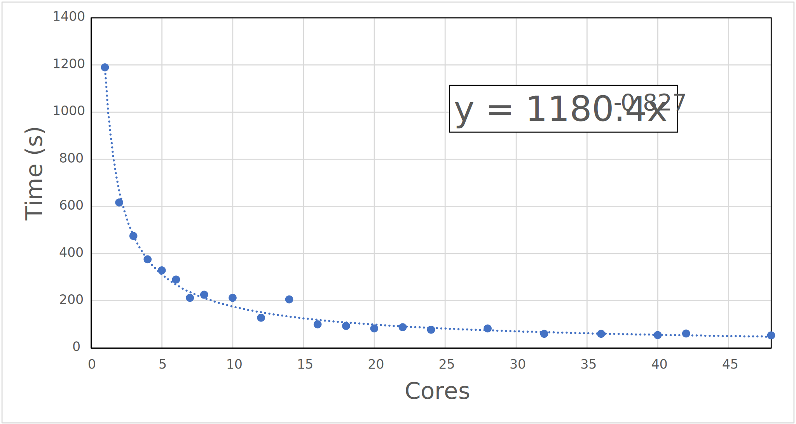
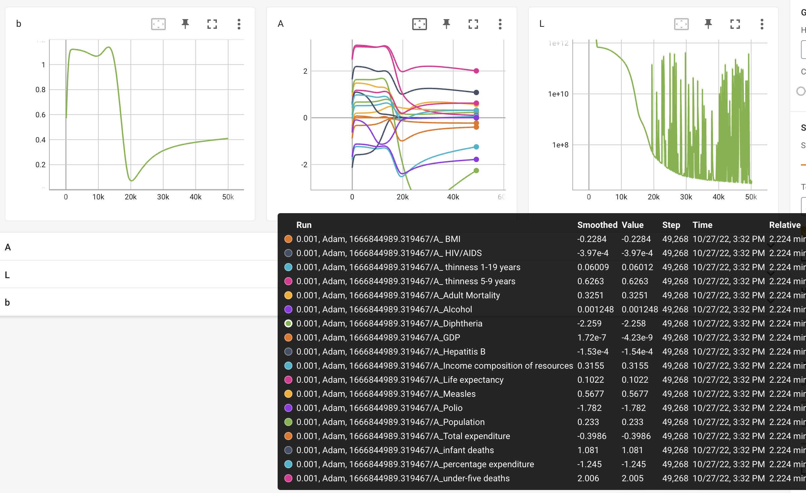

# October 2022

## Monday 3rd October

Today I'm doing this 'Data Fluency in Git and Github' workshop to get some of my MDP hours up, and I'm teaching this arvo, so I probably won't be doing my research today.

Edit: This training is really slow and dry... I think self directed learning might be a bit better for me.

## Tuesday 4th October

I didn't quite make it in for group meeting, but I have a meeting with Katya this arvo to talk about directions for my IPR, so I'm heading in for that regardless. I'll probably try to focus on getting some more reading in today.

## Wednesday 5th October

Today I was teaching, but afterwards, I spent some time running a few tests for some benchmark levels of theory. Admittedly on BODIPY which seems to be notoriously difficult. Unless otherwise specified, they all use the ωB97X-D3/aug-cc-pvtz optimised $S_1$ geometry (Ref: $\Delta E_{s^1\to s^0}^{adia} =2.504\:eV$)

| Method                                                       | Emission (eV) | Error (eV) |
| ------------------------------------------------------------ | :-----------: | :--------: |
| **<u>Correlated</u>**                                        |               |            |
| {==EOM-CCSD/aug-cc-pvdz//==}EOM-CCSD/aug-cc-pvdz             |     2.660     |   -0.155   |
| RI-DLPNO-STEOM-CCSD/aug-cc-pvtz                              |     2.334     |   0.171    |
| {==SS-CASSCF(10,10)/aug-cc-pvdz//==}RI-DLPNO-STEOM-CCSD/aug-cc-pvtz |   **crash**   |            |
| <u>**Multireference**</u>                                    |               |            |
| {==SS-CASSCF(10,10)/aug-cc-pvdz//==}NEVPT2(10,10)/aug-cc-pvtz |     1.560     |   0.945    |
| {==SS-CASSCF(10,10)/aug-cc-pvdz//==}CASCI(10,10)/aug-cc-pvtz |     2.619     |   -0.114   |
| {==SS-RI-CASSCF(10,10)/aug-cc-pvtz//==}SS-RI-CASCI(10,10)/aug-cc-pvtz |     2.659     |   -0.155   |
| RI-NEVPT2/aug-cc-pvtz                                        |     2.863     |   -0.358   |
| {==SS-CASSCF(10,10)/aug-cc-pvtz//==}RI-NEVPT2/aug-cc-pvtz    |     2.923     |   -0.428   |
| {==RI-NEVPT2/aug-cc-pvdz==}//RI-NEVPT2/aug-cc-pvtz           |               |            |
| **<u>Double Hybrids</u>**                                    |               |            |
| RI-SOS-PBE-QIDH/aug-cc-pvtz                                  |     2.703     |   -0.198   |
| RI-SOS-ωPBEPP86/aug-cc-pvtz                                  |     2.581     |   -0.076   |
| {==SS-CASSCF(10,10)/aug-cc-pvdz//==}RI-SOS-PBE-QIDH/aug-cc-pvtz |     2.755     |   -0.250   |
| {==SS-CASSCF(10,10)/aug-cc-pvdz//==}RI-SOS-ωPBEPP86/aug-cc-pvtz |     2.621     |   -0.116   |
| {==RI-SOS-PBE-QIDH/aug-cc-pvdz//==}RI-SOS-PBE-QIDH/aug-cc-pvtz (numerical opt) |     2.685     |   -0.181   |
| {==RI-SOS-ωPBEPP86/aug-cc-pvdz//==}RI-SOS-ωPBEPP86/aug-cc-pvtz |               |            |

## Thursday 6th October

I've mostly been cleaning up the calculations from yesterday in the table above, doing a bit of PySCF reading and "play" for trying to figure out optimised CASSCF optimisation procedures (density fitting, frozen core, natural orbs, etc.)

* The results from yesterday's test were interesting. The double hybrids seem to be performing really well, and RI-DLPNO-STEOM-CCSD and NEVPT2 performed surprisingly poorly.
* The surprise to me was that the CASSCF optimised BODIPY energy performed really well, so I'm re-testing the other methods as optimised by that. It might be the best way to try to include multireference character into my species.
  * This made my errors worse... I'm now trying a numerical optimisation at the double-hybrid level


I'm helping a friend at RMIT with their research at 4, so for now I'm plonked in the city and am going to continue trying to get some reading done.

==So it looks like you can tell whether you need multireference character by looking at the $T_1$ amplitudes of a CC calc. If $T_1>0.02$, then you need a MR method. ([10.1002/qua.560360824](https://doi.org/10.1002/qua.560360824))==

## Monday 10th October

Findings from my little correlated methods test:

* I think that the exact QM solution for the BODIPY species is probably higher than the experimental (~2.66 eV). I guess this is the energy that we want to compare to, but I'm not sure what the experimental discrepancy is. I might need to test charge/multiplicity variations.

  * In looking deeper, it looks like this method compares the 0-0 transition energy? at least, that's what the SI claims. TBH though, this paper does not look like they understand the photophysics particularly well, as they're calculating the 0-0 energy as $\Delta E_{adiabatic}+\Delta E_{ZPVE}$, and 0-0 is distinctly non-adiabatic... Time to do a 0-0 calculation, I guess?
    * Ref: $\Delta E_{0-0} =2.534\:eV$

* With that in mind, it looks like DLPNO-STEOM-CCSD is just too unreliable a method to use, CASSCF//CASCI seems to be pretty good, but has no dynamic correlation, so is probably a fluke.

  * EOM-CCSD looks good, but is way too expensive with those big ERI matrices, even with density fitting. The double hybrid methods do look like a decent compromise, especially if we optimise numerically. with SOS-ωPBEPP8/aug-cc-pvtz is way too slow for this, SOS-PBE-QIDH (which is the best functional in benchmarks) seems fast enough to get away with this approach.

  | Method                                                   | $\Delta E_{S^0}$ | $\Delta E^{ZPVE}_{S^0}$ | $\Delta E_{S^1}$ | $\Delta E^{ZPVE}_{S^1}$ | $\Delta E_{0-0}$ | $\Delta E ^{adia}_{S^1\to s^0}$ |
  | -------------------------------------------------------- | :--------------: | :---------------------: | :--------------: | :---------------------: | :--------------: | ------------------------------- |
  | RI-SOS-PBE-QIDH/aug-cc-pvdz//RI-SOS-PBE-QIDH/aug-cc-pvtz |   -680.485533    |        0.154578         |                  |                         |                  |                                 |
  | RI-SOS-ωPBEPP8/aug-cc-pvdz//RI-SOS-ωPBEPP8/aug-cc-pvtz   |   -680.768591    |        0.153766         |                  |                         |                  |                                 |
  
  I've also decided to check the CASSCF/CASCI results for Oxazine $4^+$, since I have gas phase data for that as well. ($\lambda_{max}^{emission}$ at 2.160 and 2.094 eV at RT)
  
  | Method                                             | Emission (eV) | Error (eV) |
  | -------------------------------------------------- | :-----------: | :--------: |
  | SS-CASSCF(6,6)/aug-cc-pvdz//CASCI(6,6)/aug-cc-pvtz |     3.290     |    BAD!    |
  
  Since every paper seems to find CASPT2/NEVPT2 opts as being really good, I'm going to try and NEVPT2(8,8) numerical opt for BODIPY. I looked at the CASSCF results from before and saw occupations outside the 0.05-0.95 range on the two most extreme orbitals, so I've culled my active space to (8,8)
  
  | Method                                                 | Emission (eV) | Error (eV) |
  | ------------------------------------------------------ | ------------- | ---------- |
  | RI-NEVPT2(8,8)/aug-cc-pvdz//RI-NEVPT2(8,8)/aug-cc-pvdz | 3.017         | BAD!       |

## Tuesday 11th October

Now that the Oxazine 4+ CASSCF job has optimised, it looks like we could probably get away with a (4,4) active space.

I've mostly been reading today, and I got some headings together for my IPR to see what things I need to cover that I haven't read up enough on.

Ways to make Adrea not trust your whole paper:

> "We finally recommend to use the linear response LR-CPCM solvation model as it produce a slight improvement in terms of consistency and predictability over gas phase calculations"

(No shit a PCM makes your theoretical calculations better match your solvated energies!? Who'd have thought...)

I ended up revisiting the double hybrid paper as I realised that they only benchmarked absorbance and not emission, which kinda puts a spanner in the works for that as our reference method.==I suspect we might need to do some benchmarking work to assess the viability of the methods, perhaps using the[ TD-TDT geometry assessment 0-0 transition energies](https://onlinelibrary.wiley.com/doi/10.1002/jcc.26213) or even better [10.1039/C2CP42694C](https://doi.org/10.1039/C2CP42694C) as our reference.==

So the Oxazine 4+ CASSCF test was a failure... I guess it was just a fluke with the BODIPY species.

## Friday 14th October

I *have* been doing work, but it's also been intermittent and boring. Today I've been trying to work through the VEM paper to get my head around the method and then I remembered a few things that need clarification in my head:

* cLR = state specific LR
* VEM = PTES (PTE + PTD)
* IBSF = PTED
* GSRF = PTD
* LR is not state specific, cLR adds this this as per^
* the LR method uses the transition dipole moment, where the cLR formalism comes from a solution of the Schrodinger eqn directly and uses the density differerence instead.
* Equilibrium means no fast-slow separation, so if you're optimising geometry, it should always be equilibrium

Okay so this all gets even dirtier in my mind, because It looks like in basic LR, equilibrium and non-equilibirum are MUCH more simple concepts. In doing some testing, there doesn't seem to be any change with the energy of the states when the "state of interest" is changed, which implies that all states are treated equally.

In basic-LR, equilibrium *does* reduce the transition energy, but it does so to all states, and doesn't change their relative spacing to each other. I've also been playing with IBSF(PTED) and cLR in Gaussian, which are both state specific approaches, but while cLR and both seem to change the energy of states relative to each other!

Useful quote from the Herbert review:

> "Though it is found that the accuracy is largely unaffected if the LR-PCM procedure is used for the excited-state geometry optimization, followed by a ptSS-PCM single-point calculation, which simplifies the procedure."


## Sunday 16th October

Code snippet for a very multilinear regression in python with statsmodels using the simple formula $\langle y\rangle=x_a\cdot m_a+x_b\cdot m_b+x_c\cdot m_c + c$. Here:

* $y=$ Sales 
* $x_a=$ Radio
* $x_b=$ Newspaper
* $x_c=$ TV
* $c=y$ -intercept

```python
import pandas as pd
import statsmodels.api as sm

df = pd.read_csv('~/Downloads/Advertising.csv') # read in the data


x = df[['Radio', 'Newspaper', 'TV']] # assign our independent variables
y = df['Sales'] # assign our dependent variable

x = sm.add_constant(x) # set the model's x and y variables 
model = sm.OLS(y,x).fit() # and fit the data
predictions = model.predict(x) # extract the expected values for each entry according to our model
print(model.params) # print out the coefficients for each independent variable and our y intercept 
model.summary() # print a summary of the model
```

Could also be done with scikit learn, though it seems to be less fully featured?:

```python
from sklearn import linear_model

regr = linear_model.LinearRegression() # defines our model
regr.fit(x,y) #fits our model
print(regr.coef_) # prints the coefficients
print(regr.intercept_) # prints our y intercept

```


This could also be accomplished with scipy, defining a custom function, as shown here with morse potential fitting:

```python
from scipy.optimize import curve_fit
import numpy as np
import matplotlib.pyplot as plt

def model(x, a, b, c, d, e):
    return (a * x**4) + (b * x**3) + (c * x**2) + (d * x) + e

  
params, covariance = curve_fit(model, x, y)
print(params)

x_new = np.arange(-10, 20000, 1)
y_new = model(x_new, *params)

plt.scatter(x, y)
plt.plot(x_new, y_new, c='r')
plt.show()
```

In the above example, scipy optimize fits as a 4th order polynomial to a series of data, with coefficients `a` though `c`

## Monday 17th October

!!! note "New Idea!"
	What if we scale the solvent parameters in SMD to better match the excited state!?<br>
	Solvents are described through 7 parameters, 5 of which control the non-electrostatic terms, so ignoring the issues with the baked in parameters (e.g. interatomic distances) we could theoretically re-parameterise the solvent properties alone, though this is INCREDIBLY hacky since the SMD model is derived from stat-mech...<br>
	Perhaps we can just apply a correction term to SMD, though this would still have to be implemented at a deeper level, and I'm not sure if I want this PhD to be a code integration challenge.

## Tuesday 18th October

!!! note "New Idea! (cont.)"
	The new idea could also be extended to SMSSP solvation, since it's a more simple model with only two parameters

I've been playing with NWchem since it both has source code for SMD solvation (in case I want to modify it) and it has SMSSP and VEM. It looks like the SMSSP correction for the BODIPY species I'm playing with is minor to say the least, 

SMSSP seems like a cool method, but its applicability to excited states is mostly based on it using excited state polarisability, which you have to calculate beforehand. It very much looks to be used in conjunction with SMD radii, which means that in total you need:

* Polarisability of the ground and excited state of interest
* Solvent dielectric, h-bonding acidity and macroscopic surface tension

#### 0-0 Transition Correction

I probably should have picked up on this from another paper, but a correction needs to be applied when comparing with experimental 0-0 transitions. This seems to be because the 0-0 transition is an equilibrium response, where the crossing point of our absorbance/fluorescence spectra (our experimental 0-0 transition) is a non-equilibirum response:

$$
\begin{align*}
E^{0-0}&=E^{0-0}(cLR,eq)+\frac{[\Delta E^{vert-a}+\Delta E^{vert-f}]}{2}\\
\Delta E^{vert-a}&=\Delta E^{vert-a}(cLR,neq)-\Delta E^{vert-a}(cLR,eq)\\
\Delta E^{vert-f}&=\Delta E^{vert-f}(cLR,neq)-\Delta E^{vert-a}(cLR,eq)
\end{align*}
$$

**This is discussed fully in ([10.1021/ct300326f](10.1021/ct300326f))**

## Wednesday 19th October

It's the WINC AGM dinner tonight, so I'm trying to work form home, which means I'm also trying to paint my nails while catching up on seminar recordings that I've neglected to watch for months.

## Thursday 20th October

Talk to Baden about doing IR as well, Talk to Toby about making a dataset.

Katya is suggesting a choice of 10 fluorophores in 10 solvents

- Maybe 5 distinct structure with a few variations of each

* Using 0-0 transitions from absorbance/fluorescence crossings
* For error checking, only using the smallest systems for double hybrids
  * Try using a dz basis for these
* Might have to use the multi-functional averaging approach
* Katya has no papers that are critical of the field
* To assess MR character, use CASSCF and see if changing the active space changes the energy
* They have to have to done a peer reviewed component
  * Any other research counts if it's peer reviewed

## Friday-Sunday 21st-23rd October

I've been putting a lot of effort into getting nwchem compiled and profiled to figure out what combination of MPI, BLAS/LAPACK/SCALAPACK, compilers will be best for MonARCH

In profiling, MPI-PR seems to be twice as fast as using OPENIB (Inifiband verbs)

Intel's 2018 stack seems marginally slower than Intel's 2022 stack, but has a lower memory footprint (though this could also be due to how memory was specified)

#### TD-CAM-B3LYP/aug-cc-pvdz with SMD + VEM + SMSSP gradient on `md05` :

All seem to be above 95% CPU efficient

| Compiler   | MPI        | MPI Protocol | BLAS/LAPACK | SCALAPACK | Threads | Time (min) | Max mem (GB) |
| :--------- | :--------- | ------------ | :---------- | :-------- | ------- | :--------: | :----------: |
| Intel 2022 | Intel 2019 | MPI-PR       | MKL 2022    | MKL 2022  | 17      |     85     |     5.36     |
| Intel 2022 | Intel 2019 | OPENIB       | MKL 2022    | MKL 2022  | 16      |    205     |     5.64     |
| Intel 2022 | Intel 2019 | MPI-PT       | MKL 2022    | MKL 2022  | 16      | very slow  |              |
| Intel 2022 | Intel 2019 | MPI-MT       | MKL 2022    | MKL 2022  | 16      | very slow  |              |

OpenMPI OPENIB with GNU compilers seems to give the best multicore performance, but I'm still figuring out MKL/SCALAPACK.

#### TD-CAM-B3LYP/aug-cc-pvdz with SMD + VEM + SMSSP gradient on `md01` :

| Compiler   | MPI           | MPI Protocol | BLAS/LAPACK                 | SCALAPACK          | Threads |   Time (min)   | Max mem (GB) |
| :--------- | :------------ | ------------ | :-------------------------- | :----------------- | ------- | :------------: | :----------: |
| Intel 2022 | Intel 2019    | MPI-PR       | MKL 2022                    | MKL 2022           | 17      |       83       |     5.45     |
| GNU 10.2   | OpenMPI 4.1.2 | MPI-PR       | MKL 2018                    | SCALAPACK 2.0.2    | 16      |       75       |     2.78     |
| GNU 10.2   | OpenMPI 4.1.2 | ==OPENIB==   | MKL 2018                    | SCALAPACK 2.0.2    | 16      |       69       |     2.80     |
| GNU 11.2   | OpenMPI 4.1.2 | MPI-PR       | MKL 2022                    | SCALAPACK 2.0.2    | 16      |       78       |     2.72     |
| GNU 11.2   | OpenMPI 4.1.2 | ==OPENIB==   | MKL 2022                    | SCALAPACK 2.0.2    | 16      |       69       |     2.97     |
| GNU 11.2   | OpenMPI 4.1.2 | ==OPENIB==   | MKL 2022                    | Inbuilt (compiled) | 16      |       73       |     3.09     |
| GNU 11.2   | OpenMPI 4.1.2 | ==OPENIB==   | Inbuilt OpenBLAS (Compiled) | Inbuilt (compiled) | 16      | ==1.3 (WTF!)== |   ==1.85==   |
| Conda      |               |              |                             |                    | 16      |       36       |     2.55     |

#### Other comp notes:

* Intel link lined figured out with their [link line advisor](https://www.intel.com/content/www/us/en/developer/tools/oneapi/onemkl-link-line-advisor.html#gs.gfmpbi)
* GNU 5.* stack will not build (tried for cross compatible OpenMPI)
* Have not tried compiling OpenMPI directly
* MPI-PR needs one extra thread for managing the worker threads, so need to request n+1 cores
* Intel MPI doesn't work with `/usr/bin/time -v`
* Compile takes ~30-35 mins with GNU stack, but is slower with intel

## Monday 24th October

AAAAAAH crap. I just did a quick test against the conda-forge version of nwchem, and it destroys all of my locally compiled versions. I think I might need to try compiling against all the conda dependencies, and see how that goes.

In digging into the conda-forge build scripts, it looks like all the BLAS is using `USE_64TO32=y`, and no ARMCI interface (which I think defaults to `MPI_TS`) and no OpenMPI so I might try that...

Okay... so uhhh... The inbuilt OpenBLAS/SCALAPACK gave me a 90 second run!!!! WTFFFFF!! (This is replicatable)

The scaling of this (wrt #cores) is also pretty good!

{: style="width: 40%; "class="center"}

Okay, with that exercise done, I guess I should get back to reading...

So I noticed that the github latest version of nwchem has LibXC functionals, so I compiled that, and it's even faster, which means wB97X-D3 in nwchem :smile:.

LibXC functionals also seem to be compatible with TDDFT gradients, but the VEM component is still gradient only.


### A new and useful table:

|                                       | ORCA        | Psi4                | PySCF     | GAMESS                            | Gaussian                                   | QChem                                                        | NWChem  |
| ------------------------------------- | ----------- | ------------------- | --------- | --------------------------------- | ------------------------------------------ | ------------------------------------------------------------ | ------- |
| **PCM**                               | A-CPCM      | A-CPCM<br/>A-IEFPCM | A-ddCOSMO | A-CPCM<br/>A-IEFPCM<br/>A-SS(V)PE | A-CPCM<br/>A-IEFPCM                        | A -CPCM<br/>A-IEFPCM                                         | A-COSMO |
|                                       |             |                     |           |                                   |                                            |                                                              |         |
| **ES Treatment**                      |             |                     |           |                                   |                                            |                                                              |         |
| LR-PCM                                | A           | N                   | A         | N                                 | A                                          | A                                                            | A       |
| ptLR<br/>(transition density)         |             |                     |           |                                   |                                            | ptLR-A<br/>(LR-PTE(S?))                                      |         |
| cLR/PTE/ptSS<br/>(density difference) | CCSD-PTE-E  |                     |           |                                   | cLR(ptSS)-A                                | ptSS-A<br/>PTE-ADC-A<br/>(no iterations)                     | ?       |
| PTES/VEM                              | CCSD-PTES-E |                     |           |                                   |                                            | PTES-ADC-A<br/>(1+iteration)                                 | VEM-E   |
| PTED/IBSF                             |             |                     |           |                                   | CCSD-PTED-E<br/>IBSF-E (ExternalIteration) | PTED-ADC-A                                                   |         |
| SMSSP                                 |             |                     |           |                                   |                                            |                                                              | E       |
|                                       |             |                     |           |                                   |                                            |                                                              |         |
| **Non-el Terms**                      |             |                     |           |                                   |                                            |                                                              |         |
| SMD                                   | A-(g/e)     |                     |           | y-(?)                             | A-(?)                                      | A-(g)                                                        | A-(g/e) |
| SMSSP                                 |             |                     |           |                                   |                                            |                                                              | E       |
|                                       |             |                     |           |                                   |                                            |                                                              |         |
| **Explicit Embedding**                |             |                     |           |                                   |                                            |                                                              |         |
| EFP                                   |             | A-(solute)          |           | A                                 |                                            | E-(+Excited States)                                          |         |
| Density Embedding                     |             | CPPE                | CPPE      |                                   |                                            | CPPE<br/>Frozen<br/>Projection Based<br/>(polarisable ONIOM) |         |


## Tuesday 25th October

SS uses $\Delta\rho_k=\rho_k-\rho_0$, LR uses $\rho_{0n}$

The version of nwchem I compiled yesterday has some issues with lots of failing tests, so I'm trying a few different variants of the compile

| Version                   | Compiler     | MPI               | MPI Protocol | BLAS/LAPACK                     | SCALAPACK              | Threads                | Time (min) | Max mem (GB) | Stability  |
| ------------------------- | :----------- | :---------------- | ------------ | :------------------------------ | :--------------------- | ---------------------- | :--------: | :----------: | ---------- |
| 7.0.2                     | GNU 11.2     | OpenMPI 4.1.2     | OPENIB       | Inbuilt OpenBLAS (Compiled)     | Inbuilt (compiled)     | 16                     |    1.4     |     2.01     | Stable     |
| ==7.0.2<br/>(No OpenMP)== | ==GNU 11.2== | ==OpenMPI 4.1.2== | ==OPENIB==   | ==Inbuilt OpenBLAS (Compiled)== | ==Inbuilt (compiled)== | ==16==                 |  ==1.4==   |   ==2.0==    | ==Stable== |
|                           |              |                   |              |                                 |                        |                        |            |              |            |
| Latest                    | GNU 11.2     | OpenMPI 4.1.2     | OPENIB       | Inbuilt OpenBLAS (Compiled)     | Inbuilt (compiled)     | 16                     |    1.3     |     2,35     |            |
| Latest<br/>(No OpenMP)    | GNU 11.2     | OpenMPI 4.1.2     | OPENIB       | Inbuilt OpenBLAS (Compiled)     | Inbuilt (compiled)     | 16                     |    1.1     |     2.04     | Unstable   |
| Latest<br/>(No OpenMP)    | GNU 11.2     | OpenMPI 4.1.2     | MPI-PR       | Inbuilt OpenBLAS (Compiled)     | Inbuilt (compiled)     | 16                     |    2.0     |     1.83     | Stable     |
| "                         | "            | "                 | "            | "                               | "                      | ==17 --oversubscribe== |  ==1.78==  |   ==1.96==   | ==Stable== |
| Latest<br/>(No OpenMP)    | GNU 11.2     | OpenMPI 4.1.2     | MPI-PT       | Inbuilt OpenBLAS (Compiled)     | Inbuilt (compiled)     | 16                     |            |              |            |
| Latest<br/>(No OpenMP)    | GNU 11.2     | OpenMPI 4.1.2     | MPI-MT       | Inbuilt OpenBLAS (Compiled)     | Inbuilt (compiled)     | 16                     |    4.1     |     1.5      |            |
| Latest<br/>(No OpenMP)    | GNU 11.2     | OpenMPI 4.1.2     | MPI-TS       | Inbuilt OpenBLAS (Compiled)     | Inbuilt (compiled)     | 16                     |    2.9     |     2.16     |            |
| Latest<br/>(No OpenMP)    | GNU 11.2     | OpenMPI 4.1.2     | MPI-SPAWN    | Inbuilt OpenBLAS (Compiled)     | Inbuilt (compiled)     | 16                     |    1.0     |     2.05     | Unstable   |

Fun definition; A dark state is one in which the molecule cannot absorb or emit photons, as in, the transitions to all other states are forbidden

## Thursday 27th October

I know that I should just start writing my IPR, but I've gotten REALLY distracted using pytorch to do multilinear regression of a really large dataset... Tell me this isn't cool to watch:

{: style="width: 60%; "class="center"}

This is a basic multilinear regression taking the form. but it's being performed on the WHO life expectancy dataset:

$$
A x^{(i)} + b
= \begin{bmatrix}
a_1,
a_2,
\cdots,
a_j,
\cdots,
a_n
\end{bmatrix} \begin{bmatrix}
x^{(i)}_1 \\
x^{(i)}_2 \\
\vdots \\
x^{(i)}_j \\
\vdots \\
x^{(i)}_n
\end{bmatrix} + b
= a_1 x^{(i)}_1 + a_2 x^{(i)}_2 + \cdots + a_j x^{(i)}_j + \cdots + a_n x^{(i)}_n + b
= y'^{(i)}
$$

It's very cool, but still MASSIVELY faster to do it using scikit.learn or statsmodels, and fitting anything non-linear is also far more sensitive in pytorch. In a message to a friend:

> "Well, I’ve officially decided that doing multilinear regression within an ML framework is like carving a pumpkin with a Swiss Army knife
>
> The knife may be absolutely beautiful and very versatile, but it’s going to do physical damage to you, and it’s going to make a mess of the pumpkin, assuming you have the skill not to end up with pumpkin fragments everywhere. Oh, and it takes 20x-50x as long."


I am very tired but trying to pick apart NWChem's VEM cycle

1. SCF + COSMO PCM + Print MO analysis
2. TDDFT + COSMO PCM + Print roots and oscillators
3. TDDFT gradient + COSMO CM
4. COSMO VEM Results --> ==cGSRF energy==
5. Another SCF cycle (short one this time) + Print MO analysis
6. TDDFT  COSMO PCM + Print roots and oscillators
7. TDDFT gradient + COSMO CM
8. COSMO VEM Results --> ==VEM iteration energy (cLR)== 
9. ==Repeat from 5 for full VEM energy==


Between VEM in eq and VEM in non-eq, the TDDFT excitation energy is the same. After the gradient module kicks in, the energy is different, which implies some fast/slow separation going on there.

With pure COSMO, no corrections are being made to the TDDFT excitations, so I'm guessing this is using basic LR formalism.

I guess this means that the second VEM output is the cLR equivalent, which seems to be pretty close to what gaussian is producing.


Comparing the VEM paper's description to this description:

| VEM Paper                                                    | Output steps |
| ------------------------------------------------------------ | ------------ |
| First, we evaluate the equilibrium ground-state reaction field and the slow (orientational or inertial) polarization charges using the procedure described above. | 1 --> 2      |
| Then, we evaluate the excited-state wave function with the effective Hamiltonian of eqn (4) using the ground-state reaction field as an initial approximation to the excited-state reaction field, which results in the zero-order approximation b(0) to the solute’s excited-state electrostatic potential b. | 3 --> 4      |
| Using the excited-state column vector b(0) and the fixed slow polarization charges saved earlier, and solving eqn (18) if Partition I is used or eqn (19) if Partition II is used, we can evaluate a new excited-state reaction field using eqn (13) or eqn (14). | 5 --> 6      |
| Using the new total nonequilibrium excited-state reaction field, we evaluate new approximations to the excited-state electronic wave function of the solute molecule in solution and to the column vector b... | 7 --> 8      |
| until the procedure converges self-consistently with respect to these quantities. | 9 -->        |

## Friday 28th October

It's going to be a very long and busy day today, with a 4pm meeting with Toby to wrap it all up. I need to talk to him about getting started on building my dataset.


What a fantastically productive meeting with Toby. We went through the lab and found a bunch of compounds that Toby already has and identified a set of solvents to use/test

| Fluorophore                         |     Toby owns      |  Needs digging up  |  Needs purchasing  | Class          | Other notes                        | Price                                                        |
| ----------------------------------- | :----------------: | :----------------: | :----------------: | -------------- | ---------------------------------- | ------------------------------------------------------------ |
| Rhodamine 6G                        | :white_check_mark: |                    |                    | Rhodamine      |                                    |                                                              |
| Rhodamine 123(?)                    | :white_check_mark: |                    |                    | Rhodamine      |                                    |                                                              |
| AlexaFluor 532                      | :white_check_mark: |                    |                    | Rhodamine-like | In azide form                      |                                                              |
| NDI (of some description)           |                    | :white_check_mark: |                    | NDI            |                                    |                                                              |
| Naphthalamide (of some description) |                    | :white_check_mark: |                    | NDA            |                                    |                                                              |
| Prodan/ANAP/Laurdan                 |                    |                    | :white_check_mark: | Prodan         |                                    | [Prodan \$245/25mg](https://www.sigmaaldrich.com/AU/en/product/sigma/41525)<br/>[l-ANAP \$114/1mg](https://asischem.com/asis-0014.html) <br/>[Laurdan \$760/100mg](https://www.sigmaaldrich.com/AU/en/product/sigma/40227) |
| DAPI                                |                    | :white_check_mark: |                    | DAPI           | "Someone in bio will have some"    | [\$128/10mg](https://www.sigmaaldrich.com/AU/en/product/roche/10236276001) |
| FITC                                |                    |                    | :white_check_mark: | Fluorescein    | ==Can we just use fluorescein?==   | [\$66 USD/100mg](https://www.medchemexpress.com/FITC.html)   |
| Coumarin 343/519                    | :white_check_mark: |                    |                    | Coumarin       |                                    |                                                              |
| Texas Red                           |                    | :white_check_mark: |                    | Rhodamine-like | "Alison will have some"            | [\$256/5mg](https://www.sigmaaldrich.com/AU/en/product/sigma/s3388) |
| Nile Red                            | :white_check_mark: |                    |                    | Oxazine        |                                    |                                                              |
| BODIPY 493/503                      |                    |                    | :white_check_mark: | BODIPY         | Toby wants this to be investigated | [\$467/500mg](https://www.sigmaaldrich.com/AU/en/product/aldrich/790389) |
| Merocyanine 540                     | :white_check_mark: |                    |                    | Cyanine        |                                    |                                                              |
| Dansyl                              |                    |                    |                    | Naphthalene    | ==Which dansyl?==                  | [Hydrazine \$68/250mg](https://www.sigmaaldrich.com/AU/en/product/sigma/30434)<br/>[Amide \$150/1g](https://www.sigmaaldrich.com/AU/en/product/aldrich/218898)<br/>[Chloride \$160/1g](https://www.sigmaaldrich.com/AU/en/substance/dansylchloride26975605652) |
| Azulene                             |                    |                    | :white_check_mark: | Azulene        | $S_2\to S_0$ emitter               | [$55/50mg](https://www.sigmaaldrich.com/AU/en/substance/azulene12817275514) |

To Ask Toby:

| Fluorophore    | Toby owns | Needs digging up |  Needs purchasing  | Class       | Other notes       | Price                                                        |
| -------------- | :-------: | :--------------: | :----------------: | ----------- | ----------------- | ------------------------------------------------------------ |
| Indigo Carmine |           |                  | :white_check_mark: |             |                   | [\$87/25g](https://www.sigmaaldrich.com/AU/en/product/sial/131164) |
| Fluorescein    |           |                  | :white_check_mark: | Fluorescein | Cheaper than FITC | [\$50/250mg](https://www.sigmaaldrich.com/AU/en/substance/fluorescein332312321075) |
| Cascade Blue   |           |                  | :white_check_mark: | Pyrene      |                   | [\$208/1g](https://www.sigmaaldrich.com/AU/en/product/aldrich/h1529) |

| Solvent                      | $\varepsilon_0$ |  $n$   | $\alpha$ | $\beta$ | $\gamma\:(mN/m)$<br/>$293.15K$ | $\gamma\:(cal\cdot mol^{-1})$<br/>$(mN/m\times 1.439)$ | $\phi$ | $\psi$ |     Toby owns      |  Needs purchasing  | Price                                                        |
| ---------------------------- | :-------------: | :----: | :------: | :-----: | :----------------------------: | :----------------------------------------------------: | :----: | :----: | :----------------: | :----------------: | :----------------------------------------------------------- |
| Toluene                      |      2.37       | 1.4969 |   0.00   |  0.14   |             27.94              |                         40.21                          |  0.86  |  0.00  | :white_check_mark: |                    |                                                              |
| Anisole                      |      4.22       | 1.517  |   0.00   |  0.29   |             35.37              |                         50.90                          |  0.75  |  0.00  | :white_check_mark: |                    |                                                              |
| Diethyl ether                |      4.24       | 1.3473 |   0.00   |  0.41   |             17.15              |                         24.68                          |  0.00  |  0.00  | :white_check_mark: |                    |                                                              |
| $\ce{CH3Cl}$                 |      4.71       | 1.4458 |   0.15   |  0.02   |             27.10              |                         39.00                          |  0.00  |  0.50  | :white_check_mark: |                    |                                                              |
| THF                          |      7.43       | 1.4072 |   0.00   |  0.48   |             27.37              |                         39.39                          |  0.00  |  0.00  |                    | :white_check_mark: | [\$150-240/L](https://www.sigmaaldrich.com/AU/en/substance/tetrahydrofuran7211109999) |
| DCM                          |      8.93       | 1.4241 |   0.10   |  0.05   |             27.84              |                         40.06                          |  0.00  |  0.67  | :white_check_mark: |                    |                                                              |
| Long chain alcohol (octanol) |      9.86       | 1.430  |   0.37   |  0.48   |             26.02              |                         37.44                          |  0.00  |  0.00  |                    | :white_check_mark: | [\$100-190/L](https://www.sigmaaldrich.com/AU/en/substance/1octanol13023111875) |
| EtOH                         |      24.85      | 1.3614 |   0.37   |  0.48   |             22.28              |                         32.06                          |  0.00  |  0.00  | :white_check_mark: |                    |                                                              |
| ACN                          |      35.69      | 1.3441 |   0.07   |  0.32   |             28.37              |                         40.82                          |  0.00  |  0.00  | :white_check_mark: |                    |                                                              |
| DMF                          |      37.22      | 1.4305 |   0.00   |  0.74   |             36.73              |                         52.85                          |  0.00  |  0.00  | :white_check_mark: |                    |                                                              |
| DMSO                         |      46.83      | 1.4793 |   0.00   |  0.88   |             43.36              |                         62.40                          |  0.00  |  0.00  | :white_check_mark: |                    |                                                              |

There's no point in doing water, since SMD uses its own parameters for it and apart from nile red, nothing will fluoresce in it.

## Sunday 30th October

What a day...
I wasn't going to do any work, but I got lost in coding when I realised that I could use python `Enum`s  to build objects for each fluorophore, solvent,, basis set and method, since it makes EVERYTHING so much easier. I don't have to make LUTs and pass through a truckload of variables for each operation I do if I can just pass through 4 objects. 

Using the `aenum` package made this even better, since it means that I can nest `Enum`s within `Enum`s to build classes REALLY easily that mean that I can essentially just build thee objects from an input table, and have sub-types for things like what family a basis set is from, or what rank on the ladder a specific functional is.

## Papers

=== "SMVLE Paper" 
	[10.1021/ct100025j](https://doi.org/10.1021/ct100025j)
	
	* Short-range non-bulk (non-dielectric) effects are considered as a part of solvent-structure effects and thus need to be accounted for in the CDS term.
	* Everything seems to want to predict absolute solvation energy... this seems like a kind of useless term to be considering in comp chem...
	* The solvation sits within the first shell of solvation which doesn't really behave as the bulk dielectric might suggest.

=== "Re-Reading the SS + TD-DFT paper" 
	[10.1021/acs.jctc.5b00679](https://doi.org/10.1021/acs.jctc.5b00679)
	
	This is making a lot more sense now that I understand the "perturbation to x" cycle...
	
	The paper is quite convincing that SS methods are generally superior to LR ones, at least in the CT cases supplied. This also explains the large errors on the nile red species in the benchmark we performed.
	
	* SS is important when there is a large electronic rearrangement between the GS and ES
	* The fast component is going to be mostly the same for all solvents, but since dielectric constants are much more varied, the slow component will be much larger for higher polarity solvents. 
		* This means that the $\chi_f:\chi_s$ ratio is going to be closer to 1:2 for low polarity solvent and much greater (~1:76 for water).
		* By this^ logic, you'd expect low dielectric solvents to be more effected by the differences between eq/non-eq solvent methods.
	* Always use a decent amount of EEX with IBSF
	* ==The IBSF method has issues when modifying the ground state orbitals, causing an overestimation of the dipolar term when the EEX is too low. This is because the ground state component will not be variational within this scheme==
		* This also applies to range separated hybrids, IBSF is a good approach, but changes the ground state orbitals in a way that may not project to the correct excited state
	
	* Non-CAM-B3LYP is only good for single point work (not optimisations), and largely relies on error cancellation with the LR method. 
	* Global hybrids (non range separated) do well with LR methods, but only because of error cancellation. They overstabilise the charge transfer contribution, which accounts for the underestimation of the polarisation of the LR-PCM.

=== "TD-DFT Benchmark Review"
	[10.1002/qua.24438](https://doi.org/10.1002/qua.24438)
	
	I'm not going to lie, I've read enough benchmarks that I didn't dig too deep into this review. The conclusions as always are the same:
	
	* RSH and EXX are vital for CT and Rydberg states
		* EXX is needed in some form regardless
	* For $\Delta E_{ZPVE}$, basis set related errors are negligible
	* Double hybrids are even better than RSH


=== "SMSSP paper"
	[10.1021/ct400329u](https://doi.org/10.1021/ct400329u)
	
	Is the first SMx model that's designed for excited states, though if the polarisability changes as the geometry does, then it mightn't be the easiest to use for optimisations.
	
	It has two main terms on top of the electrostatic contribution, where:
	
	* $n_s=$ refractive index of the solvent
	* $\alpha_M=$ spherically averaged (isotropic?) polarisability of the solute
	* $\gamma_s=$ surface tension of the solvent
	* $A_M=$ SASA
	* $\sigma_D,S_{CR}=$ empirical scaling constants (fitted)
	
	$$
	\begin{align}
	G_D&=\sigma_D\alpha_M\frac{n^2_s-1}{n^2_s+2}\\
	G_{CR}&=S_{CR}\gamma_sA_M
	\end{align}
	$$
	
	* Seems good except that it's only in NWChem, and requires manual calculation of polarisabilities
	
		* Also depends on SMD radii, though this is easily automatically calculable 
	
	* Based on IEFPCM, parameterised over the average of five functionals (B3LYP, mPW1PW, M06-L, M06 and M06-2X) with MG3S basis set
	* Was not parameterised against h-bonding solvents, however should be applicable
	* Radii for electrostatics are "intrinsic Coulomb radii" where those used for non-electrostatic terms are vdW radii, and with any offsets (to pass through the first solvation shell) are called "effective solvent radii".
	* Breakdown of the CDS term:
	
		* Cavitation is proportional to the macro and microscopic surface tension of the solvent and the SASA of the solute
		* Solvent-structure refers to hydrogen bond breaking, solvent-solvent charge transfer. exchange repulsion dielectric saturation (a reduction in the solvent dielectric where an external electric field is stronger)
		* Dispersion is the short range attractive force between the solvent and solute originating from mutually -induced dipoles and higher order multipoles.
	
	* CDS needs top be considered as one inseparable term, since there's a lot of crossover between the terms, which is why there's no purely physical definition of it.

=== "SMD paper"
	[10.1021/jp810292n](https://doi.org/10.1021/jp810292n)
	
	Big takeaway, always use SMD with IEFPCM where available, also the "D for  Density" in SMD isn't any special treatment per se, but just suggests that rather than the post-scf partial charge approaches implemented in numerical SMx models, that the charges come from the SCRF density using IEF-PCM (or any other PCM). It is only "Density dependent" in relation to other Minnesota models
	
	* For the electrostatic term, SMD specifically uses IEFPCM and an SAS with a 0 solvent radius and $0.2\:\AA^2$ tesserae to keep the cavity as simple and unbiased as possible
	* For the cavity dispersion solvent-structure (CDS) term, all the values are derived from solvent parameter descriptors† ($n$, $\alpha$, $\beta$, $\gamma$, $\phi$, and $\psi$) and the integrated solvent accessible surface area (SASA) for each atom. These are combined with fitted atom-specific parameters.
	
		* † Solvent descriptors:
		* $\varepsilon=$ dielectric constant at 298.15K
		* $n^2=$ square of the refractive index ($\varepsilon_\infty$)
		* $\alpha=$ Abraham's h-bonding acidity
		* $\beta^2=$ Abraham's h-bonding basicity
		* $\gamma=$ macroscopic surface tension of air/solvent interface at 298.15K
		* $\phi^2=$ square of the fraction of solvent atoms that are aromatic
		* $\psi^2=$ square of the fraction of solvent atoms that are electronegative halogens (F, Cl, or Br)
	
	* All in all, three kinds of parameters were generated:
	
		* Global scaling factors for different solvent descriptors $\tilde\sigma_i^{[\beta^2]}$ $\tilde\sigma_i^{[\gamma]}$ $\tilde\sigma_i^{[\phi^2]}$ $\tilde\sigma_i^{[\psi^2]}$
			* These are used as such to give the molecular surface tension $\sigma^{[M]}= \tilde\sigma^{[\gamma]}(\gamma/\gamma_0) +\tilde\sigma^{[\phi^2]}\phi^2 + \tilde\sigma^{[\psi^2]}\psi^2+ \tilde\sigma^{[\beta^2]}\beta^2$
			
		* Atomic radii
		
			* The radii of oxygen depends on the solvent value of $\alpha$, but for all other atoms the Bondi radius is used or 2.0 Å if the radius is undefined
			* The radii are also slightly dependent on the atomic surface tensions
			
		* Atomic surface tension scaling parameters for each atom-type/atom-pair
		
			* given by $\tilde\sigma_i= \tilde\sigma_i^{[n]}n +\tilde\sigma_i^{[\alpha]}\alpha + \tilde\sigma_i^{[\beta]}\beta$
			* These were culled (set to zero) if their statistical significance to the model was < 95%. Only 37/108 parameters made it into the model.
	
	* SMD also seems to have been parameterised with ions, which is why it's so robust for charged species

  


=== "VEM paper"
	[10.1039/c1sc00313e](https://doi.org/10.1039/c1sc00313e)
	
	Overall, the benchmarks in this paper are not all that useful, as they're using quite error laden methods and the paper is specifically a method release statement, so heavy bias can be assumed.
	
	* VEM is equivalent to PTES (also from the Herbert review) in that:
	
		* PTE - The ground state wavefunction is iterated with the PCM in place until convergence
		* PTD - The excited state is iterated, updating the fast solvation component until convergence
		* VEM = PTES = PTE + PTD 
		
	* IBSF is a self-consistent, state-specific approach and is essentially PTED at the the TDDFT level
	
		* The ground state SCRF is run and the surface charges are partitioned into fast/slow charges. The slow charges are kept from this level.
		* The LR procedure is applied to get the excited state MOs and the fast charges are calculated from there.
		* The excited state fast and ground state slow charges are then re-calculated at the ground state level to get new ground state MOs to repeat the process until convergence
		
	* This paper does a good job of explaining the partitioning and energetic components of PCM solvation models, but is definitely a bit for a first read. Having processed the Herbert review though, I'm mostly able to follow along.
	* Useful quote to have on board.
	
	> "It is well known that there are several contributions to solvatochromic shifts, including solvent polarization, dispersion, exchange repulsion, charge transfer, and the partial covalent character of hydrogen bonding (the rest of hydrogen bonding is already included in contributions we have already mentioned). Note that the solvent polarization component can be modeled by treating the solvent as a dielectric continuum having the dielectric constant of the bulk solvent and is sometimes called the bulk electrostatic component."

=== "Double Hybrid TD-DFT For Vertical Excitation"
	[10.1021/acs.jctc.1c00535](https://doi.org/10.1021/acs.jctc.1c00535)
	
	* Double hybrids seem to have the same issues as lower rung functionals, in that range separation is important for CT and Rydberg states, and that TDA is still important for triplet transitions
	* Only looks at excitation, not emission
	
	Conclusions:
	
	* Use SOS/SCS-PBE-QIDH for valence, SCS/SOS-ωB88PP86 or SCS/SOS-ωPBEPP86 for Rydberg/CT and ωPBEPP86 if corrected functionals are unavailable
	
		* This paper [10.1021/acs.jctc.0c01135](https://dx.doi.org/10.1021/acs.jctc.0c01135) seems to provide different results, suggesting DSD-PBEP86 for valence and PBE0-2 for Rydberg
		
	* TDA is still important for triplets
	* Range separation/LC is still important for charge transfer and Rydberg states 

=== "Excited State Geometries Benchmarking DFT"
	[10.1002/jcc.26213](https://doi.org/10.1002/jcc.26213)
	
	* Again, MR+perturbation theory optimisations seem to be seen as the best.
	* Treats all bond orders as identical, since the excited state will not have the same bond order that the ground state will.
	* aug-cc-pvtz for all and density fitting for the CC2 optimisations
	* Focused on comparisons of how the functionals treat $s_1$ in comparison to $s_0$, and not so much on the accuracy of each functional vs experiment.
	
	Conclusions:
	
	* Not the most interesting paper overall. it shows that B3LYP and PBE0 seem to have the best overall results for 0-0 transition, however integration grids were not specified, so it's hard to tell if M06-2X and wB97X-D have been disadvantaged.
	* For geometry of $s_1$ in comparison to $s_0$, CAM-B3LYP and wB97X-D take the lead with M06-2X not far behind. All have an RMSD vs CC2 of 0.009 Å with an SD of 0.005 Å for the excited state.
	* Salicylic acid is a BIG outlier for all methods, with RMSD closer to 0.11 Å
	* It looks like all the go-to functionals behave pretty similarly for excited state geometry in statistics at least...

=== "Excited State Geometries Benchmarking CASPT2 + CC"
	[10.1021/acs.jctc.7b00921](https://doi.org/10.1021/acs.jctc.7b00921)
	
	* Seems like a follow up to the band shapes paper in a way. Since we can't use band shapes to determine PES representation when we're also using the harmonic oscillator approximation to build our Hessians.
	* Pretty much all optimisations required numerical gradients/frequencies, and everything seems to have been done with Dalton and Molcas, so will probably be a bit hard to replicate.
	* They definitely used tight convergence criteria as well
	
	Conclusions:
	
	* CASPT2 seems to agree pretty well with their CC3 benchmark
	
		* CCSDR(3)/def2-TZVPP is recommended as a compromise
	
	* CCSD is systematically short and ADC(2) and CC2 have non-systematic errors, but are all pretty equal.
	* GS PES is much more defined and the GS geometry is less sensitive to the method chosen.

  


=== "Band Shapes Benchmark Paper"
	
	[10.1021/ct4000795](https://dx.doi.org/10.1021/ct4000795)
	
	!!! info "Summary"
		
		I think this paper is an interesting way to look at the PES behaviour of different functionals for the excited states, but as stated in the paper, it runs into issues with the harmonic oscillator approach to the generating the hessians. My understanding is that while their approach does include Franck Condon contributions, it doesn't include Herzberg-Teller, which is obviously going to have a smaller contribution, but it might not be insignificant.
		
		The paper also seems to have used a lot of approaches to try to ignore errors, from assuming no error with the position of the first peak, and doing everything to avoid *interesting* solvation conditions (If you can call hydrogen bonding interesting).
	
	* Focused mainly on valence excited states without much CT character
	* Included emission as well as absorbance
	* Considers solvation - uses experimental data as reference
		* Specifically chose aprotic solvents to reduce h-bonding error contributions
			* (This feels like cheating in a paper about band shapes imo.)
			* I guess this makes sense in hindsight as error mitigation, though I feel like they should stick with aprotic high dielectric solvents, or use a cLR/SS method.
	
		* Uses basic Gaussian LR-PCM with VDW cavities from UFF radii
	
	* Used 6-31+G(d) and a 75/302 integration grid (grid4/defgrid2)
		* Increased to 99/590 for non-converging species (grid6/defgrid3)
		* These seem to only have been taken from a single test case though...
	* ==Compares relative band shapes, so ignores any errors. They set the first excitation as the zero point.==
	* Found that integration grids don't make a huge difference to the transition energies.


=== "Head-Gordon TD-DFT review"
	[10.1021/acs.jctc.2c00160](https://doi.org/10.1021/acs.jctc.2c00160)
	
	* ==It only covers excitations==
	* ==All are gas phase==
	* TDA is employed throughout
		* Seems to be better for triplet states, but fails spectacularly for some singlets
	* aug-cc-pvtz is the chosen basis set, though their benchmarking suggests aug-cc-pvdz for a cost trade-off for valence states and def2-tzvpd for Rydberg states "due to fortuitous error cancellation."
	* Applied to the QUEST dataset which is predominantly small molecules (not fluorophores)
	* Correlation is not needed for energy, but is probably important for geometry.
	* Exact exchange is needed and good range separated hybrids reduce errors significantly.
	* ωB97X-D, BMK, M06-SX, CAM-B3LYP and ωB97X-V provide similarly accurate RMSEs
	* TD-DFT is the recommendation for single-excitations, though triplets produce lower errors "because the triplet states have 2 parallel spins that are more stabilized by EXX."
	* Best functional of each rung is non-empirical, implying training set bias. ==Perhaps this means there's room for a vertical excitation specific functional?==
* Studied in other papers, double hybrids (+MP2 correlation energy) reduce the errors by half.
	
## Potential research questions:

* Is there a custom combination of PCM components that can be identified with ML to build the optimal model?
* Quantifying non-electrostatic contributions to vertical transitions
* Can we generalise non-electrostatic terms from other models into our own?
  * Perhaps taking the SM dataset and re-parameterising for a different model?
  * Seems to be valid to do this with isodensity cavities, as according to the Herbet review (in the conclusion) this is seemingly the best way to get electrostatic terms that are separable from the non-electrostatic ones

* Is there a gold standard solvation method that can be used?
* What is the PCM specific error contribution when looking at excited states? EOM-CCSD (gas) --> TDDFT (gas) --> TDDFT (solv)
* No Double hybrid 0-0 transition benchmark study. Do we need top do this to know our errors before starting?
  * I think we should at least for our reference functional, so we can understand what sort of errors we're dealing with.


#### Issues with the research

* No high level optimised geometry. Everything is compared to TD-DFT or MP2 opt, with benchmark levels of theory for SP only. Due to the cost, everything seems to be either at relatively low levels of correlated theory, or using a dataset of really small molecules.
  * https://arxiv.org/abs/1402.3008 is a good comparison of correlated methods, ==however didn't use augmentation==.
* No correlation between high level gas phase calculations and experiment.
  * ==This is even more difficult since the methods needed to get the fluorophores into the gas phase use ionisation, and thus cannot be directly compared with the solvated species.==
* 0-0 transition energy benchmarks exist for highly correlated WF approaches and TD-DFT, but not so much for double hybrids.
* "Chemical accuracy" for gas phase calculations can be obtained statistically, but the errors are very scattered in general and are very system specific.
* What is the scope of my studies?
  * Do I only care about fluorescence, neglecting absorbance?
    * Only singlet transitions?
  * Do I only focus on top ranked TD-DFT methods and ignore all ab initio ones?
  * Do I only focus on organic fluorophores? Metals transitions? (I guess then I'd need multireference methods)
* From Katya
  * Keep is simple for the time being
    * Probably organic fluorophores
    * Maybe metals as a "future direction"

  * Don't focus too much on the technical descriptions
    * Comp chem is useful as a high throughput screening tool, but atm, PCMs for excited states are not that. the errors are not systematic.

  * Using double hybrid methods as reference data.
    * As Mennucci did in Reading Band Shapes ([10.1021/ct4000795](https://dx.doi.org/10.1021/ct4000795)), we can treat the functional error as systematic

  * Multilinear regression before ML
  * Formation of generalisable method to calculate non-electrostatic components
  * We **do** care about about absorbance because it's practically free...
  * Focus on LR-PCM for now (maybe cLR).
    * Let's see if simple things can be fixed before we delve too deep


## Important (play) coding:

* [x] Write a server-side script for reading files? (should be faster than catting over ssh)
  * [x] Potentially explore sftp file reads instead of ssh catting
* [x] QM/MM in Q-Chem
* [ ] Can the isodensity be used to generate a cavity made of atom-centered spheres for backwards compatibility?
* [ ] ~~QM solvation shell + EFP for long range~~
  * [ ] I've decided that this is ultimately a bad idea, as it defeats the purpose of the non configuration-specific nature of PCM. Perhaps EFP fragments within a PCM region? that could be kinda cool! LEt's Do that!
