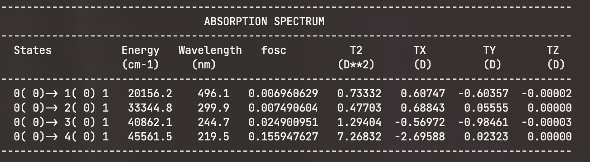
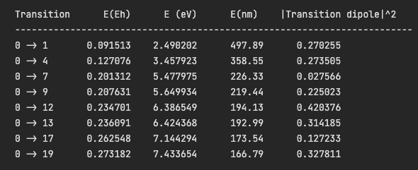
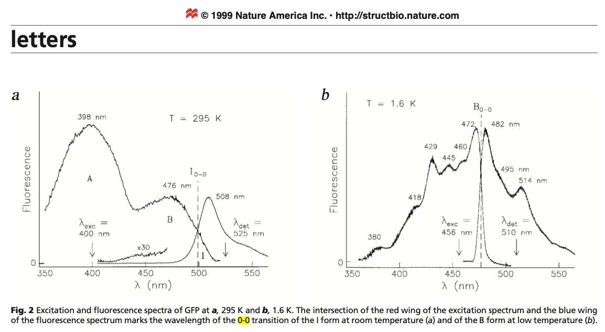

# November 2022

## Tuesday 1st November

The BODIPY RI-SOS-PBE-QIDH freq job finally finished!!! but as it turns out there's three very large, negative frequencies, and as a result the 0-0 transition energy was something like 24 eV... The interesting thing though is that the vertical transition energy is still only 2.68eV

I *am* heading into the office today, and I'm *hoping* to be able to work on a presentation for the group, with a few little figures. I think that's probably going to be a good way to get my brain dump on the page without focusing too much on how I'm structuring my writing.

I ended up slamming out my risk assessment in the afternoon and got it approved. I also worked on some figures which was good!

## Wednesday 2nd November

Today is turning out to be surprisingly productive! I've been working on this presentation which is very much showing my just how much knowledge I've actually absorbed through this process.

I'm definitely going to record my presentation to the group and upload it as well! 

## Thursday 3rd November

Today is a big PD day, I have a PhD project management workshop from 9:30-12, and the 'queers in science symposium' from 10-7.

I've been assigned my exam marking as well and will try and slam that out in the next week (600+ students, 2-3 questions... wooo!)

## Friday 4th November

Today has just been exam marking.

## Sunday 6th November

I watched a few videos on python dataclasses this morning, and subsequently spent the rest of my day refactoring all of my code :sweat_smile:

I did also write a script to be able to quickly screen the fluorophores to see how much multireference character they have. This was kinda cool actually because I learned that the occupations are the real component of the diagonalised MO density matrix! (I should have known really...)

## Monday 7th November

I got the CASSCF script up and running and am testing it with indigo carmine and azulene to see how it performs. aug-cc-pvdz seems to have issues with convergence, so I'm using 6-31+G(d). the active space scales from (4,4) to (8,8) to see how it changes

I ended up doing a whole lot of work on the presentation this afternoon/evening

## Tuesday 8th November

Waking up at 6am (unintentionally) meant that I could review a few of my slides about equilibrium and non-equilibrium in SS and LR approaches, which has raised some concerns with my understanding...

In a big turn of events, after a group meeting in which it was decided that we need to fix up the group website and documentation, I've spent my morning re-building the whole thing in mkdocs-material

Well that turned into a 13 hour day, but I've got the new website [up and running on NecTAR](http://203.101.227.153). Once the DNS is fixed, I'll need to set up SSL with certbot as well.

## Wednesday 9th November

Well I'm back at the office, feeling very drained and sore, and I think I've figured out the dilemma that's been fucking with my ability to understand non-eq.

## Thursday 10th November

From meeting with Katya:

* Present to Michelle at the collaborator meeting next Wednesday
* Put the Monash logo in the header of the website
* Add Gamess to software list

* Prepare for discussion with michelle
* How can we elucidate the number of determinants that we need in casscf to completely converge the correlation, and how can we relate that back to the correlation from DFT?
* Check CISD for red blue shift

## Friday 11th November

Today is the $M^4$ (Melbourne Meeting of Molecular Modellers), so I've managed to sneak in. I might take some notes in this space. 

=== "Lars Goerigk"
	

	**Tackling valence excitation energies with time-dependent DFT: tips, warnings and latest developments**
	
	* Fantastic breakdown of the TD-DFT eqn where:
	
		* $A=$ Matrix of single particle excitations
		* $B=$ Matrix single particle de-excitations
		* $X=$ Vector of single particle excitations
		* $Y$= Vector single particle de-excitation
		* $\Delta E=$ vertical excitation energy
		* $A$ and $B$ rely on converged ground state orbitals and exchange-correlation
		* Ignoring B gives the TDA
		* Adiabatic approximation - XC kernel is time-independent
	
	$$
	\bigg(\begin{matrix}A&B\\B&A\end{matrix}\bigg)\bigg(\begin{matrix}X\\Y\end{matrix}\bigg)=\Delta E\bigg(\begin{matrix}1&0\\0&-1\end{matrix}\bigg)\bigg(\begin{matrix}X\\Y\end{matrix}\bigg)
	$$
	
	* ω adds a red-shift, CIS(D) adds a blue shift, so ωB97X-D is only really good becasue of error cancelling. Solvation seems to break this.
	* TDA is vital for Triplet instabilities
	* Spin component scaling is a method used to reduce the over-counting of correlation, since HF does include some correlation by default, but it is different for electrons of opposite and same spin
	
		* SOS is a slightly faster version that only scales the *opposite* spin terms
	* Range separation in exchange is more important than using CIS(D) correlation
	
	**Dispersion Corrections**
	
	* Dispersion corrections are not designed for the excited state - there is a need for this.
	* Dispersion is dependent on $C^6$ term which is dependent on polarisability, which will be different between the gorund and excited state
	
	**Question:** The reccomendation for using double hybrids for excitations, does that also extend to optimisation? both for the ground and excited state 
	**Answer:** no gradients, so use range separated hybrids for geom opts and double hybrids for excitations.

## Saturday 12th November

* [x] To do: Write a PySCF script for casscf opt (hopefully it will be more stable than psi4)

This has actually been a full, productive day, though I decided that PySCF is a mess for opts, so I've separated out my gas phase opts into ORCA jobs that my PySCF builder will read from.

## Sunday 13th November

I decided that it was time to [push my resources module to gihub](https://github.com/adreasnow/es-and-monarch-handler). I've also been doing some cleanup, pushing more jobs through and kicking off timed out jobs. This first round of opts will be the slowest, but for future jobs, I'll have a solid starting point to be able to work from, so the geometric changes shouldn't be quite so drastic.

I'm still trying to break down what's actually going on with fast/slow separation, so I'm running a few q-chem jobs on Gadi to figure it out:

#### From the examples:

emission energy from 

`ChargeSeparation = Excited` and `StateSpecific = 1` --> `StateSpecific = Marcus`

1. Do slow-fast charge separation es 1.
  * I think this is calculating the ES slow and fast charges in eq via SS, and partitioning them
2. Run self-consistent SS method in the ground-state with **a given** slow polarization charges.
   * Then the SS=Marcus line takes the ES slow charges and calculates the GS fast charges
   * I'm not sure what the reference wfn is though. It seems to be doing another TD-DFT calc, but I don't know for sure if it's 

From the Herbert review:

> "in which the fast component of the polarization remains in equilibrium with the solute even upon sudden change in its charge density. The slow polarization is frozen on this timescale, at the value determined by **equilibrium solvation of the initial state**."

Reading deeper, this seems to be making a difference between eq solvation and SS neq solvation, as in, the separation between the fast and slow is different. In the equation here this is not referring to the excited and ground states, but rather the initial state (0).

$$
\begin{align*}
\sigma_0^f&=\bigg(\frac{\varepsilon_\infty-1}{\varepsilon_s-1}\bigg)\sigma_0\\
\sigma_0^s&=\bigg(\frac{\varepsilon_s-\varepsilon_\infty}{\varepsilon_s-1}\bigg)\sigma_0
\end{align*}
$$

In this formalism, the slow charges are kept from the initial state and the fast charges are allowed to be polarised 

## Monday 14th November

So I think I've polished up the presentation enough, but I need to double check a few things before I'm done.

I also checked to make sure that my OBS recording setup would work in the meeting room. It does :slightly_smiling_face:

I think I double checked enough, so I spent the rest of my day writing documentation for the group wiki!

#### To Do

* [x] Read up on more non-electrostatic terms for excited states
  * I've found a few, but they're not much better than SMSSP
* [x] Look in to cLR gradients
* [x] Prepare for meeting with Michelle
* [x] Document notifications from SLURM

#### To add to thesis

* Statement of self including biases, beyond just political and commercial affiliations.

## Tuesday 15th November

!!! info "I gave my presentation!!!""
	
	<iframe width="80%" height="500" class="center"src="https://www.youtube-nocookie.com/embed/zROvvWNex8M" title="YouTube video player" frameborder="0" allow="accelerometer; autoplay; clipboard-write; encrypted-media; gyroscope; picture-in-picture" allowfullscreen></iframe>
	
	This was a talk I gave to my research group in preparation for my first PhD milestone. I wanted to make sure that I understood the content, and the best way to do that is to teach it. It’s a resource that I wish I had seen when I first started my PhD, so I hope that it’s of use to somebody.The talk itself is about polarisable continuum (PCM) models for solvation, how they are built for the ground state, and how they can be extended for use in excited state research as well.

??? info "Slides"
	<object data='https://adreasnow.com/PhD/Notebook/presentation_slides.pdf' type="application/pdf" width="80%" class="center" height="500"></object>

After this, I had to fix some issues with the mccg website, and worked on getting failed jobs back to limping along.

## Wednesday 16th November

Had a really full on meeting with Michelle and Katya that left me feeling a bit deflated, but was really useful for revising the dataset/methodology.

## Thursday 17th November

It's been a really difficult day, but I spent a few hours working on the dataset. 

## Friday 18th November

I've been re-organising my notes, and deciding which species I want in my dataset. I think I have a decent collection, I just need to  go through each species and write some notes on them.

Apart from that, I did very little today. I tried to write some code to deconvolute UV-Vis spectra, but I realised that it's not really something that we should even attempt. it just doesn't make sense to do

## Saturday 19th November

I know it's a Saturday, but I've still been busy working. I wrote a pyscf script to optimise CASSCF geom and plot the orbital occupations to assess how big the active space needs to be.

## Monday 21st November

I'm starting my fluorophore specific reading a finding a lot of good info and tips!

## Tuesday 22nd November

Today was a big catch up with one of Katya's collaborators in Germany - Ralf. I also did some more digging on Rhodamine 800.

I came to a painful realisation about how I've been doing CASSCF calculations as well, in that I've been doing state specific calcs for opts, but it looks like I should be doing state averaged and just following the specific state.

I think my misunderstanding in this was that SA-CASSCF *does* keep different weights for each state, but uses a linear combination of these to build the full MR wavefunction. In PySCF though, (according to the documentation) you have to do a subsequent CASCI job to calculate all the excited state wfn from the CASSCF orbitals to feed into a following NEVPT2 calc.

## Wednesday 23rd November

S-HPC seminar today was good, got chatting to some interesting people. Apart form that, I've been trying to figure out these CASSCF calculations still. They're completely inconsistent between ORCA and PySCF, so I'm having to go back and forth to figure out what each is doing (or not doing).

Wait... Is ORCA culling states? That's the only way I can see these calculations being equivalent...

{class="center", style="max-width: 60%;"}

When I cull out all the states that have a negligible transition dipole moment, this is what I get!

{class="center", style="max-width: 60%;"}

## Thursday 24th November

I came across a really useful tool by Truhlar for identifying whether you need to treat a species with MR character, called the m-diagnostic

DOI: [10.1021/ct800077r](https://doi.org/10.1021/ct800077r)

* Perform a large enough active space CASSCF calculation
* $M \geq 0.04$ need MR treatment (ref [10.1021/ct500775r](https://doi.org/10.1021/ct500775r))
* With respect to the dominant determinant (occupation from SR Calculation):

  * $n(MCDONO) =$ occupation of the most correlated doubly occupied natural orbital
    * The least occupied doubly occupied natural orbital

  * $n(MCUNO) =$ occupation of the most correlated unoccupied natural orbital
    * The most occupied unoccupied natural orbital

  * $n(SONO) =$ occupation of any singly occupied natural orbitals

$$
M=\frac{1}{2}\bigg(2-n(MCDONO)+\sum_{j=1}^{n_{SOMO}}|n(j)-1|  +n(MCUNO)\bigg)
$$

!!! info
	I think the easiest way to describe what this value represents is how much of the expected electron configuration is shifted from the centre point of occupation (the HOMO/SOMO/LUMO region), in units of electrons. So $M=0.2$ indicates that 0.2 of an electron has shifted from the HOMO/SOMO --> LUMO or from the HOMO --> SOMO/LUMO.

## Friday 25th November

Meeting with Katya was good. I found the answers to most of my questions which is helpful, but I now need to just get on with writing. I have my Project proposal to write (for the change of project form) and I have to write my IPR.

Lab induction also went well, I should have access to both Toby's sample prep/spectroscopy lab, and his optical room, which might be useful for time resolved fluorescence studies.

Proposal has been written and I'm just waiting on Philip chan to get back to me with his his signature. I also managed to figure out how order chemicals, and have some 1-octanol on the way!

* [x] [Prepare for Lab Induction](https://sites.google.com/monash.edu/chem/ohs-compliance?authuser=1)

  * [x] Please ensure you have an active Monash account and consult/meet with your supervisor.

  * [x] Watch the University OHS Induction video located in the my.monash portal under HR & Employment/myDevelopment/Browse for Learning - Mandatory Compliance Training. *please note the link is available 24-48hrs after enrolment. Research students can access the University OHS Induction Video via this link ([http://www.intranet.monash/staff-development/myDevelopment/student-access](http://www.google.com/url?q=http%3A%2F%2Fwww.intranet.monash%2Fstaff-development%2FmyDevelopment%2Fstudent-access&sa=D&sntz=1&usg=AOvVaw1K18i4UJFoGOUy7moAKVCF)).

  * [x] Complete the online [School of Chemistry OHS Induction Module](http://www.google.com/url?q=http%3A%2F%2Fsafety.chem.monash.edu%2Fchem%2F&sa=D&sntz=1&usg=AOvVaw3Xr9ksSyw-aoM2WEqskeXw)[.](http://www.google.com/url?q=http%3A%2F%2Fsafety.chem.monash.edu%2Fchem%2F&sa=D&sntz=1&usg=AOvVaw3Xr9ksSyw-aoM2WEqskeXw) This will take approx. 45 mins. You must submit the completion form at the end.

  * [x] Undertake a face to face building induction with your supervisor or delegate as directed by your supervisor and then complete the [General OHS/Building Induction Form](https://forms.gle/Qm39B37MGRJLN75o9)

  * [x] **Print and complete** the  [Lab OHS Form](https://drive.google.com/file/d/1mibF0DLNO-q1aVCnqjjDZM9LDbVVueM7/view?usp=sharing)  with safety officers signing on completion and sign up for OHS training as required (see below) specific to your labs in consultation with your Lab Head/ Manager or School Safety Officers.

    * [x] Once the Lab OHS forms are completed please email a copy to [chem-operations@monash.edu](mailto:chem-operations@monash.edu). 

      You will be granted access to the School buildings & facilities on completion of all the above forms.

  * [x] [Online Risk Assessment](https://www.google.com/url?q=https%3A%2F%2Fwww.monash.edu%2Fohs%2Fsarah%2Freport-incident-hazard%2Frisk-management-and-work-safe-instructions&sa=D&sntz=1&usg=AOvVaw0shBIkJwoh2ORnKzV6zTj1) for your proposed laboratory work via the [SARAH system](https://www.google.com/url?q=https%3A%2F%2Fwww.monash.edu%2Fohs%2Fsarah&sa=D&sntz=1&usg=AOvVaw0Y1rfr_RSe739_MBIO-3BO) and refer to the [Chemistry Risk Assessment procedure](https://docs.google.com/document/d/1N4GqTDviMqgkLTJgbRo8KuDFRnAvrht8/edit?usp=sharing&ouid=112723987336660940990&rtpof=true&sd=true). Please ensure you add Dr. Craig Forsyth or Dr. Boujemaa Moubaraki (Safety Officers) as reviewers so they can check your risk assessments. It would be preferred to consult with the Safety officers prior to filling out your online Risk Assessment. 

  * [x]  Make your access key deposit online through the [Monash Shop](https://www.google.com/url?q=https%3A%2F%2Fshop.monash.edu%2Fkey-deposit-for-labs-and-offices.html&sa=D&sntz=1&usg=AOvVaw0ifEfPtUC2b_KfV4VtJSAN). The deposit required to secure one key is \$20, for two or more keys however, this is capped at \$40. When you return the keys, the deposit is refunded back via the shop. 

  * [x] Once all the above are completed  you can apply for access to the School buildings by completing the  [Access & Key Request Form](https://forms.gle/8fmfjg3GSbmHppEX7).

#### From Meeting:

* Email Philip, ask for Bayden and Allison on my panel.
* DFT will be fine, as long as the errors are systematic

#### Notes for Katya

* Slack Education has been approved
* Should I drop everything and just focus on IPR?
* Not sure of the best way to do CASSCF. 
  * Nothing seems to have ES opts for CASSCF, is this just SA-CASSCF with all the weights set to 0 except for 1 for the root of interest?
  * Can use M-diagnostic of Truhlar to determine level of MR character?

* Updated Thesis title?

  * So I can get an appropriate panel
  * "Untangling Implicit Solvation for Quantum Modelling of Excited States; Can we do Better?"

* Talk about dataset selection

  * Should we get rid of h-bonding solvents unless they're needed to cover the dielectric spectrum?

    * I feel like this is removing the chemical diversity that we want though!

  * Which species are less suitable

    * Should I completely cut certain classes that we know are unsuitable
    * Should I cut anything with too high of an MR character?

      * I feel like this would eliminate my whole dataset.

* If we want to be comparing the whole spectra, we need to be doing excited state dynamics to resolve proper band shapes. The point of using 0-0 transitions is that you're avoiding the adiabatic vertical transition approximation, and thus reducing errors.
  * ESD is only available as G09 addons, or in ORCA
* Discuss the 0-0 transition dilemma
  * Yes, I did get grumpy and do a deep dive. This is everywhere and seems to be very fundamental.
  * The key takeaway is that the 0-0 from intersection of spectra comes as the product of the harmonic oscillator approximation
    * This only seems to break down in non-realistic systems

??? "My Findings"
	
	> "*E*0–0 values are directly comparable with the experiments because they correspond to the intersection point between the absorption and emission spectra, as long as the latter spectra are correctly normalized to the intensity change with emission wavelength."
	
	DOI: [10.1039/B902315A](https://doi.org/10.1039/B902315A)
	
	> "Both the theoretical solvent-shift and the difference between vertical and 0–0 excitation energies, were subtracted from the experimental 0–0 transition energy yielding an ‘experimental’ gas phase vertical excitation energy (see section 3.2.1 for a more detailed discussion)."
	>
	>
	> "Experimental 0–0 excitation energies for the five dye molecules were determined from the intersection of absorption and emission spectra[40–44](https://pubs.rsc.org/en/content/articlelanding/2009/CP/b902315a#cit40) in solution. The solvent-shifts are estimated from the difference between the computed vertical excitation energies in the gas phase and in the corresponding solvents used in the experiment. These were calculated with the GAUSSIAN 03 program using the PBE0[45](https://pubs.rsc.org/en/content/articlelanding/2009/CP/b902315a#cit45) hybrid functional, the 6-31G* basis set[46](https://pubs.rsc.org/en/content/articlelanding/2009/CP/b902315a#cit46) and the IEFPCM continuum solvation model.[47–51](https://pubs.rsc.org/en/content/articlelanding/2009/CP/b902315a#cit47)"
	>
	> * Coumarin 153
	> * Oxazine 9
	> * 6,6’-difluoro-indigo
	> * (E)-(2-phenylazo-phenyl)bis(pentafluoro- phenyl)borane
	
	> This seems to just be a common knowledge approach to 0-0 transitions that appears everywhere in the literature
	> {class="center", style="width: 60%;"}
	
	>[mattermodeling.stackexchange](https://mattermodeling.stackexchange.com/a/9346)
	>
	>"Yes, the absorption maximum is usually close to (but not necessarily exactly equal to) the vertical excitation from the ground state, due to the Franck-Condon principle. However, this does not mean that the 0-0 excitation energy is not experimentally measurable. The point is that, when one approximates the ground and excited state potential energy surfaces as quadratic surfaces with the same quadrature, one can show that the 0-0 energy is exactly the average of the Franck-Condon absorption energy and the Franck-Condon fluorescence energy. Therefore, one can derive an experimental estimate of the 0-0 energy from an average of the experimental absorption and fluorescence energies. Some similar but slightly different alternatives are (1) averaging the absorption and fluorescence wavelengths instead (which is not equivalent to averaging the excitation energies due to the non-linear relationship between wavelengths and excitation energies), and (2) plotting both the absorption and fluorescence spectra, find the intersection point of the two spectra, and read off the corresponding excitation energy. I'm not sure which of the three strategies is the best, but mathematically they should give quite similar results for systems whose Stokes shift is not too large; when the Stokes shift is very large, all methods should become unreliable since the quadratic approximation of the PESs break down (EDIT: this holds for most, if not all, realistic molecular PESs, but does not necessarily hold for artificial PESs, such as those that are by construction globally quadratic. Thanks Hans Wurst for pointing this out)."

## Saturday 26th November

I'm plonked in a cafe and am on the hunt for some gas phase fluorophores! So far I have:

* 8-methoxy-BODIIPY - I found a bunch of BODIPYs in the paper, but this had 0-0 transitions and wasn't too small
* Fluorescein
* Rhodamine 575 - this means that we have multiple xanthenes though...
* Azulene - 0-0 only though...
* Coumarin 153

## Sunday 27th November

Surprise, surprise, I'm working today as well :sweat_smile:

I put my deconvolution code to good use and used it to extract data from some spectra form a paper (instead of eyeballing the values). They were in good agreement with other papers, but provided other useful info.

After taking some me-time, I've also been trying to verify those spectra with some CASSCF calculations, which has helped me to understand ORCA's CASSCF implementation. I still have no idea why PySCF seems to give such weird results with so many more roots...

## Monday 28th November

I took a look through one of my PySCF log fines and I think the problem is that it's been optimising for singlets AND triplets, so I'm trying some "spin fix" techniques to force it to only do singlets.

Yeah, ^this worked.

## Tuesday 29th November

GAH, yes, I know I'm procrastinating on my IPR :unamused:

Results from PySCF CASSCF/NEVPT2 Testing (all are solving for 3 states)

|                | Exp. | def2-tzvp | def2-tzvpd | cc-pvdz | aug-cc-pvdz | cc-pvtz |             aug-cc-pvtz             |
| -------------- | ---- | :-------: | :--------: | :-----: | :---------: | :-----: | :---------------------------------: |
| CASSCF 0 --> 1 | 1.77 |   2.74    |    2.73    |  2.21   |    2.44     |  2.81   |                2.43                 |
| CASSCF 0 --> 2 | 3.56 |   4.76    |    4.75    |  4.50   |    4.59     |  4.84   |                4.59                 |
| CASSCF 2 --> 0 | 3.36 |   3.70    |    3.68    |  3.77   |    3.70     |  3.77   | dnf |
| NEVPT2 0 --> 1 | 1.77 |   2.78    |    2.77    |  2.52   |    2.42     |  2.81   |                2.42                 |
| NEVPT2 0 --> 2 | 3.56 |   4.58    |    4.56    |  4.34   |    4.23     |  4.59   |                4.23                 |
| NEVPT2 2 --> 0 | 3.36 |   3.81    |    3.94    |  3.85   |    3.74     |  3.85   | dnf |

Results from ORCA CASSCF/NEVPT2 Testing

|                  | Exp. | cc-pvtz | aug-cc-pvtz |
| ---------------- | ---- | :-----: | :---------: |
| CASSCF 0 --> 1   | 1.77 |  1.94   |    1.93     |
| CASSCF 0 --> 2   | 3.56 |  4.39   |    4.38     |
| CASSCF 2 --> 0   | 3.36 |  3.54   |    5.87     |
| CASPT2 0 --> 1   | 1.77 |  2.05   |    2.04     |
| CASPT2 0 --> 2   | 3.56 |  3.85   |    4.08     |
| CASPT2 2 --> 0   | 3.36 |  3.40   |    3.53     |
| NEVPT2 0 --> 1   | 1.77 |  2.30   |    2.29     |
| NEVPT2 0 --> 2   | 3.56 |  4.06   |    4.04     |
| NEVPT2 2 --> 0   | 3.36 |  3.65   |    3.54     |
| QDNEVPT2 0 --> 1 | 1.77 |  2.44   |    2.43     |
| QDNEVPT2 0 --> 2 | 3.56 |  3.93   |    3.92     |
| QDNEVPT2 2 --> 0 | 3.36 |  3.64   |    3.56     |

I *started* my IPR!

Now to write more than one paragraph...

## Wednesday 30th November

Results from PySCF CASSCF/NEVPT2 Testing

|                | Exp. | def2-tzvp - ss - regular conv | def2-tzvp -  tight conv |
| -------------- | ---- | :---------------------------: | :---------------------: |
| CASSCF 0 --> 1 | 1.77 |             3.02              |          3.01           |
| CASSCF 0 --> 2 | 3.56 |             5.16              |          5.16           |
| NEVPT2 0 --> 1 | 1.77 |             2.91              |          2.91           |
| NEVPT2 0 --> 2 | 3.56 |             4.67              |          4.67           |

Results from PySCF CASSCF/NEVPT2 Testing

|                | Exp. | def2-tzvp - 3 states | def2-tzvp - 10 states | def2-tzvp - 20 states |
| :------------: | ---- | :------------------: | :-------------------: | :-------------------: |
| CASSCF 0 --> 1 | 1.77 |         2.74         |         2.68          |         2.57          |
| CASSCF 0 --> 2 | 3.56 |         4.76         |         4.81          |         4.72          |
| CASSCF 2 --> 0 | 3.36 |         3.70         |         3.87          |         3.66          |
| NEVPT2 0 --> 1 | 1.77 |         2.78         |         2.59          |         2.56          |
| NEVPT2 0 --> 2 | 3.56 |         4.58         |         4.23          |         4.19          |
| NEVPT2 2 --> 0 | 3.36 |         3.81         |         3.88          |         3.72          |
|  M-diagnostic  |      |      0.86/0.89       |      0.914/0.78       |       0.93/0.86       |

I had a chat with Sakol, and he really helped me with my intro structure. After this HPC seminar, I'll need to sink my teeth in to writing.

## To Dos

* [x] Start on IPR

* [ ] Read cLR geom paper [10.1039/C4CP03919J](https://doi.org/10.1039/C4CP03919J)

* [ ] Write geom LERPing script

* [ ] Write notes on **each** fluorophore in the dataset
  * [x] Rhodamine 800
  * [ ] NDI
  * [ ] Napthalamide
  * [ ] Prodan
  * [ ] DAPI
  * [ ] Coumarin 120
  * [ ] Nile Red
  * [x] BODIPY 493/503
  * [ ] Dansyl Amide
  * [x] Azulene
  * [ ] Indigo Carmine
  * [x] 1-aminoanthraquinone
  * [x] 7-azaindole
  * [ ] Anthracene

* [ ] Exclude species that we don't want

* [ ] Investigate potential new species list

* [ ] Develop a casscf/caspt2 workflow for my fluorophore testing

  * [ ] Once the dataset is finalised, identify the active spaces for the molecules with IBOView
  * [ ] Then do some basis set benchmarking
  * [ ] Try linearly interpolating between states

  

* [x] Write proposal for project change

* [x] [Gaussian deconvolution in python](http://emilygraceripka.com/blog/16)

* [x] Lab induction and key request

* [x] Email Rosie about equipment training

* [x] ==test this^== (do you need a CASSCI job to feed the NEVPT2 job, or is CASSCF enough?)

  1. SS-CASSCF opt for geom
  2. SA-CASSCF to optimise orbitals
  3. CASCI with nstates to get all the states out

* [x] Read up on the 0-0 transition form intersection of spectra

  * I can't find the origins of this idea, but it looks like you have to normalise the fluorescence to the absorbance to make it work

* [x] Look into "linear interpolation of internal coordinates" to search for crossing points.

  * This seems to just be linearly interpolating form one state geometry to another in both excited states, checking the energy at each step and seeing if there's any intersections in the PES.
  * If there's no crossing, I guess that means that any vibrational relaxation requires some other energy input than just the photon.
  * It looks like you can check for $s_n \to t_n$ intersystem crossing this way as well.

## Papers

=== "COSMO double cavity"
	

	[10.1063/1.472829](https://dx.doi.org/10.1063/1.472829)
	
	Their 1993 paper doesn't seem o cover this, but the double cavity is a method that is used to account for solute charge that isn't captured in the cavity.
	
	They create another cavity 0.95x the solvent probe radius away from the initial cavity, and use this to catch any outlying charge.

​	
