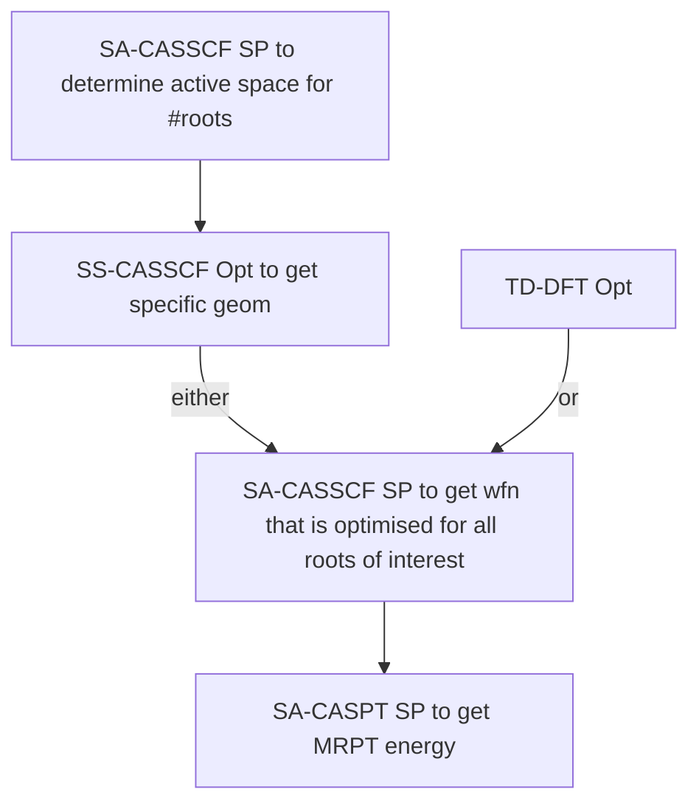
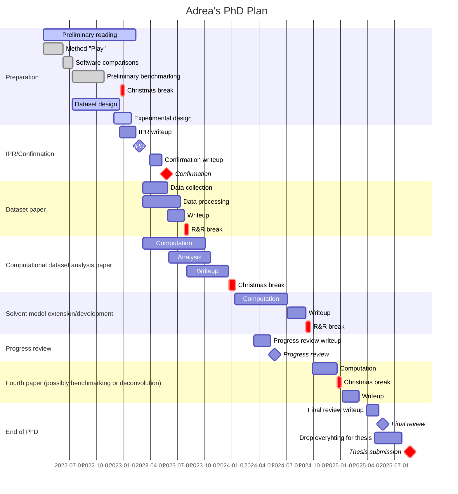
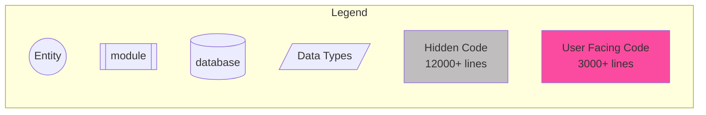
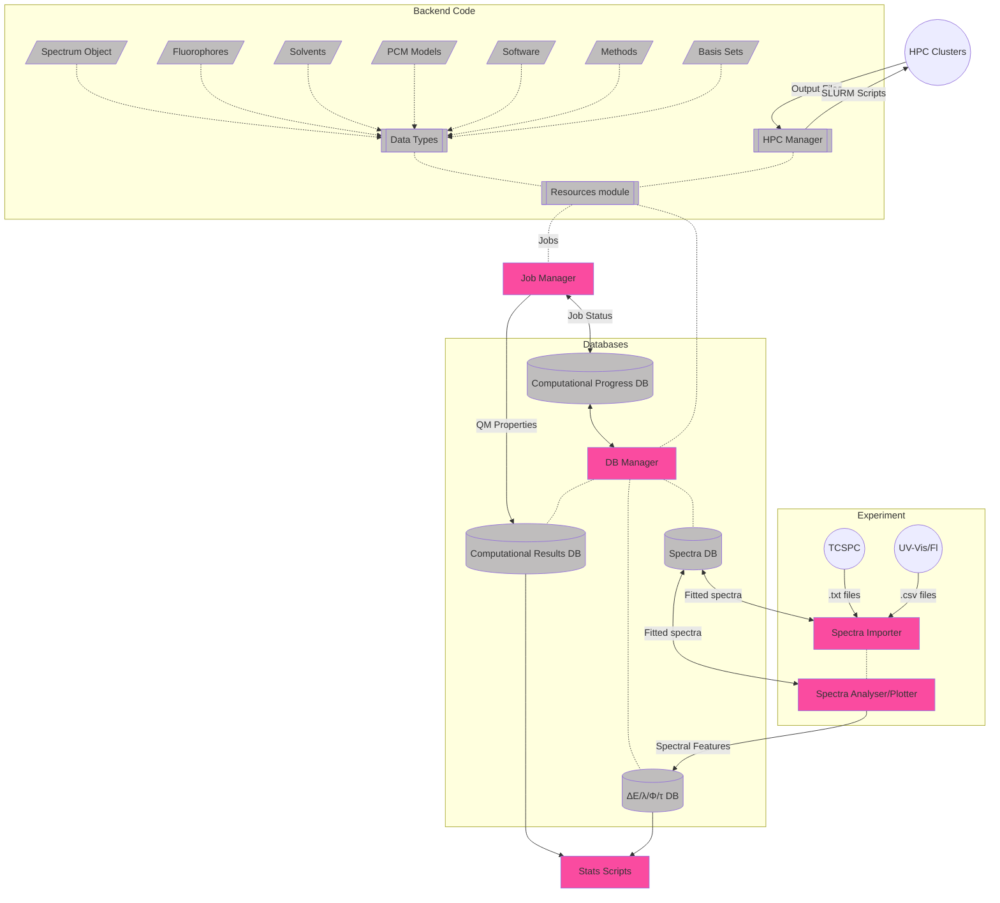

# February 2023

## Wednesday 1st February

I think I pushed myself a bit too hard yesterday, and today I had a really bad physical crash. That said, I did find out a few key details about the spectroscopic corrections, mostly that the excitation lamp corrections I was given were upside down, and had the emission corrections included, which were both very wrong. I have since fixed that and am getting better results, though there's evidence that they're not quite correct still. I'm going to talk with Toby about this, hopefully tomorrow.

## Thursday 2nd February

Just had a chat with Toby, and I think he's going to look at getting an Agilent guy out to calibrate and service the UV-Vis and Fluorimeter. He also suggested that decreasing the PMT voltage may help to reduce some of the noise that's causing errors in the low energy region. As for slit widths, they mostly help to smooth out the spectra, since more than just that one wavelength will be allowed through the monochrometer.

Today, I'm going to try and get myself into a productive headspace and try and get my IPR draft ready to send off.

## Friday 3rd February

Well I didn't manage to slam out my IPR yesterday, but I'm working from home/local cafe today, and will *try* to get it done...

Eta on my macbook is sometime next week, if it needs a full logic board replacement.

## Saturday 4th February

So I didn't get my IPR done yesterday... perhaps today? :sweat_smile:

Just sent it off!!

## Monday 6th February

I'm almost a bit lost as for what to be doing now... I could work on my IPR presentation, but I want to have a chat to some other group members first about what to include. The UV-Vis and fluorometer are booked for today, but I've booked them out for tomorrow arvo, in order to get some new QY standards from 0.05-0.01, so see if I can overcome some of the loss of linearity. I think Katya is reading my report now though, so hopefully I should get some feedback today. I can also go in and try to fill out citations on the office iMac.

Maybe I'll read those two papers I've been meaning to read (betaine 30 and cLR geoms) :stuck_out_tongue:

Hopefully Steve from eSolutions will get back my macbook back to me soon, because working on my gaming PC and iPad is very painful. 

## Tuesday 7th February

MACBOOK IS BACK!!! :smile: so naturally I've spent the day getting it back up and running.

## Wednesday 8th February

Macbook is all up and running including Psi4 and NWChem. As it turns out, NWChem supports VEM emission through `do_cosmo_vem 2` ( `do_cosmo_vem 1` is for excitation).

I meant to start work soon implementing Katya's feedback, but I spent my day trying to sort out ⍺-sexithiophene's frequencies issues and also putting together a chemdraw figure of my fluorophores.

#### Jobs I'm running

* An opt/freq test to compare staggered with flat geom in dmso
* casscf (10,10) single point of staggered asp in gas (for check before optimisation)

## Thursday 9th February

Active space on the staggered looks the same, so that's good.

Okay, looking at what's going on, gas phase opts seem to be happy to go flat, which makes me wonder if SMD is causing the issues. I'm currently testing SMD nhexane and CPCM DMSO for comparison.

## Friday 10th February

So it looks like asp goes from being staggered in the ground state to flat in the excited state.

Comparing SMD with CPCM alone, SMD definitely makes the molecule curl and stagger more. nhexane vs dmso seems to be largely identical in their geometric effects.

There's still a few negative frequencies, so I think I'm going to try to re-optimise them with an input hessian and re-do the freqs.

#### Jobs currently running:

* tddft smd dmso s1 opt and freq
* casscf gas opt s0 opt
* dft smd nhex s0 opt and freq
* dft cpcm dmso s0 opt and freq
* dft smd dmso s0 opt and freq

I'm actually making half decent progress on my IPR now :smile:

## Monday 13th February

Productive day of IPR writing! woo!!

## Tuesday 14th February

Still more writing! Though I'm feeling very groggy from coming off prozac :unamused:

## Wednesday 15th February

#### Notes form meeting with Katya:

* IPR is in a week, so focus on that
* ~~look into homoanomeric effect (sulphur diffuse electron density?)~~
  * Only for six membered rings, but thiophene is five membered

* Write notes for Laura
  * Going to check gas-phase SA vs SS CASSCF approaches to see which gives the best energy, comparing to nhexane.
* Check imaginary frequencies in staggered asp opt to see what the $>30\bar\nu$ freqs are doing
  * Disregard anything below $<30\bar\nu$
  * Compare with IEF-PCM/SSVPE/isodensity to see if it's a problem with the cavity
  * Newton-Raphson optimisation?
  * Check MOs to see how solvent changes them

## Thursday 16th February

I did manage to get a bit more done on my IPR, and made a few new figures. It was also TA training day though, and I ended up in a weirdly anxious/agitated state.

## Friday 17th February

Today I WILL finish my IPR and send it out. I have to. Conveniently, it will be 40°C until 6ish, which means that I can go to uni and stay in the air conditioned office until it's done.

Thoughts form today's writing:

* Correlating Stokes shifts of individual transitions with their state-specific polarisability
* Baseline corrections of spectra form the re-formation of convoluted spectra without the interfering broad species.

**SENT!!**

## Monday 20th February

The withdrawal is killing me, and I'm running on 4 hours sleep atm, but I've fleshed out the bones of my IPR presentation.

## Tuesday 21st February

Long day, but I got my IPR slides done, and spent the afternoon getting Laura up to speed with the project.

## Thursday 23nd February

IPR day :grimacing: (I'm sure it will be fine, but It's still a bit stressful)

asp is still causing me drama, which makes me think that there might something charge related going on, so I'm currently doing a scan of the proton on the end coming off, to see if the molecule behaves any more favourably in a deprotonated state.

I'm also testing dithiophene to see how it rotates.

bsc is also causing me issues with the CASSCF opt, so I think there might some active space issues there, so I'm trying again with a CASSCF(8,8) run

IPR is done, I did well. Feedback to consider though:

* asp is a complicated molecule and might be worth looking at the series of smaller oligomers
* Bayden suggested that I should re-consider fitting within the 2nd or 3rd derivative space.

## Friday 24th February

I ended up slamming out my derivative space fitting last night, so I need to now figure out how I want to integrate it back into my code. I'm not sure if I should extend my spectrum class to keep both the derivative space fitting *and* the re-fitted non-deriv spectrum.

#### Findings from my jobs:

* asp does go planar when deprotonated, but it's energetically less favourable to do so, somewhere around 500 kj/mol
* gas phase asp s0 CASSCF is planar and has no negative freqs
* dithiophene is stable and absent of negative freqs

## Saturday 25th February

Derivative space spectral deconvolution has been implemented

## Sunday 26th February

With my IPR over, I've decided that it's time to kick off all the old post-freq-opts, and to run CASPT2 calculations for the $s_0$ CASSCF runs as well.

Current understanding of SA/SS debacle...

Apart from looking at CASSCF/CASPT stuff, I've been getting my repos and scripts ready for Laura to be able to use next week.

## Monday 27th February

Absolutely chaotic day of getting ready for first VSEPR teaching session. I'm doing it twice again this week, but now my prep is done and the rest should go relatively smoothly! I started to help Laura get set up on monarch though which is a good start, but without Moodle access, I'm not entirely sure what to get to her to do for admin stuff.

## Tuesday 28th February

* I've decided that I don't trust the $m$ diagnostic or occupation checking for validation of active spaces for SS-CASSCF runs, so I'm redoing them as SA-CASSCF(+2,+2).
* I also have taken this opportunity to re-do the asp solvent geoms from a staggered starting point

## From meeting re Laura:

* Start on lit review asap
* What goals need to be covered, then work backwards from there
  * Focus on the broad issues, then explore the underlying issues
  * Keep description and properties of fluorophores to a minimum
* Week 3: Aims
* Week 6: Skills and knowledge 
* Week 8: Intro - draft after mid-sem (week 7)
* Week 11: Overall reflection
* Week 12: Report (in form of paper)
* Week 13: presentation

Ask Sophie to schedule practice presentation.

## Job things to do:

* CAS

  * sa-casscf jobs that need checking:
    * asp, r800, bsc
* DFT

  * [x] once asp opts finish, run freqs

  * [ ] once asp freqs finish, re-opt everything with freqs (will force them to use `angulargrid 6`)

  * [ ] repeat gs freqs

  * [ ] once all gs freqs are done, run es freqs

  * [ ] once es freqs are done,  re-opt everything with freqs
  * [ ] freqs again with hess if needed
* wB ESD from freqs

## To do:

* [ ] To read
  * [ ] Read Betaine 30 paper 10.1002/chem.201604619
  
* [ ] Jobs
  * [ ] Test QChem to figure out how to do VEM/cLR/LR/IBSF **emission**
* [ ] Code

  * [ ] Write energy extractors
    * [x] pullORCA_Freq
      * $\Delta E_{ZPVE}$
      * $\Delta E_{elec}$
      * Number of -ve freqs
      * [ ] Extend and test for CASSCF
    * [ ] pullQChem_Freq
      * $\Delta E_{ZPVE}$
      * $\Delta E_{elec}$
      * Number of -ve freqs
      * [ ] Extend and test for CASSCF
* [ ] Documentation

  * [ ] Transfers documentation
  * [ ] Contact List

  * [ ] Try lerping between states

## To Do for IPR:

* [x] Read cLR geom paper [10.1039/C4CP03919J](https://doi.org/10.1039/C4CP03919J)

## For Toby

* UV-Vis deconvolution has been explored, but it looks like people just don't seem to care that much about the component excitations. In bio, it's used to try to break down protein absorbance, but other methods that look at the band shape as a whole seem to have taken over
* There is a noticeable difference in transmission between the two good cuvettes, so I think that the rule of "use the same cuvette for blanking/baselining" needs to stand still

## GANTT Chart

## Code Object Structure

## Papers

=== "LR vs cLR Geom opts Paper"
	[10.1039/C4CP03919J](https://doi.org/10.1039/C4CP03919J)
	

	* Yes, they compared the various ES solvation models, but they used PBE0 for all of the geom opts, so there is little in the way of separation of methodological error from solvation error.
		* Their functional comparison test was only on one fluorophore, and they reduced the entirety of differences in energy to amount of HF exchange.
	* Really not sure why everything is on the nm scale, that just means that the accuracy isn't uniform...
	
	Okay, I'm really unhappy with this paper. These results are inconclusive at best. For starters, they're showing their ignorance by doing statistical analysis on wavelengths, but they're also comparing equilibrium energies with emission energies!? I'm honestly not even convinced that they haven't just used $\lambda_{max}$ for their experimental reference values...
