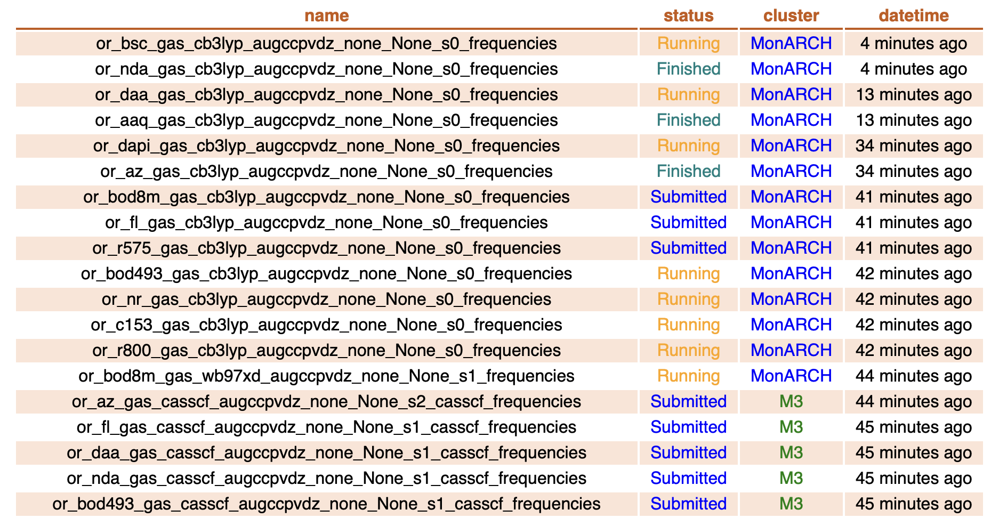
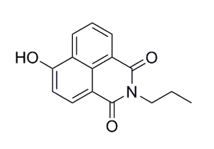
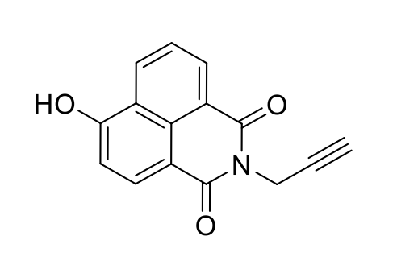
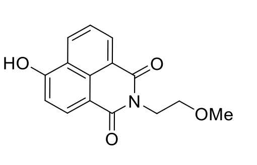
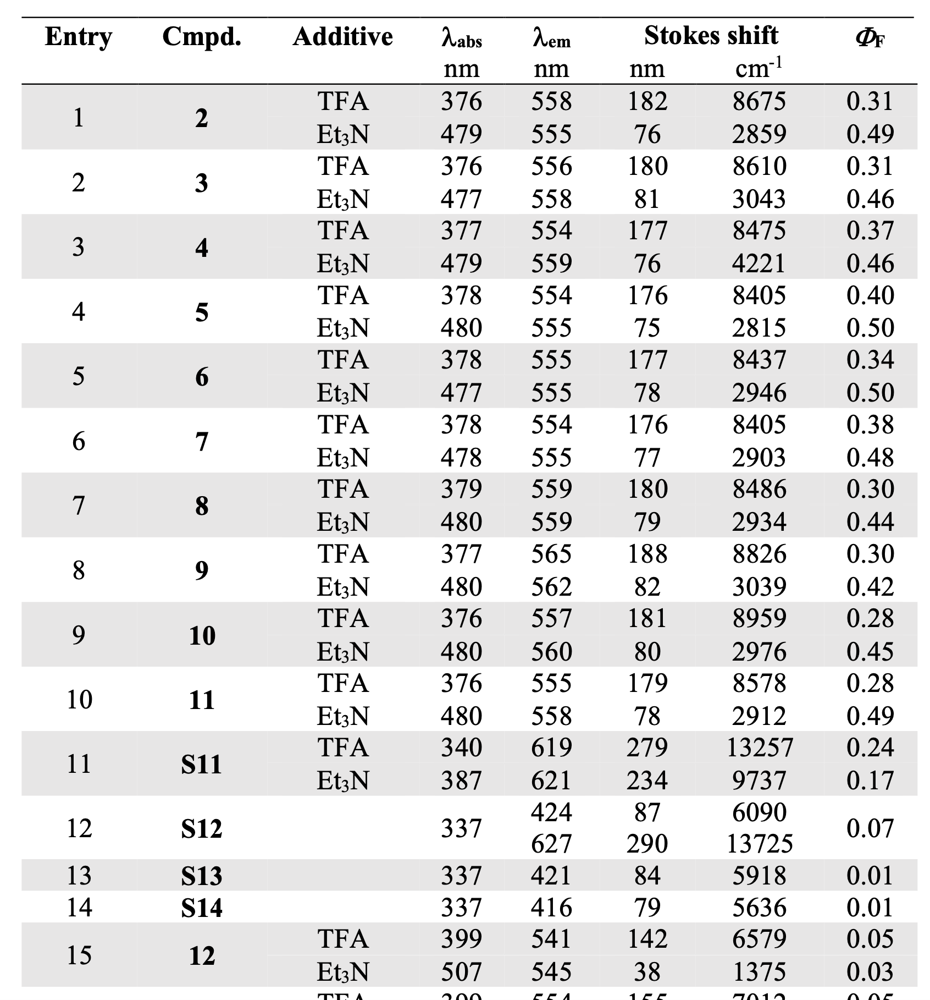
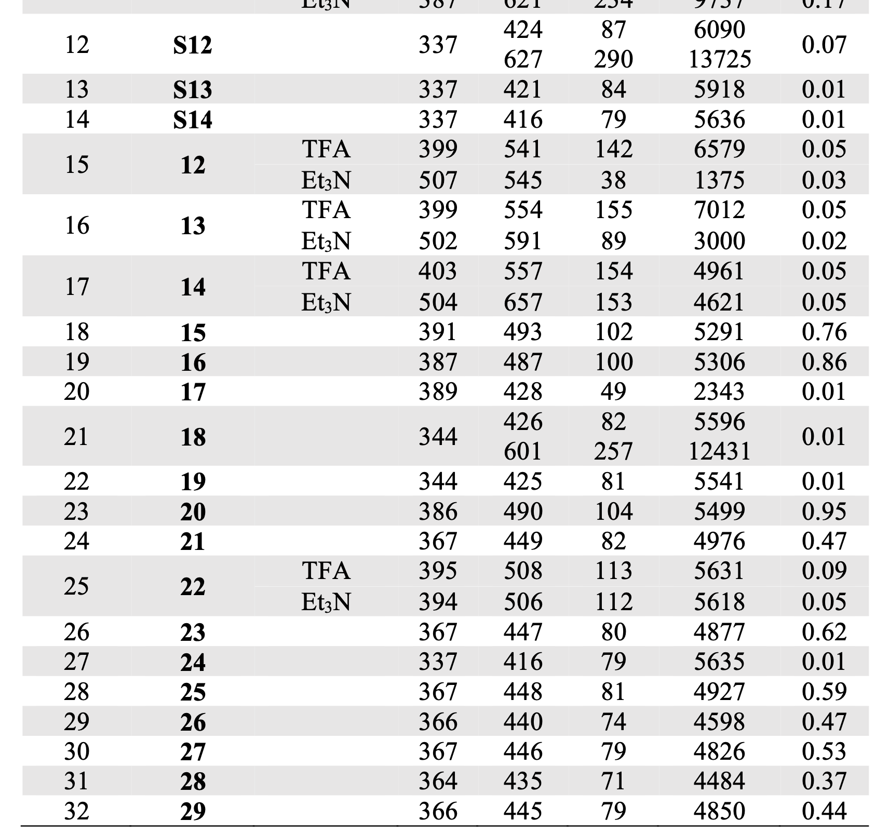
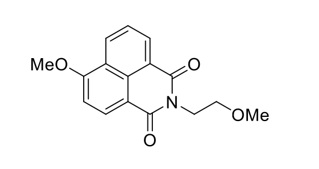
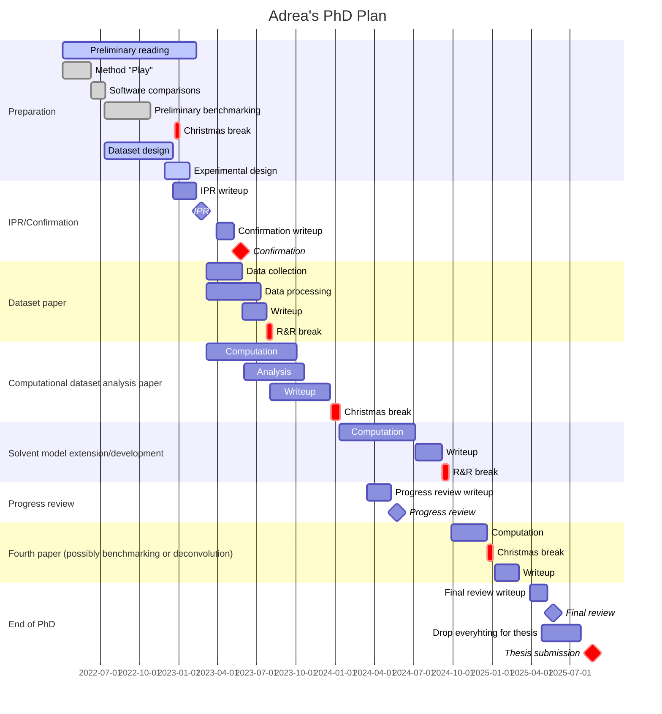
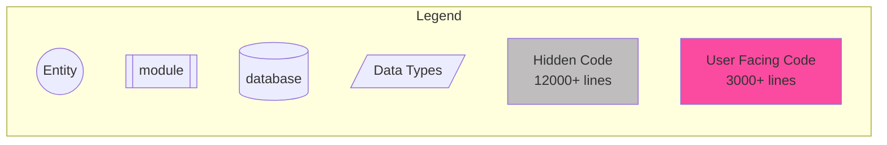
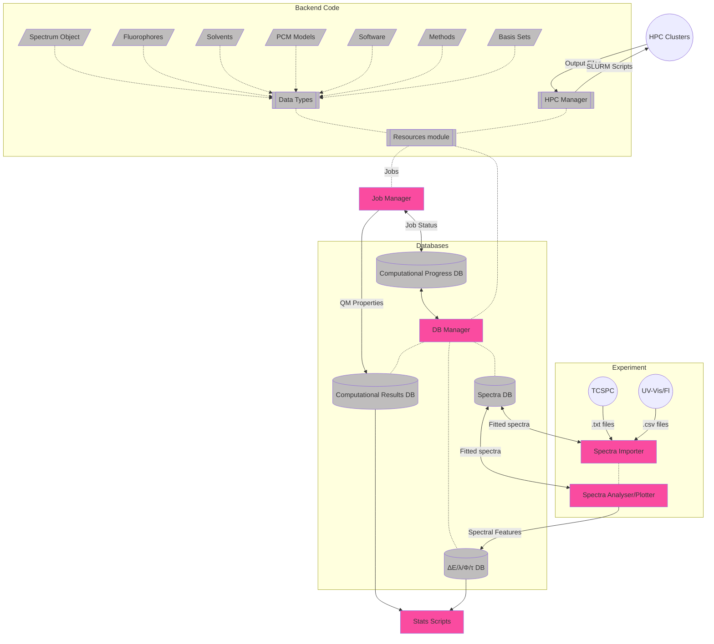

# March 2023

## Wednesday 1st March

Good day, taught Laura a lot! had a decent sleep in after all this chaos.

## Thursday 2nd March

Had a meeting with Katya and Laura about Laura's project, and then taught in the afternoon. am exhausted

### From meeting re Laura:

* Start on lit review asap
* What goals need to be covered, then work backwards from there
  * Focus on the broad issues, then explore the underlying issues
  * Keep description and properties of fluorophores to a minimum
* Week 3: Aims
* Week 6: Skills and knowledge 
* Week 8: Intro - draft after mid-sem (week 7)
* Week 11: Overall reflection
* Week 12: Report (in form of paper)
* Week 13: presentation

Ask Sophie to schedule practice presentation.

## Friday 3rd March

Finally a day where I'm not teaching!!! Hopefully I can get some work done :unamused:

* Redoing bsc jobs from an MP2 guess since they were behaving really weirdly with superci
* r800 is still going...

From meeting

* Case study of a single species with ESD in low polarity solvent
  * [x] Currently re-opt `s1` and `s2` with `calchess` and `angulargrid 6`
  * [ ] Then Freqs of all states
  * [ ] Then ESD
* +Deconvolution

I've written code additions for generation of an adiabatic hessian (hessian of other state at current state geom) and for ESD additions, and I'm waiting for some other jobs to finish before I can get these through.

## Saturday 4th March

I've been pushing through the ESD jobs and have been trying to get all the other stalled opts up and running again.

## Monday 6th March

For ESD stuff, I realised that I can use Dirac deltas instead of gaussians as my output lineshape, which means I should be able to pick the most significant peaks. I could use a convolution and pass it over to find the most significant peak

I need to write a standalone deconvolution script for Sophie:

Files to save out:

* CSV of the three specra 
  1. Processed/smoothed raw spectra
  2. Deriv space spectra
  3. Normalised spectra
* CSV with deriv space fitted gaussians (loc, amp, sigma)
* CSV with re-fitted gaussians (loc, amp, sigma)
* TOML settings file with ALL the input parameters
* Save image file

## Tuesday 7th March

Well, I felt very drained today, but I found a way to process my ESD spectra, by Gaussian smoothing the spectra and then offsetting the smoothed spectra by a Cretan amount. Any point above that line can be considered important

## Wednesday 8th March

So I couldn't sleep from like 4am, and ended up coding for the next three hours... The good thing is that the deconvolution notebook for Sophie is nearly done. I just need to write a function to export the data now.

That is done, and my module is ready for use!
https://github.com/adreasnow/uv-vis-deconvolution

I spent the afternoon helping Laura and Sophie get their work out, and managed to queue up a huge bunch of jobs to churn through.

Laura is currently calculating casscf freqs to see how good our geoms are.

## Thursday 9th March

Didn't manage to get a huge amount done today... Meeting with Katya and Laura, and I added another little feature to the deconvolution tool in order to allow for fitting of a small region, without clipping out the rest of the spectrum.

## Sunday 12th March

NWChem 7.2.0 has finally been released which makes me think that I should possibly start exploring VEM/SMSSP results, but I think I'm starting to realise that TD-DFT results are absolutely meaningless for comparing to a spectrum, without either 0-0 energies, or ESD calculations.

#### For Laura:

I think Laura is going to need to compare 0-0 energies for her work

!!! failure "FUCK!"
	So in my hormonal/withdrawal mess this afternoon, while trying to distract myself in code, I managed to rsync all my files into the aether. All gone.
	

	I grabbed what I could from Laura's folder and and trying to just focus on getting some robust gas phase computations done for now. I've started with CASSCF opts, and have queued up wB97X-D opts for the opts that are complete.
	
	Yes, I did email mcc-help to ask for them to restore my data from a backup, but I'm not sure how old it will be. I'm also working from a different directory in case they overwrite my current jobs when they restore the backup (however old it may be).

## Monday-Tuesday 13-14th March

Teaching day today... then shit hit the fan in the evening interpersonally. I'm struggling a fair bit, but I'll keep pushing through.

## Wednesday 15th March

Okay, I have an emergency appointment with the GP at Monash health and will hopefully get something to help with this stress/sleep.

We still haven't heard anything back from TCI about procuring the asp, so I've decided to cull it from the dataset. I can't find any other commercially available thiophene based fluorophores, so I don't think I'll replace it with another species.

## Thursday 16th March

So I'm taking most of the day off today, but I did notice one thing in my spectra that needs addressing. In all the spectra Laura took yesterday, there were a lot of lower energy peaks that mirrored that of the primary transition, or existed as an individual gaussian. In reading, these can be attributed to three distinct scattering phenomena:

1. [Rayleigh scattering](https://www.edinst.com/blog/raman-scattering-blog/) ($\lambda=\lambda_{excitation}$) - This is simply scattering that happens at the same wavelength as the excitation source, and can be easily accounted for by making sure there's a 10nm gap between excitation and emission recording. This appears as a single gaussian.
2. [Raman scattering (Stokes)](https://www.edinst.com/blog/raman-scattering-blog/) ($\lambda>\lambda_{excitation}$) - This appears as a single gaussian and should be accounted for in the 10nm gap for Rayleigh scattering. 
3. [Raman scattering (Stokes)](https://www.edinst.com/blog/raman-scattering-blog/) ($\lambda<\lambda_{excitation}$) - This also appears as a single gaussian but is much more difficult, since the scattered light may overlap with the fluorescence spectrum. One way to account for this is the obtain a spectrum of JUST the solvent and subtract this from the fluorescence spectrum.
4. [Second (and third) order diffractions](https://www.edinst.com/blog/second-order-diffraction/) - These appear as a copy of a part of the spectrum at a lower energy region, and include bot the fluorescence spectrum, and the three kinds of scattered light. This can mostly be accounted for by using emission filters to block out light that comes in from a greater angle to the diffraction grating. Setting the emission filter on the Cary Eclipse from "Open" to "Auto" seems to do the trick.

## Saturday 18th March

#### Thought:

Running ESD for every job to identify transitions seems a tad extreme, but what if we use gs/es hessians to figure out a vibrational state-specific transition energy.

For this approach, we'd need:

* GS hessian
* nEq ES@R(GS) hessian

From these we should be able to figure out the excitation 0-0 transition (this will be different from the Eq/Eq 0-0 for Goerigk and Grimme) and the corresponding energies for each of the subsequent higher vibrational transitions.

We're making heavy assumptions that the process will be adiabatic here though, and that the harmonic oscillator approach will hold.

To verify the harmonic oscillator, I'm running some anharmonic vibrational corrections using NWChem's VSCF module. It's slow, but we should be able to quantify some errors.

* I'm trying to reduce costs by only calculating corrections for the diagonal terms, and I'm halving the resolution form 16 displacement steps to 8 (any lower and I got weird errors)

## Sunday 19th March

I realised that I made some errors in the above protocol that have since been amended. Mostly that for this approach to work, both hessians need to be based on the starting geom (GS for excitation, ES for emission)

Also... HOLY CRAP is NWChem's TDDFT module slow! Perhaps I ned to use a smaller grid and cheaper functional...

## Monday 20th March

Teaching day. Nothing to report.

## Tuesday 21st March

I've been feeling a bunch of burnout building, so I spent my day [working on an API](https://github.com/adreasnow/apiApp) that runs on my home server and takes in job status updates to spit out a nicely formatted table of jobs, their cluster, status, and when their status last changed. I have it up and running and it looks good! (well, useful).

It was pretty easy to write the Flask and SQL app, but the hard part (that took many hours) was getting to run as a subdomain using Apache.

## Wednesday 22nd March

Another teaching day, so not much to report...

## Thursday 23rd March

Burnout recovery day, just worked on compiling NWchem better

## Friday-Sunday 24th-26th March

More burnout recovery today, but I realised a few important things while in the lab with Laura:

1. Our nda sample may not be pure
2. I'm going to need a solvent blank for EVERY fluorophore/solvent emission at every different excitation wavelength to account for Raman scattering
3. This means I need more cuvettes so that I don't constantly have to empty and blank between each reading (Toby is going to order more)
   * This can't really be mitigated with protocol work since I need to play with the excitation wavelength to get the correct peak and minimise scatter, so I need at least one more that I can get a solvent blank with.

## Monday 27th March

Another big teaching week, don't expect too much from me

## Compounds I'm getting Sophie to test:

| Code     |                          Structure                           |
| -------- | :----------------------------------------------------------: |
| NDA1 (2) |  |
| NDA2 (8) |  |
| NDA3 (3) |  |

#### New Theory

I suspect that I can't use these small NDAs that have a hydroxyl, unless I ensure their protonation state.

There are a few NDAs that don't need to be forced into a protonation state, but they are much less computationally friendly.

## I think this might need to be out new nda:

6-Methoxy-2-(2-methoxyethyl)-1*H*-benzo[*de*]isoquinoline-1,3(2*H*)-dione

* $\Phi$ (DMSO) = 0.47
* $\lambda_{max}^{abs}$ (DMSO) = 367
* $\lambda_{max}^{fluor}$ (DMSO) = 449

## Tuesday 28th March

#### NWChem Testing (all performed with 8 cores 16GB on `hi01`)

| identifier                    | fialed tests (qm subset) | CPU Time | Wall Time ⬇︎ | efficiency |
| ----------------------------- | :----------------------: | :------: | ----------- | ---------- |
| -f90                          |                          |  1166.0  | 1169.5      | 99.7%      |
| -knl                          |                          |  1207.2  | 1211.3      | 99.7%      |
| -                             |                          |  1280.5  | 1286.4      | 99.5%      |
|                               |                          |          |             |            |
| **knl+f90**                   |                          |          |             |            |
| -openib-full-gcc10 (simint)   |    5  (./doalltests)     |  959.6   | 970.8       | 98.8%      |
| -openib-full-gcc10 (nosimint) |    5  (./doalltests)     |  966.6   | 978.0       | 98.8%      |
| -openib-full                  |     6 (./doalltests)     |  1011.9  | 1019.8      | 99.2%      |
| -openib                       |     37 (./doqmtests)     |  1019.7  | 1028.1      | 99.2%      |
| - (armci)                     |     38 (./doqmtests)     |  1226.0  | 1229.9      | 99.7%      |
| -mpipr                        |     37 (./doqmtests)     |  1292.9  | 1336.3      | 96.7%      |

## Wednesday 29th March

There's a few coding things I need to implement:

* [ ] QY saving to db
* [x] Solvent blanking (for Raman scatter removal)

## Thursday 30th March

Dave seems to think the fluorometer is okay, but wants to re-do the correction curves. Theres'a an unreliability in the wavelength accuracy, though with errors of ~1.2nm (*just* within spec of the instrument.)

## Friday 31st March

Marking is done for this teaching cycle, I might go in to the lab later and collect some more data.

#### From meeting with Katya:

* Drop QY entirely
* Should be able to get transition oscillator approximation by measuring the overlap between GS ZPVE dipole and ES $v=n$ dipole derivative
* HT should have a geometric approximation
  * https://escholarship.org/content/qt33c9b7zs/qt33c9b7zs.pdf?t=rb3s6h
* Excitation spectra is probably better to use than absorbance for deconvolution, since it's going to give us fewer peaks and thus cleaner data.
  * Need to account for this in our oscillator overlap as well - transition probability of both up and down.

## Questions I'm currently trying to answer

* Can we use frequency calculations directly to think about the individual transitions?
* How significant is anharmonicity in effecting transition energies?
  * Even if it's significant in overall thermodynamic properties, do the errors cancel out when considering both GS and ES PES anharmonically?
* In investigating 0-0 transition energies, what is the most correct formal approach?
  * ~~Adiabatic 0-0 - R(initial) Eq -->  R(initial) nEq~~ ==!! This approach is fundamentally flawed, as you will ALWAYS get negative frequencies !!==
    * ~~Using relaxed densities is probably important here though since the wfn will have time to relax~~
      * ~~QChem: `CIS_RELAXED_DENSITY   TRUE`~~
  * Equilibirated 0-0 - R(initial) Eq -->  R(final) Eq
    * ==This doesn't give the distinct difference in abs and fluor 0-0 peaks though==

## Spectra that need re-taking

* [x] az
* [ ] r800
* [ ] nda
* [ ] dapi
* [x] daa

## Job Matrix

### CAS (M3)

| State |   Active Spaces    |    Opt    |   Freq    | FIC-CASPT2K | SC-NEVPT2 | QD-NEVPT2 |
| ----- | :----------------: | :-------: | :-------: | :---------: | :-------: | --------- |
| s0    | :white_check_mark: | :running: | :running: |             |           |           |
| s1+2  | :white_check_mark: | :running: | :running: |             |           |           |

### DFT - Gas (MonARCH)

| State | Functional |        Opt         |        Freq        |        Pol         |       Ex/Em        | ESD  |
| ----- | ---------- | :----------------: | :----------------: | :----------------: | :----------------: | :--: |
| s0    | ωB97X-D    | :white_check_mark: | :white_check_mark: | :white_check_mark: | :white_check_mark: |      |
| s1+2  | ωB97X-D    | :white_check_mark: |     :running:      |     :running:      |                    |      |
| s0    | CAM-B3LYP  | :white_check_mark: | :white_check_mark: |        N/A         |                    |      |
| s1+2  | CAM-B3LYP  | :white_check_mark: |     :running:      |        N/A         |                    |      |

### DFT - n-Hexane

| State | Functional | Opt  | Freq | Pol  |  SS  | VEM  | ESD  |
| ----- | ---------- | :--: | :--: | :--: | :--: | :--: | :--: |
| s0    | ωB97X-D    |      |      |      |      |      |      |
| s1+2  | ωB97X-D    |      |      |      |      |      |      |
| s0    | CAM-B3LYP  |      |      |      |      |      |      |
| s1+2  | CAM-B3LYP  |      |      |      |      |      |      |

## To Run an ESD job:

1. Calculate frequencies of GS and ES
3. Run ESD Calcs for both states - both with eq solvation
   * GS: `ESD(ABS)`
   * ES: `ESD(FLUOR)`

## To do:

* [ ] To read
  * [ ] Read Betaine 30 paper 10.1002/chem.201604619
* [ ] Jobs to write
  * [ ] Test QChem to figure out how to do VEM/cLR/LR/IBSF **emission**
* [ ] Code
  * [x] Write standalone deconvolution notebook
  * [ ] Write energy extractors
    * [ ] pullQChem_Freq
      * $\Delta E_{ZPVE}$
      * $\Delta E_{elec}$
      * Number of -ve freqs
      * [ ] Extend and test for CASSCF
    * [ ] Q-chem ex/em extractors
      * [ ] ss-ex
      * [ ] ss-em
      * [ ] lr-ex
      * [ ] lr-em
  
* [ ] Documentation

  * [x] Transfers documentation
  * [x] Contact List
  * [ ] ORCA and QChem examples

  * [ ] Try lerping between states

## GANTT Chart

## Code Object Structure

