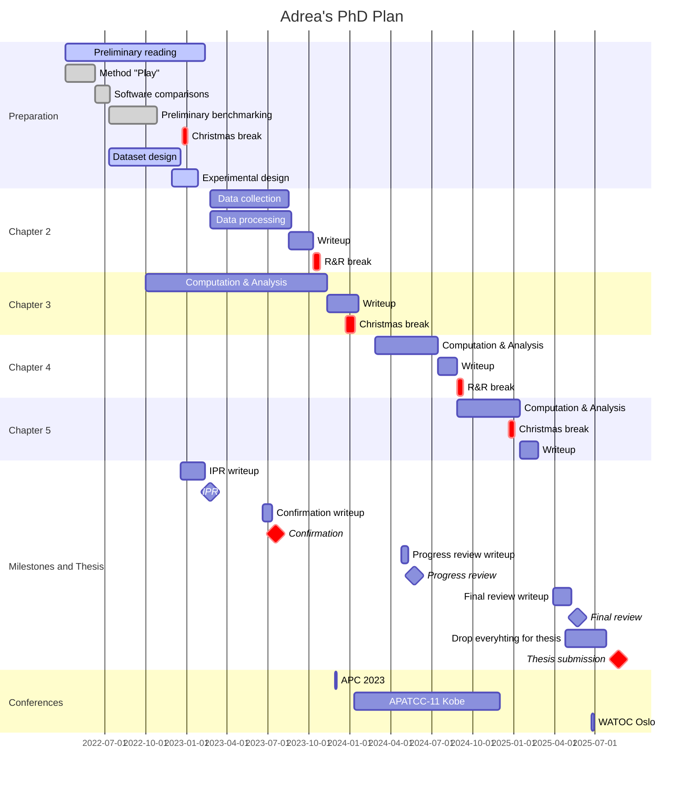
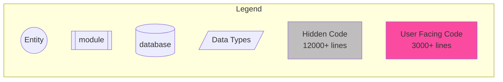
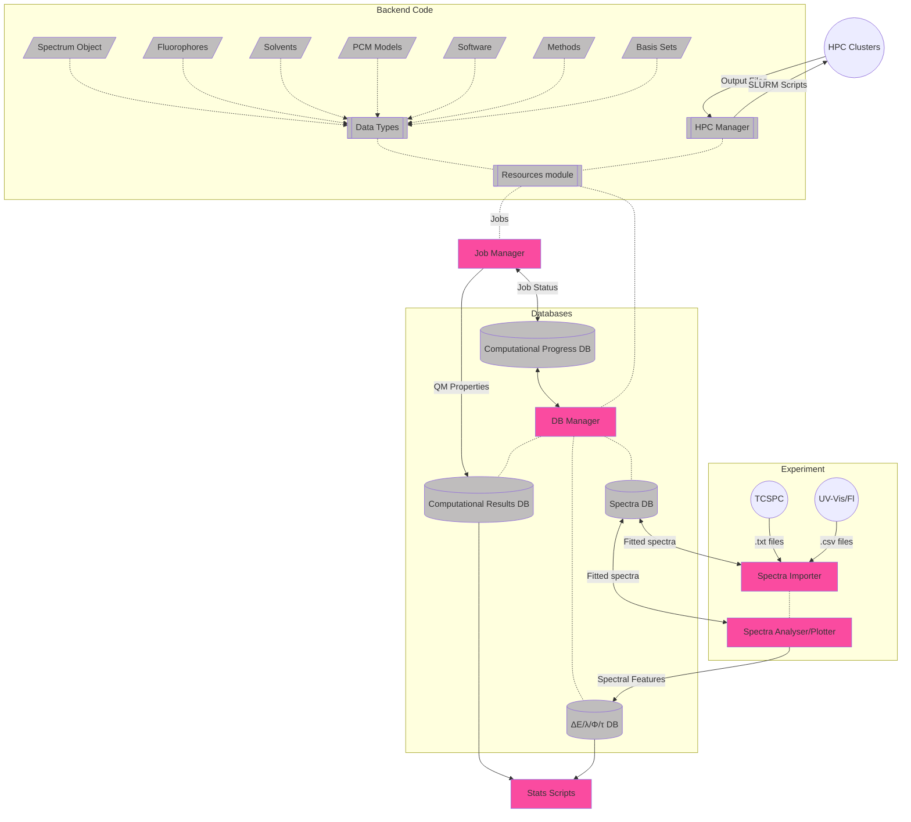

# June 2023

## Thursday 1st June


Molecular sieves have come in today, but apart from drying some solvents and having a meeting about moderation, I've just been coding up pyqt guid like crazy.

## Friday 2nd June


If I can pull myself away from my code for long enough, I think tomorrow might be a moderation day for me!

## Monday 5th June


Big code day!

## Tuesday 6th June


Another big code day!

## Wednesday 7th June


This morning I went to 3MT to support a friend, but I'm really emotionally burned out, so I went to the office and spent the afternoon coding. I also fired off some failed jobs on the clusters for the first time in a while.

I think I'm going to take tomorrow off.

## Thursday 8th June


Taking today off, though I did set up a spreadsheet to keep track of where each job is at in my computational pipeline.

Toby just sent me a call for abstracts for the Asian Photochemistry Conference to be held at MCEC in Nov/Dec this year, so I need to get something in for that. Abstract deadline is in the 14th

## Friday - Wednesday 9-14th June


Marking... so much marking... Even through the weekend :sob:

I did submit an abstract to APC 2023 though :slightly_smiling_face:

It's fucking done! I'mma take a nap in the bath...

## Thursday 15th June


Finally getting back to some science!
I spent my day setting up a notebook for n-hexane/gas study and have all my plots in order. This also required a bit of fixing some old code from my main cluster handler that I never got to test.

I also fired off a bunch of jobs, including setting up a whole lot of wB97X-D and CAM-B3LYP single points at TZ instead of the usual DZ.

## Friday 16th June


I submitted a few hundred very quick jobs last night, so this morning has been a lot of tedious updating of spreadsheets :sweat_smile:

I'm mostly going to be running the JMSS immersion day day today, but BPA just came in and I'm going to grab spectra of it in nhex and ethanol before that! (I want to see what φ=1 looks like :smile:)

## Monday 19th June


* Confirmation report needs to be done by the 12th
* Submit confirmation report by the end of this week and the manuscript by the end of next.

## Tuesday/Friday 20-23rd June


Focusing on getting my confirmation report out. I did spend a couple of hours doing some re-marking for CHM1011/51 exams though.

#### Confirmation report

* [x] Base structure
* [x] Lit review summary
* [x] Thesis plan
* [x] Aim/Progress/Plans
  * Mostly done
* [x] Deep dive (intro - manuscript to come later)
* [x] Conferences and publications
* [x] Gantt Chart

## Sunday 25th June


Confirmation report first draft is done. I'll start on the manuscript tomorrow.

## Monday-Wednesday 16-28th June


So I did get a little bit done on Monday and Tuesday, but mostly on getting a latex template set up, building some figures and setting up notebooks. It's Wednesday now, and I'm trying to focus on writing 

## Idea for freqs/deconv

What if instead of starting with a random guess, we make a function that has a fixed number of Gaussians at a fixed spacing from each other, and we fit them with an offset parameter. We could use the frequencies to dictate the distribution of the Gaussians and and only have the amplitude and sigma as free parameters

```python
func(shift: float, amps: list[float], sigma: list[float] cen_FIXED: list[float])
```


#### To implement in code:

* [x] SVG visualisation for the fluorophores
* [x] Spectrum deconvolution
* [ ] Rate limiting for spectraView

## Important Questions:

* Can we use the difference between TDDFT Eq and nEq energies to figure out the stokes correction to the 0-0 energy in abs and fluor
* Can we use the shape of the Theoretical PES to determine what the width of the deconvoluting Gaussians should be for fitting?

## Experimental work

#### Problematic spectra:

* Collecting:
  * AZ lifetimes - all solvents. No solvatochromic shift on s2 --> s0
  * DMSO with azulene seems to have issues, I'm guessing DMSO excites
* Difficulty fitting
  * TCSPC
    * DAA/nhex
    * BSC/etoh


#### Experimental to-do:

* [ ] Anisole series (sure/seal)
* [ ] THF series (sure/seal)

#### UV/FL

|        | nhex               | tol  | ans  | ether | chcl3 | thf  | dcm  | c80h |        etoh        | acn  |        dmf         |        dmso        |
| ------ | ------------------ | :--: | :--: | :---: | :---: | :--: | :--: | :--: | :----------------: | :--: | :----------------: | :----------------: |
| nr     | :white_check_mark: |      |      |       |       |      |      |      | :white_check_mark: |      | :white_check_mark: | :white_check_mark: |
| nda    | :white_check_mark: |      |      |       |       |      |      |      | :white_check_mark: |      | :white_check_mark: | :white_check_mark: |
| r800   | insol              |      |      |       |       |      |      |      | :white_check_mark: |      | :white_check_mark: | :white_check_mark: |
| c153   | :white_check_mark: |      |      |       |       |      |      |      | :white_check_mark: |      | :white_check_mark: | :white_check_mark: |
| bod493 | :white_check_mark: |      |      |       |       |      |      |      | :white_check_mark: |      | :white_check_mark: | :white_check_mark: |
| az     | :white_check_mark: |      |      |       |       |      |      |      | :white_check_mark: |      | :white_check_mark: | :white_check_mark: |
| aaq    | :white_check_mark: |      |      |       |       |      |      |      | :white_check_mark: |      | :white_check_mark: | :white_check_mark: |
| dapi   | insol              |      |      |       |       |      |      |      | :white_check_mark: |      | :white_check_mark: | :white_check_mark: |
| daa    | :white_check_mark: |      |      |       |       |      |      |      | :white_check_mark: |      | :white_check_mark: | :white_check_mark: |
| bsc    | :white_check_mark: |      |      |       |       |      |      |      | :white_check_mark: |      | :white_check_mark: | :white_check_mark: |
| fno    | :white_check_mark: |      |      |       |       |      |      |      | :white_check_mark: |      |                    |                    |
| bpa    | :white_check_mark: |      |      |       |       |      |      |      | :white_check_mark: |      |                    |                    |
| fat    | :white_check_mark: |      |      |       |       |      |      |      | :white_check_mark: |      | :white_check_mark: | :white_check_mark: |

#### TCSPC

|        |        nhex        | tol  | ans  | ether | chcl3 | thf  | dcm  | c80h |        etoh        | acn  |        dmf         |        dmso        |
| ------ | :----------------: | :--: | :--: | :---: | :---: | :--: | :--: | :--: | :----------------: | :--: | :----------------: | :----------------: |
| nr     | :white_check_mark: |      |      |       |       |      |      |      | :white_check_mark: |      | :white_check_mark: | :white_check_mark: |
| nda    | :white_check_mark: |      |      |       |       |      |      |      | :white_check_mark: |      | :white_check_mark: | :white_check_mark: |
| r800   |       insol        |      |      |       |       |      |      |      | :white_check_mark: |      | :white_check_mark: | :white_check_mark: |
| c153   | :white_check_mark: |      |      |       |       |      |      |      | :white_check_mark: |      | :white_check_mark: | :white_check_mark: |
| bod493 | :white_check_mark: |      |      |       |       |      |      |      | :white_check_mark: |      | :white_check_mark: | :white_check_mark: |
| az     |         -          |  -   |  -   |   -   |   -   |  -   |  -   |  -   |         -          |  -   |         -          |         -          |
| aaq    | :white_check_mark: |      |      |       |       |      |      |      | :white_check_mark: |      | :white_check_mark: | :white_check_mark: |
| dapi   |       insol        |      |      |       |       |      |      |      | :white_check_mark: |      | :white_check_mark: | :white_check_mark: |
| daa    | :white_check_mark: |      |      |       |       |      |      |      | :white_check_mark: |      | :white_check_mark: | :white_check_mark: |
| bsc    | :white_check_mark: |      |      |       |       |      |      |      | :white_check_mark: |      | :white_check_mark: | :white_check_mark: |
| fno    |                    |      |      |       |       |      |      |      |                    |      |                    |                    |
| bpa    |                    |      |      |       |       |      |      |      |                    |      |                    |                    |
| fat    | :white_check_mark: |      |      |       |       |      |      |      | :white_check_mark: |      | :white_check_mark: | :white_check_mark: |

## Job Matrix

### CAS (M3)

| State |   Active Spaces    | CASSCF/aug-cc-pvdz | QD-NEVPT2/aug-cc-pvdz |
| ----- | :----------------: | :----------------: | :-------------------: |
| s0    | :white_check_mark: |                    |                       |
| s1+2  | :white_check_mark: |                    |                       |

### DFT - Gas (MonARCH)

| State | Functional |        Opt         |        Freq        |        Pol         |   Ex/Em   | ESD  |
| ----- | ---------- | :----------------: | :----------------: | :----------------: | :-------: | :--: |
| s0    | ωB97X-D    |     :running:      |     :running:      | :white_check_mark: | :running: |      |
| s1+2  | ωB97X-D    |     :running:      |     :running:      |     :running:      |           |      |
| s0    | CAM-B3LYP  | :white_check_mark: | :white_check_mark: |        N/A         |           |      |
| s1+2  | CAM-B3LYP  | :white_check_mark: |     :running:      |        N/A         |           |      |

### DFT - solv (MonARCH)

| State | Functional |        Opt         |   Freq    | Pol  |  SS  | VEM  | ESD  |
| ----- | ---------- | :----------------: | :-------: | :--: | :--: | :--: | :--: |
| s0    | ωB97X-D    | :white_check_mark: | :running: |      |      |      |      |
| s1+2  | ωB97X-D    | :white_check_mark: | :running: |      |      |      |      |
| s0    | CAM-B3LYP  |                    |           |      |      |      |      |
| s1+2  | CAM-B3LYP  |                    |           |      |      |      |      |

## To do:

* [ ] Jobs to figure out
  * [ ] Test QChem to figure out how to do VEM/cLR/LR/IBSF **emission**
* [ ] Code
  * [ ] Write energy extractors
    * [ ] pullQChem_Freq
      * $\Delta E_{ZPVE}$
      * $\Delta E_{elec}$
      * Number of -ve freqs
      * [ ] Extend and test for CASSCF
    * [ ] Q-chem ex/em extractors
      * [ ] ss-ex
      * [ ] ss-em
      * [ ] lr-ex
      * [ ] lr-em

## GANTT Chart



## Code Object Structure




