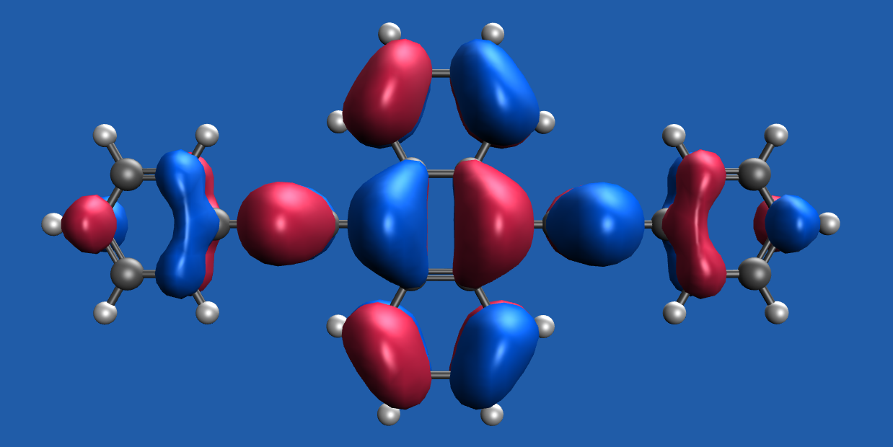
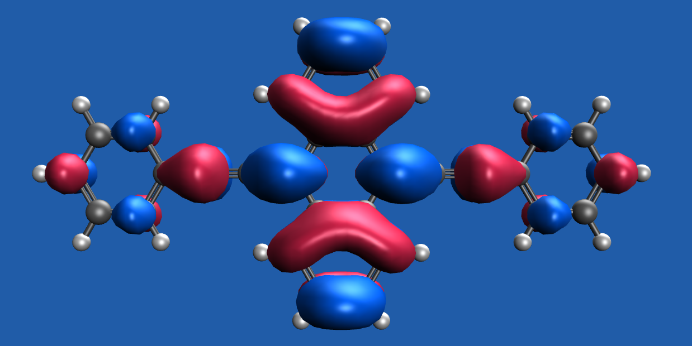
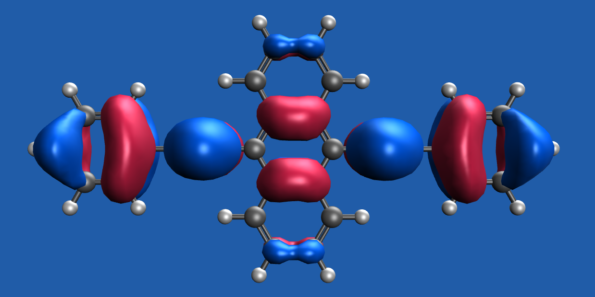
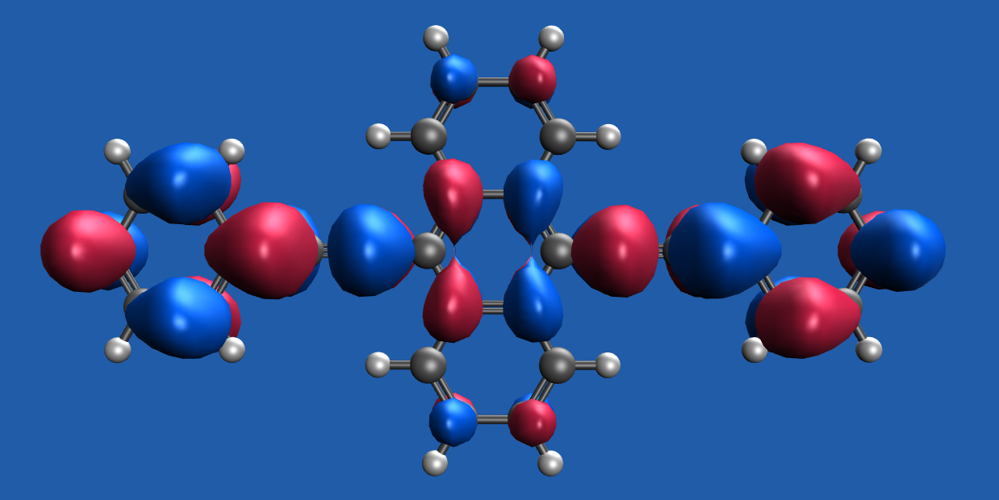
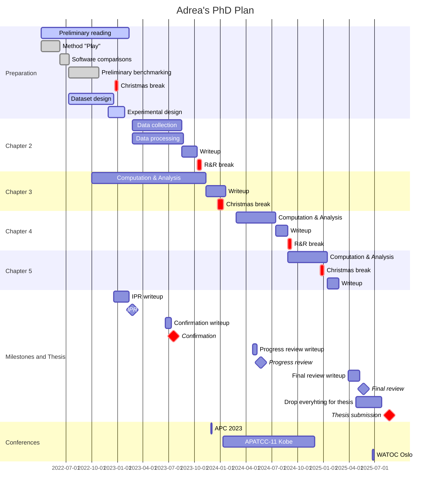
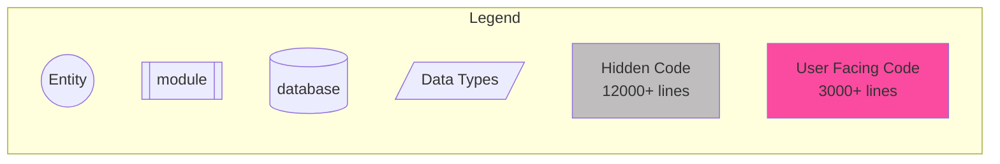
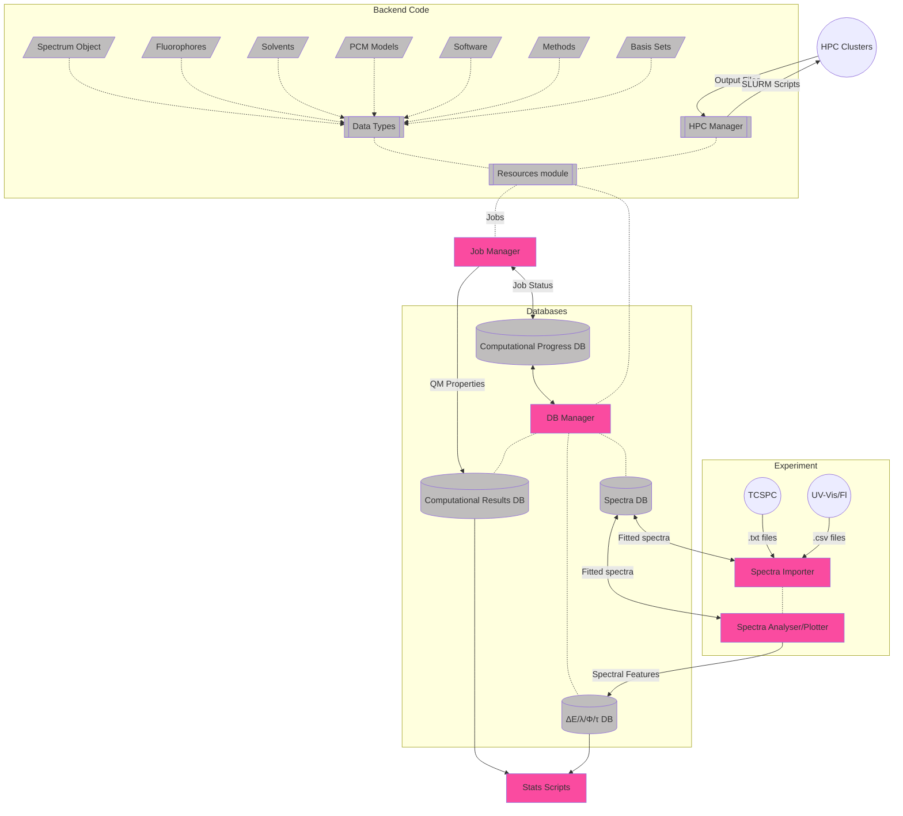

# August 2023

## Tuesday 1st July


I've booked the spectrometers for a couple of hours this afternoon. I think that if the TCSPC is going to be in competition, I should just focus on UV-vis and fluorescence for now and do a bit of photon counting when the resources are available (or when the spectrometers get booked out :sweat_smile:).

I really need to spend some time trying to push through more calcs, but it's so painful...

I didn't end up doing that^, but I did collect a few spectra...

## Wednesday 2nd July


### Meeting Notes:

* [ ] EFP from MD structures - static shell size - cpcm outer?
* [x] For BPA - try the truncated Dunnings accpvtz (the calendar revisions)
* [ ] Multiple levels of xtb for a couple of fluorophores
  * FAT
  * NDA
  * Maybe BOD493
* [ ] HF small basis with different solvent models to compare the influence of the model on the geometry.
* [ ] Scrap R800 from the computational dataset for now.

## Thursday/Friday 4-5th July


I've been helping a former student of Toby's, Ash these past couple of days. We're both studying BODIPY 493/503, and I was able to help him with my spectra, to produce some single point quantum yields, to determine an molar extinction coefficient and use it to obtain a LogP for the dye. I think it was actually a really fun and useful thing to do with my time :slightly_smiling_face:

## Monday 7th July


I got some improved xtb calcs going over the weekend. I decided to use the density of *n*-hexane to figure out how many molecules to put in a region, and then I confined them in xtb using a force field. I decided to test out GFN-FF as well as GFN-1 and GFN-2, since it's so much faster, and while I haven't done any quantitative analysis, they *seem* to be pretty good? :woman_shrugging:

For BPA CASSCF, the cc-pvtz job finished with minimal iterations, but it's right on the edge of active space occupation, so I'm running a (14,14) single point as well :grimacing:

I'm trying Katya's advice and going for a slightly less augmented Dunnings basis set, with jul-cc-pv(t+d)z for both (12,12) and (14,14).

## Tuesday-Friday 8-11th July


This week I've focused on three main things:

1. Getting more of the experimental dataset finalised - This has been tricky given how many of these solvents are VOCs, so I don't want to spend too long each day working with them.
2. Trying to push through the XTB AIMD runs and see how I can analyse them - I've yet to figure out how to generate an RDF or SDF of these through... I think I might need to be more specific in my atom definitions within the PDBs I'm using for topology definition, but 
3. Trying to get the BPA CASSCF jobs sorted - This has also meant trying to figure out MO rotations, which I'm still really unsure of

## Wednesday 16th July


#### From meeting:

* Extract some clusters and determine dispersion by the perturbation method described below:

$$
\begin{gather}
\Delta E_{Int}=E_{Cluster}-E_{Solvent Sphere}-E_{Solute}\\ \Delta E_{Disp}=\Delta E_{Int}^{DFT}-\Delta E_{Int}^{HF}
\end{gather}
$$
* ~~Use NTOs to determine where the BPA transitions are located. This should help determine which $\pi$ orbitals to include in the active space for BPA~~
  * We have an issue... While the primary transition (94%) for s1 is all localised to the naphthalene core, the second contribution (2%) extends out through the ethyne and phenyl rings, meaning that we don't really know which $\pi$ orbitals are going to be the important ones to include. Realistically, we probably need them all.


|                             From                             |                              To                              |
| :----------------------------------------------------------: | :----------------------------------------------------------: |
|  |  |
|  |  |


  * Also focus on non-augmented basis sets for now.

## Saturday 19th July


Soooooo... M3 seems to be stalled. I've tried to clean up as much as I can, but I'mma need to wait for things to come back up before I resubmit my jobs :unamused:

## Monday 21st July


Teaching day, but I also made a presentation for group meeting.

## Tuesday 22nd July

Got a bit more lab work done today. Started on the THF series.

## Thursday 24th July

!!! error "Burnout..."
	I'm taking a month off from today in order to fix some burnout prevention. I don't think I'll be back to my PhD from this.

## Idea for freqs/deconv

What if instead of starting with a random guess, we make a function that has a fixed number of Gaussians at a fixed spacing from each other, and we fit them with an offset parameter. We could use the frequencies to dictate the distribution of the Gaussians and and only have the amplitude and sigma as free parameters

```python
func(shift: float, amps: list[float], sigma: list[float] cen_FIXED: list[float])
```


## Important Questions:

* Can we use the difference between TDDFT Eq and nEq energies to figure out the stokes correction to the 0-0 energy in abs and fluor
* Can we use the shape of the Theoretical PES to determine what the width of the deconvoluting Gaussians should be for fitting?

## Experimental work

#### Problematic spectra:

* Collecting:
  * AZ lifetimes - all solvents. No solvatochromic shift on s2 --> s0
  * Solvent excitation issues
    * DMSO with azulene
    * Anisole with azulene
* Difficulty fitting
  * TCSPC
    * DAA/nhex
    * BSC/etoh


#### Experimental to-do:

#### UV/FL

|        | nhex               |        tol         |        ans         | ether | chcl3 |        thf         | dcm  |        c80h        |        etoh        | acn  |        dmf         |        dmso        |
| ------ | ------------------ | :----------------: | :----------------: | :---: | :---: | :----------------: | :--: | :----------------: | :----------------: | :--: | :----------------: | :----------------: |
| nr     | :white_check_mark: |                    | Issues with ex/em  |       |       | :white_check_mark: |      |                    | :white_check_mark: |      | :white_check_mark: | :white_check_mark: |
| nda    | :white_check_mark: |                    | :white_check_mark: |       |       | :white_check_mark: |      |                    | :white_check_mark: |      | :white_check_mark: | :white_check_mark: |
| r800   | insol              |                    | :white_check_mark: |       |       |                    |      |                    | :white_check_mark: |      | :white_check_mark: | :white_check_mark: |
| c153   | :white_check_mark: |                    | :white_check_mark: |       |       |                    |      |                    | :white_check_mark: |      | :white_check_mark: | :white_check_mark: |
| bod493 | :white_check_mark: | :white_check_mark: | :white_check_mark: |       |       | :white_check_mark: |      | :white_check_mark: | :white_check_mark: |      | :white_check_mark: | :white_check_mark: |
| az     | :white_check_mark: |                    | :white_check_mark: |       |       | :white_check_mark: |      |                    | :white_check_mark: |      | :white_check_mark: | :white_check_mark: |
| aaq    | :white_check_mark: |                    | :white_check_mark: |       |       |                    |      |                    | :white_check_mark: |      | :white_check_mark: | :white_check_mark: |
| dapi   | insol              |                    |       insol        |       |       |                    |      |                    | :white_check_mark: |      | :white_check_mark: | :white_check_mark: |
| daa    | :white_check_mark: |                    | :white_check_mark: |       |       |                    |      |                    | :white_check_mark: |      | :white_check_mark: | :white_check_mark: |
| bsc    | :white_check_mark: |                    | :white_check_mark: |       |       |                    |      |                    | :white_check_mark: |      | :white_check_mark: | :white_check_mark: |
| fno    | :white_check_mark: |                    | :white_check_mark: |       |       | :white_check_mark: |      |                    | :white_check_mark: |      | :white_check_mark: | :white_check_mark: |
| bpa    | :white_check_mark: |                    | :white_check_mark: |       |       | :white_check_mark: |      |                    | :white_check_mark: |      | :white_check_mark: | :white_check_mark: |
| fat    | :white_check_mark: |                    | :white_check_mark: |       |       | :white_check_mark: |      |                    | :white_check_mark: |      | :white_check_mark: | :white_check_mark: |

#### TCSPC

|        |        nhex        |        tol         |        ans         | ether | chcl3 | thf  | dcm  |        c80h        |        etoh        | acn  |        dmf         |        dmso        |
| ------ | :----------------: | :----------------: | :----------------: | :---: | :---: | :--: | :--: | :----------------: | :----------------: | :--: | :----------------: | :----------------: |
| nr     | :white_check_mark: |                    |                    |       |       |      |      |                    | :white_check_mark: |      | :white_check_mark: | :white_check_mark: |
| nda    | :white_check_mark: |                    |                    |       |       |      |      |                    | :white_check_mark: |      | :white_check_mark: | :white_check_mark: |
| r800   |       insol        |                    |                    |       |       |      |      |                    | :white_check_mark: |      | :white_check_mark: | :white_check_mark: |
| c153   | :white_check_mark: |                    |                    |       |       |      |      |                    | :white_check_mark: |      | :white_check_mark: | :white_check_mark: |
| bod493 | :white_check_mark: | :white_check_mark: | :white_check_mark: |       |       |      |      | :white_check_mark: | :white_check_mark: |      | :white_check_mark: | :white_check_mark: |
| az     |         -          |         -          |         -          |   -   |   -   |  -   |  -   |         -          |         -          |  -   |         -          |         -          |
| aaq    | :white_check_mark: |                    |                    |       |       |      |      |                    | :white_check_mark: |      | :white_check_mark: | :white_check_mark: |
| dapi   |       insol        |                    |                    |       |       |      |      |                    | :white_check_mark: |      | :white_check_mark: | :white_check_mark: |
| daa    | :white_check_mark: |                    |                    |       |       |      |      |                    | :white_check_mark: |      | :white_check_mark: | :white_check_mark: |
| bsc    | :white_check_mark: |                    |                    |       |       |      |      |                    | :white_check_mark: |      | :white_check_mark: | :white_check_mark: |
| fno    | :white_check_mark: |                    |                    |       |       |      |      |                    |                    |      |                    |                    |
| bpa    |                    |                    |                    |       |       |      |      |                    |                    |      |                    |                    |
| fat    | :white_check_mark: |                    |                    |       |       |      |      |                    | :white_check_mark: |      | :white_check_mark: | :white_check_mark: |

## Job Matrix

### CAS (M3)

| State |   Active Spaces    | CASSCF/aug-cc-pvdz | QD-NEVPT2/aug-cc-pvdz |
| ----- | :----------------: | :----------------: | :-------------------: |
| s0    | :white_check_mark: |                    |                       |
| s1+2  | :white_check_mark: |                    |                       |

### DFT - Gas (MonARCH)

| State | Functional |        Opt         |        Freq        |        Pol         |   Ex/Em   | ESD  |
| ----- | ---------- | :----------------: | :----------------: | :----------------: | :-------: | :--: |
| s0    | ωB97X-D    |     :running:      |     :running:      | :white_check_mark: | :running: |      |
| s1+2  | ωB97X-D    |     :running:      |     :running:      |     :running:      |           |      |
| s0    | CAM-B3LYP  | :white_check_mark: | :white_check_mark: |        N/A         |           |      |
| s1+2  | CAM-B3LYP  | :white_check_mark: |     :running:      |        N/A         |           |      |

### DFT - solv (MonARCH)

| State | Functional |        Opt         |   Freq    | Pol  |  SS  | VEM  | ESD  |
| ----- | ---------- | :----------------: | :-------: | :--: | :--: | :--: | :--: |
| s0    | ωB97X-D    | :white_check_mark: | :running: |      |      |      |      |
| s1+2  | ωB97X-D    | :white_check_mark: | :running: |      |      |      |      |
| s0    | CAM-B3LYP  |                    |           |      |      |      |      |
| s1+2  | CAM-B3LYP  |                    |           |      |      |      |      |

## To do:

* [ ] Jobs to figure out
  * [ ] Test QChem to figure out how to do VEM/cLR/LR/IBSF **emission**
* [ ] Code
  * [ ] Write energy extractors
    * [ ] pullQChem_Freq
      * $\Delta E_{ZPVE}$
      * $\Delta E_{elec}$
      * Number of -ve freqs
      * [ ] Extend and test for CASSCF
    * [ ] Q-chem ex/em extractors
      * [ ] ss-ex
      * [ ] ss-em
      * [ ] lr-ex
      * [ ] lr-em

## GANTT Chart



## Code Object Structure




