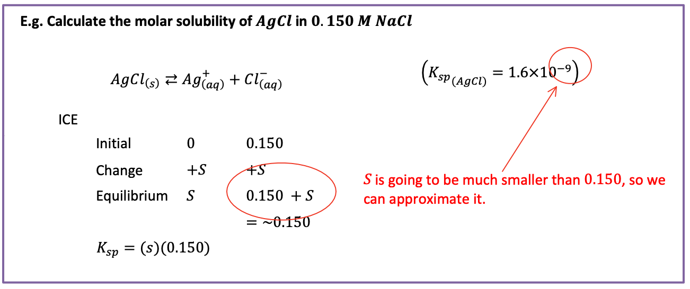
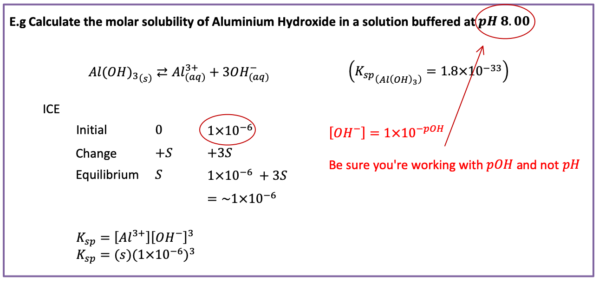
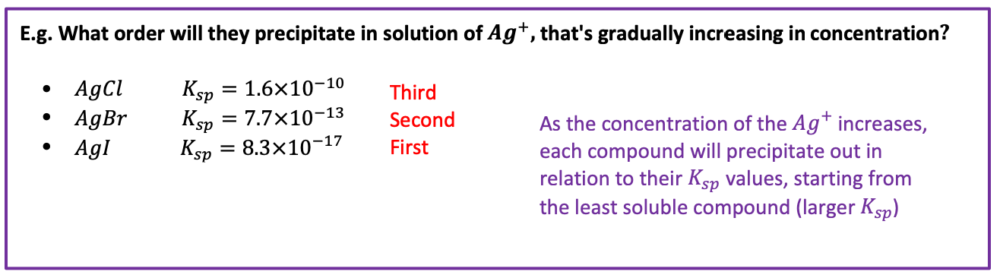
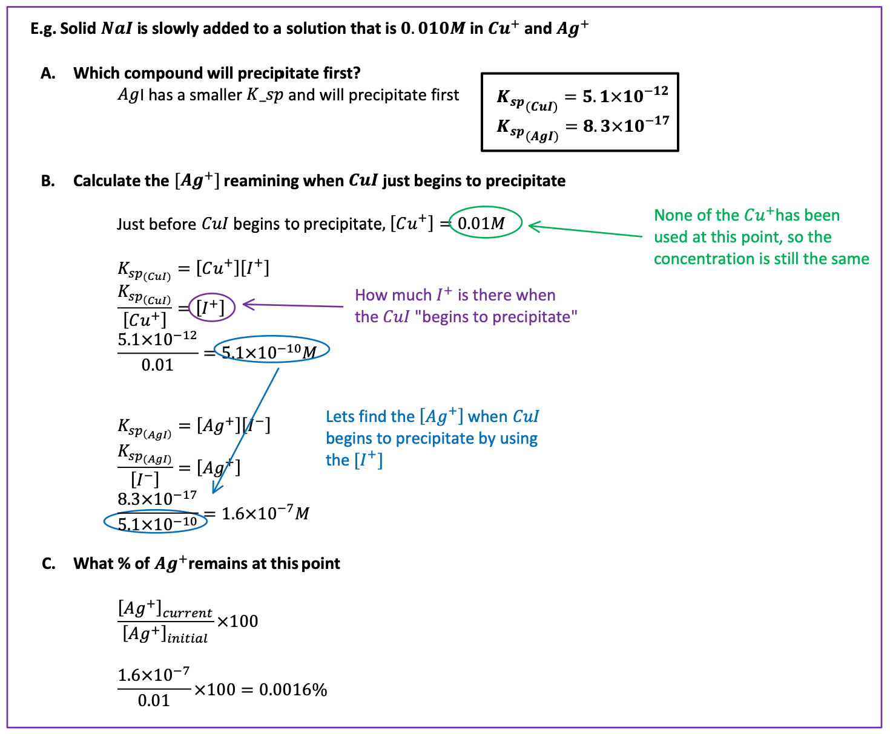

# Common Ion Effect

When an ion involved in a $K_{sp}$ equilibrium equation reaction, is also found in the surrounding solution the solubility of the solid can vary.

E.g. Reaction dependent on pH

{: style="width: 400px;" class="center"}

## Calculating

If you have an insoluble compound in a solution with a common ion, the concentration of the solution is involved in the ICE table

{: style="width: 100%;"}

pH can also be converted into a concentration for these equilibria reactions

{: style="width: 100%;"}

## Order of Precipitation

If there are multiple insoluble ionic compounds with the same common ion and differing $K_{sp}$  values they will precipitate at different concentrations of the common ion

{: style="width: 100%;"}

## Fractional Precipitation

{: style="width: 100%;"}