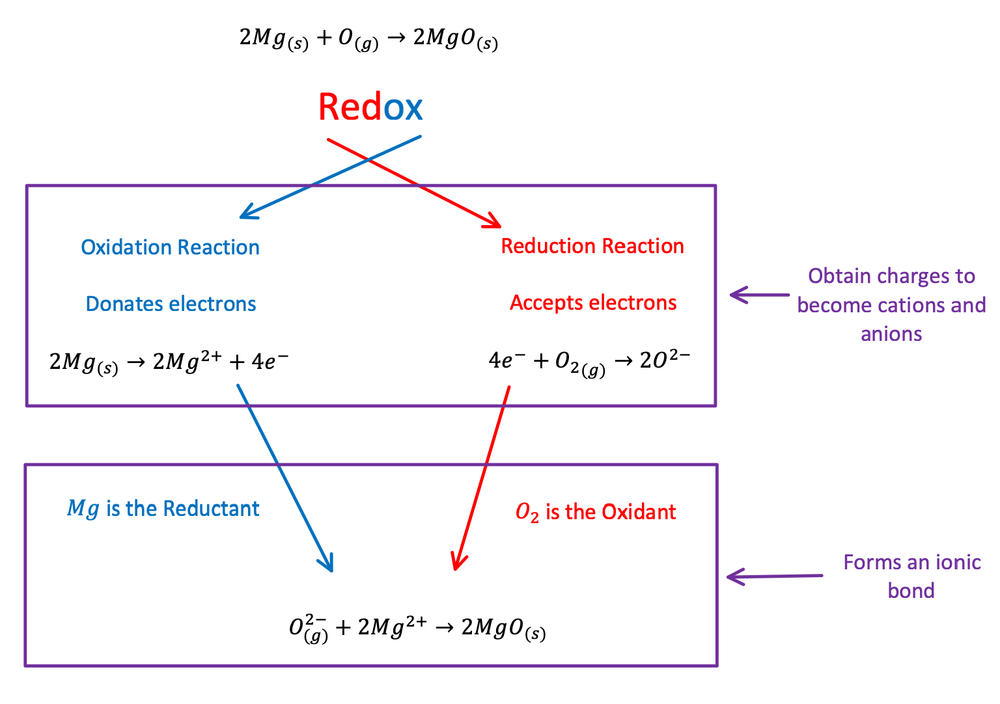
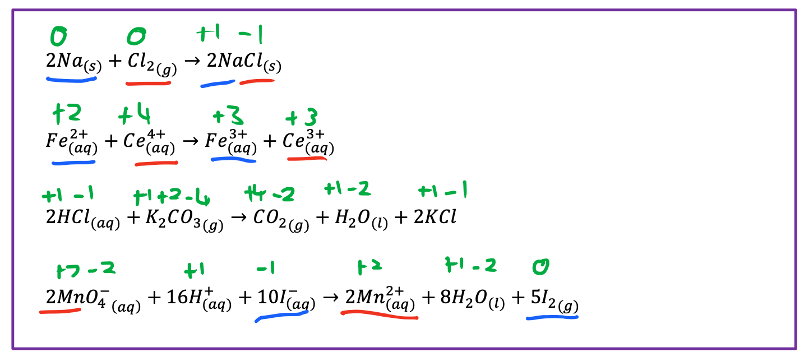
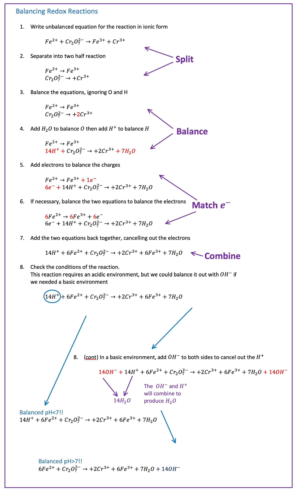

# Redox Reactions

{: style="width: 100%;" class="center"}

Oxidation Numbers
Rules for calculating oxidation numbers (in this order)

1. Free or uncombined elements have an oxidation number of 0
$\hskip{1cm}\ce{Na, Be, K, Pb, H2, O2, P4}$
2. In monatomic ions, the oxidation number = the ion's charge

$\hskip{1cm}\ce{Li+} = +1 \hskip{1cm} \ce{Fe^{3+}} = +3 \hskip{1cm} \ce{O^{2−}} = −2$

3. The oxidation number of oxygen is usually $-2$ except in $\ce{H2O2}$  and $\ce{O2^{2−}}$ where it′ s $-1$ 
4. The oxidation number of hydrogen is $+1$ except when it's bonded to metals in binary compounds - hydrides. In these cases, its oxidation number is $-1$
$\ce{LiH, CaH2, LiAlH4 = −1}$
5. Group I metals are $+1$, group II metals are $+2$ and fluorine is always $-1$
6. The sum of the oxidation numbers of all the atoms in a molecule or ion is equal to the charge on that molecule or ion.

# Using Oxidation Numbers

If an oxidation number increases over a reaction, it has undergone oxidation
If an oxidation number decreases over a reaction, it has undergone reduction

E.g. Identify which element is undergoing reduction and which is undergoing oxidation in the following equations.

{: style="width: 100%;" class="center"}

{: style="width: 100%;" class="center"}