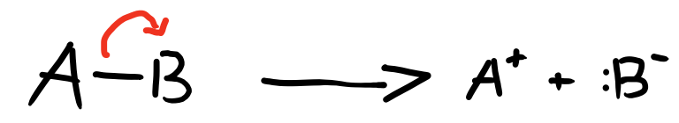
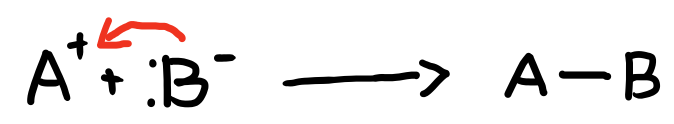
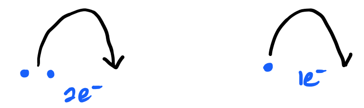
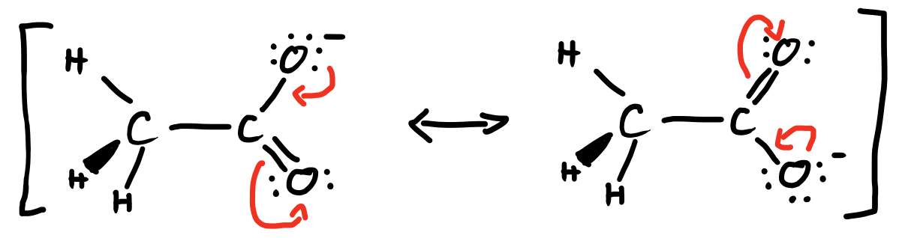
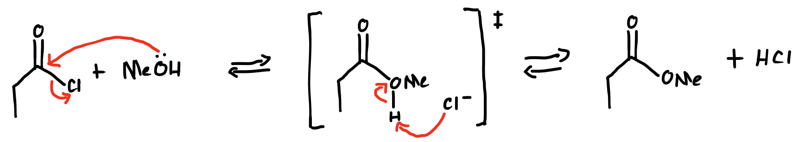

# Curved Arrow

## Rules

All acceptable electron redistribution (bonds being broken or formed) must:

1. Have the same number of valence electrons
2. Obey the rules of covalent bonding
3. differ only in distribution of valence electrons
4. have the same number of paired and unpaired electrons
5. have a charge balance following the redistribution

A reaction mechanism describes the breakage and formation of bonds

* Arrows represent the moving of electrons

#### Breaking bonds

* Arrow goes from the bond to the electrophile

{: style="width: 40%;" class="center"}

#### Making Bonds

* Arrow goes from the nucleophile to the electrophile

{: style="width: 40%;" class="center"}

## How Many Electrons?

The amount of spurs on the arrow indicates the amount of $e^−$  being transferred:

{: style="width: 40%;" class="center"}

## E.g. 1

{: style="width: 60%;" class="center"}

## E.g. 2

{: style="width: 100%;" class="center"}