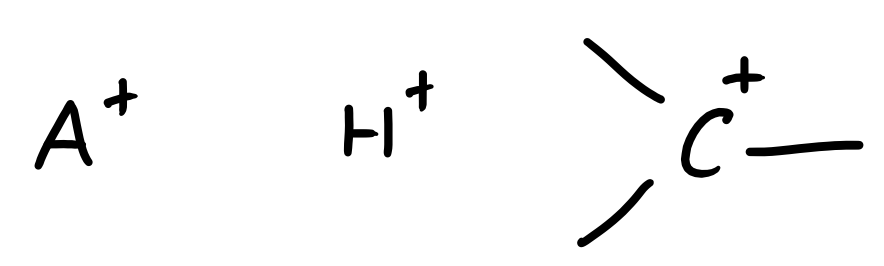
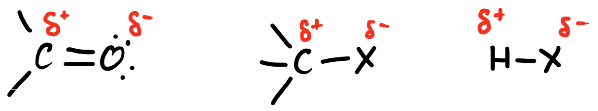

# Electrophiles

Electrophiles are electron poor species, either formally or informally, that seek out electrons to balance their charge

## Formal

Based on formal Charges

{: style="width: 40%;" class="center"}

$$
\begin{align}
FC&=[\text{valence electrons}]−[\text{lone pair electrons}]−[\text{bonds}]\\
FC_{carbon}&=4−0−3\\
FC_{carbon}&=+1
\end{align}
$$

## Informal

Based on electron density

{: style="width: 50%;" class="center"}

