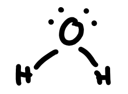
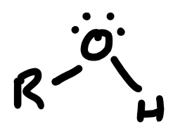
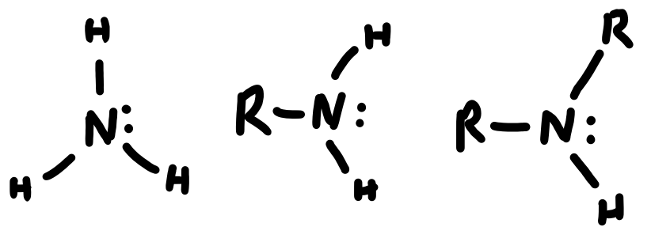

# Nucleophiles

Nucleophiles are electron rich species that seek out a positive charge to balance themselves out

These can come under many different forms

## Anions

|Halide Ions | Hydroxide | Alkoxide | Hydride | Carbanions|
|:-----------:|:---------:|:--------:|:--------:|:--------:|
| {: style="max-width:200%;height:35px;"} | {: style="max-width:200%;height:30px;"} | {: style="max-width:200%;height:30px;"} | {: style="max-width:200%;height:30px;"} | {: style="max-width:200%;height:40px;"} |

## Neutral Molecules With LPE

|Water | Alcohols | Ammonia and Amines |
|:-----------:|:---------:|:--------:|
| {: style="max-width:200%;height:50px;"} | {: style="max-width:200%;height:50px;"} | {: style="max-width:300%;height:70px;"} |

## Species With $\pi$ Bonds

The $\pi$ bond is comparatively weak (compared to its $\sigma$ bond counterpart) and a secondary $\pi$ bond will be even weaker. As a result, it behaves as a nucleophile.

|Alkenes | Alkynes |Benzene |
|:-----------:|:---------:|:--------:|
| {: style="max-width:200%;height:40px;"} | {: style="max-width:200%;height:30px;"} | {: style="max-width:200%;height:40px;"} |
