# Acids and Bases

## Brønsted-Lowry Definition

* Acids are proton donors
* Bases are proton acceptors

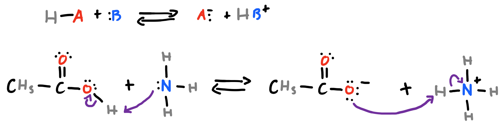{: style="width: 70%;" class="center"}

## Lewis Definition

* Acids are electron acceptors (electrophiles)
* Bases are electron donors (nucleophiles)

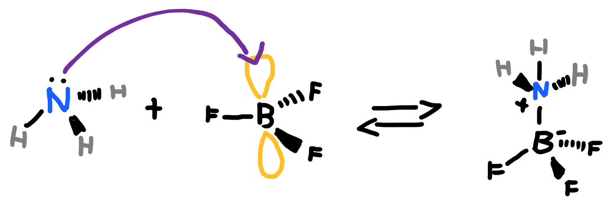{: style="width: 50%;" class="center"}

## Factors Affecting Basicity

While the primary basic functional group is amine, all anions and nucleophiles are  considered basic. The same factors the affect organic acids affect organic bases, though the effect is usually inversely proportionate.
	
Since bases are electron donors, any factor that increases the electron density at the basic species will increase the basicity.

## Factors Affecting Nucleophilicity/Electrophilicity

#### Electronegativity

The more electronegative the acidic atom is, the more it wants electrons and the better it will hold on to them
	
Electronegativity:$\hskip{3cm}\ce{C \:\:\:\:<\:\: N\:\:\:\:\:\:\: <\:\:\:\: O\:\: <\:\: F}$

Stability of conjugate Base:$\hskip{1.2cm}\ce{CH3 < NH2 \:\:\:< OH− < F−}$

Acidity:$\hskip{4.7cm}\ce{CH4+ < NH3+ < H2O < HF}$
	
#### Atom Size

If an atom is larger (going down the period) regardless of its electronegativity, it will be able to hold more electrons in more shells and have a greater electron density
	
Size:$\hskip{5.4cm}\ce{F  \: < \: Cl  <  Br   \:\:\:< I}$

Stability of conjugate Base:$\hskip{1.4cm}\ce{F^− < Cl− < Br− \;< I−}$

Acidity:$\hskip{4.9cm}\ce{ HF < HCl < HBr < HI}$
	
#### Resonance

Resonance of a species will make its conjugate more potent. The equilibrium of the reaction will be pushed to the more stable form, causing it to 'tend' to that side.

??? abstract "Resonance in acids"
	
	#### Example - alcohol vs carboxylic acid
	
	{: style="width: 100%;" class="center"}
	
	#### Example - cyclohexanol vs phenol
	
	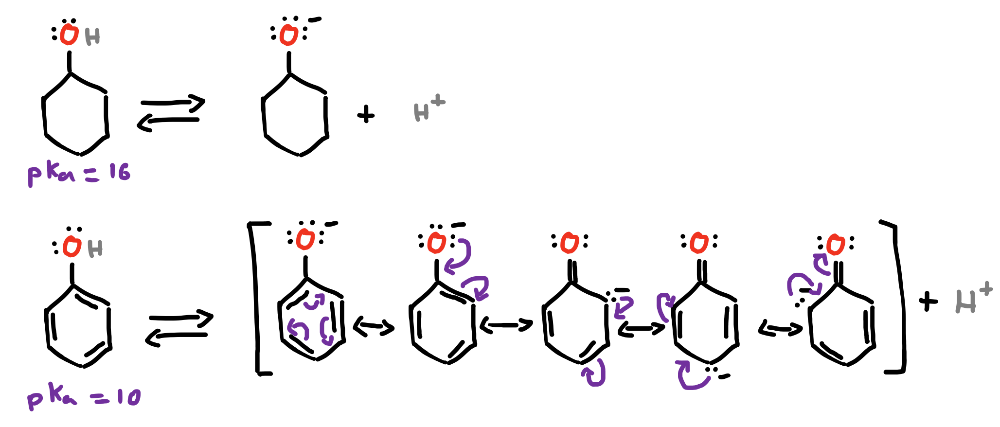{: style="width: 100%;" class="center"}
	
	#### MORE!!!
	
	The more resonant, the more stable and the more acidic. Adding more charge balancing functional groups can increase the acidity even further.
	
	|  | phenol |2-nitrophenol | 2,4-dinitrophenol|2,4,6-trinitrophenol|
	|--|:-------:|:-----------:|:----------------:|:------------------:|
	|$pK_a$| 10|7.2|4.1|1|
	|  |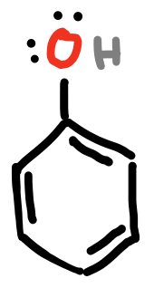{: style="height:90px;"}|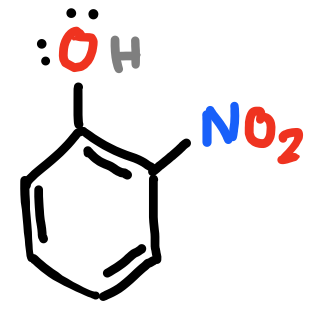{: style="height:90px;"}|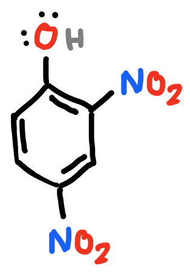{: 	style="height:120px;"}|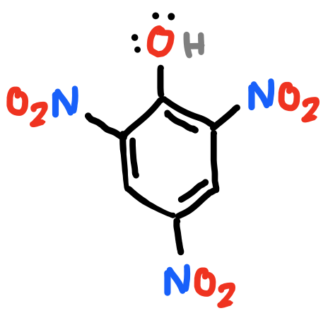{: style="height:120px;"}|

??? abstract "Resonance in bases"
	
	#### Example - aniline vs anilinium ion
	
	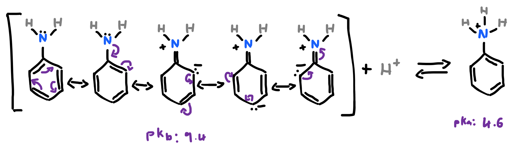{: style="width: 80%;" class="center"}
	
	The effect of this resonance actually makes the anilinium ion a better acid than aniline is a base.
	
	#### Example - 4-nitroaniline vs 4-nitroanilinium
	
	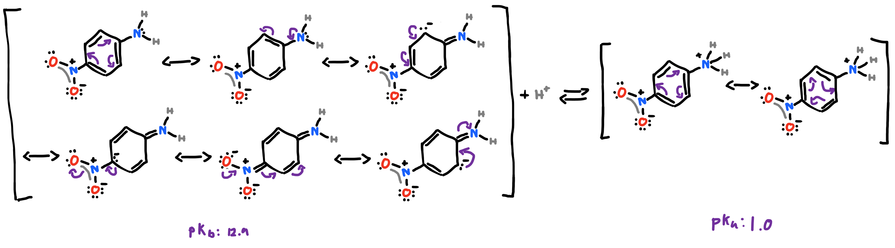{: style="width: 100%;" class="center"}

#### Electron Withdrawing Group (EWG)

* Since the electrons need to be present and ready to dissociate to react, electron density can be modified by adding an EWG. An electronegative group on another part of the molecule will redistribute the electron density, pulling free electrons away from the group of interest
* The further away the EWG, the lesser its effect

??? abstract "EWG in acids"
"
	
	As organic acids are electrophiles, the lower the electron density around the acidic species, the lower the resulting pKa and the more reactive the species.
	
	|  | 2-chlorobutanoic acid | 3-chlorobutanoic acid | 4-chlorobutanoic acid| pentanoic acid|
	|--|:-------:|:-----------:|:----------------:|:------------------:|
	|$pK_a$| 2.8 | 4.1|4.5|4.8|
	|  |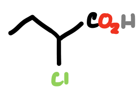{: style="height:60px;"}|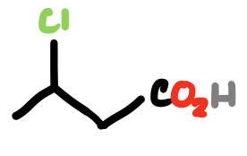{: style="height:60px;"}|{: style="height:40px;"}|{: style="height:40px;"}|
	
	In the previous example, the effect is amplified because there are both an incredibly large number of resonance structures to support the negative charge AND a whole stack of other electronegative species that would remove some of the electron density from the acidic group in question

??? abstract "EWG in bases"
	
	The same process as for acids happens with bases, but by removing the electron density from the basic species, it will be less able to react.
	
	|| 2,2,2-trichloroethylamine | 2,2,2-trichloropropylamine | ethylamine|
	|--|:-------:|:-----------:|:----------------:|
	|$pK_b$| 8.5 | 4.4|3.5|
	||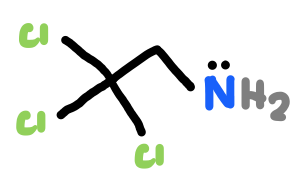{: style="height:60px;"}|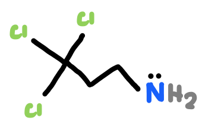{: style="height:60px;"}|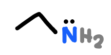{: style="height:40px;"}|

#### Electron Donating Group (EDG)

The inverse happens for groups that donate electrons to the system, particularly in the case of methyl groups

|| ammonia | methylamine | 1,methylethylamine|
|--|:-------:|:-----------:|:----------------:|
|$pK_b$| 4.8 | 3.5|3.2|
||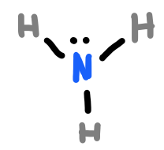{: style="height:70px;"}|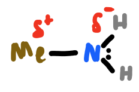{: style="height:60px;"}|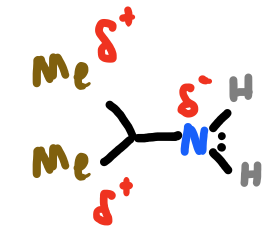{: style="height:75px;"}|

#### Hybridisation

For anions differing only in hybridisation state, the greater the p character, the more stable the resulting π bonds are and the less acidic the species

|| ethyne | ethene | ethane |
|--|:-------:|:-----------:|:----------------:|
|Hybridisation| $sp$ | $sp^2$ | $sp^3$ |
|$pK_a$| 25 | 44 | 50 |
||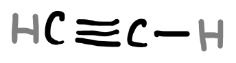{: style="height:35px;"}|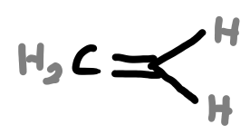{: style="height:60px;"}|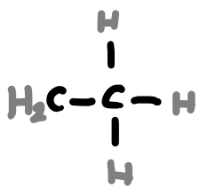{: style="height:75px;"}|