# SN1 and SN2 Reactions

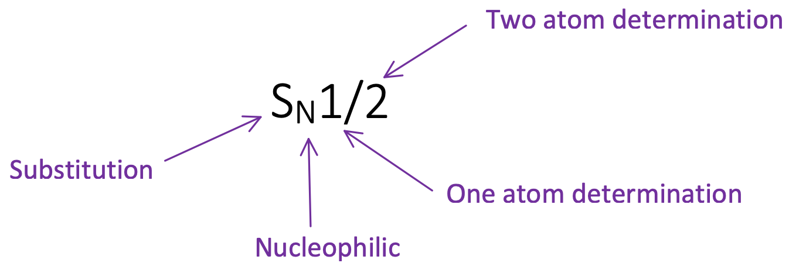{: style="width: 80%;" class="center"}

## SN2 and SN1 Compared

|$S_N2$ | $S_N1$|
|:-----:|:-----:|
|One step (concerted) mechanism | Stepwise mechanism with a $C+$ Intermediate |
|Rate determination based on two molecules | Rate determination based on one molecule |
|Product changes chirality | Products have inverted and retained configuration |
|Reactivity order of alkyl halides   $\ce{−CH3}>1^\circ>2^\circ>3^\circ$ |Reactivity order of alkyl halides   $3^\circ>2^\circ>1^\circ>\ce{−CH3}$|
|Reaction rate improved by polar aprotic solvents | Polar solvents help stabilise the carbocation|
|No carbocation rearrangements | Carbocation rearrangements|

## Leaving Group (LG)

* A good leaving group must be more electronegative than the C atom
  * This allows a partial dipole to exist
  * Also ensures that the LG will take an electron pair with it.
* It must also be weaker than the nucleophile that is substituting it.

* The best leaving groups are those that stabilise the negative charge in the transition state (polarizability, delocalisation of $e^−$)
* The greater the stability of the transition state, the lower the energy required to get through the reaction
* Weak bases make good leaving groups, strong bases make poor ones.
Alcohols, Ethers and Amines don't make good leaving groups and should be converted to more appropriate ones, 

## $S_N2$

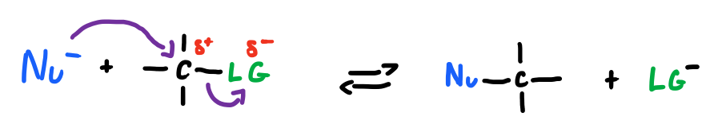{: style="width: 70%;" class="center"}

The SN2 reaction is also known as a backside attack, because of the way that it forces the leaving group off from behind, as shown in the next example:

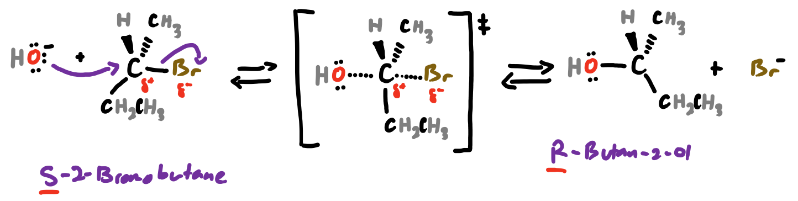{: style="width: 90%;" class="center"}

#### Steric Hinderance

Since the nucleophile needs to be able to access the $\delta +$ C, hinderance from the other groups attached can cause the reaction to become less active.

| Relative Reactivity | $<$1 | 1 | 500 | 40,000 | 2,000,000 |
|:--------------------|:----:|:-:|:---:|:------:|:---------:|
| | 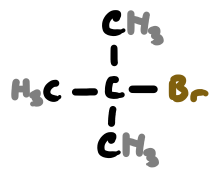{: style="max-width:200%;height:60px;"} | 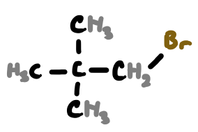{: style="max-width:200%;height:60px;"} | 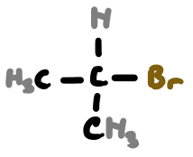{: style="max-width:200%;height:60px;"} | 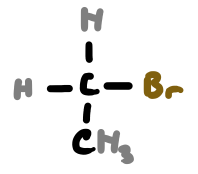{: style="max-width:200%;height:60px;"} | 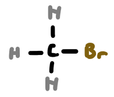{: style="max-width:200%;height:60px;"} |
| | 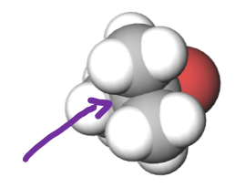{: style="max-width:200%;height:60px;"} | 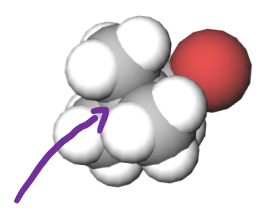{: style="max-width:200%;height:60px;"} | 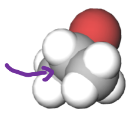{: style="max-width:200%;height:60px;"} | 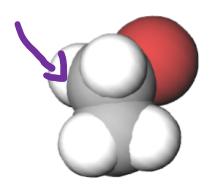{: style="max-width:200%;height:60px;"} | 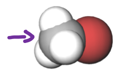{: style="max-width:200%;height:60px;"} |

#### The  Nucleophile

The stronger the nucleophile, the more quickly the reaction will happen. This can be achieved in multiple ways

**Anions**

Anions are much better nucleophiles than formally neutral species
	
**Periods**

Nucleophilicity usually increases going down a period of the periodic table
$\ce{I > Br > Cl}$

|Species | $\ce{OH−, NH2−, OR−}$ | $\ce{F-}$ | $\ce{Cl-}$ | $\ce{Br-}$ | $\ce{I-}$ | $\ce{TosO-}$|
|:-------|:---------------------:|:---------:|:---------:|:----------:|:---------:|:-----------:|
|Relative Reactivity |<<1 | 1 | 200 | 10,000 | 30,000 | 60,000|

#### The Solvent

* The reaction is most effective in solvents that won't protonate the nucleophile though will allow the polar species to exist in solution
* An aprotic solvent with a low-moderate polarity is best

| Solvent | $\ce{CH3OH}$ | $\ce{H2O}$ | DMSO | DMF | $\ce{CH3CN}$|
|:-------|:---------------------:|:---------:|:---------:|:----------:|:---------:|
|Relative Reactivity | 1 | 7 | 1300 | 2800 | 5000|

####  Summary of SN2

| Nucleophile                                            | Product        | Class of Resulting Compound |
| ------------------------------------------------------------ | ------------------- | ------------------------------- |
| $\ce{OH-}$ | $\ce{CH3CH2OH}$     | alcohol                         |
| $\ce{OR-}$ | $\ce{CH3CH2OR}$     | ether                           |
| $\ce{X-}$ | $\ce{CH3CH2X}$      | alkyl halide                    |
| $\ce{CN-}$ | $\ce{CH3CH2CN}$     | nitrile                         |
| $\ce{NH3-}$ | $\ce{CH3CH2NH3+X-}$ | alkyl ammonium salt             |
| $\ce{H2O}$ | $\ce{CH3CH2OH}$     | alcohol                         |

## $S_N1$

#### The General Reaction 

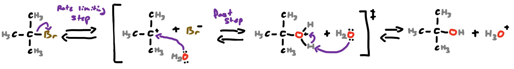{: style="width: 100%;" class="center"}

#### Carbocation Stability

* Since the reaction is dependent on a carbocation, its stability is paramount for the speed of the reaction
* Carbocations on more branched structures are more stable and thus the reaction will occur more rapidly

| Relative Reactivity | $<$1 | 1 | 12 | 1,200,000 |
|:--------------------|:----:|:-:|:---:|:------:|
| Initial | 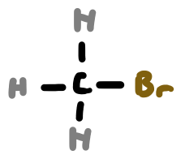{: style="max-width:200%;height:80px;"} | 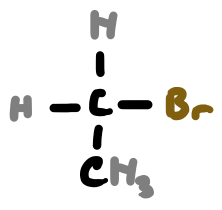{: style="max-width:200%;height:80px;"} | 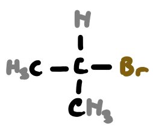{: style="max-width:200%;height:80px;"} | 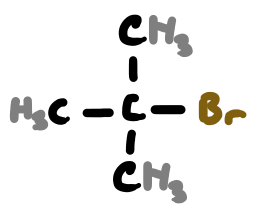{: style="max-width:200%;height:80px;"} |
| Carbocation | 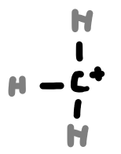{: style="max-width:200%;height:80px;"} | 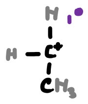{: style="max-width:200%;height:80px;"} | 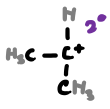{: style="max-width:200%;height:80px;"} | 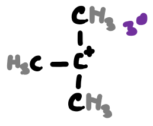{: style="max-width:200%;height:80px;"} |

* This is due to the slight dislocation of the electron density from around the carbocation

#### The Nucleophile

Since the nucleophile is not involved in the rate determining step, it has no effect on the rate of the reaction.

#### The Solvent

Since the carbocation is stabilised by a polar environments, polar solvents such as water and methanol are faster for this reaction than nonpolar solvents

| Solvent | Ethanol | 40% Water   60% Ethanol | 80% Water   20% Ethanol | Water  |
| ----------------------- | --------- | ---------------- | ------------------ | --------- |
| Relative Reactivity | 1      | 100                      | 14,000          | 100,000 |